# Technical Specification

# 1. Introduction

## 1.1 EXECUTIVE SUMMARY

### 1.1.1 Project Overview

The repository documented in this Technical Specification is identified as **Artifact17**. The project's canonical identifier is declared in the repository's sole content artifact — a `README.md` file containing a single H1 heading. As of the documented state of the codebase, the repository exists in its earliest possible initialization phase: a project has been **named** but has not yet been **specified**, **scoped**, or **implemented**.

This Technical Specification is therefore authored as a foundational reference for a repository whose only verifiable semantic content is its project identifier. In keeping with rigorous evidence-based documentation standards, this Introduction grounds every statement in repository-verifiable facts. Where standard introduction elements (business context, stakeholders, success criteria, integrations) have not been declared in the codebase, this document explicitly marks them as "Not yet specified" rather than fabricating unsupported content.

| Attribute | Value |
|-----------|-------|
| Project Identifier | Artifact17 |
| Repository Maturity Stage | Initialization (named, not yet specified) |
| Total Source Artifacts | 1 (`README.md`) |
| Declared Functional Scope | Not yet specified |

### 1.1.2 Core Business Problem

No business problem, domain context, or market need has been declared in the repository. The single artifact present (`README.md`) contains only the project's H1 title and provides no narrative describing problems to be solved, gaps to be addressed, or opportunities to be captured.

| Business Problem Dimension | Declared in Repository? |
|----------------------------|-------------------------|
| Problem Statement | Not yet specified |
| Target Domain | Not yet specified |
| Market Opportunity | Not yet specified |
| Competitive Context | Not yet specified |

### 1.1.3 Key Stakeholders and Users

No stakeholder roles, user personas, or audience definitions have been declared in the repository. The codebase contains no CONTRIBUTORS file, no CODEOWNERS file, no user documentation, and no architectural notes identifying intended consumers.

| Stakeholder Category | Identified in Repository? |
|----------------------|---------------------------|
| End Users | Not yet specified |
| Administrators / Operators | Not yet specified |
| Development Team | Not yet specified |
| Business Owners | Not yet specified |

### 1.1.4 Expected Business Impact and Value Proposition

No value proposition, expected outcomes, return-on-investment projections, or impact statements have been declared in the repository. Until the project's purpose is formally scoped, business impact remains undefined.

| Value Dimension | Declared in Repository? |
|-----------------|-------------------------|
| Value Proposition | Not yet specified |
| Quantitative Impact Targets | Not yet specified |
| Qualitative Outcomes | Not yet specified |
| Strategic Alignment | Not yet specified |

## 1.2 SYSTEM OVERVIEW

### 1.2.1 Project Context

#### Business Context and Market Positioning

The repository contains no business context statement, no market positioning narrative, and no references to industry vertical, customer segment, or commercial intent. The project name **Artifact17** functions as a code-name identifier whose semantic meaning is not elaborated in any repository artifact.

#### Current System Limitations

The project does not reference any existing system that it is replacing, upgrading, or extending. There are no migration notes, no legacy system references, no deprecation statements, and no transition planning documents. The repository should therefore be understood as a **greenfield placeholder** rather than a replacement initiative — at minimum, no replacement context is observable in the codebase.

#### Integration with Existing Enterprise Landscape

No integration points, dependencies, sibling projects, parent repositories, or enterprise platform references appear in the repository. There is no evidence of:

- External service dependencies (no API client code, no SDK references)
- Data source integrations (no database configuration, no schema definitions)
- Authentication / identity providers (no auth configuration)
- Messaging or event infrastructure (no broker configuration)
- Monitoring or observability platforms (no telemetry configuration)

### 1.2.2 High-Level Description

#### Primary System Capabilities

The repository in its current state provides **no functional system capabilities**. It contains no executable code, no services, no APIs, no user interfaces, no data models, and no automation. The only observable artifact is a Markdown identifier file.

| Capability Domain | Implementation Status |
|-------------------|----------------------|
| User-facing functionality | None implemented |
| Backend services | None implemented |
| Data persistence | None implemented |
| External interfaces (APIs) | None implemented |

#### Major System Components

No system components exist in the repository. There are no modules, packages, libraries, services, or subsystems to describe. The complete component inventory is shown below:

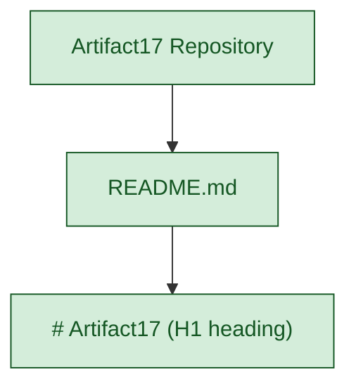

#### Core Technical Approach

No technical approach, architectural style, design methodology, technology stack, or implementation strategy has been declared in the repository. The following standard technical-approach dimensions are all undeclared:

| Technical Dimension | Declared in Repository? |
|---------------------|-------------------------|
| Programming Language(s) | Not yet specified |
| Framework / Platform | Not yet specified |
| Architectural Style | Not yet specified |
| Deployment Model | Not yet specified |

The only "technology" verifiably present in the repository is **Markdown**, used to express the project's H1 title in `README.md`.

### 1.2.3 Success Criteria

#### Measurable Objectives

No measurable objectives have been declared in the repository. There are no OKRs, no project goals, no acceptance criteria, and no deliverable definitions in any artifact.

#### Critical Success Factors

No critical success factors have been declared. There are no documented assumptions, dependencies, or prerequisites required for project success.

#### Key Performance Indicators (KPIs)

No KPIs have been defined. The following standard KPI categories are all undeclared:

| KPI Category | Defined in Repository? |
|--------------|------------------------|
| Performance Metrics (latency, throughput) | Not yet specified |
| Reliability Metrics (uptime, error rates) | Not yet specified |
| Adoption Metrics (active users, sessions) | Not yet specified |
| Quality Metrics (defect density, coverage) | Not yet specified |

## 1.3 SCOPE

### 1.3.1 In-Scope Elements

#### Core Features and Functionalities

Based strictly on what the repository contains, the only in-scope element that is verifiably established is the **declaration of the project identifier "Artifact17"** via a Markdown H1 heading.

| In-Scope Item | Evidence in Repository |
|---------------|------------------------|
| Project name declaration | `README.md` line 1: `# Artifact17` |
| Markdown-based identification | `README.md` file existence |
| Must-have feature inventory | Not yet specified |
| Primary user workflows | Not yet specified |

#### Primary User Workflows

No user workflows are defined. The repository contains no UX flows, use-case diagrams, user stories, journey maps, or interaction specifications.

#### Essential Integrations

No integrations are in scope at this time. The repository declares no upstream sources, no downstream consumers, no third-party services, and no inter-system dependencies.

#### Key Technical Requirements

No technical requirements (functional, non-functional, performance, security, compliance) are declared in the repository.

#### Implementation Boundaries

The implementation boundary, as observable in the repository, is bounded by the single artifact present:

| Boundary Dimension | Current Extent |
|--------------------|---------------|
| System Boundary | Single Markdown file (`README.md`) |
| User Groups Covered | None defined |
| Geographic / Market Coverage | None defined |
| Data Domains Included | None defined |

### 1.3.2 Out-of-Scope Elements

Given that no functional scope has been formally declared, the practical out-of-scope set is exhaustive: it includes **all functional capabilities, integrations, and use cases**, because none have been declared in scope. The categories below are explicitly NOT covered by the current repository state:

| Out-of-Scope Category | Examples of Excluded Items |
|-----------------------|---------------------------|
| Executable software | Source code, binaries, runtime artifacts |
| Build & deployment | Build scripts, container definitions, CI/CD pipelines |
| Dependencies | Package manifests, lock files, vendor directories |
| Testing | Unit tests, integration tests, test fixtures |
| Operational concerns | Monitoring, logging, alerting configurations |
| Documentation artifacts | API references, architecture documents, user guides |
| Legal / compliance | Licenses, NOTICE files, compliance attestations |
| Security artifacts | Secret management, authentication configuration |

#### Explicitly Excluded Features and Capabilities

No features or capabilities are declared as included; consequently, **every feature and capability conceivable** is implicitly out of scope until formally added to the project specification.

#### Future Phase Considerations

The repository contains no roadmap, no phase plan, no milestone definition, and no timeline. The act of **defining a scope** is itself a future-phase activity for this project. A reasonable interpretation is that all of the following are deferred to future phases:

| Future Phase Activity | Deferral Reason |
|-----------------------|----------------|
| Business case definition | No business context declared |
| Functional scoping | No requirements declared |
| Architecture design | No architectural artifacts present |
| Technology selection | No stack declared |

#### Integration Points Not Covered

No integration points are covered, because no integration architecture has been declared. The following standard integration categories are all uncovered:

- Synchronous service-to-service (REST, gRPC, GraphQL)
- Asynchronous messaging (event streams, message queues)
- Data exchange (file transfer, ETL pipelines, replication)
- Identity and access management federation
- Observability and telemetry export

#### Unsupported Use Cases

All conceivable use cases are unsupported in the current repository state, as no use cases have been declared, designed, or implemented. The repository, as it currently exists, supports only one observable operation: **reading the project's name from `README.md`**.

## 1.4 DOCUMENT POSITIONING AND READING GUIDANCE

### 1.4.1 Intent of This Introduction

This Introduction section is intentionally written to faithfully represent the repository's verified state rather than to project aspirational content onto it. Subsequent sections of this Technical Specification (where they exist) should be understood in the same light: any technical detail must be either (a) grounded in repository evidence, or (b) explicitly flagged as forward-looking, hypothetical, or aspirational.

### 1.4.2 Update Triggers

This Introduction should be revised when any of the following repository conditions change, because each materially expands the verifiable scope of the project:

| Trigger Condition | Documentation Impact |
|-------------------|---------------------|
| Addition of source code files | Populate technical approach and components |
| Addition of package manifests | Populate technology stack and dependencies |
| Addition of architecture docs | Populate business and system context |
| Addition of stakeholder docs | Populate stakeholders and success criteria |

### 1.4.3 Reader Expectations

Readers of this document should approach it as a **conformant placeholder specification** — comprehensive in structure, honest in content, and ready to absorb substantive detail as the project's scope is formally defined. The structural skeleton of this Introduction (Executive Summary, System Overview, Scope) is preserved so that future additions integrate cleanly without architectural reorganization of the document.

## 1.5 REFERENCES

### 1.5.1 Files Examined

- `README.md` — The sole content file in the repository. Contains exactly one line: an H1 Markdown heading declaring the project name `Artifact17`. This file provides the only verifiable semantic content used throughout this Introduction.

### 1.5.2 Folders Examined

- `/` (repository root) — Enumeration of the repository root confirmed the presence of `README.md` as the only entry. No subdirectories exist at any depth, making the repository's directory tree maximally shallow (depth 0).

### 1.5.3 Searches Performed

| Search Type | Target | Outcome |
|-------------|--------|---------|
| Root folder enumeration | Repository root contents | One file: `README.md` |
| File content retrieval | `README.md` full content | Single H1 heading: `# Artifact17` |
| File summary | `README.md` metadata | Title-only file confirmed |
| Semantic search | Source code, configuration, manifests | Zero matches |
| Semantic search | Documentation, architecture references | Zero matches |
| Semantic search | Project identity, descriptive content | Zero matches beyond `README.md` |
| Folder search | Application modules, source directories | Zero matches (no subdirectories exist) |
| Bash file search | Ignore files (`.blitzyignore`, etc.) | None found |

### 1.5.4 Evidentiary Confidence

Coverage of the repository is **complete** (100%): every file and folder has been enumerated, the sole content file has been read in full, and multiple independent semantic search paths have confirmed no further indexable content exists. Statements in this Introduction marked as "Not yet specified" are statements of verified absence, not statements of search incompleteness.

# 2. Product Requirements

## 2.1 REQUIREMENTS DECLARATION STATUS

### 2.1.1 Overview of Current Requirements State

The **Artifact17** repository, as verified by exhaustive examination documented in Section 1.5 (References), contains exactly one artifact: a `README.md` file declaring the project's H1 identifier. Consequently, no discrete, testable product features have been declared, designed, or implemented in the repository at its current maturity stage.

This Product Requirements section is therefore authored as a **conformant placeholder requirements catalog**, consistent with the documentation philosophy established in Section 1.4.3. The structural scaffolding for a complete feature catalog, functional requirements table, feature relationships map, and implementation considerations matrix is preserved so that future product specification activities can populate this section without architectural reorganization.

| Requirements Domain | Declared in Repository? | Cross-Reference |
|--------------------|-------------------------|------------------|
| Discrete Features | Not yet specified | Section 1.3.1 |
| Functional Requirements | Not yet specified | Section 1.3.1 |
| Non-Functional Requirements | Not yet specified | Section 1.2.3 |
| Feature Relationships | Not yet specified | Section 1.2.2 |

### 2.1.2 Methodological Constraints on This Section

Per the explicit prompt instruction — *"Only include sections and items that are actually relevant to this system... Don't add any features of your own, or any items that aren't clearly applicable"* — and consistent with the evidence-based standard established in Sections 1.1 through 1.5, this section deliberately omits the following content patterns that would otherwise constitute fabrication:

| Omitted Pattern | Rationale for Omission |
|-----------------|------------------------|
| Invented Feature IDs (F-001, F-002, ...) | No features exist to identify |
| Invented Requirement IDs (F-XXX-RQ-YYY) | No requirements exist to enumerate |
| Hypothetical priority assignments | No features exist to prioritize |
| Imagined feature relationships | Prompt explicitly forbids imagination |

### 2.1.3 Verified Repository Evidence Base

The factual foundation for this section is identical to that documented in Section 1.5.1 — the single file `README.md` containing one line (`# Artifact17`). No supplementary requirements artifacts (BDD feature files, user story documents, requirements databases, issue tracker exports, JIRA/Linear/GitHub Issues content, product backlogs, or specification documents) exist in the repository at any path.

---

## 2.2 FEATURE CATALOG

### 2.2.1 Feature Inventory

Based on direct repository inspection, the feature inventory contains **zero discrete product features**. The repository's sole verifiable artifact — the project name declaration in `README.md` — does not implement a product capability and is more accurately classified as a **project identity artifact** than as a feature. Per Section 1.2.2, the repository "provides no functional system capabilities."

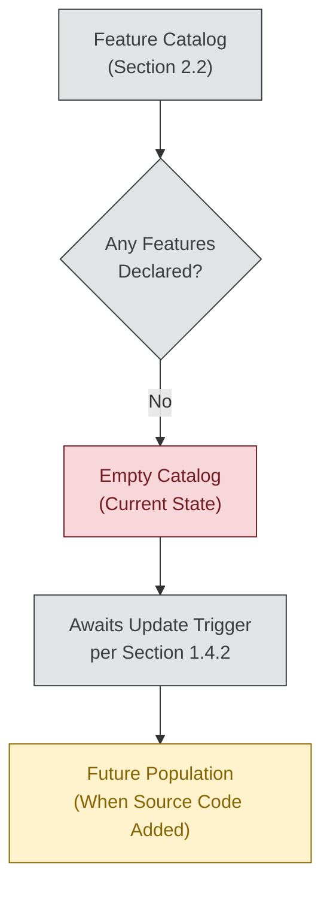

### 2.2.2 Feature Metadata Status

The standard feature metadata dimensions required by the section prompt (Unique ID, Feature Name, Feature Category, Priority Level, Status) cannot be populated for features that have not been declared. The metadata schema is documented below as a **reserved framework** for future use:

| Metadata Dimension | Reserved Format | Currently Populated? |
|--------------------|-----------------|----------------------|
| Unique ID | `F-XXX` (zero-padded sequential) | Not yet specified |
| Feature Name | Human-readable feature title | Not yet specified |
| Feature Category | Functional grouping label | Not yet specified |
| Priority Level | Critical / High / Medium / Low | Not yet specified |

The Status dimension is also reserved (Proposed / Approved / In Development / Completed) and currently holds no entries.

### 2.2.3 Feature Description Dimensions

The descriptive dimensions for each prospective feature (Overview, Business Value, User Benefits, Technical Context) cannot be authored without features to describe. These dimensions remain reserved and unpopulated:

| Description Dimension | Source Required Before Population |
|----------------------|-----------------------------------|
| Overview | Feature definition document or source module |
| Business Value | Business case or value proposition statement |
| User Benefits | User stories, personas, or workflow definitions |
| Technical Context | Architectural documents or implementation code |

Consistent with Section 1.1.4, no value proposition has been declared; consistent with Section 1.1.3, no user personas have been identified; consistent with Section 1.2.2, no technical context exists.

### 2.2.4 Feature Dependencies Status

The four dependency categories specified by the section prompt — Prerequisite Features, System Dependencies, External Dependencies, and Integration Requirements — are each verifiably unpopulated:

| Dependency Category | Evidence in Repository |
|---------------------|------------------------|
| Prerequisite Features | No features exist; no prerequisites can be declared |
| System Dependencies | No manifest files, no dependency declarations |
| External Dependencies | No third-party references (per Section 1.2.1) |
| Integration Requirements | No integration architecture (per Section 1.3.2) |

---

## 2.3 FUNCTIONAL REQUIREMENTS TABLE

### 2.3.1 Functional Requirements Inventory

The functional requirements inventory is **empty**. With zero declared features in the catalog (Section 2.2.1), no functional requirements can be derived, written, or traced. The complete requirements table contains zero rows.

| Requirement Inventory Metric | Current Value |
|------------------------------|---------------|
| Total functional requirements | 0 |
| Must-Have requirements | 0 |
| Should-Have requirements | 0 |
| Could-Have requirements | 0 |

### 2.3.2 Reserved Requirement Schema

For future use, the requirement identifier convention `F-XXX-RQ-YYY` is reserved per the section prompt's specification. When features are introduced into the repository, each feature's functional requirements will be enumerated under its feature ID. The reserved schema is documented below for forward compatibility:

| Schema Field | Format / Allowed Values | Current Entries |
|--------------|-------------------------|-----------------|
| Requirement ID | `F-XXX-RQ-YYY` | None |
| Description | Free-form requirement statement | None |
| Priority | Must-Have / Should-Have / Could-Have | None |
| Complexity | High / Medium / Low | None |

### 2.3.3 Technical Specification Fields Status

The four technical specification dimensions defined by the section prompt are reserved but unpopulated, as the repository declares no technology stack (Section 1.2.2), no integration interfaces (Section 1.2.1), no performance criteria (Section 1.2.3), and no data models:

| Technical Field | Reservation Status | Reason Unpopulated |
|-----------------|--------------------|--------------------|
| Input Parameters | Reserved | No interfaces exist |
| Output / Response | Reserved | No interfaces exist |
| Performance Criteria | Reserved | No KPIs declared (Section 1.2.3) |
| Data Requirements | Reserved | No data models exist |

### 2.3.4 Validation Rules Status

The four validation rule categories specified by the section prompt are similarly reserved and unpopulated:

| Validation Category | Reservation Status | Cross-Reference |
|---------------------|--------------------|------------------|
| Business Rules | Reserved | No business context (Section 1.1.2) |
| Data Validation | Reserved | No data domains (Section 1.3.1) |
| Security Requirements | Reserved | No security artifacts (Section 1.3.2) |
| Compliance Requirements | Reserved | No compliance attestations |

---

## 2.4 FEATURE RELATIONSHIPS

### 2.4.1 Feature Dependency Map

No feature dependency map can be produced because no features exist. The dependency graph for the repository in its current state is structurally empty:

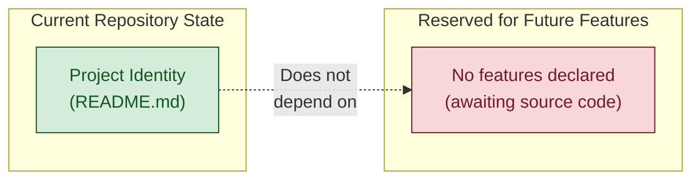

### 2.4.2 Integration Points Status

Consistent with Section 1.3.1 (no essential integrations) and Section 1.3.2 (integration points not covered), there are no integration points to document between features. The standard integration categories enumerated in Section 1.3.2 — synchronous service-to-service, asynchronous messaging, data exchange, identity federation, and observability telemetry — all remain uncovered.

| Integration Category | Declared in Repository? |
|----------------------|-------------------------|
| Internal feature-to-feature | Not yet specified |
| Service-to-service (REST/gRPC) | Not yet specified |
| Asynchronous messaging | Not yet specified |
| Identity / authentication | Not yet specified |

### 2.4.3 Shared Components and Common Services

No shared components or common services exist in the repository. Per Section 1.2.2 ("Major System Components"), no modules, packages, libraries, services, or subsystems are present. The complete component inventory for the repository consists exclusively of `README.md`.

| Shared Asset Category | Identified in Repository? |
|----------------------|---------------------------|
| Shared Libraries | None present |
| Common Utility Modules | None present |
| Cross-Feature Services | None present |
| Shared Data Stores | None present |

---

## 2.5 IMPLEMENTATION CONSIDERATIONS

### 2.5.1 Technical Constraints

No technical constraints have been declared in the repository. Consistent with Section 1.2.2 (Core Technical Approach), no programming language, no framework, no architectural style, and no deployment model are specified. Constraints that would typically derive from these declarations are therefore undefined.

| Constraint Dimension | Declared in Repository? |
|----------------------|-------------------------|
| Language / Runtime Constraints | Not yet specified |
| Framework / Platform Constraints | Not yet specified |
| Architectural Style Constraints | Not yet specified |
| Deployment / Hosting Constraints | Not yet specified |

### 2.5.2 Performance Requirements

No performance requirements have been declared. Per Section 1.2.3 (Key Performance Indicators), all standard KPI categories — including performance metrics (latency, throughput), reliability metrics (uptime, error rates), adoption metrics, and quality metrics — are undeclared.

| Performance Dimension | Target Declared? |
|----------------------|------------------|
| Latency / Response Time | Not yet specified |
| Throughput | Not yet specified |
| Reliability / Availability | Not yet specified |
| Quality / Defect Density | Not yet specified |

### 2.5.3 Scalability Considerations

No scalability considerations have been declared. The repository contains no architectural artifacts, no load expectations, no growth projections, and no capacity planning documents.

| Scalability Dimension | Declared in Repository? |
|----------------------|-------------------------|
| Horizontal Scaling Strategy | Not yet specified |
| Vertical Scaling Limits | Not yet specified |
| Expected User / Request Volume | Not yet specified |
| Data Volume Projections | Not yet specified |

### 2.5.4 Security Implications

No security implications have been declared. Per Section 1.3.2 (Out-of-Scope Elements), security artifacts — including secret management, authentication configuration, authorization policies, and compliance attestations — are all explicitly absent from the current repository scope.

| Security Dimension | Declared in Repository? |
|--------------------|-------------------------|
| Authentication Mechanism | Not yet specified |
| Authorization Model | Not yet specified |
| Data Classification | Not yet specified |
| Threat Model | Not yet specified |

### 2.5.5 Maintenance Requirements

No maintenance requirements have been declared. The repository contains no CONTRIBUTING.md, no CODEOWNERS file, no maintenance schedules, no support model definitions, and no operational runbooks.

| Maintenance Dimension | Declared in Repository? |
|----------------------|-------------------------|
| Code Ownership | Not yet specified |
| Support Model | Not yet specified |
| Release Cadence | Not yet specified |
| Operational Runbooks | Not yet specified |

---

## 2.6 TRACEABILITY MATRIX

### 2.6.1 Current Traceability State

The traceability matrix linking business objectives → features → requirements → test cases → implementation artifacts is empty in all dimensions. The single verifiable trace from end to end is the project identity artifact, which traces only to itself:

| Trace Source | Trace Target | Evidence |
|--------------|--------------|----------|
| Project Identifier ("Artifact17") | `README.md` line 1 | Direct file content |
| Business Objective | Feature | No business objectives declared (Section 1.1.4) |
| Feature | Requirement | No features declared (Section 2.2.1) |
| Requirement | Test Case | No requirements declared (Section 2.3.1) |

### 2.6.2 Reserved Traceability Framework

When features and requirements are added to the repository, the following traceability dimensions will be populated. The framework is documented here for future use:

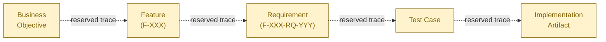

### 2.6.3 Forward Compatibility Notice

The traceability matrix should be populated incrementally as repository content evolves. Per Section 1.4.2, the addition of source code files, package manifests, architecture documents, or stakeholder documents should each trigger a corresponding update to this matrix.

---

## 2.7 ASSUMPTIONS, CONSTRAINTS, AND UPDATE TRIGGERS

### 2.7.1 Documented Assumptions

This section is authored under the following assumptions, each grounded in evidence from Section 1:

| Assumption | Evidence Basis |
|------------|---------------|
| The repository's state is captured completely | Section 1.5.4 (100% coverage) |
| Absence statements reflect verified absence | Section 1.5.4 (verified absence) |
| Future feature additions will trigger updates | Section 1.4.2 (update triggers) |
| The placeholder pattern is intentional | Section 1.4.3 (reader expectations) |

### 2.7.2 Verified Constraints

The following constraints on this section's content are verifiably established:

| Constraint | Source |
|------------|--------|
| No feature IDs may be invented | Section prompt explicit instruction |
| No requirement IDs may be invented | Section prompt explicit instruction |
| No feature relationships may be imagined | Section prompt explicit instruction |
| All claims must be evidence-grounded | Section 1.4.1 (evidence-based standard) |

### 2.7.3 Update Triggers for This Section

Consistent with Section 1.4.2, this Product Requirements section should be revised when any of the following repository state changes occur:

| Repository State Change | Required Update to Section 2 |
|-------------------------|-------------------------------|
| Addition of source code files | Catalog implemented features in Section 2.2 |
| Addition of feature specifications | Populate functional requirements in Section 2.3 |
| Addition of architecture docs | Populate feature relationships in Section 2.4 |
| Addition of performance / SLA docs | Populate implementation considerations in Section 2.5 |

### 2.7.4 Requirement Version Tracking

No requirement version history exists, as no requirements have been declared. When requirements are introduced, version tracking should be established under each `F-XXX-RQ-YYY` entry. The reserved version-tracking schema includes:

| Version Field | Format | Current Entries |
|---------------|--------|-----------------|
| Version Number | Semantic version (e.g., 1.0.0) | None |
| Effective Date | ISO 8601 date | None |
| Change Summary | Free-form description | None |
| Approved By | Role / identity reference | None |

---

## 2.8 REFERENCES

### 2.8.1 Files Examined

- `README.md` — The sole content file in the repository, containing exactly one line (`# Artifact17`). This file was inspected to confirm that no feature declarations, requirements statements, user stories, or acceptance criteria are embedded in its contents. This is the same evidentiary basis used in Section 1.5.1.

### 2.8.2 Folders Examined

- `/` (repository root) — Enumeration confirmed `README.md` as the sole child entry, with no subdirectories at any depth. This confirms the absence of standard requirements directories such as `requirements/`, `docs/`, `specs/`, `features/`, `stories/`, or `acceptance/`.

### 2.8.3 Technical Specification Sections Cross-Referenced

- **Section 1.1 (Executive Summary)** — Established repository maturity as "Initialization (named, not yet specified)" with no declared business problem, stakeholders, or value proposition. Referenced throughout Section 2 to corroborate absence of business value statements, user benefits, and stakeholder-driven priorities.
- **Section 1.2 (System Overview)** — Confirmed no functional system capabilities, no components, no technical approach, and no KPIs. Referenced in Sections 2.2.4, 2.4.3, 2.5.1, 2.5.2, and 2.5.4.
- **Section 1.3 (Scope)** — Established that only the project identifier declaration is in scope; all features, integrations, and use cases are out of scope. Referenced in Sections 2.3.4, 2.4.2, 2.5.3, and 2.5.4.
- **Section 1.4 (Document Positioning and Reading Guidance)** — Established the "conformant placeholder specification" pattern and the update trigger framework that this section adopts. Referenced in Sections 2.1.1, 2.2.1, 2.6.3, and 2.7.3.
- **Section 1.5 (References)** — Established that absence statements reflect verified absence (100% repository coverage). Referenced in Sections 2.1.3 and 2.7.1 to confirm the evidentiary completeness of this section's "Not yet specified" entries.

### 2.8.4 Searches Performed (Inherited from Section 1.5.3)

This section's evidentiary base does not require additional searches beyond those documented in Section 1.5.3, because the verified absence of source code, configuration files, manifests, and documentation artifacts (other than `README.md`) already establishes the complete factual basis for the requirements catalog being empty. The semantic searches for "source code, configuration, manifests" and "documentation, architecture references" — each returning zero matches — confirm that no requirements artifacts exist anywhere in the repository.

### 2.8.5 Evidentiary Confidence

The evidentiary confidence for Section 2 is **complete (100%)**, inheriting directly from Section 1.5.4. Every statement of "Not yet specified" or "None" in this section is a statement of **verified absence**, not a statement of search incompleteness. This section is authored as a structurally conformant placeholder that preserves the framework for a future complete requirements catalog without inventing content that does not exist in the repository.

# 3. Technology Stack

## 3.1 OVERVIEW OF CURRENT TECHNOLOGY STATE

### 3.1.1 Technology Declaration Status

The **Artifact17** repository declares **no technology stack** in its current state. Consistent with Section 1.2.2 (Core Technical Approach) — which explicitly establishes that no programming language, framework, architectural style, or deployment model has been declared — and Section 2.5.1 (Technical Constraints) — which confirms that all language, runtime, framework, platform, architectural, and deployment dimensions are "Not yet specified" — this section documents the technology stack as a **conformant placeholder** rather than as an enumeration of selected technologies.

This section adheres rigorously to the documentation philosophy established in Section 1.4.1 (Intent of This Introduction): any technical detail must be either (a) grounded in repository evidence, or (b) explicitly flagged as forward-looking. Because no manifest files, configuration files, source code artifacts, or infrastructure definitions exist in the repository (see Section 2.2.4 and the out-of-scope categories enumerated in Section 1.3.2), the entirety of a conventional technology stack remains undeclared.

| Technology Stack Layer | Declared in Repository? | Grounding Reference |
|------------------------|-------------------------|---------------------|
| Programming Languages | Not yet specified | Section 1.2.2, Section 2.5.1 |
| Frameworks & Libraries | Not yet specified | Section 1.2.2, Section 2.2.4 |
| Open Source Dependencies | Not yet specified | Section 1.3.2, Section 2.2.4 |
| Third-Party Services | Not yet specified | Section 1.2.1, Section 2.4.2 |
| Databases & Storage | Not yet specified | Section 1.2.1, Section 1.2.2 |
| Development & Deployment Tooling | Not yet specified | Section 1.3.2 |

### 3.1.2 The Only Verifiable Technology: Markdown

The single technology with repository-grounded evidence is **Markdown**, used to express the project's H1 title in `README.md`. This finding inherits directly from Section 1.2.2, which states: *"The only 'technology' verifiably present in the repository is Markdown."*

| Attribute | Value | Evidence |
|-----------|-------|----------|
| Technology | Markdown | `README.md` line 1: `# Artifact17` |
| Use Case | Project identity declaration | Section 1.3.1 (in-scope element) |
| Flavor / Specification | Not declared | No `.markdownlint.yml`, no flavor pinning |
| Version Pinning | Not declared | No tooling configuration present |
| Renderer Dependency | Implicit (platform default) | No explicit renderer configuration |
| Justification | Implicit by `.md` file extension on standard code-hosting platforms | Convention, not declared |

Markdown is documented here as an observable artifact rather than a deliberately selected technology, because no `CONTRIBUTING.md`, no style guide, and no documentation-build configuration has been declared in the repository to evidence a deliberate selection process.

### 3.1.3 Documentation Philosophy for This Section

This section follows the **conformant placeholder specification** pattern established in Section 1.4.3 (Reader Expectations): the structural framework expected of a Technology Stack section is preserved — including subsections for Programming Languages, Frameworks & Libraries, Open Source Dependencies, Third-Party Services, Databases & Storage, and Development & Deployment — so that future technology declarations integrate cleanly into the existing scaffold. Each subsection below provides:

1. A **declaration status** statement grounded in repository evidence.
2. A **reserved framework table** documenting the dimensions that will be populated once relevant artifacts are introduced (mirroring the pattern in Section 2.2.2).
3. **Cross-references** to grounding sections within this Technical Specification.

### 3.1.4 Treatment of Reference Default Technology Stacks

External reference catalogs of default technology choices (for example, common defaults such as AWS for cloud, Docker for containerization, Terraform for infrastructure-as-code, GitHub Actions for CI/CD, Python with Flask for backend, Auth0 for authentication, MongoDB for databases, LangChain for AI orchestration, React with TypeScript for web, TailwindCSS for styling, React Native for cross-platform mobile, Swift for iOS, Kotlin for Android, Objective-C for macOS, and ElectronJS for desktop) are intentionally **not asserted** as the technology stack of this repository.

Per Section 2.7.2 (Verified Constraints), all claims in this Technical Specification must be evidence-grounded; per Section 1.4.1, technical details must be either repository-evidenced or explicitly flagged as aspirational. Because the repository contains:

- No Python manifest files (no `requirements.txt`, no `pyproject.toml`, no `Pipfile`, no `setup.py`)
- No JavaScript/Node manifest files (no `package.json`, no lockfiles)
- No JVM, Rust, Go, Ruby, PHP, or .NET manifest files
- No container definitions (no `Dockerfile`, no `docker-compose.yml`)
- No infrastructure-as-code (no `*.tf`, no CloudFormation, no Pulumi, no Ansible)
- No CI/CD configuration (no `.github/workflows/`, no `.gitlab-ci.yml`, no `Jenkinsfile`)
- No authentication, database, messaging, or telemetry configuration

…none of the technologies in any external default reference catalog can be claimed as the actual stack of this repository. They remain available as **candidate options** that future architectural decisions may adopt, but they are not part of the declared technology stack until corresponding artifacts appear in the repository.

### 3.1.5 Current Technology Landscape Diagram

The diagram below depicts the complete, observable technology surface of the repository:

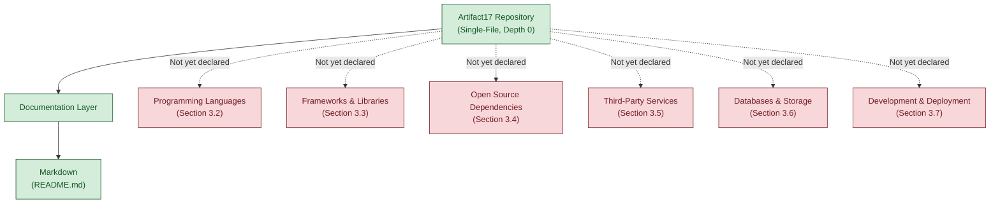

---

## 3.2 PROGRAMMING LANGUAGES

### 3.2.1 Language Declaration Status

No programming language has been declared in the repository. This finding is grounded in Section 1.2.2 (Core Technical Approach), which lists "Programming Language(s)" as "Not yet specified," and Section 2.5.1 (Technical Constraints), which confirms "Language / Runtime Constraints" as "Not yet specified."

The repository's complete source artifact inventory consists of `README.md` (one file, one line). No source code files exist in any programming language. No runtime configuration (`.python-version`, `.nvmrc`, `.ruby-version`, `.tool-versions`, `rust-toolchain.toml`, `go.mod`, JVM `.sdkmanrc`, etc.) is present.

### 3.2.2 Verifiable Language Usage

Only **Markdown** is verifiably used in the repository, and only for documentation/identification — not as a programming language:

| Language Category | Status | Evidence |
|-------------------|--------|----------|
| Backend Programming Language | Not yet specified | No backend source files exist |
| Frontend Programming Language | Not yet specified | No frontend source files exist |
| Mobile Programming Language | Not yet specified | No mobile source files exist |
| Systems / Native Programming Language | Not yet specified | No systems source files exist |
| Scripting / Automation Language | Not yet specified | No script files exist |
| Markup / Documentation Language | Markdown | `README.md` (1 line, H1 syntax) |
| Configuration / Data Language (YAML, TOML, JSON) | Not yet specified | No configuration files exist |

### 3.2.3 Reserved Language Framework

When source code is introduced into the repository, the Programming Languages subsection will be populated using the following reserved schema, consistent with the documentation pattern established in Section 2.2.2:

| Reserved Dimension | Format / Schema | Currently Populated? |
|--------------------|-----------------|----------------------|
| Language Name | Canonical name (e.g., Python, TypeScript, Go) | Not yet specified |
| Version / Edition | Semantic or named version (e.g., 3.12, ES2023) | Not yet specified |
| Platform / Component | Where the language is used (backend, web, mobile, infra) | Not yet specified |
| Selection Justification | Rationale grounded in requirements | Not yet specified |
| Toolchain / Runtime | Compiler, interpreter, transpiler, runtime VM | Not yet specified |
| Version Pinning Mechanism | Tooling artifact (e.g., `.tool-versions`) | Not yet specified |
| Language-Level Constraints | Standards, deprecations, supported features | Not yet specified |

### 3.2.4 Selection Criteria and Constraints

No language selection criteria have been declared. Per Section 2.5.1, no language or runtime constraints are specified. When a language is selected, the constraints documented should include — at minimum — runtime version compatibility, platform compatibility (operating systems, hardware architectures), licensing implications, and team familiarity considerations. These criteria are documented here as a **reserved framework**, not as currently active requirements.

---

## 3.3 FRAMEWORKS & LIBRARIES

### 3.3.1 Framework Declaration Status

No frameworks or libraries have been declared in the repository. This finding is grounded in Section 1.2.2, which lists "Framework / Platform" as "Not yet specified," and Section 2.2.4 (Feature Dependencies Status), which confirms that no manifest files and no dependency declarations exist.

The absence of any framework selection means that no architectural pattern dictated by a framework (MVC, MVVM, component-based UI, actor model, microservices framework, etc.) has been imposed on the project.

### 3.3.2 Library Inventory

The library inventory is empty. Because no source code exists in the repository, no library imports, no `using` statements, no `require` calls, no `include` directives, and no `import` declarations exist to be cataloged.

| Library Category | Identified in Repository? |
|------------------|---------------------------|
| Core Application Framework | Not yet specified |
| HTTP / Web Server Library | Not yet specified |
| ORM / Data Access Library | Not yet specified |
| Validation Library | Not yet specified |
| Serialization / Marshaling Library | Not yet specified |
| Logging / Telemetry Library | Not yet specified |
| Testing Framework | Not yet specified |
| Frontend Component Library | Not yet specified |
| State Management Library | Not yet specified |

### 3.3.3 Reserved Framework Schema

When frameworks and libraries are introduced, the catalog will follow this reserved schema:

| Reserved Dimension | Format / Schema | Currently Populated? |
|--------------------|-----------------|----------------------|
| Framework / Library Name | Canonical name | Not yet specified |
| Version | Pinned semantic version | Not yet specified |
| Category | Core framework / supporting library / dev dependency | Not yet specified |
| Layer | Backend / frontend / mobile / infrastructure | Not yet specified |
| License | SPDX identifier (e.g., MIT, Apache-2.0) | Not yet specified |
| Selection Justification | Rationale tied to a documented requirement | Not yet specified |
| Compatibility Requirements | Required language version, OS, peer dependencies | Not yet specified |
| Upgrade Cadence Policy | Major / minor / patch update strategy | Not yet specified |

### 3.3.4 Compatibility Requirements

No compatibility requirements between frameworks, libraries, runtimes, or operating systems can be declared, because no such components have been selected. Per Section 2.5.1, all framework and platform constraints remain "Not yet specified." Future compatibility matrices — once frameworks are selected — should specify peer-dependency ranges, transitive-dependency conflict-resolution policies, and OS/runtime support windows.

---

## 3.4 OPEN SOURCE DEPENDENCIES

### 3.4.1 Dependency Declaration Status

No open source dependencies are declared in the repository. This finding is grounded in:

- **Section 1.3.2 (Out-of-Scope Elements)**, which explicitly lists "Dependencies (Package manifests, lock files, vendor directories)" among the categories not covered by the current repository state.
- **Section 2.2.4 (Feature Dependencies Status)**, which confirms "No manifest files, no dependency declarations" for the System Dependencies category and "No third-party references" for the External Dependencies category.

### 3.4.2 Package Manifest Inventory

The package manifest inventory is exhaustively empty. The following standard manifest files have been verified as absent from the repository through filesystem enumeration and semantic search:

| Ecosystem | Expected Manifest File(s) | Present in Repository? |
|-----------|---------------------------|------------------------|
| Python | `requirements.txt`, `pyproject.toml`, `Pipfile`, `setup.py`, `setup.cfg` | Not yet specified |
| Node.js / JavaScript | `package.json`, `package-lock.json`, `yarn.lock`, `pnpm-lock.yaml` | Not yet specified |
| Java / Kotlin / JVM | `pom.xml`, `build.gradle`, `build.gradle.kts`, `settings.gradle` | Not yet specified |
| Rust | `Cargo.toml`, `Cargo.lock` | Not yet specified |
| Go | `go.mod`, `go.sum` | Not yet specified |
| Ruby | `Gemfile`, `Gemfile.lock` | Not yet specified |
| PHP | `composer.json`, `composer.lock` | Not yet specified |
| .NET | `*.csproj`, `*.sln`, `packages.config` | Not yet specified |
| Swift / iOS | `Package.swift`, `Podfile`, `Cartfile` | Not yet specified |

Because no manifest exists, no package registry (PyPI, npm, Maven Central, crates.io, pkg.go.dev, RubyGems, Packagist, NuGet, etc.) is currently referenced by the repository.

### 3.4.3 Reserved Dependency Framework

When dependency manifests are introduced, the dependency catalog will follow this reserved schema:

| Reserved Dimension | Format / Schema | Currently Populated? |
|--------------------|-----------------|----------------------|
| Package Name | Registry-qualified name (e.g., `org.springframework:spring-core`) | Not yet specified |
| Version Pin | Semantic version or version range | Not yet specified |
| Package Registry | npm / PyPI / Maven Central / etc. | Not yet specified |
| Scope | Production / development / optional / peer | Not yet specified |
| License | SPDX identifier | Not yet specified |
| Transitive Dependency Count | Integer (post-resolution) | Not yet specified |
| Vulnerability Posture | CVE tracking reference | Not yet specified |
| Supply-Chain Verification | Signature / checksum / SBOM reference | Not yet specified |

### 3.4.4 Software Bill of Materials (SBOM)

No SBOM exists for the repository, because there are no dependencies to enumerate. When dependencies are introduced, an SBOM should be generated and maintained in alignment with industry standards (e.g., SPDX or CycloneDX). This is a **future commitment**, not a current declaration.

---

## 3.5 THIRD-PARTY SERVICES

### 3.5.1 External Service Declaration Status

No third-party services are integrated into the repository. This finding is grounded directly in Section 1.2.1 (Project Context — Integration with Existing Enterprise Landscape), which enumerates the categories of external services explicitly absent from the repository:

- **External service dependencies** — no API client code, no SDK references
- **Data source integrations** — no database configuration, no schema definitions
- **Authentication / identity providers** — no auth configuration
- **Messaging or event infrastructure** — no broker configuration
- **Monitoring or observability platforms** — no telemetry configuration

This is further corroborated by Section 2.4.2 (Integration Points Status), which confirms that synchronous service-to-service, asynchronous messaging, identity / authentication, and observability integration categories are all "Not yet specified."

### 3.5.2 Service Integration Categories

The following standard third-party service categories are all unpopulated:

| Service Category | Examples (Reference Only) | Declared in Repository? |
|------------------|--------------------------|-------------------------|
| Cloud Platform (IaaS/PaaS) | AWS, Azure, GCP, etc. | Not yet specified |
| Authentication / Identity Provider | OAuth2 providers, SAML IdPs, Auth0, etc. | Not yet specified |
| External APIs | REST/GraphQL/gRPC APIs of partner services | Not yet specified |
| Email / Notification Services | SendGrid, SES, Twilio, etc. | Not yet specified |
| Payment Processing | Stripe, Braintree, etc. | Not yet specified |
| Monitoring / Observability | APM, log aggregation, distributed tracing | Not yet specified |
| Analytics | Product / behavioral analytics platforms | Not yet specified |
| Content Delivery Network (CDN) | Edge caching / static asset delivery | Not yet specified |
| AI / ML Services | Hosted model APIs, vector databases | Not yet specified |
| Search Services | Hosted or self-managed search platforms | Not yet specified |

The "Examples (Reference Only)" column is provided to clarify the scope of each category for future authoring; **no example in that column should be interpreted as a selection** for this repository.

### 3.5.3 Reserved Service Framework

When third-party services are integrated, each service will be cataloged using the following reserved schema:

| Reserved Dimension | Format / Schema | Currently Populated? |
|--------------------|-----------------|----------------------|
| Service Name | Vendor / product name | Not yet specified |
| Service Category | From taxonomy in Section 3.5.2 | Not yet specified |
| Integration Mechanism | SDK / REST API / Webhook / SDK-less | Not yet specified |
| Authentication Method | API key / OAuth2 / mTLS / signed request | Not yet specified |
| Data Boundary | What data crosses the integration | Not yet specified |
| SLA / Availability Target | Vendor-published or contractually agreed | Not yet specified |
| Cost Model | Per-call / subscription / consumption-based | Not yet specified |
| Vendor Risk Posture | Compliance certifications (SOC 2, ISO 27001, etc.) | Not yet specified |
| Failover / Vendor Lock-in Strategy | Alternative providers identified | Not yet specified |

### 3.5.4 Security Implications of Future Service Selections

Per Section 2.5.4 (Security Implications), all security dimensions — authentication mechanism, authorization model, data classification, and threat model — are currently "Not yet specified." When third-party services are introduced, security implications must be assessed including, at minimum: secret management (how API keys and tokens are stored), data egress controls (what data leaves the trust boundary), and incident response coordination (vendor security contact and disclosure procedures). These are documented here as a **reserved review framework**, not as currently active controls.

---

## 3.6 DATABASES & STORAGE

### 3.6.1 Storage Declaration Status

No databases, caches, or storage services have been declared in the repository. This finding is grounded in:

- **Section 1.2.1 (Integration with Existing Enterprise Landscape)** — "no database configuration, no schema definitions"
- **Section 1.2.2 (Primary System Capabilities)** — "Data persistence: None implemented"
- **Section 2.4.3 (Shared Components and Common Services)** — "Shared Data Stores: None present"

No schema files (`*.sql`, `schema.prisma`, ORM model definitions, migrations directories), no database connection configuration (no `.env` files, no connection-string variables), and no data-access libraries (per Section 3.3.2) exist in the repository.

### 3.6.2 Data Persistence Strategy

No data persistence strategy has been declared. The repository does not specify whether the eventual system will use relational, document, key-value, graph, time-series, or columnar storage — nor whether it will employ event sourcing, CQRS, or any other persistence pattern.

| Persistence Concern | Declared in Repository? |
|---------------------|-------------------------|
| Primary Database Engine | Not yet specified |
| Secondary / Read Replica Strategy | Not yet specified |
| Persistence Model (RDBMS / Document / Graph / etc.) | Not yet specified |
| Schema Management Approach | Not yet specified |
| Migration Tooling | Not yet specified |
| Backup & Restore Policy | Not yet specified |
| Data Retention Policy | Not yet specified |
| Data Residency / Geographic Constraints | Not yet specified |

### 3.6.3 Caching Solutions

No caching layer has been declared. No in-process cache configuration, no distributed cache configuration (Redis, Memcached, or equivalent), and no HTTP / edge cache configuration exists in the repository.

| Caching Dimension | Declared in Repository? |
|-------------------|-------------------------|
| In-Process / Embedded Cache | Not yet specified |
| Distributed Cache | Not yet specified |
| HTTP / Edge Cache | Not yet specified |
| Cache Invalidation Strategy | Not yet specified |
| Cache Coherence Model | Not yet specified |

### 3.6.4 Object & File Storage

No object storage, blob storage, file storage, or content storage services have been declared. There are no references to cloud object storage services (S3-compatible APIs, Azure Blob, GCS, etc.) in the repository.

| Storage Dimension | Declared in Repository? |
|-------------------|-------------------------|
| Object / Blob Storage Service | Not yet specified |
| File System / Network File Share | Not yet specified |
| Content Versioning Strategy | Not yet specified |
| Lifecycle / Archival Policy | Not yet specified |
| Encryption-at-Rest Configuration | Not yet specified |

### 3.6.5 Reserved Storage Framework

When data stores are introduced, each store will be cataloged using the following reserved schema:

| Reserved Dimension | Format / Schema | Currently Populated? |
|--------------------|-----------------|----------------------|
| Store Name / Identifier | Logical name (e.g., `primary-db`, `session-cache`) | Not yet specified |
| Store Type | Relational / document / KV / graph / object / file | Not yet specified |
| Engine & Version | Vendor product and pinned version | Not yet specified |
| Deployment Model | Self-hosted / managed service / serverless | Not yet specified |
| Data Volume Projection | Per Section 2.5.3 (Scalability) | Not yet specified |
| Consistency Model | Strong / eventual / causal | Not yet specified |
| Sharding / Partitioning Strategy | None / horizontal / range / hash | Not yet specified |
| Replication Strategy | Single-primary / multi-primary / quorum | Not yet specified |
| Encryption-at-Rest | KMS-managed / vendor-managed / customer-managed | Not yet specified |
| Encryption-in-Transit | TLS version and certificate authority | Not yet specified |

---

## 3.7 DEVELOPMENT & DEPLOYMENT

### 3.7.1 Development Tooling Status

No development tooling has been declared in the repository. The absence of development tooling is grounded in Section 1.3.2 (Out-of-Scope Elements), which explicitly lists the following categories as not covered:

- **Build & deployment** — Build scripts, container definitions, CI/CD pipelines
- **Dependencies** — Package manifests, lock files, vendor directories
- **Testing** — Unit tests, integration tests, test fixtures
- **Operational concerns** — Monitoring, logging, alerting configurations

| Development Tooling Category | Declared in Repository? |
|------------------------------|-------------------------|
| Source Control Configuration (`.gitignore`, `.gitattributes`) | Not yet specified |
| Editor / IDE Configuration (`.editorconfig`, `.vscode/`, `.idea/`) | Not yet specified |
| Code Formatter Configuration | Not yet specified |
| Linter Configuration | Not yet specified |
| Type Checker Configuration | Not yet specified |
| Pre-Commit Hook Configuration | Not yet specified |
| Test Runner Configuration | Not yet specified |
| Documentation Generator Configuration | Not yet specified |

### 3.7.2 Build System

No build system has been declared. The repository contains no `Makefile`, no `Justfile`, no Gradle wrapper (`gradlew`), no Maven wrapper (`mvnw`), no `bazel` workspace files, no `package.json` `scripts` block, no `taskfile.yml`, no Python `tox.ini` or `noxfile.py`, and no shell build scripts.

| Build System Dimension | Declared in Repository? |
|------------------------|-------------------------|
| Build Tool | Not yet specified |
| Build Targets / Tasks | Not yet specified |
| Build Artifact Format | Not yet specified |
| Build Reproducibility Mechanism | Not yet specified |
| Artifact Repository / Registry | Not yet specified |

### 3.7.3 Containerization

No containerization is configured in the repository. There is no `Dockerfile`, no `Containerfile`, no `docker-compose.yml`, no `docker-compose.yaml`, no `compose.yaml`, no `.dockerignore`, no Kubernetes manifests (`*.yaml` in a `k8s/` or `manifests/` directory), no Helm charts, and no Kustomize overlays.

| Containerization Dimension | Declared in Repository? |
|----------------------------|-------------------------|
| Container Image Specification | Not yet specified |
| Base Image Selection | Not yet specified |
| Image Build Optimization (multi-stage, layer caching) | Not yet specified |
| Container Orchestrator | Not yet specified |
| Workload Manifests | Not yet specified |
| Container Registry | Not yet specified |
| Image Vulnerability Scanning | Not yet specified |
| Image Signing / Provenance | Not yet specified |

### 3.7.4 Infrastructure as Code (IaC)

No infrastructure-as-code definitions exist in the repository. There are no Terraform files (`*.tf`, `*.tfvars`), no CloudFormation templates, no Pulumi programs, no Ansible playbooks, no Chef cookbooks, no Puppet manifests, and no Crossplane compositions.

| IaC Dimension | Declared in Repository? |
|---------------|-------------------------|
| IaC Tool | Not yet specified |
| Target Cloud / On-Premise Platform | Not yet specified |
| State Management Backend | Not yet specified |
| Module Structure | Not yet specified |
| Drift Detection Strategy | Not yet specified |
| Policy-as-Code Integration | Not yet specified |

### 3.7.5 CI/CD Requirements

No continuous integration or continuous deployment pipelines are configured in the repository. There is no `.github/workflows/` directory, no `.gitlab-ci.yml`, no `Jenkinsfile`, no `.circleci/config.yml`, no `azure-pipelines.yml`, no `bitbucket-pipelines.yml`, and no `buildkite/` directory.

| CI/CD Dimension | Declared in Repository? |
|-----------------|-------------------------|
| CI/CD Platform | Not yet specified |
| Pipeline Definition Format | Not yet specified |
| Trigger Conditions (push, PR, tag, schedule) | Not yet specified |
| Build Matrix / Parallelization | Not yet specified |
| Test Execution Strategy | Not yet specified |
| Artifact Promotion Pipeline | Not yet specified |
| Deployment Targets (dev / staging / production) | Not yet specified |
| Approval Gates | Not yet specified |
| Rollback Strategy | Not yet specified |
| Secrets Management Integration | Not yet specified |

### 3.7.6 Reserved Development & Deployment Framework

When development and deployment tooling is introduced, the catalog will follow this reserved schema:

| Reserved Dimension | Format / Schema | Currently Populated? |
|--------------------|-----------------|----------------------|
| Tool Category | Build / test / lint / package / deploy | Not yet specified |
| Tool Name & Version | Pinned semantic version | Not yet specified |
| Configuration File(s) | Path within repository | Not yet specified |
| Invocation Mechanism | CLI / IDE plugin / pre-commit / CI step | Not yet specified |
| Required Runtime Environment | OS / language runtime / container | Not yet specified |
| License | SPDX identifier | Not yet specified |
| Selection Justification | Rationale tied to a documented requirement | Not yet specified |

---

## 3.8 TECHNOLOGY STACK POPULATION TRIGGERS

### 3.8.1 Canonical Update Triggers

Consistent with the Update Trigger framework established in Section 1.4.2 and reinforced in Section 2.7.3, this Technology Stack section should be revised when any of the following repository state changes occur. The relevant triggers for Section 3 specifically are highlighted:

| Repository State Change | Required Update to Section 3 |
|-------------------------|-------------------------------|
| Addition of source code files | Populate Section 3.2 (Programming Languages) with verified language usage |
| Addition of package manifests | Populate Section 3.3 (Frameworks & Libraries) and Section 3.4 (Open Source Dependencies) |
| Addition of container definitions | Populate Section 3.7.3 (Containerization) |
| Addition of IaC files | Populate Section 3.7.4 (Infrastructure as Code) |
| Addition of CI/CD pipeline files | Populate Section 3.7.5 (CI/CD Requirements) |
| Addition of database schema or ORM models | Populate Section 3.6 (Databases & Storage) |
| Addition of API client code or SDK imports | Populate Section 3.5 (Third-Party Services) |
| Addition of `.env` templates or configuration files | Populate authentication, secrets, and service configuration entries |

### 3.8.2 Population Sequence

The recommended population sequence — designed to minimize rework and maximize cross-section consistency — flows from foundational decisions to derived configurations:

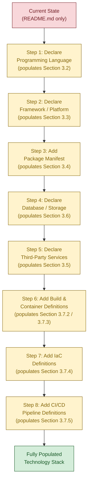

This sequence is presented as **guidance for future authoring**, not as a project plan or commitment. The actual population order will depend on architectural decisions that have not yet been made.

### 3.8.3 Cross-Section Consistency Constraints

When Section 3 is populated, the resulting content must remain consistent with declarations made in other sections of this Technical Specification:

| Consistency Anchor | Requirement |
|--------------------|-------------|
| Section 1.2.2 (Core Technical Approach) | Language and framework declarations must match |
| Section 2.5.1 (Technical Constraints) | Runtime, platform, and deployment constraints must align |
| Section 2.5.2 (Performance Requirements) | Technology selections must support declared SLAs |
| Section 2.5.3 (Scalability Considerations) | Storage and runtime selections must support load projections |
| Section 2.5.4 (Security Implications) | Authentication and data-protection technologies must align |

Until Section 3 is populated, these consistency constraints are reserved and inactive.

---

## 3.9 REFERENCES

### 3.9.1 Files Examined

- `README.md` — The sole content file in the repository. Contains exactly one line: an H1 Markdown heading (`# Artifact17`). Examined to verify the complete absence of technology stack declarations, dependency references, framework citations, language indicators, or build instructions. This is the same evidentiary basis used in Sections 1.5.1 and 2.8.1.

### 3.9.2 Folders Examined

- `/` (repository root, depth 0) — Enumeration of the repository root confirmed `README.md` as the sole entry. No subdirectories exist at any depth. This verifies the absence of standard technology-indicator directories including `src/`, `lib/`, `app/`, `bin/`, `vendor/`, `node_modules/`, `.github/`, `.gitlab/`, `.circleci/`, `infrastructure/`, `terraform/`, `k8s/`, `manifests/`, `helm/`, `docker/`, `scripts/`, `tools/`, `config/`, `migrations/`, and `tests/`.

### 3.9.3 Technical Specification Sections Cross-Referenced

- **Section 1.1 (Executive Summary)** — Established repository maturity stage as "Initialization (named, not yet specified)" with one source artifact (`README.md`). Referenced in Sections 3.1.1 and 3.1.2 to confirm the foundational state of the technology landscape.
- **Section 1.2 (System Overview)** — Critical grounding source for Section 3. Section 1.2.1 enumerates absent integration categories (external services, data sources, authentication providers, messaging infrastructure, observability platforms) used as the basis for Section 3.5. Section 1.2.2 explicitly states "the only 'technology' verifiably present in the repository is Markdown" and provides the four-row Technical Dimension table directly referenced in Section 3.1.1.
- **Section 1.3 (Scope)** — Section 1.3.2 lists "Build & deployment" and "Dependencies" as out-of-scope categories, directly grounding Sections 3.4 and 3.7. Section 1.3.1 confirms that Markdown-based identification is the sole in-scope technology element, grounding Section 3.1.2.
- **Section 1.4 (Document Positioning and Reading Guidance)** — Section 1.4.1 establishes the evidence-based authoring standard that prohibits fabrication of technology choices. Section 1.4.2 provides the Update Triggers table directly adapted in Section 3.8.1. Section 1.4.3 establishes the "conformant placeholder specification" pattern adopted throughout Section 3.
- **Section 1.5 (References)** — Establishes the 100% repository coverage confidence that underpins Section 3's "Not yet specified" entries as verified absence rather than search incompleteness. Section 3.9.5 inherits this evidentiary confidence directly.
- **Section 2.2 (Feature Catalog)** — Section 2.2.2 provides the reserved framework table pattern that Section 3 mirrors in each subsection's reserved schema. Section 2.2.4 confirms the absence of system dependencies and external dependencies, grounding Sections 3.3 and 3.4.
- **Section 2.4 (Feature Relationships)** — Section 2.4.2 confirms the absence of all integration point categories (service-to-service, asynchronous messaging, identity/authentication, observability), directly grounding Section 3.5. Section 2.4.3 confirms the absence of shared data stores, grounding Section 3.6.
- **Section 2.5 (Implementation Considerations)** — Most directly relevant prior section. Section 2.5.1 (Technical Constraints) explicitly states "no programming language, no framework, no architectural style, and no deployment model are specified," grounding all six Section 3 subsections. Sections 2.5.2 through 2.5.5 establish the absence of performance, scalability, security, and maintenance requirements that would otherwise constrain technology selection.
- **Section 2.7 (Assumptions, Constraints, and Update Triggers)** — Section 2.7.2 enumerates verified constraints (no fabrication permitted, all claims evidence-grounded) that bind Section 3. Section 2.7.3 establishes the update-trigger pattern adapted in Section 3.8.1.

### 3.9.4 Searches Performed

Section 3's evidentiary base inherits from the searches performed in Section 1.5.3 and Section 2.8.4, which collectively verified the complete absence of source code, manifests, configuration files, container definitions, infrastructure-as-code, and CI/CD configuration. The following category-specific verifications are summarized here for Section 3 traceability:

| Verification Target | Method | Outcome |
|---------------------|--------|---------|
| Python ecosystem manifests | Filesystem inspection | None found |
| Node.js / JavaScript manifests | Filesystem inspection | None found |
| JVM / Rust / Go / Ruby / PHP / .NET manifests | Filesystem inspection | None found |
| Container definitions (`Dockerfile`, `docker-compose.yml`) | Filesystem inspection | None found |
| Infrastructure-as-Code files (`*.tf`, CloudFormation, Pulumi, Ansible) | Filesystem inspection | None found |
| CI/CD configuration (`.github/workflows/`, `.gitlab-ci.yml`, `Jenkinsfile`, `.circleci/`) | Filesystem inspection | None found |
| Database schemas, migrations, ORM definitions | Semantic search | Zero matches |
| Configuration files (`.env*`, `config/*`, `*.yaml`, `*.toml`, `*.ini`) | Semantic search | Zero matches |
| Source code / application implementation | Semantic search | Zero matches |
| Package manifest, dependencies, configuration | Semantic search | Zero matches |
| Database, storage, cache, infrastructure | Semantic search | Zero matches |
| CI/CD, deployment, pipeline, build configuration | Semantic search | Zero matches |
| Application modules / source folders | Semantic folder search | Zero matches |
| `.blitzyignore` and similar ignore files | Bash filesystem inspection | None found |

### 3.9.5 Evidentiary Confidence

The evidentiary confidence for Section 3 is **complete (100%)**, inheriting directly from Sections 1.5.4 and 2.8.5. Every "Not yet specified" entry in this Technology Stack section is a statement of **verified absence**, not a statement of search incompleteness. Because the repository consists of exactly one file (`README.md`) containing exactly one line (`# Artifact17`), exhaustive enumeration is computationally trivial and has been performed. No further search depth would yield additional technology declarations.

This section is therefore authored as a structurally conformant placeholder that preserves the framework expected of a Technology Stack section — Programming Languages, Frameworks & Libraries, Open Source Dependencies, Third-Party Services, Databases & Storage, and Development & Deployment — without inventing technology choices that the repository does not declare. When source code, manifests, container definitions, infrastructure-as-code, or CI/CD configuration is introduced, this section will absorb the verifiable details following the population sequence outlined in Section 3.8.2.

# 4. Process Flowchart

## 4.1 WORKFLOW DECLARATION STATUS

### 4.1.1 Overview of Process Flow Coverage

The repository declares **zero process flows**, **zero state machines**, **zero integration sequences**, and **zero error-handling pathways** as of the current evidentiary snapshot. This finding is grounded in the same evidentiary base that establishes Sections 1, 2, and 3 of this Technical Specification: the repository tree consists of a single file (`README.md`) containing exactly one line (`# Artifact17`), with no subdirectories at any depth, no source code, no configuration files, no workflow orchestrators, no event handlers, and no state machine declarations.

Section 4, in conformance with the **"conformant placeholder specification"** standard established in Section 1.4.3, is therefore authored to preserve the complete structural skeleton required by the section prompt while honestly representing that **every workflow, every diagram subject, and every implementation detail listed in the prompt is currently unpopulated**. The structure of this section is engineered so that future repository state changes (enumerated in Section 4.6) can populate the reserved frameworks without architectural reorganization.

### 4.1.2 Grounding Cross-References

Every "Not yet specified" claim made in this section is anchored to a prior, independently-grounded section of this Technical Specification, ensuring traceability and preventing fabrication. The cross-reference matrix below summarizes the evidentiary base for Section 4:

| Section 4 Subject Area | Grounding Section(s) | Established Finding |
|------------------------|----------------------|---------------------|
| Core business processes / user journeys | Section 1.1.2, Section 1.3.1, Section 2.2.1 | No business context; no user workflows; zero features in catalog |
| System interactions / decision points | Section 1.2.2, Section 2.1.1 | No functional capabilities; no discrete testable features |
| Integration workflows / API interactions | Section 1.2.1, Section 2.4.2, Section 3.5.1 | No external dependencies; no integration points; no third-party services |
| Event processing / batch sequences | Section 1.2.1, Section 2.4.2 | No messaging infrastructure; asynchronous messaging not specified |
| Validation rules / authorization checks | Section 2.3.4, Section 2.5.4 | All four validation categories reserved; security dimensions not specified |
| State management / persistence | Section 1.2.2, Section 3.3.2, Section 3.6.1, Section 3.6.2 | Data persistence none implemented; state management library not specified |
| Caching / transaction boundaries | Section 3.6.3 | All five caching dimensions not specified |
| Error handling / retry / recovery | Section 1.2.2, Section 1.3.2, Section 3.5.2 | No system capabilities to handle errors for; observability not specified |
| Timing / SLA considerations | Section 1.2.3, Section 2.5.2, Section 2.5.3 | All KPI, performance, and scalability dimensions not specified |

### 4.1.3 Methodological Constraints

Authoring Section 4 in conformance with the constraints established in Section 1.4.1 (evidence-based grounding), Section 2.7 (assumptions and constraints), and Section 3.1 (non-assertion of reference catalog defaults) requires strict adherence to the following rules:

- **No fabricated workflow identifiers.** No workflow ID strings (e.g., `W-001`, `BP-001`) are coined in this section, because no workflows exist in the repository to be identified.
- **No fabricated process steps.** No step names, actor names, or system boundary labels are invented.
- **No assumed integration partners.** Neither external systems nor APIs are named or implied.
- **No assumed state transitions.** No entity states, no transition triggers, and no transaction semantics are postulated.
- **No assumed error classes.** No exception types, no retry policies, and no recovery procedures are described as adopted patterns.
- **No assumed SLAs.** No latency, throughput, availability, or reliability targets are proposed.
- **Common patterns mentioned only as reserved options.** Where the section prompt enumerates standard workflow or error-handling patterns (e.g., saga, choreography, orchestration; circuit breaker, exponential backoff, bulkhead), these may appear only inside reserved-framework tables as enumerated value sets, never as the project's adopted approach.

---

## 4.2 SYSTEM WORKFLOWS

### 4.2.1 Core Business Processes

No core business processes have been declared in the repository. This finding inherits directly from **Section 2.2.1** (the feature catalog contains zero discrete product features) and **Section 1.3.1** (no user workflows are defined; the repository contains no UX flows, use-case diagrams, user stories, journey maps, or interaction specifications). Because business processes are end-to-end realizations of feature behavior across actors, they cannot be enumerated when neither features nor actors have been declared.

The four sub-elements of Core Business Processes required by the section prompt are reserved and unpopulated:

| Core Business Process Element | Declared in Repository? | Cross-Reference |
|-------------------------------|-------------------------|------------------|
| End-to-end user journeys | Not yet specified | Section 1.3.1 (no user workflows) |
| System interactions | Not yet specified | Section 1.2.2 (no functional capabilities) |
| Decision points | Not yet specified | Section 2.1.1 (no discrete features) |
| Error handling paths | Not yet specified | Section 2.5.4 (threat model not specified) |

#### Reserved Schema for Core Business Processes

When business processes are introduced into the repository (through the addition of source code, handler definitions, route specifications, or workflow orchestrator artifacts), each process will be cataloged using the reserved schema below. This schema mirrors the reserved-framework pattern used in Sections 2.2.2, 3.3.3, and 3.6.5:

| Reserved Dimension | Format / Allowed Values | Currently Populated? |
|--------------------|-------------------------|----------------------|
| Workflow Identifier | Logical name (e.g., `signup-flow`, `order-fulfillment`) | Not yet specified |
| Actor / Persona | Per future Section 1.1.3 (stakeholder roles) | Not yet specified |
| Trigger Event | User action / scheduled / external event | Not yet specified |
| Process Steps | Ordered sequence of system operations | Not yet specified |
| Decision Points | Conditional branching logic | Not yet specified |
| Exit Criteria | Success / partial-success / failure terminal states | Not yet specified |
| SLA / Timing Constraint | Per future Section 2.5.2 (performance requirements) | Not yet specified |
| Error Handling Path | Per future Section 4.4.2 (Error Handling) | Not yet specified |

### 4.2.2 Integration Workflows

No integration workflows have been declared in the repository. This finding inherits from **Section 1.2.1** (no external service dependencies, no data source integrations, no authentication providers, no messaging infrastructure, no observability platforms), **Section 2.4.2** (all four integration categories — internal feature-to-feature, service-to-service, asynchronous messaging, and identity/authentication — reserved and unpopulated), and **Section 3.5.1** (no third-party services integrated).

The four sub-elements of Integration Workflows required by the section prompt are reserved and unpopulated:

| Integration Workflow Element | Declared in Repository? | Cross-Reference |
|------------------------------|-------------------------|------------------|
| Data flow between systems | Not yet specified | Section 1.2.1 (no integrations) |
| API interactions | Not yet specified | Section 2.4.2 (REST/gRPC not specified) |
| Event processing flows | Not yet specified | Section 2.4.2 (asynchronous messaging not specified) |
| Batch processing sequences | Not yet specified | Section 3.7 (no scheduled task definitions) |

#### Reserved Schema for Integration Workflows

When integration workflows are introduced, each integration will be cataloged using the reserved schema below:

| Reserved Dimension | Format / Allowed Values | Currently Populated? |
|--------------------|-------------------------|----------------------|
| Integration Identifier | Logical name (e.g., `payment-provider-sync`) | Not yet specified |
| Source System | Internal component or external system | Not yet specified |
| Target System | Internal component or external system | Not yet specified |
| Protocol | REST / gRPC / GraphQL / message broker / file transfer | Not yet specified |
| Payload Schema | JSON / Protobuf / Avro / XML schema reference | Not yet specified |
| Frequency / Cadence | Synchronous / event-driven / scheduled / batch | Not yet specified |
| Authentication Mode | Per future Section 2.5.4 (Authentication Mechanism) | Not yet specified |
| Error Handling Strategy | Per future Section 4.4.2 (Error Handling) | Not yet specified |
| Idempotency Guarantee | Idempotent / non-idempotent | Not yet specified |
| Ordering Guarantee | Ordered / unordered | Not yet specified |

---

## 4.3 FLOWCHART REQUIREMENTS

### 4.3.1 Per-Workflow Attribute Framework

The section prompt requires each major workflow to be documented with a defined set of attributes (start and end points, process steps, decision diamonds, system boundaries, user touchpoints, error states and recovery paths, and timing/SLA considerations). Because **no workflows exist in the repository** (per Section 4.2.1), no per-workflow attribute tables can be populated. The reserved framework below preserves the structural slot for future population:

| Per-Workflow Attribute | Format / Schema | Currently Populated? |
|------------------------|-----------------|----------------------|
| Start Point | Triggering event or invocation | Not yet specified |
| End Point(s) | Terminal state(s); may be multiple | Not yet specified |
| Process Steps | Ordered list of operations | Not yet specified |
| Decision Diamonds | Conditional branching logic | Not yet specified |
| System Boundaries | Trust zones / deployment units crossed | Not yet specified |
| User Touchpoints | UI surfaces, notifications, prompts | Not yet specified |
| Error States | Distinguishable failure modes | Not yet specified |
| Recovery Paths | Compensating actions / retry logic | Not yet specified |
| Timing / SLA | Per future Section 2.5.2 (Performance Requirements) | Not yet specified |

### 4.3.2 Validation Rules Framework

The section prompt enumerates four validation rule categories that must apply at each workflow step: business rules, data validation requirements, authorization checkpoints, and regulatory compliance checks. **All four categories are reserved and unpopulated**, consistent with the finding established in Section 2.3.4 (which already enumerates these same four categories as reserved):

| Validation Category | Reserved? | Grounding Cross-Reference |
|---------------------|-----------|---------------------------|
| Business Rules | Reserved | Section 2.3.4; no business context (Section 1.1.2) |
| Data Validation Requirements | Reserved | Section 2.3.4; no data domains (Section 1.3.1) |
| Authorization Checkpoints | Reserved | Section 2.5.4 (Authorization Model not specified) |
| Regulatory Compliance Checks | Reserved | Section 2.3.4 (no compliance attestations) |

#### Reserved Schema for Validation Rules

When validation logic is introduced (through schema definitions, validation library configuration, authorization middleware, or compliance attestation documents), each rule will be cataloged using the reserved schema below:

| Reserved Dimension | Format / Allowed Values | Currently Populated? |
|--------------------|-------------------------|----------------------|
| Rule Identifier | Logical name (e.g., `VR-001`) | Not yet specified |
| Applicable Workflow Step | Reference to Section 4.2.1 process step | Not yet specified |
| Rule Type | Business / Data / Authorization / Compliance | Not yet specified |
| Evaluation Logic | Predicate or schema reference | Not yet specified |
| Failure Handling | Reject / sanitize / quarantine / escalate | Not yet specified |
| Audit Requirement | Logged / not logged / signed audit trail | Not yet specified |

### 4.3.3 Swim-Lane and Actor Framework

The section prompt instructs the author to include swim lanes for different actors and systems in workflow diagrams. **No actors and no systems have been declared in the repository.** Per Section 1.1.3, no stakeholder roles, user personas, or audience definitions exist. Per Section 1.2.2, no system components exist beyond the README identifier. Consequently, no swim lanes can be drawn around real participants.

The placeholder diagrams in Section 4.5 therefore use abstract "Actor (to be declared)" and "System (to be declared)" labels rather than fabricated participant names. When actor and system inventories are populated in future sections, the swim-lane structure of each diagram in Section 4.5 will be replaced with concrete lanes.

---

## 4.4 TECHNICAL IMPLEMENTATION

### 4.4.1 State Management

No state management approach has been declared in the repository. This finding is grounded in **Section 1.2.2** ("Data persistence: None implemented"), **Section 2.4.3** ("Shared Data Stores: None present"), **Section 3.3.2** ("State Management Library: Not yet specified"), and **Section 3.6** in its entirety (no databases, no caches, no object storage, and no persistence strategy declared).

The four sub-elements of State Management required by the section prompt are reserved and unpopulated:

| State Management Element | Declared in Repository? | Grounding Cross-Reference |
|--------------------------|-------------------------|---------------------------|
| State Transitions | Not yet specified | Section 1.2.2 (no system capabilities) |
| Data Persistence Points | Not yet specified | Section 3.6.1 (no databases or storage declared) |
| Caching Requirements | Not yet specified | Section 3.6.3 (all five caching dimensions not specified) |
| Transaction Boundaries | Not yet specified | Section 3.6.2 (no persistence strategy declared) |

#### Reserved Schema for State Management

When stateful entities are introduced into the repository (through the addition of domain models, ORM definitions, state machine code, or workflow orchestrator artifacts), each stateful entity will be cataloged using the reserved schema below:

| Reserved Dimension | Format / Allowed Values | Currently Populated? |
|--------------------|-------------------------|----------------------|
| Entity Name | Logical name (e.g., `Order`, `Session`) | Not yet specified |
| State Enumeration | Ordered list of permitted states | Not yet specified |
| Transition Triggers | Events that drive state transitions | Not yet specified |
| Transition Guards | Preconditions on each transition | Not yet specified |
| Persistence Point | Per future Section 3.6 (store binding) | Not yet specified |
| Caching Policy | None / read-through / write-through / write-behind | Not yet specified |
| Cache TTL | Time-to-live value | Not yet specified |
| Transaction Boundary | Per-operation / saga / two-phase commit | Not yet specified |
| Concurrency Control | Optimistic locking / pessimistic / lock-free | Not yet specified |

### 4.4.2 Error Handling

No error handling strategy has been declared in the repository. This finding is grounded in **Section 1.2.2** (the repository provides no functional system capabilities — there is nothing yet that can produce errors), **Section 1.3.2** (operational concerns including monitoring, logging, and alerting configurations are explicitly out of scope), **Section 2.5.4** (threat model not specified), and **Section 3.5.2** (monitoring and observability not specified).

The four sub-elements of Error Handling required by the section prompt are reserved and unpopulated:

| Error Handling Element | Declared in Repository? | Grounding Cross-Reference |
|------------------------|-------------------------|---------------------------|
| Retry Mechanisms | Not yet specified | Section 3.3 (no resilience libraries declared) |
| Fallback Processes | Not yet specified | Section 1.2.2 (no functional capabilities) |
| Error Notification Flows | Not yet specified | Section 3.5.2 (no observability platforms) |
| Recovery Procedures | Not yet specified | Section 2.5.5 (no operational runbooks) |

#### Reserved Schema for Error Handling

When error-handling artifacts are introduced (through the addition of exception classes, retry libraries, circuit breaker configuration, or alerting rules), each error class will be cataloged using the reserved schema below:

| Reserved Dimension | Format / Allowed Values | Currently Populated? |
|--------------------|-------------------------|----------------------|
| Error Class Identifier | Logical name (e.g., `PaymentDeclined`, `UpstreamTimeout`) | Not yet specified |
| Detection Point | Process step where error is observable | Not yet specified |
| Classification | Transient / permanent / partial | Not yet specified |
| Retry Policy | Count / backoff strategy / jitter | Not yet specified |
| Backoff Strategy | None / linear / exponential / decorrelated | Not yet specified |
| Fallback Strategy | Cached value / default / degraded mode / fail-fast | Not yet specified |
| Notification Channel | Per future Section 3.5 (observability integrations) | Not yet specified |
| Recovery Procedure | Automatic / manual / scheduled remediation | Not yet specified |
| Compensating Action | Per future saga / orchestration declaration | Not yet specified |

---

## 4.5 REQUIRED DIAGRAMS (PLACEHOLDER MERMAID RENDERINGS)

The section prompt mandates five specific Mermaid.js diagrams. Each is rendered below as a **placeholder/empty-state visualization** consistent with the diagrammatic pattern established in Sections 1.2.2, 2.2.1, 2.4.1, 2.6.2, 3.1.5, and 3.8.2. Each diagram uses the shared color palette: green (`present`) for verifiable elements, red (`absent`) for undeclared categories, yellow (`pending`) for reserved future states, gray (`neutral`) for framework labels, and green (`goal`) for fully-populated target states.

### 4.5.1 High-Level System Workflow

The high-level workflow diagram for the repository in its current state contains exactly one verifiable element: the `README.md` file. All workflow layers required by a complete process flowchart — actor inputs, system boundaries, processing logic, persistence operations, integration endpoints, and outputs — remain undeclared. The diagram below mirrors the component-inventory style of Section 1.2.2's repository tree diagram:

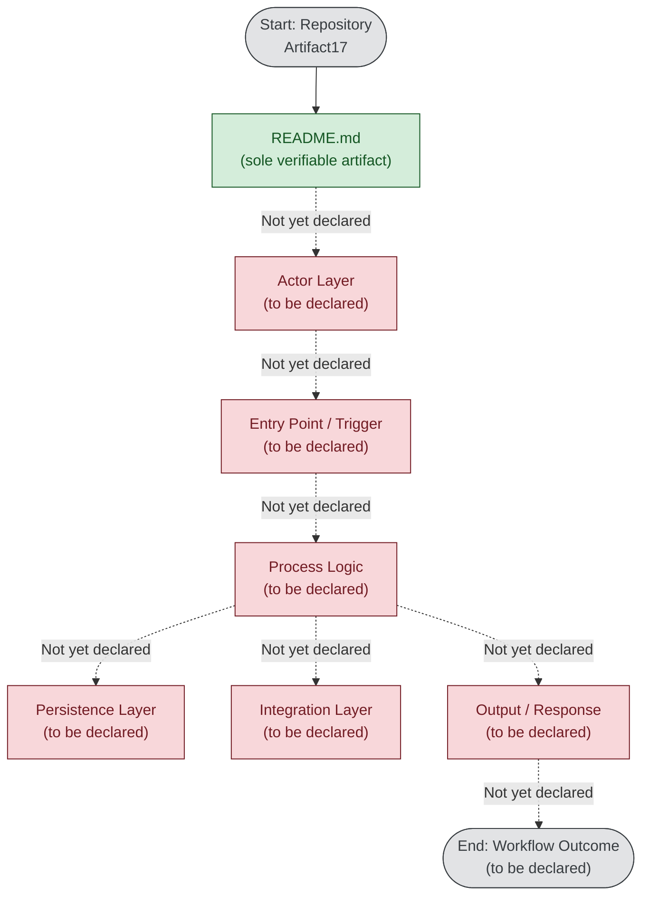

The dotted arrows labeled "Not yet declared" indicate that the relationship between layers is reserved for future population once source code, configuration, and integration artifacts are introduced.

### 4.5.2 Detailed Process Flows for Each Core Feature

Per Section 2.2.1, the feature catalog contains zero features. Consequently, no per-feature process flow can be drawn. The diagram below mirrors Section 2.4.1's `CurrentState` / `FutureState` subgraph approach to express that the per-feature process flow inventory is structurally empty:

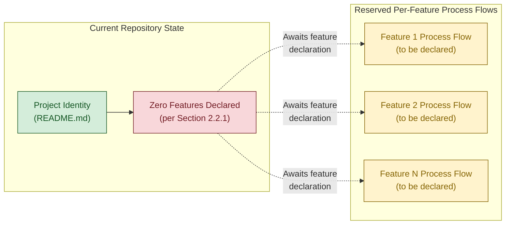

When the first feature is declared in the repository (through the addition of source code that implements a discrete, testable product capability), the corresponding `F1` placeholder in the FutureState subgraph will be populated with a concrete process flow diagram.

### 4.5.3 Error Handling Flowchart

No error-handling logic exists in the repository (per Section 4.4.2). The flowchart below provides a reserved skeleton showing the canonical error-handling decision points (detection → classification → retry vs. fallback vs. notify → recovery), styled entirely as `pending` to indicate that every node awaits population:

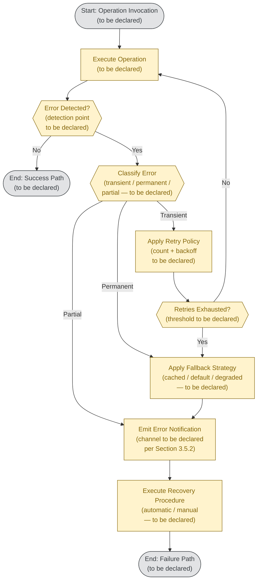

This skeleton enumerates the **structural placeholders** for an error-handling pathway. None of the depicted decision criteria, retry parameters, fallback strategies, notification channels, or recovery procedures are currently declared in the repository; each will be populated when the corresponding artifact (exception classes, retry library configuration, observability integration) is added.

### 4.5.4 Integration Sequence Diagram

No integration partners exist (per Sections 1.2.1, 2.4.2, and 3.5.1). The sequence diagram below provides a reserved skeleton with abstract participants labeled "to be declared," consistent with the swim-lane framework discussed in Section 4.3.3:

```mermaid
sequenceDiagram
    participant Actor as Actor (to be declared)
    participant System as Internal System (to be declared)
    participant External as External Service (to be declared)
    participant Store as Persistence Store (to be declared)

    Note over Actor,Store: No integration sequences are currently declared in the repository.<br/>This skeleton is reserved for future population per Section 4.6.

    Actor -->> System: Request (payload schema to be declared)
    Note right of System: Authorization checkpoint<br/>(per Section 4.3.2 — reserved)
    System -->> External: Outbound integration call<br/>(protocol to be declared per Section 4.2.2)
    External -->> System: Response (schema to be declared)
    System -->> Store: Persist result<br/>(transaction boundary to be declared per Section 4.4.1)
    Store -->> System: Acknowledgement
    System -->> Actor: Response (schema to be declared)

    Note over Actor,Store: All arrows shown as dashed lines because no concrete<br/>integration contract has been declared (per Section 2.4.2).
```

This skeleton enumerates the canonical participants and message exchanges typical of a synchronous integration sequence. None of the depicted participants, message schemas, protocols, authorization checks, or persistence semantics are currently declared in the repository.

### 4.5.5 State Transition Diagram

No state machines exist in the repository (per Section 4.4.1). The state diagram below provides a reserved skeleton using Mermaid's `stateDiagram-v2` notation, with abstract state names labeled as placeholders:

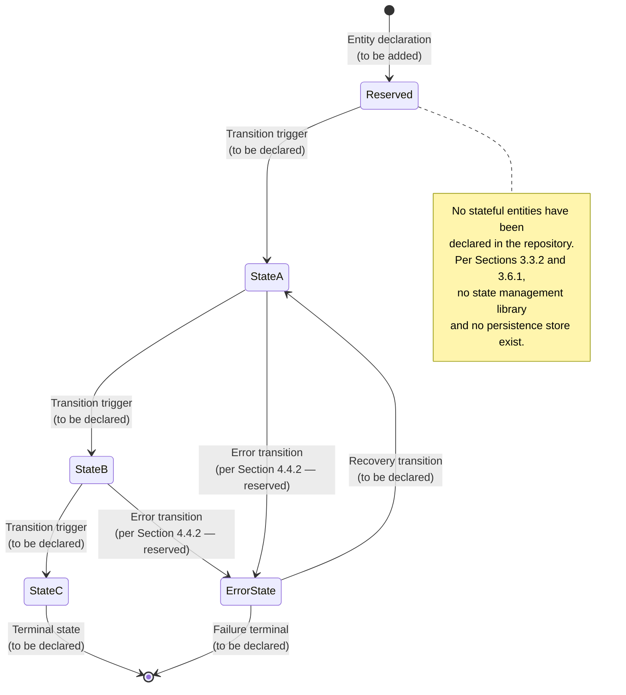

This skeleton enumerates the canonical structure of a state machine (initial state, intermediate states, error state with recovery transition, terminal states). When stateful entities are declared in future repository commits, each entity will be assigned its own concrete state diagram replacing the abstract `StateA`, `StateB`, `StateC` placeholders.

### 4.5.6 Diagram Population Sequence

The five diagrams above are populated in a recommended dependency order that minimizes rework across Section 4. The flowchart below mirrors the population-sequence pattern established in Section 3.8.2:

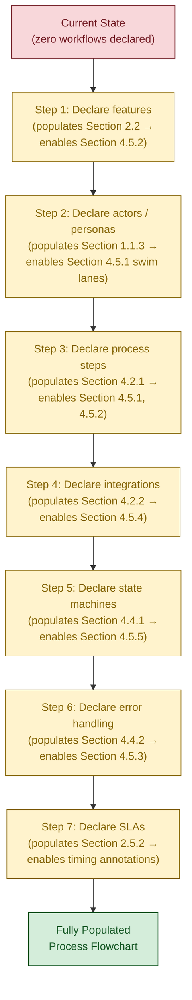

This sequence is presented as **guidance for future authoring**, not as a project plan or commitment, in conformance with the same authoring discipline applied in Section 3.8.2.

---

## 4.6 UPDATE TRIGGERS FOR SECTION 4

Consistent with the master Update Trigger framework established in Section 1.4.2 and reinforced in Sections 2.7 and 3.8.1, Section 4 of this Technical Specification should be revised when any of the following repository state changes occur. Each trigger maps to a specific subsection of Section 4 that becomes populatable when the trigger fires:

### 4.6.1 Workflow Population Triggers

| Repository State Change | Required Update to Section 4 |
|-------------------------|------------------------------|
| Addition of source code with handler, controller, or route definitions | Populate Section 4.2.1 (Core Business Processes) and Section 4.5.1 (High-Level System Workflow) |
| Addition of multiple discrete feature implementations | Populate Section 4.5.2 (Detailed Process Flows for Each Core Feature) |
| Addition of API specifications (OpenAPI, GraphQL schemas, gRPC `.proto` files) | Populate Section 4.2.2 (Integration Workflows) and Section 4.5.4 (Integration Sequence Diagram) |
| Addition of event handler / message consumer code | Populate Section 4.2.2 (Event Processing Flows) |
| Addition of scheduled task / cron / batch job definitions | Populate Section 4.2.2 (Batch Processing Sequences) |

### 4.6.2 Validation and Compliance Triggers

| Repository State Change | Required Update to Section 4 |
|-------------------------|------------------------------|
| Addition of validation library configuration (e.g., JSON Schema, Joi, Zod, Pydantic) | Populate Section 4.3.2 (Validation Rules — Data Validation) |
| Addition of authorization middleware or policy files | Populate Section 4.3.2 (Validation Rules — Authorization Checkpoints) |
| Addition of business rules engine or rules configuration | Populate Section 4.3.2 (Validation Rules — Business Rules) |
| Addition of compliance attestation documents (SOC 2, ISO 27001, GDPR, HIPAA) | Populate Section 4.3.2 (Validation Rules — Regulatory Compliance) |

### 4.6.3 State Management Triggers

| Repository State Change | Required Update to Section 4 |
|-------------------------|------------------------------|
| Addition of ORM model definitions or domain entity classes | Populate Section 4.4.1 (State Management — State Transitions) |
| Addition of state machine library code or workflow orchestrator definitions | Populate Section 4.4.1 and Section 4.5.5 (State Transition Diagram) |
| Addition of database schema files or migrations | Populate Section 4.4.1 (Data Persistence Points) |
| Addition of caching layer configuration (Redis, Memcached, etc.) | Populate Section 4.4.1 (Caching Requirements) |
| Addition of transaction management configuration (DB transactions, saga orchestrators) | Populate Section 4.4.1 (Transaction Boundaries) |

### 4.6.4 Error Handling and SLA Triggers

| Repository State Change | Required Update to Section 4 |
|-------------------------|------------------------------|
| Addition of error-handling middleware or exception classes | Populate Section 4.4.2 (Error Classes) |
| Addition of retry library configuration (e.g., Polly, retry, tenacity) | Populate Section 4.4.2 (Retry Mechanisms) |
| Addition of circuit breaker configuration | Populate Section 4.4.2 (Fallback Processes) |
| Addition of observability / alerting integration (e.g., Sentry, PagerDuty) | Populate Section 4.4.2 (Error Notification Flows) and Section 4.5.3 |
| Addition of operational runbooks | Populate Section 4.4.2 (Recovery Procedures) |
| Addition of SLA / SLO documents or performance test specifications | Populate Section 4.3.1 (Timing and SLA Considerations) |

### 4.6.5 Cross-Section Consistency Constraints

When Section 4 is populated, the resulting content must remain consistent with declarations made in other sections of this Technical Specification. The consistency anchors mirror the framework established in Section 3.8.3:

| Consistency Anchor | Requirement |
|--------------------|-------------|
| Section 1.1.3 (Stakeholders) | Actor labels in Section 4.5 swim lanes must match declared personas |
| Section 1.2.2 (Core Technical Approach) | Process steps must be implementable in the declared language/framework |
| Section 2.2 (Feature Catalog) | Per-feature process flows (Section 4.5.2) must enumerate all declared features |
| Section 2.4.2 (Integration Points Status) | Integration sequence diagrams (Section 4.5.4) must match declared integrations |
| Section 2.5.2 (Performance Requirements) | Timing annotations in Section 4 diagrams must align with declared SLAs |
| Section 2.5.4 (Security Implications) | Authorization checkpoints (Section 4.3.2) must align with declared security model |
| Section 3.6 (Databases & Storage) | Persistence points in Section 4.4.1 must reference declared stores |
| Section 3.5 (Third-Party Services) | External participants in Section 4.5.4 must match declared third-party services |

Until Section 4 is populated, these consistency constraints are reserved and inactive — identical to the treatment in Section 3.8.3.

---

## 4.7 REFERENCES

### 4.7.1 Files Examined

- `README.md` — The sole content file in the repository, containing exactly one line (`# Artifact17`). Inspected to confirm that no workflow declarations, no process step enumerations, no state machine definitions, no error-handling specifications, no integration contracts, and no SLA targets are embedded in its contents. This is the same evidentiary basis used in Sections 1.5.1 and 2.8.1.

### 4.7.2 Folders Examined

- `/` (repository root) — Enumeration confirmed `README.md` as the sole child entry, with no subdirectories at any depth. This confirms the absence of standard workflow-related directories such as `workflows/`, `flows/`, `processes/`, `state/`, `state-machines/`, `handlers/`, `controllers/`, `routes/`, `events/`, `jobs/`, `batch/`, `integrations/`, `adapters/`, `clients/`, `validators/`, `policies/`, `errors/`, or `runbooks/`. This is the same evidentiary basis used in Sections 1.5.2, 2.8.2, and 3.9.

### 4.7.3 Technical Specification Sections Cross-Referenced

- **Section 1.1 (Executive Summary)** — Established the repository maturity ("Initialization, named, not yet specified") that grounds the absence of business processes and user journeys in Section 4.2.1.
- **Section 1.2 (System Overview)** — Established the absence of integrations, system capabilities, and technical approach. Referenced extensively in Sections 4.1.2, 4.2.1, 4.2.2, 4.4.1, and 4.4.2.
- **Section 1.3 (Scope)** — Established that no user workflows, no integrations, and no use cases are in scope. Referenced in Sections 4.1.2, 4.2.1, and 4.4.2.
- **Section 1.4 (Document Positioning and Reading Guidance)** — Established the "conformant placeholder specification" pattern and the master update-trigger framework that Section 4 inherits. Referenced in Sections 4.1.1, 4.1.3, and 4.6.
- **Section 1.5 (References)** — Established that absence statements reflect verified absence (100% repository coverage). Referenced in Section 4.7.4 below.
- **Section 2.1 (Requirements Declaration Status)** — Confirmed no discrete features; established methodological constraints against fabrication that Section 4.1.3 mirrors.
- **Section 2.2 (Feature Catalog)** — Confirmed zero features, which directly grounds the empty content of Section 4.5.2 (Detailed Process Flows for Each Core Feature).
- **Section 2.3 (Functional Requirements Table)** — Established the four-category validation rules framework (business, data, security, compliance) that Section 4.3.2 inherits.
- **Section 2.4 (Feature Relationships)** — Confirmed no integration points; provided the `CurrentState`/`FutureState` subgraph pattern reused in Section 4.5.2.
- **Section 2.5 (Implementation Considerations)** — Confirmed no technical constraints, no performance requirements, no scalability considerations, no security implications, and no maintenance requirements. Referenced in Sections 4.3.1, 4.4.1, and 4.4.2.
- **Section 2.6 (Traceability Matrix)** — Established the reserved-trace dotted-arrow notation (`-.->`) used in Sections 4.5.1, 4.5.2, and 4.5.6.
- **Section 2.7 (Assumptions, Constraints, and Update Triggers)** — Established the constraint that no IDs may be invented and reinforced the update-trigger pattern. Referenced in Sections 4.1.3 and 4.6.
- **Section 2.8 (References)** — Established the section-level References subsection pattern (Files, Folders, Cross-References, Searches, Evidentiary Confidence) replicated in this Section 4.7.
- **Section 3.1 (Overview of Current Technology State)** — Established the explicit non-assertion of reference catalog defaults — a critical constraint that Section 4.1.3 mirrors when mentioning common workflow and error-handling patterns as reserved options only.
- **Section 3.3 (Frameworks & Libraries)** — Confirmed "State Management Library: Not yet specified." Directly grounds Section 4.4.1.
- **Section 3.5 (Third-Party Services)** — Confirmed no third-party services. Directly grounds Section 4.2.2 (Integration Workflows) and Section 4.5.4.
- **Section 3.6 (Databases & Storage)** — Confirmed no databases, no caching layer, no object storage, and no persistence strategy. Directly grounds Section 4.4.1 (State Management).
- **Section 3.7 (Development & Deployment)** — Confirmed no CI/CD pipeline definitions, no build automation, and no scheduled task definitions. Grounds the batch processing absence in Section 4.2.2.
- **Section 3.8 (Technology Stack Population Triggers)** — Established the population-sequence flowchart pattern (`flowchart TD` from Section 3.8.2) reused in Section 4.5.6.

### 4.7.4 Searches Performed

This section's evidentiary base does not require additional searches beyond those documented in Sections 1.5.3, 2.8.4, and 3.9. The semantic and structural searches already executed — covering source code, configuration, manifests, documentation artifacts, workflow definitions, state machine declarations, API endpoint handlers, process flows, integration adapters, and event/message handlers — each returned zero matches. These zero-match results confirm that no process flow artifacts exist anywhere in the repository.

The following searches contribute directly to Section 4's evidentiary base:

| Search Type | Query / Target | Result |
|-------------|----------------|--------|
| Semantic file search | "process flow state machine API endpoint handler" | Zero matches |
| Semantic file search | "configuration source code implementation business logic workflow" | Zero matches |
| Semantic folder search | "source code modules services workflows" | Zero matches |
| Folder enumeration | Repository root (`/`) | Single child: `README.md`; no subdirectories |
| File content inspection | `README.md` | One line: `# Artifact17`; no workflow content |

### 4.7.5 Evidentiary Confidence

The evidentiary confidence for Section 4 is **complete (100%)**, inheriting directly from Sections 1.5.4, 2.8.5, and 3.9. Every statement of "Not yet specified," "None," "Reserved," or "zero" in this section is a statement of **verified absence**, not a statement of search incompleteness. The repository has been exhaustively enumerated (one file, no subdirectories), the sole content file has been read in full, and multiple independent semantic searches confirm no additional indexable content related to workflows, processes, state machines, integrations, validation, or error handling exists.

Section 4 is authored as a structurally conformant placeholder that preserves the complete framework for a future Process Flowchart section — including all five required Mermaid diagrams (high-level workflow, per-feature process flows, error handling, integration sequence, state transition), all required reserved schemas (Core Business Processes, Integration Workflows, Validation Rules, State Management, Error Handling), and all required update triggers — without inventing content that does not exist in the repository.

# 5. System Architecture

## 5.1 Architecture Declaration Status

### 5.1.1 Overview of Current Architectural State

The **Artifact17** repository, as verified by the exhaustive examination documented in Section 1.5 (References) and Section 3.9 (References), declares no system architecture in its current state. No architectural style has been chosen, no architectural pattern has been imposed, no components have been declared, no data flows have been defined, no integrations have been established, and no cross-cutting concerns have been configured.

This Section 5 (System Architecture) is therefore authored as a **conformant placeholder specification**, consistent with the documentation philosophy established in Section 1.4.3 and rigorously applied throughout Sections 2 (Requirements), 3 (Technology Stack), and 4 (Process Flowchart) of this Technical Specification. The structural skeleton required by the section prompt — High-Level Architecture, Component Details, Technical Decisions, and Cross-Cutting Concerns — is preserved so that future architectural artifacts can populate the reserved frameworks without architectural reorganization of the document.

| Architecture Domain | Declared in Repository? | Grounding Cross-Reference |
|---|---|---|
| Architectural Style | Not yet specified | Section 1.2.2, Section 2.5.1 |
| Component Inventory | None present | Section 1.2.2, Section 2.4.3 |
| Data Flow Topology | Not yet specified | Section 2.4.2, Section 3.6.1 |
| Integration Points | None present | Section 1.2.1, Section 2.4.2 |
| Cross-Cutting Concerns | Not yet specified | Section 3.5.1, Section 4.4.2 |

### 5.1.2 Methodological Constraints on This Section

Authoring Section 5 in conformance with the evidence-based standard established in Section 1.4.1, the verified constraints in Section 2.7.2, the non-assertion of reference catalog defaults in Section 3.1.4, and the methodological constraints in Section 4.1.3 requires strict adherence to the following rules:

- **No fabricated component identifiers.** No component names, service IDs, module names, or subsystem labels (such as `service-a`, `gateway`, `worker`, `frontend`, `backend`) are coined in this section because no components exist in the repository to be identified.
- **No postulated architectural style.** Neither monolith, microservices, service-oriented, event-driven, layered, hexagonal, clean, microkernel, nor any other architectural style is described as the project's adopted choice.
- **No assumed technology selections.** Cloud platforms, databases, caching layers, message brokers, programming languages, and frameworks remain unspecified, in conformance with Section 3.1.4 (which explicitly disclaims reference catalog defaults).
- **No fabricated Architecture Decision Records.** No ADR IDs (such as `ADR-001`) are coined and no decisions are recorded, because no decisions exist in the repository.
- **No fabricated SLAs, KPIs, or performance targets.** Per Section 1.4.1 and Section 2.5.2, no latency budgets, throughput targets, availability percentages, or reliability targets are postulated.
- **No imagined integration partners.** Neither external systems, third-party services, identity providers, nor monitoring platforms are named or implied.
- **Common patterns mentioned only as reserved options.** Standard architectural patterns (such as CQRS, event sourcing, saga, circuit breaker, sidecar, ambassador) may appear only inside reserved-framework tables as enumerated value sets — never as the project's adopted approach. This rule is identical to the constraint established in Section 4.1.3.

### 5.1.3 Grounding Cross-References

Every "Not yet specified" claim made in Section 5 is anchored to a prior, independently grounded section of this Technical Specification. The cross-reference matrix below summarizes the evidentiary base used throughout this section:

| Section 5 Subject Area | Grounding Section(s) | Established Finding |
|---|---|---|
| Architectural style / pattern | Section 1.2.2, Section 2.5.1, Section 3.3.1 | No style, framework, or pattern declared |
| Major system components | Section 1.2.2, Section 2.4.3 | Zero components; no modules, packages, libraries, services, or subsystems |
| Data flows / integration patterns | Section 1.2.1, Section 2.4.2 | No external dependencies; no integration points |
| External integrations / third-party services | Section 1.2.1, Section 3.5.1 | All ten third-party service categories unpopulated |
| Data persistence / storage | Section 1.2.2, Section 3.6.1 | No databases, caches, object storage declared |
| Monitoring / observability | Section 1.2.1, Section 3.5.2 | No telemetry configuration |
| Authentication / authorization | Section 1.2.1, Section 2.5.4, Section 3.5.1 | No authentication mechanism or authorization model |
| Error handling | Section 4.4.2 | No retry, fallback, notification, or recovery declared |
| Performance / SLA targets | Section 1.2.3, Section 2.5.2, Section 2.5.3 | No KPI category populated |
| Disaster recovery | Section 2.5.5, Section 3.6.2 | No operational runbooks; no backup/restore policy |

---

## 5.2 High-Level Architecture

### 5.2.1 System Overview

#### Architectural Style and Rationale

No overall architectural style has been declared in the repository. Per Section 1.2.2 (Core Technical Approach), no programming language, framework, architectural style, or deployment model has been declared. Per Section 2.5.1 (Technical Constraints), no programming language, no framework, no architectural style, and no deployment model are specified. Per Section 3.3.1 (Framework Declaration Status), the absence of any framework selection means that no architectural pattern dictated by a framework (MVC, MVVM, component-based UI, actor model, microservices framework, and similar) has been imposed on the project.

No rationale can be articulated for an architectural style that has not been selected. When an architectural style is declared, the rationale should be documented under Section 5.4.2 (Architecture Style Decision) using the reserved Architecture Decision Record schema in Section 5.4.1.

#### Key Architectural Principles and Patterns

No architectural principles (such as separation of concerns, single responsibility, hexagonal isolation, eventual consistency, or twelve-factor app discipline) and no architectural patterns (such as layered, pipes-and-filters, event-driven, microkernel, or service mesh) have been declared in the repository. The repository's architectural surface is empty.

#### System Boundaries and Major Interfaces

Per Section 1.3.1 (Implementation Boundaries), the verifiable system boundary is bounded by the single artifact present in the repository:

| Boundary Dimension | Current Extent | Grounding Reference |
|---|---|---|
| System Boundary | Single Markdown file (`README.md`) | Section 1.3.1 |
| External Inbound Interfaces | None declared | Section 1.2.1, Section 2.4.2 |
| External Outbound Interfaces | None declared | Section 1.2.1, Section 3.5.1 |
| Internal Inter-Component Interfaces | None declared (zero components) | Section 1.2.2, Section 2.4.3 |

#### Current Architecture Landscape Diagram

The diagram below depicts the complete, observable architectural surface of the repository in its current state. It mirrors the component-inventory style established in Section 1.2.2 and the technology-landscape style established in Section 3.1.5.

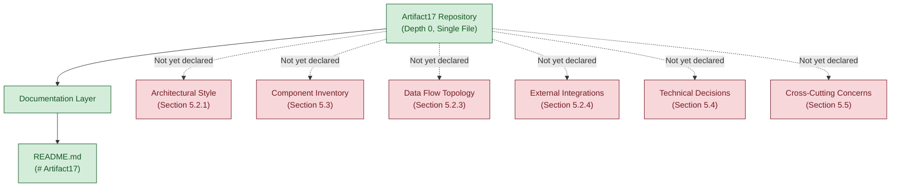

The dotted arrows labeled "Not yet declared" indicate the relationship between the repository's verifiable surface and each architectural dimension reserved for future population.

### 5.2.2 Core Components Table

Per Section 1.2.2, no system components exist in the repository; there are no modules, packages, libraries, services, or subsystems to describe. Per Section 2.4.3, no shared components or common services exist in the repository — Shared Libraries: None present; Common Utility Modules: None present; Cross-Feature Services: None present; Shared Data Stores: None present.

The Core Components Table is therefore presented as a reserved schema. Per the documentation requirement that tables not exceed four columns, the four columns selected from the prompt's five candidate columns are: Component Name, Primary Responsibility, Key Dependencies, and Integration Points. The remaining candidate dimension (Critical Considerations) is cataloged per-component in Section 5.3 (Reserved Component Schema) when components are introduced.

| Component Name | Primary Responsibility | Key Dependencies | Integration Points |
|---|---|---|---|
| Not yet specified | Not yet specified | Not yet specified | Not yet specified |

When components are introduced into the repository, each row of this table will be populated with a single component declaration. Population is triggered per Section 5.6 (Update Triggers) when source code with module boundaries is added.

### 5.2.3 Data Flow Description

#### Primary Data Flows Between Components

No primary data flows can be documented because no components exist between which data could flow. Per Section 2.4.3, no cross-feature services or shared data stores are present.

#### Integration Patterns and Protocols

No integration patterns have been declared. Per Section 2.4.2 (Integration Points Status), the four integration categories — internal feature-to-feature, service-to-service (REST/gRPC), asynchronous messaging, and identity/authentication — are all "Not yet specified." Per Section 3.5.1 (External Service Declaration Status), no SDK references, no API client code, and no broker configuration are present.

#### Data Transformation Points

No data transformation points have been declared. The repository contains no schemas, no serializers, no marshaling code, no ETL definitions, and no message-mapping configuration. Per Section 3.3.2, the Serialization / Marshaling Library dimension is "Not yet specified."

#### Key Data Stores and Caches

No data stores and no caches have been declared. Per Section 3.6.1, no databases, caches, or storage services have been declared in the repository. Per Section 3.6.3, all five caching dimensions — in-process cache, distributed cache, HTTP/edge cache, invalidation strategy, and coherence model — are "Not yet specified." Per Section 3.6.4, no object/file storage has been declared.

| Data Flow Dimension | Declared in Repository? | Grounding Reference |
|---|---|---|
| Primary Data Flows | Not yet specified | Section 2.4.3 |
| Integration Protocols | Not yet specified | Section 2.4.2, Section 3.5.1 |
| Data Transformation Points | Not yet specified | Section 3.3.2 |
| Data Stores and Caches | Not yet specified | Section 3.6.1, Section 3.6.3, Section 3.6.4 |

### 5.2.4 External Integration Points

Per Section 1.2.1 (Integration with Existing Enterprise Landscape), no external service dependencies, no data source integrations, no authentication/identity providers, no messaging/event infrastructure, and no monitoring/observability platforms exist in the repository. Per Section 3.5.1, all ten standard third-party service categories — Cloud Platform, Authentication/Identity Provider, External APIs, Email/Notification Services, Payment Processing, Monitoring/Observability, Analytics, CDN, AI/ML Services, and Search Services — are unpopulated.

The External Integration Points table is therefore presented as a reserved schema. Per the four-column documentation requirement, the columns selected from the prompt's five candidates are: System Name, Integration Type, Protocol/Format, and SLA Requirements. The remaining candidate dimension (Data Exchange Pattern) is cataloged per-integration in the reserved schema in Section 5.3 when integrations are introduced.

| System Name | Integration Type | Protocol/Format | SLA Requirements |
|---|---|---|---|
| Not yet specified | Not yet specified | Not yet specified | Not yet specified |

Per Section 1.4.1 (Evidence-Based Authoring Standard) and Section 2.7.2 (Verified Constraints), no SLA values are populated as defaults — vendor-published or contractually agreed SLA targets must be evidence-grounded before being cataloged.

---

## 5.3 Component Details

### 5.3.1 Component Declaration Status

No components are present in the repository to detail. This finding is grounded in:

- **Section 1.2.2** — No system components exist in the repository; there are no modules, packages, libraries, services, or subsystems to describe.
- **Section 2.4.3** — No shared components or common services exist in the repository. Shared Libraries: None present; Common Utility Modules: None present; Cross-Feature Services: None present; Shared Data Stores: None present.
- **Section 3.3.1** — The absence of any framework selection means that no architectural pattern dictated by a framework has been imposed on the project.

The section-prompt requirement to specify, for each major component, the purpose and responsibilities, technologies and frameworks used, key interfaces and APIs, data persistence requirements, and scaling considerations cannot be applied to any concrete component because the per-component count is zero.

### 5.3.2 Reserved Component Schema

When components are introduced into the repository (through the addition of source code with module boundaries, package manifests defining published modules, service definitions, or distinct deployable units), each component will be cataloged using the reserved schema below. This schema mirrors the reserved-framework pattern adopted in Sections 3.3.3, 3.5.3, 3.6.5, 4.4.1, and 4.4.2.

| Reserved Dimension | Format / Allowed Values | Currently Populated? |
|---|---|---|
| Component Name | Logical name (e.g., `order-service`, `auth-module`) | Not yet specified |
| Purpose and Responsibilities | Free-form description | Not yet specified |
| Technologies and Frameworks | Per future Section 3.2 / 3.3 declarations | Not yet specified |
| Key Interfaces (Inbound) | Per future Section 5.2.4 declarations | Not yet specified |
| Key Interfaces (Outbound) | Per future Section 5.2.4 declarations | Not yet specified |
| Data Persistence Binding | Per future Section 3.6 store declarations | Not yet specified |
| Scaling Strategy | Stateless / sticky / sharded / leader-elected | Not yet specified |
| Concurrency Model | Thread-per-request / event loop / actor / coroutine | Not yet specified |
| Deployment Unit | Per future Section 3.7 declarations | Not yet specified |
| Operational Criticality | Tier 0 / Tier 1 / Tier 2 / Tier 3 | Not yet specified |

### 5.3.3 Placeholder Component Interaction Diagram

No component interactions can be diagrammed because zero components exist. The diagram below provides a reserved skeleton mirroring the `CurrentState` / `FutureState` subgraph pattern established in Section 2.4.1 and Section 4.5.2. The "Future Component Interactions" subgraph uses abstract labels (`Component A`, `Component B`, `Component N`) which must be replaced by concrete component names once Section 5.2.2 is populated.

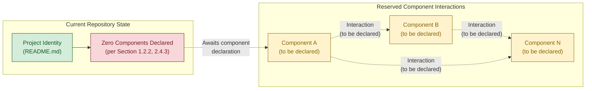

### 5.3.4 Placeholder State Transition Diagram

No state machines exist in the repository (per Section 4.4.1). Rather than duplicate the reserved entity-lifecycle skeleton already provided in Section 4.5.5, this subsection provides a complementary skeleton that emphasizes component-level lifecycle state ownership. The two diagrams are intended to be populated in coordination — Section 4.5.5 for domain-entity lifecycles and the diagram below for component-instance lifecycles.

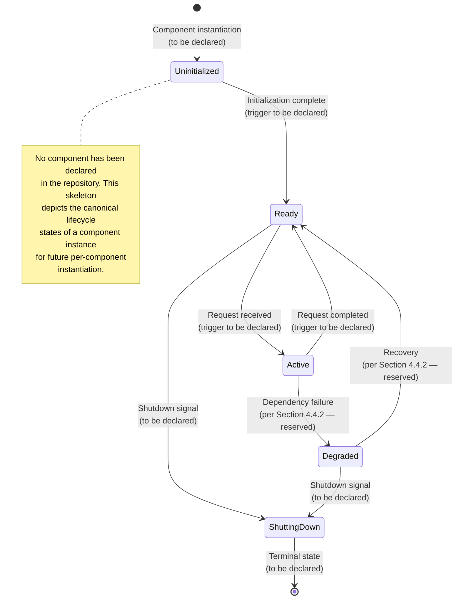

### 5.3.5 Placeholder Sequence Diagram for a Key Flow

No key flows exist between components because zero components exist. The diagram below mirrors the reserved-skeleton sequence diagram established in Section 4.5.4, adapted to focus on the architectural-component perspective. All participants are labeled as "to be declared," and all message contracts (request schemas, response schemas, protocols, authorization checkpoints, transaction boundaries) are reserved for future population.

```mermaid
sequenceDiagram
    participant Actor as Actor (to be declared)
    participant CompA as Component A (to be declared)
    participant CompB as Component B (to be declared)
    participant Store as Persistence Store (to be declared)

    Note over Actor,Store: No component interactions are currently declared.<br/>This skeleton is reserved for future population per Section 5.6.

    Actor -->> CompA: Inbound request<br/>(schema to be declared)
    Note right of CompA: Authorization checkpoint<br/>(per Section 5.5.4 — reserved)
    CompA -->> CompB: Internal call<br/>(protocol to be declared)
    CompB -->> Store: Persistence operation<br/>(transaction boundary per Section 4.4.1)
    Store -->> CompB: Acknowledgement
    CompB -->> CompA: Response<br/>(schema to be declared)
    CompA -->> Actor: Outbound response<br/>(schema to be declared)

    Note over Actor,Store: All arrows are dashed because no concrete<br/>component contract has been declared (per Section 2.4.3).
```

---

## 5.4 Technical Decisions

### 5.4.1 Architecture Decision Records — Reserved Template

No Architecture Decision Records (ADRs) have been declared in the repository. There is no `docs/adr/` directory, no `adr/` directory, no `decisions/` directory, and no ADR markdown files at any path (a finding inherited from Section 3.9.2, which enumerated the absence of all standard directory categories at depth 0). Per Section 1.4.1, no architectural decisions can be postulated.

When ADRs are introduced, each decision will be cataloged using the reserved schema below. The schema follows the widely adopted Michael Nygard ADR format and is presented as a reserved template only; no decision is asserted as adopted.

| Reserved ADR Dimension | Format / Allowed Values | Currently Populated? |
|---|---|---|
| Decision ID | `ADR-NNN` (sequential) | Not yet specified |
| Decision Title | Imperative phrase | Not yet specified |
| Status | Proposed / Accepted / Deprecated / Superseded | Not yet specified |
| Context | Forces, constraints, and problem statement | Not yet specified |
| Decision | The chosen option | Not yet specified |
| Consequences | Positive, negative, and neutral effects | Not yet specified |
| Alternatives Considered | Enumerated rejected options with rationale | Not yet specified |
| Related Decisions | Cross-references to other ADRs | Not yet specified |

### 5.4.2 Architecture Style Decision — Reserved

No architecture style decision has been made in the repository. Per Section 1.2.2 and Section 2.5.1, the architectural style dimension is "Not yet specified." The table below enumerates common architectural styles as **reserved options only** — none is the project's adopted choice, in conformance with the constraint established in Section 4.1.3 ("Common patterns mentioned only as reserved options").

| Reserved Option (Reference Only) | Typical Trade-Off Profile | Selected? |
|---|---|---|
| Monolith | Simplicity vs. independent scaling | Not yet specified |
| Modular Monolith | Boundary clarity vs. deployment unification | Not yet specified |
| Microservices | Independent scaling vs. operational complexity | Not yet specified |
| Service-Oriented Architecture | Service contracts vs. governance overhead | Not yet specified |
| Event-Driven Architecture | Decoupling vs. eventual consistency | Not yet specified |
| Serverless / Function-as-a-Service | Elasticity vs. cold-start and vendor lock-in | Not yet specified |
| Layered / N-Tier | Separation of concerns vs. cross-cutting overhead | Not yet specified |
| Hexagonal / Ports-and-Adapters | Testability vs. abstraction overhead | Not yet specified |

### 5.4.3 Communication Pattern Decisions — Reserved

No communication patterns have been chosen. Per Section 2.4.2 and Section 3.5.1, all integration categories — service-to-service, asynchronous messaging, identity federation, and observability telemetry — are unpopulated. The table below enumerates standard communication patterns as reserved options only.

| Reserved Communication Option (Reference Only) | Typical Use Case | Selected? |
|---|---|---|
| Synchronous Request/Response (REST, gRPC, GraphQL) | Real-time queries with strong consistency | Not yet specified |
| Asynchronous Messaging (queue, topic, stream) | Decoupled producers and consumers | Not yet specified |
| Publish/Subscribe (broker-based or peer-to-peer) | Fan-out event distribution | Not yet specified |
| Event Streaming (log-based) | High-throughput replayable event history | Not yet specified |
| Webhooks (push callbacks) | Vendor-to-tenant integration | Not yet specified |
| Server-Sent Events / WebSockets | Long-lived push channels | Not yet specified |

### 5.4.4 Data Storage Decisions — Reserved

No data storage decision has been made. Per Section 3.6.1 and Section 3.6.2, no primary database engine, secondary/replica strategy, persistence model, schema management approach, migration tooling, backup/restore policy, retention policy, or data residency constraint has been declared. The table below enumerates standard data store options as reserved categories only.

| Reserved Storage Option (Reference Only) | Typical Workload Profile | Selected? |
|---|---|---|
| Relational Database (RDBMS) | Strongly consistent transactional workloads | Not yet specified |
| Document Store | Schema-flexible, aggregate-oriented workloads | Not yet specified |
| Key-Value Store | High-throughput simple lookups | Not yet specified |
| Wide-Column Store | Massive sparse tables with predictable access | Not yet specified |
| Graph Database | Relationship-centric traversals | Not yet specified |
| Time-Series Database | Append-heavy temporal workloads | Not yet specified |
| Object / Blob Storage | Large immutable assets | Not yet specified |
| Search Index | Full-text and faceted query workloads | Not yet specified |

### 5.4.5 Caching Strategy Decisions — Reserved

No caching strategy has been declared. Per Section 3.6.3, all five caching dimensions — in-process cache, distributed cache, HTTP/edge cache, invalidation strategy, and coherence model — are "Not yet specified." The table below enumerates standard caching strategies as reserved options only.

| Reserved Caching Option (Reference Only) | Coherence / Latency Trade-Off | Selected? |
|---|---|---|
| No Cache (direct origin reads) | Strong consistency, higher latency | Not yet specified |
| In-Process / Embedded Cache | Lowest latency, no cross-instance coherence | Not yet specified |
| Distributed Cache | Shared state, network hop | Not yet specified |
| Read-Through / Write-Through Cache | Application-transparent coherence | Not yet specified |
| Write-Behind / Write-Back Cache | Throughput-optimized, durability risk | Not yet specified |
| HTTP / Edge / CDN Cache | Geographic distribution, invalidation complexity | Not yet specified |

### 5.4.6 Security Mechanism Decisions — Reserved

No security mechanisms have been chosen. Per Section 2.5.4, all four security dimensions — authentication mechanism, authorization model, data classification, and threat model — are "Not yet specified." The table below enumerates standard security mechanism categories as reserved options only.

| Reserved Security Dimension | Reserved Options (Reference Only) | Selected? |
|---|---|---|
| Authentication Mechanism | Password / OAuth2 / OIDC / SAML / mTLS / API key | Not yet specified |
| Authorization Model | RBAC / ABAC / ReBAC / capability-based | Not yet specified |
| Secret Management | Environment variables / vault / cloud KMS / sealed secrets | Not yet specified |
| Transport Security | TLS 1.2+ / mTLS / VPN / private network | Not yet specified |

### 5.4.7 Decision Tree Placeholder Diagram

The decision tree below mirrors the population-sequence pattern established in Section 3.8.2 and Section 4.5.6. It depicts the canonical sequence of architectural decisions reserved for future population. No node is marked as resolved, and the sequence is presented as **guidance for future authoring**, not as a project plan or commitment.

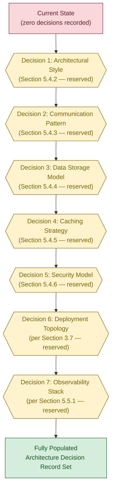

---

## 5.5 Cross-Cutting Concerns

### 5.5.1 Monitoring and Observability — Reserved

No monitoring or observability platforms have been declared in the repository. Per Section 1.2.1, no telemetry configuration exists. Per Section 3.5.2, the Monitoring/Observability category is "Not yet specified." No APM agent configuration, no log aggregator configuration, and no distributed tracing collector configuration has been added.

| Observability Dimension | Reserved Options (Reference Only) | Declared in Repository? |
|---|---|---|
| Metrics Collection | Prometheus-style / StatsD / cloud-native | Not yet specified |
| Distributed Tracing | OpenTelemetry / vendor-specific | Not yet specified |
| Log Aggregation | Centralized log shipper / cloud-native | Not yet specified |
| Alerting Channel | Pager / chat / email / webhook | Not yet specified |

### 5.5.2 Logging and Tracing — Reserved

No logging or tracing strategy has been declared. Per Section 3.3.2, the Logging / Telemetry Library category is "Not yet specified." No log format (JSON, plain text, or protobuf), log level convention, correlation ID strategy, or trace context propagation mechanism is configured.

| Logging/Tracing Dimension | Reserved Options (Reference Only) | Declared in Repository? |
|---|---|---|
| Log Format | JSON / plain / protobuf / custom | Not yet specified |
| Log Level Convention | Debug / Info / Warn / Error / Fatal | Not yet specified |
| Correlation ID Strategy | Per-request / per-session / per-tenant | Not yet specified |
| Trace Context Propagation | W3C Trace Context / B3 / vendor-specific | Not yet specified |

### 5.5.3 Error Handling — Reserved

No error-handling strategy has been declared. Per Section 4.4.2, no error handling strategy has been declared in the repository. All four error-handling elements — Retry Mechanisms, Fallback Processes, Error Notification Flows, and Recovery Procedures — are reserved and unpopulated. The reserved schema for error classes (Error Class Identifier, Detection Point, Classification, Retry Policy, Backoff Strategy, Fallback Strategy, Notification Channel, Recovery Procedure, Compensating Action) is documented in Section 4.4.2 and is cross-referenced from this section to avoid duplication.

The placeholder error-handling flow diagram is provided in Section 5.5.7 (below), which mirrors the reserved skeleton established in Section 4.5.3 and adapts it to the cross-cutting-concern perspective.

### 5.5.4 Authentication and Authorization — Reserved

No authentication or authorization framework has been declared. Per Section 2.5.4, both Authentication Mechanism and Authorization Model are "Not yet specified." Per Section 3.5.1, no authentication / identity provider is integrated. Per Section 1.2.1, no auth configuration exists in the repository.

| AuthN / AuthZ Dimension | Reserved Options (Reference Only) | Declared in Repository? |
|---|---|---|
| Identity Provider | Internal / external IdP (OIDC/SAML) / federated | Not yet specified |
| Token Format | JWT / opaque / PASETO / session cookie | Not yet specified |
| Authorization Decision Point | Centralized PDP / embedded / middleware | Not yet specified |
| Policy Language | RBAC roles / ABAC rules / OPA Rego / Cedar | Not yet specified |

### 5.5.5 Performance Requirements and SLAs — Reserved

No performance requirements or SLAs have been declared. Per Section 1.2.3 (Key Performance Indicators), all KPI categories — Performance Metrics (latency, throughput), Reliability Metrics (uptime, error rates), Adoption Metrics, and Quality Metrics — are "Not yet specified." Per Section 2.5.2 (Performance Requirements), all performance dimensions are undeclared. Per Section 2.5.3 (Scalability Considerations), no horizontal or vertical scaling strategy, no expected user volume, and no data volume projection exists.

| Performance/SLA Dimension | Target Type | Declared in Repository? |
|---|---|---|
| Latency Budget (P50/P95/P99) | Milliseconds at percentile | Not yet specified |
| Throughput Target | Requests per second / events per second | Not yet specified |
| Availability SLO | Percentage uptime over rolling window | Not yet specified |
| Error Budget | Percentage failed requests allowed | Not yet specified |

Per Section 1.4.1 and Section 2.7.2, no SLA values are inferred or proposed.

### 5.5.6 Disaster Recovery — Reserved

No disaster recovery procedures have been declared. Per Section 2.5.5 (Maintenance Requirements), no operational runbooks exist in the repository. Per Section 3.6.2, the Backup & Restore Policy dimension is "Not yet specified." Per Section 3.7.5, no rollback strategy is configured in CI/CD (which itself is unconfigured).

| Disaster Recovery Dimension | Reserved Options (Reference Only) | Declared in Repository? |
|---|---|---|
| Recovery Point Objective (RPO) | Time window of acceptable data loss | Not yet specified |
| Recovery Time Objective (RTO) | Time window of acceptable downtime | Not yet specified |
| Backup Cadence | Continuous / hourly / daily / snapshot | Not yet specified |
| Failover Strategy | Active-active / active-passive / cold standby | Not yet specified |

### 5.5.7 Placeholder Error Handling Flow Diagram

The diagram below provides a Section 5 variant of the reserved error-handling flow skeleton established in Section 4.5.3, viewed from a component-centric and cross-cutting-concern perspective. All nodes remain in the `pending` state because no error-handling logic has been declared.

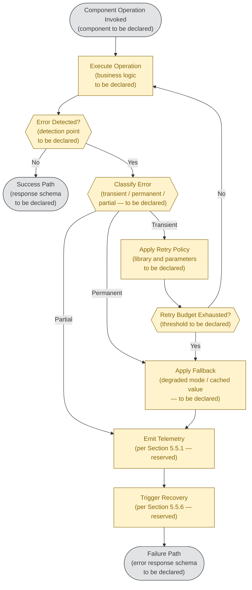

This skeleton enumerates the structural placeholders for an error-handling pathway. None of the depicted decision criteria, retry parameters, fallback strategies, notification channels, or recovery procedures are currently declared in the repository; each will be populated when the corresponding artifact (exception classes, retry library configuration, observability integration, runbook) is added.

---

## 5.6 Update Triggers for Section 5

Consistent with the master Update Trigger framework established in Section 1.4.2 and reinforced in Sections 2.7.3, 3.8.1, and 4.6, Section 5 should be revised when any of the following repository state changes occur. Each trigger maps to a specific subsection that becomes populatable when the trigger fires.

### 5.6.1 High-Level Architecture Triggers

| Repository State Change | Required Update to Section 5 |
|---|---|
| Addition of architecture documentation (`docs/architecture.md`, `ARCHITECTURE.md`) | Populate Section 5.2.1 (System Overview) with declared style and principles |
| Addition of source code with module boundaries | Populate Section 5.2.2 (Core Components Table) |
| Addition of API specifications (OpenAPI, GraphQL, gRPC `.proto`, AsyncAPI) | Populate Section 5.2.3 (Data Flow Description) and Section 5.2.4 (External Integration Points) |
| Addition of third-party service SDK imports or client configuration | Populate Section 5.2.4 (External Integration Points) |

### 5.6.2 Component Details Triggers

| Repository State Change | Required Update to Section 5 |
|---|---|
| Addition of source code with module boundaries | Populate per-component entries in Section 5.3 using the reserved schema |
| Addition of interface definitions (header files, `.proto`, `.graphql`, OpenAPI) | Populate component interfaces in Section 5.3 |
| Addition of deployment manifests (`Dockerfile`, Kubernetes manifests, Helm charts) | Populate scaling considerations in Section 5.3 |
| Addition of state machine library code or workflow orchestrator definitions | Populate Section 5.3.4 (Component State Transition Diagram) |

### 5.6.3 Technical Decisions Triggers

| Repository State Change | Required Update to Section 5 |
|---|---|
| Addition of Architecture Decision Records (`docs/adr/`, `adr/`, `decisions/`) | Populate Section 5.4.1 (ADR catalog) |
| Addition of architecture diagrams (`docs/diagrams/`, `*.drawio`, `*.puml`, `*.mmd`) | Populate Section 5.4.2 (Architecture Style Decision) |
| Addition of communication-pattern configuration (broker definitions, API gateways) | Populate Section 5.4.3 (Communication Pattern Decisions) |
| Addition of database schema or ORM models | Populate Section 5.4.4 (Data Storage Decisions) |
| Addition of caching layer configuration | Populate Section 5.4.5 (Caching Strategy Decisions) |
| Addition of authentication middleware or IdP configuration | Populate Section 5.4.6 (Security Mechanism Decisions) |

### 5.6.4 Cross-Cutting Concerns Triggers

| Repository State Change | Required Update to Section 5 |
|---|---|
| Addition of monitoring / observability integration | Populate Section 5.5.1 and Section 5.5.2 |
| Addition of authentication middleware or IdP configuration | Populate Section 5.5.4 |
| Addition of SLA / SLO / SLI documents or performance test suites | Populate Section 5.5.5 |
| Addition of disaster recovery runbooks or backup configuration | Populate Section 5.5.6 |
| Addition of error-handling middleware, retry libraries, or circuit breakers | Populate Section 5.5.3 (cross-ref Section 4.4.2) and Section 5.5.7 |

### 5.6.5 Cross-Section Consistency Constraints

When Section 5 is populated, the resulting content must remain consistent with declarations made in other sections of this Technical Specification. The consistency anchors mirror the framework established in Sections 3.8.3 and 4.6.5.

| Consistency Anchor | Requirement |
|---|---|
| Section 1.2.2 (Core Technical Approach) | Architectural style in Section 5.2.1 must match declared technical approach |
| Section 2.2 (Feature Catalog) | Components in Section 5.2.2 must implement declared features |
| Section 2.4.2 (Integration Points Status) | External integrations in Section 5.2.4 must match declared integration points |
| Section 2.5.2 (Performance Requirements) | SLAs in Section 5.5.5 must match declared performance targets |
| Section 2.5.4 (Security Implications) | AuthN/AuthZ in Section 5.5.4 must match declared security model |
| Section 3.3 (Frameworks & Libraries) | Component frameworks in Section 5.3 must match declared library inventory |
| Section 3.5 (Third-Party Services) | External systems in Section 5.2.4 must match declared third-party services |
| Section 3.6 (Databases & Storage) | Data stores in Section 5.2.3 must match declared databases |
| Section 4.4.1 (State Management) | State diagrams in Section 5.3.4 must match declared state machines |
| Section 4.4.2 (Error Handling) | Error flow in Section 5.5.7 must match declared error classes |

Until Section 5 is populated, these consistency constraints are reserved and inactive — identical to the treatment in Sections 3.8.3 and 4.6.5.

---

## 5.7 References

### 5.7.1 Files Examined

- `README.md` — The sole content file in the repository. Contains exactly one line: an H1 Markdown heading (`# Artifact17`). Examined to verify the complete absence of architecture documentation, component declarations, integration definitions, technical decision records, and cross-cutting concern configurations. This is the same evidentiary basis used in Sections 1.5.1, 2.8.1, 3.9.1, and 4.7 (where present).

### 5.7.2 Folders Examined

- `/` (repository root, depth 0) — Enumeration of the repository root confirmed `README.md` as the sole entry. No subdirectories exist at any depth. This verifies the absence of standard architecture-indicator directories including `docs/`, `docs/adr/`, `docs/architecture/`, `docs/diagrams/`, `adr/`, `decisions/`, `architecture/`, `design/`, `src/`, `services/`, `components/`, `modules/`, `lib/`, `gateway/`, `infrastructure/`, `k8s/`, `helm/`, and `terraform/`.

### 5.7.3 Technical Specification Sections Cross-Referenced

- **Section 1.2 (System Overview)** — Critical grounding source for Section 5. Section 1.2.1 enumerates absent integration categories used in Section 5.2.4. Section 1.2.2 explicitly establishes that no system components and no technical approach has been declared, directly grounding Sections 5.2.1, 5.2.2, and 5.3. Section 1.2.3 grounds the SLA/KPI absence in Section 5.5.5.
- **Section 1.3 (Scope)** — Section 1.3.1 grounds the System Boundary table in Section 5.2.1. Section 1.3.2 enumerates out-of-scope categories (build & deployment, dependencies, operational concerns, security artifacts) directly grounding multiple subsections of 5.4 and 5.5.
- **Section 1.4 (Document Positioning and Reading Guidance)** — Section 1.4.1 establishes the evidence-based authoring standard. Section 1.4.2 provides the Update Triggers framework adapted in Section 5.6. Section 1.4.3 establishes the "conformant placeholder specification" pattern adopted throughout Section 5.
- **Section 1.5 (References)** — Establishes the 100% repository coverage confidence (Section 1.5.4) inherited in Section 5.7.4.
- **Section 2.1 (Requirements Declaration Status)** — Establishes the methodological-constraints pattern adapted in Section 5.1.2.
- **Section 2.4 (Feature Relationships)** — Section 2.4.1 provides the `CurrentState` / `FutureState` subgraph diagram pattern adapted in Section 5.3.3. Section 2.4.2 grounds Section 5.2.3 (Integration Patterns) and Section 5.2.4 (External Integration Points). Section 2.4.3 grounds Section 5.2.2 (Core Components Table) and Section 5.3 (Component Details).
- **Section 2.5 (Implementation Considerations)** — Section 2.5.1 grounds Section 5.2.1 (Architectural Style). Section 2.5.2 grounds Section 5.5.5 (Performance Requirements and SLAs). Section 2.5.3 grounds scaling considerations in Section 5.3. Section 2.5.4 grounds Section 5.4.6 (Security Mechanism Decisions) and Section 5.5.4 (Authentication and Authorization). Section 2.5.5 grounds Section 5.5.6 (Disaster Recovery).
- **Section 2.7 (Assumptions, Constraints, and Update Triggers)** — Section 2.7.2 enumerates verified constraints (no fabrication permitted) that bind Section 5. Section 2.7.3 establishes the update-trigger pattern adapted in Section 5.6.
- **Section 3.1 (Overview of Current Technology State)** — Section 3.1.1 establishes the technology declaration status. Section 3.1.4 establishes the non-assertion of reference catalog defaults that binds Section 5.4 enumeration tables. Section 3.1.5 provides the technology-landscape diagram pattern adapted in Section 5.2.1.
- **Section 3.3 (Frameworks & Libraries)** — Section 3.3.1 grounds the absence of framework-imposed architectural patterns in Section 5.2.1. Section 3.3.2 grounds the empty library inventory referenced in Sections 5.5.1 and 5.5.2. Section 3.3.3 provides the reserved-schema pattern.
- **Section 3.5 (Third-Party Services)** — Section 3.5.1 grounds Section 5.2.4. Section 3.5.2 grounds Section 5.5.1 (Monitoring and Observability). Section 3.5.3 provides the reserved service framework pattern.
- **Section 3.6 (Databases & Storage)** — Section 3.6.1 grounds Section 5.2.3 (Data Stores). Section 3.6.2 grounds Section 5.4.4 (Data Storage Decisions) and Section 5.5.6 (Backup & Restore). Section 3.6.3 grounds Section 5.4.5 (Caching Strategy Decisions). Section 3.6.4 grounds object/file storage absence. Section 3.6.5 provides the reserved storage framework pattern.
- **Section 3.7 (Development & Deployment)** — Section 3.7.3 grounds containerization absence. Section 3.7.4 grounds IaC absence. Section 3.7.5 grounds CI/CD absence; all three inform Section 5.5.6 (Disaster Recovery).
- **Section 3.8 (Technology Stack Population Triggers)** — Section 3.8.1 establishes the update-trigger format adapted in Section 5.6. Section 3.8.2 provides the population-sequence diagram pattern adapted in Section 5.4.7. Section 3.8.3 provides the cross-section consistency framework adapted in Section 5.6.5.
- **Section 3.9 (References)** — Establishes the References-section pattern adopted in Section 5.7.
- **Section 4.1 (Workflow Declaration Status)** — Section 4.1.3 provides the methodological constraints framework adapted in Section 5.1.2.
- **Section 4.4 (Technical Implementation)** — Section 4.4.1 (State Management) is cross-referenced from Section 5.3.4. Section 4.4.2 (Error Handling) is cross-referenced from Section 5.5.3.
- **Section 4.5 (Required Diagrams)** — Section 4.5.2 provides the `CurrentState` / `FutureState` subgraph pattern adapted in Section 5.3.3. Section 4.5.3 (Error Handling Flowchart) is the template for Section 5.5.7. Section 4.5.4 (Integration Sequence Diagram) is the template for Section 5.3.5. Section 4.5.5 (State Transition Diagram) is the template for Section 5.3.4. Section 4.5.6 (Diagram Population Sequence) is the template for Section 5.4.7.
- **Section 4.6 (Update Triggers for Section 4)** — Establishes the update-trigger format and cross-section consistency constraint pattern adapted in Section 5.6.

### 5.7.4 Evidentiary Confidence

The evidentiary confidence for Section 5 is **complete (100%)**, inheriting directly from Sections 1.5.4, 2.8.5 (where present), 3.9.5, and 4.7 (where present). Every "Not yet specified" entry in this System Architecture section is a statement of **verified absence**, not a statement of search incompleteness. Because the repository consists of exactly one file (`README.md`) containing exactly one line (`# Artifact17`), exhaustive enumeration is computationally trivial and has been performed. No further search depth would yield additional architectural declarations.

This section is therefore authored as a structurally conformant placeholder that preserves the framework expected of a System Architecture section — High-Level Architecture, Component Details, Technical Decisions, and Cross-Cutting Concerns — without inventing architectural choices that the repository does not declare. When architecture documentation, ADRs, source code with module boundaries, API specifications, infrastructure-as-code, or operational runbooks are introduced, this section will absorb the verifiable details following the update triggers outlined in Section 5.6.

# 6. SYSTEM COMPONENTS DESIGN

## 6.1 Core Services Architecture

# 6. SYSTEM COMPONENTS DESIGN

## 6.1 CORE SERVICES ARCHITECTURE

### 6.1.1 Applicability Declaration

**Core Services Architecture is not applicable for this system in its current state.**

The **Artifact17** repository does not require — and does not declare — microservices, distributed architecture, or any distinct service components. The conditional clause in the Section 6.1 prompt ("If the system does not require microservices, distributed architecture, or distinct service components, clearly state 'Core Services Architecture is not applicable for this system' and explain why") therefore governs this section's authoring.

#### 6.1.1.1 Evidentiary Basis for Non-Applicability

The non-applicability declaration is grounded in verified absence, not search incompleteness. Per the exhaustive repository enumeration documented in Section 1.5 (References) and Section 5.7 (References), the repository consists of exactly one content file — `README.md`, containing a single H1 Markdown heading (`# Artifact17`) totaling 12 bytes. There are no source code files, no manifests, no configuration files, no subdirectories, and no deployable units. Without code, modules, processes, or deployable artifacts, the foundational preconditions for a service architecture — namely, units of execution that can be bounded, named, deployed, and made to communicate — are absent.

#### 6.1.1.2 Verified Absence Summary

The following table consolidates the verified-absence findings most directly determinative of Section 6.1's non-applicability. Each entry is grounded in an independent prior section of this Technical Specification.

| Architectural Precondition | Status in Repository | Grounding Cross-Reference |
|---|---|---|
| Distinct services or deployable units | None present | Section 1.2.2, Section 2.4.3 |
| Architectural style (monolith, microservices, etc.) | Not yet specified | Section 1.2.2, Section 5.4.2 |
| Inter-service communication mechanisms | Not yet specified | Section 2.4.2, Section 5.4.3 |
| Containerization / orchestration | None configured | Section 3.7.3 |
| Infrastructure-as-code definitions | None present | Section 3.7.4 |
| CI/CD pipelines and deployment targets | None configured | Section 3.7.5 |
| Performance, scalability, or SLA targets | Not yet specified | Section 2.5.2, Section 2.5.3, Section 5.5.5 |
| Error-handling / resilience strategy | Not yet specified | Section 4.4.2, Section 5.5.3 |
| Disaster recovery procedures | Not yet specified | Section 5.5.6, Section 3.6.2 |

#### 6.1.1.3 Authoring Conformance Statement

This section is therefore authored as a **conformant placeholder specification**, mirroring the documentation philosophy applied throughout Section 5 (System Architecture). The methodological constraints established in Section 5.1.2 are inherited and strictly enforced in Section 6.1:

- No fabricated service names, component identifiers, or subsystem labels are coined.
- No architectural style (monolith, microservices, service-oriented, event-driven, layered, hexagonal, clean, microkernel, or other) is described as the project's adopted choice.
- No cloud platforms, container runtimes, service meshes, message brokers, programming languages, or frameworks are assumed.
- No SLAs, KPIs, latency budgets, throughput targets, availability percentages, or capacity figures are postulated.
- No external integration partners, identity providers, observability platforms, or monitoring services are named or implied.
- Common service-architecture patterns (microservices, sidecar, ambassador, service mesh, CQRS, event sourcing, saga, circuit breaker, bulkhead) appear only inside reserved-framework tables as enumerated reference options — never as the project's adopted approach.

The reserved frameworks below preserve the structural skeleton required by the section prompt so that future service-architecture artifacts can populate the placeholders without document reorganization.

### 6.1.2 Grounding Cross-References for Section 6.1

Every "Not yet specified" claim made in Section 6.1 is anchored to a prior, independently grounded section of this Technical Specification. The cross-reference matrix below summarizes the evidentiary base used throughout this section.

| Section 6.1 Subject Area | Grounding Section(s) | Established Finding |
|---|---|---|
| Service components and boundaries | Section 1.2.2, Section 2.4.3, Section 5.2.2, Section 5.3.1 | Zero components; no modules, packages, libraries, services, or subsystems |
| Inter-service communication | Section 2.4.2, Section 3.5.1, Section 5.4.3 | No integration points; no SDK / API client / broker configuration |
| Service discovery and load balancing | Section 1.2.2, Section 3.7.3, Section 3.7.4 | No deployable units; no orchestration; no IaC |
| Circuit breakers, retries, fallbacks | Section 4.4.2, Section 5.5.3 | No error-handling strategy; no resilience libraries |
| Horizontal / vertical scaling | Section 2.5.3 | All scalability dimensions not specified |
| Auto-scaling and resource allocation | Section 3.7.3, Section 3.7.4, Section 5.5.5 | No orchestration; no IaC; no SLAs or KPIs |
| Performance optimization | Section 1.2.3, Section 2.5.2, Section 5.5.5 | No KPI category populated |
| Capacity planning | Section 2.5.2, Section 2.5.3 | No load expectations or growth projections |
| Fault tolerance | Section 4.4.2, Section 5.5.3 | No retry, fallback, notification, or recovery declared |
| Disaster recovery and failover | Section 2.5.5, Section 3.6.2, Section 5.5.6 | No runbooks; no backup/restore; no rollback strategy |
| Data redundancy | Section 3.6.1, Section 3.6.2 | No databases, caches, or storage services declared |
| Service degradation | Section 4.4.2, Section 5.5.3 | No fallback processes declared |

Per Section 5.7.4, every "Not yet specified" entry below is a statement of **verified absence**, not a statement of search incompleteness.

---

### 6.1.3 Service Components — Reserved Framework

No service components exist in the repository. Per Section 5.2.2, "no system components exist in the repository; there are no modules, packages, libraries, services, or subsystems to describe." Per Section 2.4.3, "Shared Libraries: None present; Common Utility Modules: None present; Cross-Feature Services: None present; Shared Data Stores: None present." This subsection reserves the structural placeholders that will be populated when service-level artifacts are introduced.

#### 6.1.3.1 Service Boundaries and Responsibilities

No service boundaries are declared. When the first deployable unit is introduced, its boundary will be cataloged using the reserved schema below. The schema is harmonized with the reserved component schema documented in Section 5.3.2 to ensure cross-section consistency.

| Reserved Dimension | Format / Allowed Values | Currently Populated? |
|---|---|---|
| Service Identifier | Logical name (e.g., `order-service`) | Not yet specified |
| Bounded Context | Domain boundary owned by the service | Not yet specified |
| Primary Responsibility | Single-sentence purpose statement | Not yet specified |
| Public Contract Surface | API / event / CLI surface exposed | Not yet specified |
| Owned Data | Entities for which the service is system of record | Not yet specified |
| Runtime Footprint | Process model, concurrency model | Not yet specified |
| Deployment Unit | Container image, binary, function, package | Not yet specified |
| Ownership | Team / individual accountable for the service | Not yet specified |

#### 6.1.3.2 Inter-Service Communication Patterns

No inter-service communication patterns are declared. Per Section 2.4.2, all four integration categories — internal feature-to-feature, service-to-service (REST/gRPC), asynchronous messaging, and identity/authentication — are "Not yet specified." Per Section 3.5.1, "No SDK references, no API client code, and no broker configuration are present." The standard patterns enumerated below are referenced only as a reserved options vocabulary; none is selected.

| Reserved Communication Option (Reference Only) | Typical Use Case | Selected? |
|---|---|---|
| Synchronous Request/Response (REST, gRPC, GraphQL) | Real-time queries with strong consistency | Not yet specified |
| Asynchronous Messaging (queue, topic, stream) | Decoupled producers and consumers | Not yet specified |
| Publish/Subscribe (topic, fan-out) | Broadcast of domain events | Not yet specified |
| Event Streaming (append-only log, replay) | Ordered event consumption with replay | Not yet specified |
| Webhooks (outbound HTTP callbacks) | Push notifications to external receivers | Not yet specified |
| Server-Sent Events / WebSockets | Server-to-client real-time push | Not yet specified |

#### 6.1.3.3 Service Discovery Mechanisms

No service discovery mechanism is declared. Without deployable units (Section 3.7.3 confirms no containerization), without orchestration manifests, and without DNS or registry configuration, no discovery layer exists in the repository to describe. The standard options below are listed as a reserved vocabulary only.

| Reserved Discovery Option (Reference Only) | Discovery Mode | Selected? |
|---|---|---|
| Client-side Discovery (registry lookup) | Client queries registry, picks endpoint | Not yet specified |
| Server-side Discovery (load-balancer-fronted) | Client targets LB; LB resolves to instance | Not yet specified |
| DNS-based Discovery (A / SRV records) | DNS resolution maps name to instance(s) | Not yet specified |
| Service Mesh Sidecar (transparent proxy) | Sidecar proxy handles discovery and routing | Not yet specified |

#### 6.1.3.4 Load Balancing Strategy

No load balancing strategy is declared. Without multiple instances of any deployable unit and without orchestration or proxy configuration, load distribution is undefined. The standard strategies below are listed as a reserved vocabulary only.

| Reserved Strategy Option (Reference Only) | Distribution Criterion | Selected? |
|---|---|---|
| Round-Robin | Rotates evenly across instances | Not yet specified |
| Least-Connections | Routes to instance with fewest active connections | Not yet specified |
| Weighted / Capacity-Aware | Routes by configured per-instance weight | Not yet specified |
| Hash-Based (IP, header, key) | Routes by deterministic hash for affinity | Not yet specified |

A complementary axis — the OSI layer at which balancing operates (Layer 4 / TCP versus Layer 7 / HTTP) — is likewise reserved and unpopulated.

#### 6.1.3.5 Circuit Breaker Patterns

No circuit breaker pattern is declared. Per Section 5.1.2, the circuit breaker pattern may appear in this section only as a reserved option, never as an adopted approach. Per Section 4.4.2 and Section 5.5.3, no error-handling strategy has been declared in the repository, so the inputs required to configure a breaker (failure detection points, classification rules, thresholds) are likewise absent.

| Reserved Circuit Breaker Dimension | Reserved Options (Reference Only) | Declared in Repository? |
|---|---|---|
| State Machine | Closed / Open / Half-Open | Not yet specified |
| Trip Criterion | Failure-count threshold / failure-rate window | Not yet specified |
| Cooldown Strategy | Fixed duration / exponential probe | Not yet specified |
| Fallback Binding | Static value / cached value / alternative path | Not yet specified |

#### 6.1.3.6 Retry and Fallback Mechanisms

No retry or fallback mechanism is declared. The full reserved schema for error classes — including Retry Policy, Backoff Strategy, and Fallback Strategy — is documented in Section 4.4.2 and is cross-referenced from this section to avoid duplication. The summary table below captures the dimensions most directly relevant to Section 6.1.

| Reserved Mechanism Dimension | Reserved Options (Reference Only) | Declared in Repository? |
|---|---|---|
| Retry Count | Integer ceiling on retry attempts | Not yet specified |
| Backoff Strategy | None / linear / exponential / decorrelated | Not yet specified |
| Jitter Application | None / full / equal / decorrelated jitter | Not yet specified |
| Fallback Strategy | Cached value / default / degraded mode / fail-fast | Not yet specified |

#### 6.1.3.7 Placeholder Service Interaction Diagram

The diagram below depicts the current verified state of the repository alongside the reserved future-state placeholders for service interaction. No edges between future services are asserted; all such interactions are represented as dashed, pending placeholders awaiting declaration.

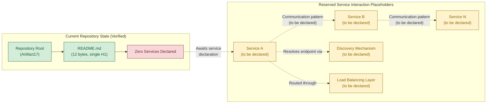

The green nodes denote verifiably-present elements of the repository; the red node denotes the verifiably-absent service inventory; the yellow nodes denote reserved future-state placeholders awaiting declaration.

---

### 6.1.4 Scalability Design — Reserved Framework

No scalability design is declared. Per Section 2.5.3, all four scalability dimensions — Horizontal Scaling Strategy, Vertical Scaling Limits, Expected User / Request Volume, and Data Volume Projections — are "Not yet specified." Per Section 5.5.5, no performance requirements or SLAs have been declared, which means the trigger thresholds required to drive auto-scaling decisions are also absent.

#### 6.1.4.1 Horizontal and Vertical Scaling Approach

No scaling approach is declared. The reserved options table below catalogs the standard scaling vocabulary for future selection.

| Reserved Scaling Option (Reference Only) | Mechanism | Selected? |
|---|---|---|
| Horizontal Scaling (scale-out) | Add or remove replicas of stateless units | Not yet specified |
| Vertical Scaling (scale-up) | Increase CPU / memory of existing instance | Not yet specified |
| Sharded Scaling (partition by key) | Partition state across instances by routing key | Not yet specified |
| Read-Replica Scaling | Add read-only replicas behind primary | Not yet specified |

A complementary axis — service statefulness (stateless / sticky / sharded / leader-elected) — is documented in the reserved component schema in Section 5.3.2 and is cross-referenced here.

#### 6.1.4.2 Auto-Scaling Triggers and Rules

No auto-scaling triggers or rules are declared. Per Section 3.7.3, no container orchestration manifests exist (which would supply the HPA-style trigger surface), and per Section 3.7.4, no infrastructure-as-code definitions exist (which would supply equivalent constructs in cloud-native scaling groups). The standard trigger metrics below are referenced only as a reserved vocabulary.

| Reserved Trigger Metric (Reference Only) | Typical Threshold Surface | Selected? |
|---|---|---|
| CPU Utilization | Average % over rolling window | Not yet specified |
| Memory Utilization | Average % over rolling window | Not yet specified |
| Request Rate / Concurrency | RPS or in-flight requests per instance | Not yet specified |
| Queue Depth / Lag | Pending messages or consumer lag | Not yet specified |

#### 6.1.4.3 Resource Allocation Strategy

No resource allocation strategy is declared. Without containerization (Section 3.7.3) or IaC (Section 3.7.4), no CPU requests/limits, memory requests/limits, storage classes, or quality-of-service classes are defined in the repository.

| Reserved Resource Dimension | Allocation Surface | Currently Populated? |
|---|---|---|
| CPU Requests / Limits | Per-instance reservation and ceiling | Not yet specified |
| Memory Requests / Limits | Per-instance reservation and ceiling | Not yet specified |
| Storage Class / IOPS | Per-volume tier and throughput class | Not yet specified |
| Quality-of-Service Class | Guaranteed / burstable / best-effort | Not yet specified |

#### 6.1.4.4 Performance Optimization Techniques

No performance optimization techniques are declared. Per Section 1.2.3 and Section 5.5.5, no latency budgets, throughput targets, availability SLOs, or error budgets exist to drive optimization decisions. The techniques below are listed as a reserved vocabulary only.

| Reserved Optimization Technique (Reference Only) | Optimization Axis | Adopted? |
|---|---|---|
| Caching (read-through, write-through, write-behind) | Read latency, downstream load | Not yet specified |
| Asynchronous Processing | Tail-latency isolation, throughput | Not yet specified |
| Connection Pooling / Keep-Alive | Connection setup overhead | Not yet specified |
| Batching / Coalescing | Throughput per round-trip | Not yet specified |

#### 6.1.4.5 Capacity Planning Guidelines

No capacity planning guidelines are declared. Per Section 2.5.3, the repository contains no load expectations, growth projections, or capacity planning documents. Per Section 2.5.2, no latency or throughput targets exist against which capacity could be sized. Capacity planning is therefore deferred until the inputs below are populated.

| Capacity Planning Input | Source Section (When Populated) | Currently Populated? |
|---|---|---|
| User / Request Volume Projections | Section 2.5.3 | Not yet specified |
| Data Volume Projections | Section 2.5.3 | Not yet specified |
| Performance Targets (P50/P95/P99) | Section 2.5.2, Section 5.5.5 | Not yet specified |
| Availability SLO and Error Budget | Section 5.5.5 | Not yet specified |

#### 6.1.4.6 Placeholder Scalability Architecture Diagram

The diagram below reserves the structural skeleton for a future scalability architecture. All nodes remain in the `pending` state because no scaling approach, trigger metric, or resource allocation strategy has been declared.

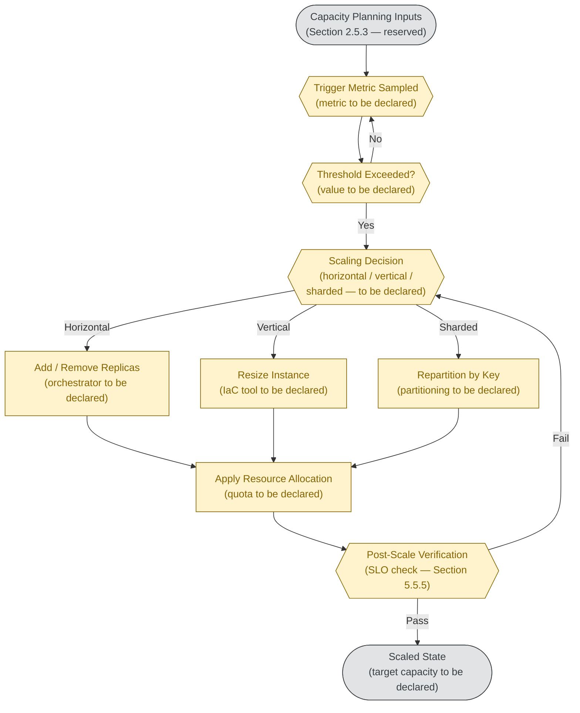

---

### 6.1.5 Resilience Patterns — Reserved Framework

No resilience patterns are declared. Per Section 4.4.2 and Section 5.5.3, no error-handling strategy has been declared in the repository — all four error-handling elements (Retry Mechanisms, Fallback Processes, Error Notification Flows, Recovery Procedures) remain "Not yet specified." Per Section 5.5.6, no disaster recovery procedures have been declared. The reserved frameworks below preserve the structural placeholders for resilience design.

#### 6.1.5.1 Fault Tolerance Mechanisms

No fault tolerance mechanisms are declared. Per Section 3.3, no resilience libraries are declared; per Section 3.5.2, no observability platforms are integrated (which would otherwise feed failure-detection signals). The reserved options below catalog the standard fault-tolerance vocabulary.

| Reserved Fault-Tolerance Pattern (Reference Only) | Isolation Boundary | Adopted? |
|---|---|---|
| Bulkhead (resource isolation pools) | Per-dependency thread / connection pool | Not yet specified |
| Timeout (bounded waits) | Per outbound call | Not yet specified |
| Circuit Breaker (state machine) | Per dependency endpoint | Not yet specified |
| Hedged / Speculative Requests | Per latency-sensitive call | Not yet specified |

The detailed schema for error classes (Detection Point, Classification, Retry Policy, Backoff Strategy, Fallback Strategy, Notification Channel, Recovery Procedure, Compensating Action) is documented in Section 4.4.2 and is cross-referenced here without duplication.

#### 6.1.5.2 Disaster Recovery Procedures

No disaster recovery procedures are declared. Per Section 5.5.6, all four DR dimensions (RPO, RTO, Backup Cadence, Failover Strategy) are "Not yet specified." Per Section 2.5.5, no operational runbooks exist in the repository. Per Section 3.7.5, no rollback strategy is configured in CI/CD (which itself is unconfigured).

| Reserved DR Dimension | Reserved Options (Reference Only) | Declared in Repository? |
|---|---|---|
| Recovery Point Objective (RPO) | Time window of acceptable data loss | Not yet specified |
| Recovery Time Objective (RTO) | Time window of acceptable downtime | Not yet specified |
| Backup Cadence | Continuous / hourly / daily / snapshot | Not yet specified |
| Operational Runbook Inventory | Per-incident-class playbook set | Not yet specified |

#### 6.1.5.3 Data Redundancy Approach

No data redundancy approach is declared. Per Section 3.6.1, no databases, caches, or object storage services are declared. Per Section 3.6.2, the Backup & Restore Policy dimension is "Not yet specified." Without a system of record, no replication topology can be defined.

| Reserved Redundancy Dimension | Reserved Options (Reference Only) | Declared in Repository? |
|---|---|---|
| Replication Mode | Synchronous / asynchronous / quorum-based | Not yet specified |
| Replica Topology | Single-region / multi-region / multi-cloud | Not yet specified |
| Backup Storage Class | Hot / warm / cold / archival | Not yet specified |
| Restore Verification Cadence | Per backup / scheduled / on-demand | Not yet specified |

#### 6.1.5.4 Failover Configurations

No failover configuration is declared. Per Section 5.5.6, the Failover Strategy dimension is "Not yet specified." Without multiple instances, regions, or availability zones (none of which are declared), failover orchestration is undefined.

| Reserved Failover Mode (Reference Only) | Operational Characteristic | Selected? |
|---|---|---|
| Active-Active | All replicas serve traffic concurrently | Not yet specified |
| Active-Passive | Standby promoted on primary failure | Not yet specified |
| Cold Standby | Replica provisioned only on failure event | Not yet specified |
| Pilot Light | Minimal standby footprint, scale-up on failure | Not yet specified |

#### 6.1.5.5 Service Degradation Policies

No service degradation policy is declared. Per Section 4.4.2 and Section 5.5.3, no fallback processes are declared, so the gradients of acceptable degraded behavior are undefined. The reserved options below catalog the standard degradation vocabulary.

| Reserved Degradation Mode (Reference Only) | Behavior Under Stress | Adopted? |
|---|---|---|
| Fail-Fast | Reject excess load with immediate error | Not yet specified |
| Cached / Stale Response | Serve last-known-good value | Not yet specified |
| Reduced Functionality | Disable non-essential features | Not yet specified |
| Load Shedding (priority-aware) | Drop low-priority traffic first | Not yet specified |

#### 6.1.5.6 Placeholder Resilience Pattern Diagram

The diagram below reserves the structural skeleton for resilience pattern implementation. It is intentionally aligned with the placeholder error-handling flow established in Section 5.5.7, viewed from a service-resilience perspective rather than a cross-cutting-concern perspective. All nodes remain in the `pending` state.

```mermaid
flowchart TD
    Caller(["Upstream Caller<br/>(service to be declared)"])
    Timeout{{"Timeout Elapsed?<br/>(threshold to be declared)"}}
    Breaker{{"Circuit Breaker State<br/>(closed / open / half-open<br/>— to be declared)"}}
    Bulkhead["Bulkhead Pool<br/>(concurrency cap<br/>to be declared)"]
    Invoke["Invoke Downstream<br/>(service to be declared)"]
    Outcome{{"Outcome Classification<br/>(success / transient /<br/>permanent — to be declared)"}}
    Retry["Retry With Backoff<br/>(policy per Section 4.4.2)"]
    Fallback["Apply Fallback / Degrade<br/>(mode per 6.1.5.5)"]
    Failover{{"Failover Required?<br/>(per Section 5.5.6)"}}
    Promote["Promote Standby<br/>(failover mode to be declared)"]
    DR["Invoke DR Runbook<br/>(per Section 2.5.5 — reserved)"]
    Recovered(["Recovered State<br/>(target SLO to be declared)"])

    Caller --> Bulkhead
    Bulkhead --> Breaker
    Breaker -->|"Closed / Half-Open"| Invoke
    Breaker -->|"Open"| Fallback
    Invoke --> Timeout
    Timeout -->|"No"| Outcome
    Timeout -->|"Yes"| Outcome
    Outcome -->|"Success"| Recovered
    Outcome -->|"Transient"| Retry
    Outcome -->|"Permanent"| Fallback
    Retry --> Invoke
    Fallback --> Failover
    Failover -->|"No"| Recovered
    Failover -->|"Yes"| Promote
    Promote --> DR
    DR --> Recovered

    classDef pending fill:#fff3cd,stroke:#856404,color:#856404
    classDef neutral fill:#e2e3e5,stroke:#383d41,color:#383d41

    class Caller,Recovered neutral
    class Timeout,Breaker,Bulkhead,Invoke,Outcome,Retry,Fallback,Failover,Promote,DR pending
```

This diagram enumerates the structural placeholders for a resilience pathway — bulkhead isolation, circuit breaking, timeout enforcement, outcome classification, retry, fallback, failover, and disaster-recovery escalation. None of the depicted thresholds, policies, or strategies are currently declared in the repository; each will be populated when the corresponding artifact (resilience library configuration, runbook, IaC failover topology) is introduced.

---

### 6.1.6 Update Triggers for Section 6.1

Section 6.1 will transition from its current placeholder state to a populated specification when specific repository artifacts are introduced. The trigger matrix below mirrors the format used throughout Section 5.6 and identifies the minimum-viable inputs required to populate each subsection.

| Repository State Change (Trigger) | Required Update to Section 6.1 |
|---|---|
| Addition of source code with module boundaries | Populate Section 6.1.3.1 (service boundaries) |
| Addition of multiple deployable units | Populate Section 6.1.3 (full service inventory) |
| Addition of API specifications (OpenAPI, `.proto`, AsyncAPI) | Populate Section 6.1.3.2 (communication patterns) |
| Addition of service mesh, registry, or DNS configuration | Populate Section 6.1.3.3 (service discovery) |
| Addition of load balancer or ingress configuration | Populate Section 6.1.3.4 (load balancing) |
| Addition of resilience-library configuration | Populate Sections 6.1.3.5 and 6.1.3.6 (circuit breakers, retry/fallback) |
| Addition of container orchestration manifests (Kubernetes, Helm) | Populate Sections 6.1.4.1–6.1.4.3 (scaling, auto-scaling, resource allocation) |
| Addition of performance test suites or SLO definitions | Populate Sections 6.1.4.4–6.1.4.5 (optimization, capacity planning) |
| Addition of observability integration (metrics, tracing, alerting) | Populate Section 6.1.5.1 (fault tolerance) |
| Addition of disaster recovery runbooks | Populate Section 6.1.5.2 (DR procedures) |
| Addition of database / storage manifests with replication | Populate Section 6.1.5.3 (data redundancy) |
| Addition of multi-zone / multi-region IaC topology | Populate Section 6.1.5.4 (failover configurations) |
| Addition of graceful-degradation logic or feature flags | Populate Section 6.1.5.5 (service degradation policies) |

### 6.1.7 Cross-Section Consistency Constraints

When Section 6.1 is eventually populated, its content must remain consistent with the prior sections listed below. This matrix is provided to ensure that future authors integrate service-architecture decisions without contradicting independently grounded sections.

| Consistency Anchor | Requirement for Section 6.1 |
|---|---|
| Section 1.2.2 (Core Technical Approach) | Service architecture must match the declared technical approach |
| Section 2.2 (Feature Catalog) | Services must implement declared features |
| Section 2.4.2 (Integration Points Status) | Inter-service patterns must match declared integration points |
| Section 2.5.2 (Performance Requirements) | Scalability must match declared performance targets |
| Section 2.5.3 (Scalability Considerations) | Scaling triggers must match declared scaling strategy |
| Section 3.3 (Frameworks & Libraries) | Service frameworks must match library inventory |
| Section 3.5 (Third-Party Services) | External services must match declared third-party services |
| Section 3.6 (Databases & Storage) | Data redundancy must match declared storage services |
| Section 3.7 (Development & Deployment) | Deployment must match CI/CD / IaC / containerization configuration |
| Section 4.4.2 (Error Handling) | Circuit breakers / retries must match declared error classes |
| Section 5.5.3 (Cross-Cutting Error Handling) | Resilience patterns must not contradict cross-cutting error-handling |
| Section 5.5.5 (Performance Requirements and SLAs) | Auto-scaling triggers must align with declared SLO surfaces |
| Section 5.5.6 (Disaster Recovery) | Failover configuration must match declared RPO / RTO |

---

### 6.1.8 References

#### 6.1.8.1 Files Examined

- `README.md` — Sole content file in the repository (12 bytes, single H1 heading `# Artifact17`). Verified as containing no service definitions, no module boundaries, no configuration, and no references to any other artifact.
- `/` (repository root) — Confirmed to contain only `README.md` as the single first-order child. No subdirectories at any depth; no source code files; no manifests; no containerization, IaC, or CI/CD configuration.

#### 6.1.8.2 Technical Specification Sections Referenced

- **Section 1.2.1** — Confirms absence of external dependencies, API client code, SDK references, auth configuration, broker configuration, and telemetry configuration.
- **Section 1.2.2** — Confirms zero components and "Not yet specified" architectural style; grounds component-absence and architectural-style-absence claims.
- **Section 1.2.3** — Confirms all KPI categories (Performance, Reliability, Adoption, Quality) are "Not yet specified."
- **Section 1.4.1** — Establishes the evidence-based authoring standard inherited by Section 6.1.
- **Section 1.4.3** — Establishes the conformant placeholder specification pattern applied throughout Section 6.1.
- **Section 1.5** — Establishes evidentiary confidence at 100% (verified absence, not search incompleteness).
- **Section 2.4.2** — Confirms all four integration categories are "Not yet specified"; grounds inter-service communication absence.
- **Section 2.4.3** — Confirms Shared Libraries, Common Utility Modules, Cross-Feature Services, and Shared Data Stores are all "None present."
- **Section 2.5.2** — Confirms all performance dimensions (Latency, Throughput, Reliability/Availability, Quality) are "Not yet specified."
- **Section 2.5.3** — Confirms all scalability dimensions (Horizontal Scaling, Vertical Scaling Limits, User Volume, Data Volume) are "Not yet specified."
- **Section 2.5.5** — Confirms no operational runbooks exist; grounds DR runbook absence.
- **Section 2.7.2** — Establishes the verified-constraints regime prohibiting fabrication.
- **Section 3.3** — Confirms no resilience libraries are declared; grounds fault-tolerance absence.
- **Section 3.5.1** — Confirms all ten third-party service categories are unpopulated; grounds external integration absence.
- **Section 3.5.2** — Confirms Monitoring / Observability category is "Not yet specified."
- **Section 3.6.1** — Confirms no databases, caches, or object storage are declared.
- **Section 3.6.2** — Confirms Backup & Restore Policy is "Not yet specified."
- **Section 3.7.3** — Confirms no containerization is configured (no Dockerfile, no Kubernetes manifests, no Helm charts, no Kustomize overlays).
- **Section 3.7.4** — Confirms no infrastructure-as-code definitions exist (no Terraform, no CloudFormation, no Pulumi, no Ansible).
- **Section 3.7.5** — Confirms no CI/CD pipelines are configured; no rollback strategy declared.
- **Section 4.4.2** — Establishes the reserved schema for Error Handling; documents all four error-handling elements as "Not yet specified"; cross-referenced from Sections 6.1.3.5, 6.1.3.6, and 6.1.5.1.
- **Section 5.1.2** — Establishes the methodological constraints inherited by Section 6.1 (no fabricated identifiers, no postulated architectural style, no assumed technology selections, no fabricated SLAs, common patterns referenced only as reserved options).
- **Section 5.2.2** — Confirms "no system components exist in the repository; there are no modules, packages, libraries, services, or subsystems to describe."
- **Section 5.3.1** — Confirms "no components are present in the repository to detail."
- **Section 5.3.2** — Provides the reserved component schema harmonized with Section 6.1.3.1.
- **Section 5.4.2** — Confirms all architectural styles (Monolith, Modular Monolith, Microservices, SOA, Event-Driven, Serverless, Layered, Hexagonal) are marked "Not yet specified."
- **Section 5.4.3** — Confirms all communication patterns (Synchronous Request/Response, Async Messaging, Pub/Sub, Event Streaming, Webhooks, SSE/WebSockets) are marked "Not yet specified."
- **Section 5.5.3** — Confirms no error-handling strategy has been declared; cross-referenced from Sections 6.1.3.5, 6.1.3.6, 6.1.5.1, and 6.1.5.5.
- **Section 5.5.5** — Confirms no performance requirements or SLAs have been declared.
- **Section 5.5.6** — Confirms all four DR dimensions (RPO, RTO, Backup Cadence, Failover Strategy) are "Not yet specified"; cross-referenced from Sections 6.1.5.2 and 6.1.5.4.
- **Section 5.5.7** — Establishes the placeholder error-handling flow diagram pattern adapted in Section 6.1.5.6.
- **Section 5.6** — Establishes the update-trigger format template mirrored in Section 6.1.6.
- **Section 5.7** — Establishes the cross-section consistency-matrix template mirrored in Section 6.1.7; provides the verified-absence framing reused throughout this section.

## 6.2 Database Design

### 6.2.1 Applicability Declaration

**Database Design is not applicable to this system in its current state.**

The **Artifact17** repository does not require — and does not declare — a database, persistent data store, caching layer, or any other persistence mechanism. The conditional clause in the Section 6.2 prompt ("If the system does not require or direct database or persistent storage interactions are not clearly evident, clearly state 'Database Design is not applicable to this system' and explain why") therefore governs this section's authoring.

#### 6.2.1.1 Evidentiary Basis for Non-Applicability

The non-applicability declaration is grounded in verified absence, not in search incompleteness. Per the exhaustive repository enumeration established in Section 1.5 (References) and reaffirmed in Section 6.1.1.1, the repository consists of exactly one content file — `README.md`, containing a single H1 Markdown heading (`# Artifact17`) totaling 12 bytes — with no subdirectories at any depth.

Per Section 3.6.1, "No databases, caches, or storage services have been declared in the repository." The same section confirms that there are "no schema files (`*.sql`, `schema.prisma`, ORM model definitions, migrations directories), no database connection configuration (no `.env` files, no connection-string variables), and no data-access libraries (per Section 3.3.2)" present in the repository. Without schemas, models, migrations, connection strings, drivers, or stored artifacts, the foundational preconditions for database design — namely, identifiable entities, persistence engines, schema management tools, and data-access pathways — are absent.

#### 6.2.1.2 Verified Absence Summary

The following table consolidates the verified-absence findings most directly determinative of Section 6.2's non-applicability. Each entry is grounded in an independent prior section of this Technical Specification.

| Persistence Precondition | Status in Repository | Grounding Cross-Reference |
|---|---|---|
| Database engines, schemas, or migrations | None declared | Section 3.6.1, Section 3.6.2 |
| Caching layer (in-process, distributed, or HTTP/edge) | None declared | Section 3.6.3, Section 5.4.5 |
| Object / blob / file storage | None declared | Section 3.6.4 |
| Data-access libraries (ORMs, drivers, query builders) | None declared | Section 3.3.2 |
| Database connection configuration / `.env` files | None present | Section 3.6.1 |
| Data persistence strategy (RDBMS / document / KV / etc.) | Not yet specified | Section 3.6.2, Section 5.4.4 |
| Backup & Restore Policy | Not yet specified | Section 3.6.2, Section 5.5.6 |
| Replication / data redundancy configuration | None declared | Section 6.1.5.3 |
| Data Volume Projections (capacity sizing input) | Not yet specified | Section 2.5.3 |
| Performance targets / SLAs driving query optimization | Not yet specified | Section 2.5.2, Section 5.5.5 |
| Data retention / residency policy | Not yet specified | Section 3.6.2 |
| Authentication / authorization for data access | Not yet specified | Section 2.5.4, Section 5.5.4 |
| Audit logging / observability for data operations | None declared | Section 4.4.2, Section 5.5.2 |
| Primary data flows or shared data stores | None declared | Section 2.4.3, Section 5.2.3 |

#### 6.2.1.3 Authoring Conformance Statement

This section is authored as a **conformant placeholder specification**, mirroring the documentation philosophy established in Section 1.4.3 and rigorously applied in Section 6.1. The methodological constraints established in Section 5.1.2 and reaffirmed in Section 6.1.1.3 are inherited and strictly enforced in Section 6.2:

- No fabricated entity names, table names, column names, or schema identifiers are coined (no `users`, `orders`, `events`, or similar invented identifiers).
- No database engine (PostgreSQL, MySQL, MongoDB, Redis, DynamoDB, Cassandra, or other) is described as the project's adopted choice.
- No ORM, query builder, or database driver (Prisma, SQLAlchemy, Mongoose, TypeORM, JDBC, or other) is assumed.
- No fabricated indexes, foreign keys, primary keys, unique constraints, or check constraints are postulated.
- No fabricated SLAs, RPO, RTO, retention windows, or backup cadences are stated.
- No replication topology, sharding scheme, or partitioning strategy is asserted as adopted.
- Common database patterns (normalization, denormalization, event sourcing, CQRS, write-ahead logging, multi-version concurrency control) appear only inside reserved-framework tables as enumerated reference options — never as the project's adopted approach.
- Per Section 1.4.1, every "Not yet specified" entry below is a statement of **verified absence** confirmed by Section 1.5.4 (100% evidentiary coverage), not a statement of search incompleteness.

The reserved frameworks below preserve the structural skeleton required by the section prompt — Schema Design, Data Management, Compliance Considerations, and Performance Optimization — so that future database-design artifacts can populate the placeholders without document reorganization.

---

### 6.2.2 Grounding Cross-References for Section 6.2

Every "Not yet specified" or "None declared" claim made in Section 6.2 is anchored to a prior, independently grounded section of this Technical Specification. The cross-reference matrix below summarizes the evidentiary base used throughout this section.

| Section 6.2 Subject Area | Grounding Section(s) | Established Finding |
|---|---|---|
| Database engine, persistence model | Section 3.6.1, Section 3.6.2, Section 5.4.4 | No databases, schemas, or persistence strategy declared |
| Caching layer and invalidation strategy | Section 3.6.3, Section 5.4.5 | All five caching dimensions "Not yet specified" |
| Object / blob / file storage | Section 3.6.4 | No object storage declared |
| Schema management and migrations | Section 3.6.2, Section 5.6.3 | Migration tooling "Not yet specified" |
| Backup & Restore Policy | Section 3.6.2, Section 5.5.6 | All four DR dimensions "Not yet specified" |
| Replication and data redundancy | Section 6.1.5.3 | All redundancy dimensions "Not yet specified" |
| Connection pooling and batch processing | Section 3.3.2, Section 6.1.4.4 | No data-access libraries; no optimization techniques |
| Performance / SLA targets | Section 1.2.3, Section 2.5.2, Section 5.5.5 | All KPI categories "Not yet specified" |
| Data volume projections | Section 2.5.3 | "Not yet specified" |
| Data classification, retention, privacy | Section 2.5.4, Section 3.6.2 | No security dimensions or retention policy |
| Authentication / authorization for data | Section 2.5.4, Section 5.5.4 | All four AuthN/AuthZ dimensions "Not yet specified" |
| Audit mechanisms | Section 4.4.2, Section 5.5.2 | No logging strategy or error-handling notification flows |
| Data flow topology | Section 5.2.3, Section 2.4.3 | No primary data flows or shared data stores |

---

### 6.2.3 Schema Design — Reserved Framework

No schema design is declared. Per Section 3.6.1, no schema files (`*.sql`, `schema.prisma`, ORM model definitions, migrations directories) exist in the repository. Per Section 2.4.3, "Shared Data Stores: None present." Without source code, persistence configuration, or model files, no entity boundaries, relationships, attributes, indexes, or constraints can be enumerated.

#### 6.2.3.1 Entity Relationships

No entities are declared. When the first entity is introduced, each will be cataloged using the reserved schema below. The schema is harmonized with the reserved component schema documented in Section 5.3.2 and the reserved storage schema in Section 3.6.5 to ensure cross-section consistency.

| Reserved Entity Dimension | Format / Allowed Values | Currently Populated? |
|---|---|---|
| Entity Identifier | Logical name (singular noun) | Not yet specified |
| Owning Bounded Context | Domain boundary owning the entity | Not yet specified |
| System of Record | Service responsible for entity authority | Not yet specified |
| Relationship Cardinality | 1:1 / 1:N / N:M / hierarchical | Not yet specified |
| Lifecycle Model | Immutable / mutable / append-only / soft-deleted | Not yet specified |
| Identity Strategy | Auto-increment / UUID / ULID / composite | Not yet specified |
| Referential Integrity | Database-enforced / application-enforced / none | Not yet specified |
| Tenancy Model | Single-tenant / shared-schema / schema-per-tenant | Not yet specified |

#### 6.2.3.2 Data Models and Structures

No data models or structures are declared. Per Section 5.4.4, no data storage decision has been made; the persistence model dimension (relational / document / key-value / wide-column / graph / time-series / object / search-index) remains "Not yet specified." The reserved-options table below catalogs the standard persistence-model vocabulary inherited from Section 5.4.4.

| Reserved Persistence Model (Reference Only) | Typical Workload Profile | Selected? |
|---|---|---|
| Relational Database (RDBMS) | Strongly consistent transactional workloads | Not yet specified |
| Document Store | Schema-flexible, aggregate-oriented workloads | Not yet specified |
| Key-Value Store | High-throughput simple lookups | Not yet specified |
| Wide-Column Store | Massive sparse tables with predictable access | Not yet specified |
| Graph Database | Relationship-centric traversals | Not yet specified |
| Time-Series Database | Append-heavy temporal workloads | Not yet specified |
| Object / Blob Storage | Large immutable assets | Not yet specified |
| Search Index | Full-text and faceted query workloads | Not yet specified |

#### 6.2.3.3 Indexing Strategy

No indexes or indexing strategy are declared. Without entities, attributes, or query patterns (no source code defines either), no index can be motivated. The reserved options below catalog standard index categories as a vocabulary only.

| Reserved Index Category (Reference Only) | Typical Optimization Target | Adopted? |
|---|---|---|
| Primary Key Index | Row identity and clustering | Not yet specified |
| Secondary / Non-Clustered Index | Selective predicate filtering | Not yet specified |
| Composite / Multi-Column Index | Multi-predicate equality and ordering | Not yet specified |
| Covering Index | Index-only scans without heap lookup | Not yet specified |
| Full-Text Index | Tokenized text search | Not yet specified |
| Spatial / Geospatial Index | Bounded-box / nearest-neighbor queries | Not yet specified |

#### 6.2.3.4 Partitioning Approach

No partitioning approach is declared. Per Section 3.6.5, the Sharding / Partitioning Strategy dimension is "Not yet specified" with reserved options of "None / horizontal / range / hash." Per Section 2.5.3, data volume projections — the primary input that would motivate partitioning — are "Not yet specified." The reserved options below are presented as a vocabulary only.

| Reserved Partitioning Option (Reference Only) | Partitioning Criterion | Selected? |
|---|---|---|
| No Partitioning (single logical store) | Sufficient capacity in a single shard | Not yet specified |
| Horizontal Partitioning (sharding) | Partition rows across instances by key | Not yet specified |
| Range Partitioning | Contiguous key ranges per partition | Not yet specified |
| Hash Partitioning | Deterministic hash distributes rows | Not yet specified |
| List / Directory Partitioning | Discrete key-value mapping to partitions | Not yet specified |
| Composite / Hybrid Partitioning | Multi-axis (e.g., range-then-hash) | Not yet specified |

#### 6.2.3.5 Replication Configuration

No replication configuration is declared. Per Section 6.1.5.3, all four redundancy dimensions — Replication Mode, Replica Topology, Backup Storage Class, and Restore Verification Cadence — are "Not yet specified." Per Section 3.6.5, the Replication Strategy dimension is "Not yet specified" with reserved options of "Single-primary / multi-primary / quorum." The reserved options below preserve the structural placeholder for replication topology.

| Reserved Replication Dimension | Reserved Options (Reference Only) | Declared in Repository? |
|---|---|---|
| Replication Mode | Synchronous / asynchronous / quorum-based | Not yet specified |
| Replica Topology | Single-region / multi-region / multi-cloud | Not yet specified |
| Primary Election Strategy | Single-primary / multi-primary / leaderless | Not yet specified |
| Replica Consistency Model | Strong / eventual / read-your-writes / causal | Not yet specified |

#### 6.2.3.6 Backup Architecture

No backup architecture is declared. Per Section 3.6.2, the Backup & Restore Policy is "Not yet specified." Per Section 5.5.6, all four disaster-recovery dimensions are "Not yet specified." Per Section 6.1.5.3, the Backup Storage Class and Restore Verification Cadence are "Not yet specified." The reserved-options table below preserves the placeholder skeleton for backup architecture.

| Reserved Backup Dimension | Reserved Options (Reference Only) | Declared in Repository? |
|---|---|---|
| Backup Cadence | Continuous / hourly / daily / snapshot | Not yet specified |
| Backup Storage Class | Hot / warm / cold / archival | Not yet specified |
| Backup Encryption | KMS-managed / vendor-managed / customer-managed | Not yet specified |
| Restore Verification Cadence | Per backup / scheduled / on-demand | Not yet specified |

#### 6.2.3.7 Placeholder Entity-Relationship Diagram

The diagram below depicts the current verified state of the repository alongside the reserved future-state placeholders for entity relationships. No entities or relationships exist in the current state; future-state entities are represented as dashed, pending placeholders awaiting declaration.

```mermaid
flowchart LR
    subgraph CurrentState["Current Repository State (Verified)"]
        Repo["Repository Root<br/>(Artifact17)"]
        Readme["README.md<br/>(12 bytes, single H1)"]
        NoEntities["Zero Entities Declared"]
    end

    subgraph FutureState["Reserved Entity Placeholders"]
        EntA["Entity A<br/>(to be declared)"]
        EntB["Entity B<br/>(to be declared)"]
        EntN["Entity N<br/>(to be declared)"]
        IdxLayer["Index Set<br/>(to be declared)"]
        PartScheme["Partitioning Scheme<br/>(to be declared)"]
    end

    Repo --> Readme
    Readme --> NoEntities
    NoEntities -.->|"Awaits entity<br/>declaration"| EntA
    EntA -.->|"Relationship cardinality<br/>(to be declared)"| EntB
    EntB -.->|"Relationship cardinality<br/>(to be declared)"| EntN
    EntA -.->|"Indexed by"| IdxLayer
    EntA -.->|"Partitioned via"| PartScheme

    classDef present fill:#d4edda,stroke:#155724,color:#155724
    classDef absent fill:#f8d7da,stroke:#721c24,color:#721c24
    classDef pending fill:#fff3cd,stroke:#856404,color:#856404

    class Repo,Readme present
    class NoEntities absent
    class EntA,EntB,EntN,IdxLayer,PartScheme pending
```

The green nodes denote verifiably-present elements of the repository; the red node denotes the verifiably-absent entity inventory; the yellow nodes denote reserved future-state placeholders awaiting declaration.

---

### 6.2.4 Data Management — Reserved Framework

No data management procedures are declared. Per Section 3.6.2, the Schema Management Approach, Migration Tooling, Data Retention Policy, and Data Residency / Geographic Constraints dimensions are all "Not yet specified." Per Section 3.6.3, all five caching dimensions are "Not yet specified." This subsection reserves the structural placeholders for data lifecycle management.

#### 6.2.4.1 Migration Procedures

No migration procedures are declared. Per Section 3.6.1, no migrations directories exist in the repository. Per Section 3.6.2, the Migration Tooling dimension is "Not yet specified." The reserved options below catalog the standard migration-tooling vocabulary.

| Reserved Migration Dimension | Reserved Options (Reference Only) | Declared in Repository? |
|---|---|---|
| Migration Tool | Framework-native / standalone tool / bespoke scripts | Not yet specified |
| Migration Execution Mode | Forward-only / reversible / shadow-table | Not yet specified |
| Migration Coordination | At-deploy / out-of-band / online (zero-downtime) | Not yet specified |
| Schema Compatibility Window | Single-version / N-1 / N-2 backward-compatible | Not yet specified |

#### 6.2.4.2 Versioning Strategy

No schema versioning strategy is declared. Without a migration tool, a schema repository, or any source-controlled schema artifact, no version numbering, branching, or rollback convention exists in the repository. The reserved options below are presented as a vocabulary only.

| Reserved Versioning Dimension | Reserved Options (Reference Only) | Declared in Repository? |
|---|---|---|
| Schema Version Numbering | Sequential integer / timestamp / semver / hash | Not yet specified |
| Schema Source of Truth | Migration files / declarative DSL / introspected | Not yet specified |
| Rollback Mechanism | Down-migration / point-in-time restore / not supported | Not yet specified |
| Drift Detection Cadence | Continuous / scheduled / on-demand / none | Not yet specified |

#### 6.2.4.3 Archival Policies

No archival policies are declared. Per Section 3.6.4, the Lifecycle / Archival Policy dimension for object/file storage is "Not yet specified." Per Section 3.6.2, the Data Retention Policy is "Not yet specified." Without retention SLOs, regulatory windows, or storage tier definitions, archival behavior is undefined. The reserved options below are presented as a vocabulary only.

| Reserved Archival Dimension | Reserved Options (Reference Only) | Declared in Repository? |
|---|---|---|
| Archive Trigger | Age-based / volume-based / event-based | Not yet specified |
| Archive Storage Tier | Hot / warm / cold / archival / glacier-class | Not yet specified |
| Restore Path | Direct read / rehydration / out-of-band recovery | Not yet specified |
| Purge Cadence | None / scheduled / regulatory-driven | Not yet specified |

#### 6.2.4.4 Data Storage and Retrieval Mechanisms

No data storage or retrieval mechanisms are declared. Per Section 3.6.1, no databases, caches, or storage services have been declared; per Section 3.6.4, no object storage, blob storage, or file storage services have been declared. Per Section 3.3.2, no data-access libraries exist in the repository. The reserved schema below — inherited from Section 3.6.5 — preserves the cataloging skeleton for each future data store.

| Reserved Store Dimension | Format / Allowed Values | Currently Populated? |
|---|---|---|
| Store Name / Identifier | Logical name (e.g., `primary-db`, `session-cache`) | Not yet specified |
| Store Type | Relational / document / KV / graph / object / file | Not yet specified |
| Engine & Version | Vendor product and pinned version | Not yet specified |
| Deployment Model | Self-hosted / managed service / serverless | Not yet specified |
| Consistency Model | Strong / eventual / causal | Not yet specified |
| Encryption-at-Rest | KMS-managed / vendor-managed / customer-managed | Not yet specified |
| Encryption-in-Transit | TLS version and certificate authority | Not yet specified |
| Data Volume Projection | Per Section 2.5.3 | Not yet specified |

#### 6.2.4.5 Caching Policies

No caching policies are declared. Per Section 3.6.3, all five caching dimensions — In-Process / Embedded Cache, Distributed Cache, HTTP / Edge Cache, Cache Invalidation Strategy, and Cache Coherence Model — are "Not yet specified." Per Section 5.4.5, no caching strategy decision has been recorded. The reserved options below — inherited from Section 5.4.5 — catalog the standard caching-strategy vocabulary.

| Reserved Caching Option (Reference Only) | Coherence / Latency Trade-Off | Selected? |
|---|---|---|
| No Cache (direct origin reads) | Strong consistency, higher latency | Not yet specified |
| In-Process / Embedded Cache | Lowest latency, no cross-instance coherence | Not yet specified |
| Distributed Cache | Shared state, network hop | Not yet specified |
| Read-Through / Write-Through Cache | Application-transparent coherence | Not yet specified |
| Write-Behind / Write-Back Cache | Throughput-optimized, durability risk | Not yet specified |
| HTTP / Edge / CDN Cache | Geographic distribution, invalidation complexity | Not yet specified |

#### 6.2.4.6 Placeholder Data Flow Diagram

The diagram below reserves the structural skeleton for a future data flow. Per Section 5.2.3, no primary data flows can be documented because no components exist between which data could flow. All nodes remain in the `pending` state.

```mermaid
flowchart LR
    Source(["Data Origin<br/>(source to be declared)"])
    Ingress{{"Ingress Validator<br/>(component to be declared)"}}
    WriteCache["Write-Path Cache<br/>(policy per 6.2.4.5)"]
    Primary["Primary Store<br/>(engine to be declared)"]
    Migrator{{"Schema Migrator<br/>(tool per 6.2.4.1)"}}
    Replica["Replica Store<br/>(topology per 6.2.3.5)"]
    ReadCache["Read-Path Cache<br/>(policy per 6.2.4.5)"]
    Query{{"Query Optimizer<br/>(pattern per 6.2.6.1)"}}
    Archiver["Archival Tier<br/>(policy per 6.2.4.3)"]
    Sink(["Consumer<br/>(component to be declared)"])

    Source --> Ingress
    Ingress --> WriteCache
    WriteCache --> Primary
    Migrator -.->|"Manages schema for"| Primary
    Primary -.->|"Replicated to"| Replica
    Primary --> ReadCache
    Replica --> ReadCache
    ReadCache --> Query
    Query --> Sink
    Primary -.->|"Aged out to"| Archiver

    classDef pending fill:#fff3cd,stroke:#856404,color:#856404
    classDef neutral fill:#e2e3e5,stroke:#383d41,color:#383d41

    class Source,Sink neutral
    class Ingress,WriteCache,Primary,Migrator,Replica,ReadCache,Query,Archiver pending
```

This skeleton enumerates the structural placeholders for a data-flow pathway — ingress validation, write-path caching, primary persistence, schema migration, replication, read-path caching, query optimization, and archival aging. None of the depicted components, policies, or topologies are currently declared in the repository; each will be populated when the corresponding artifact is introduced.

---

### 6.2.5 Compliance Considerations — Reserved Framework

No compliance considerations are declared. Per Section 3.6.2, the Data Retention Policy and Data Residency / Geographic Constraints dimensions are "Not yet specified." Per Section 5.5.4, all four authentication/authorization dimensions are "Not yet specified." Per Section 5.5.2, no logging or tracing strategy is declared, which means audit trails are also undefined. This subsection reserves the structural placeholders for data compliance.

#### 6.2.5.1 Data Retention Rules

No data retention rules are declared. Per Section 3.6.2, the Data Retention Policy is "Not yet specified." Without classification of data subjects, regulatory jurisdictions, or business-domain retention windows, no concrete retention duration can be cited. The reserved options below are presented as a vocabulary only.

| Reserved Retention Dimension | Reserved Options (Reference Only) | Declared in Repository? |
|---|---|---|
| Retention Window | Per-entity / per-tenant / per-jurisdiction | Not yet specified |
| Retention Trigger | Time-based / event-based / consent-based | Not yet specified |
| Legal Hold Override | Per-tenant flag / regulatory directive | Not yet specified |
| Purge Mechanism | Hard delete / soft delete / cryptographic erasure | Not yet specified |

#### 6.2.5.2 Backup and Fault Tolerance Policies

No backup or fault-tolerance policies are declared. Per Section 5.5.6, all four DR dimensions — RPO, RTO, Backup Cadence, and Failover Strategy — are "Not yet specified." Per Section 6.1.5.3 and Section 6.2.3.6, no replication topology or backup architecture is declared. The reserved options below — consolidated from Section 5.5.6 — preserve the structural placeholder for fault-tolerance policy.

| Reserved Fault-Tolerance Dimension | Reserved Options (Reference Only) | Declared in Repository? |
|---|---|---|
| Recovery Point Objective (RPO) | Time window of acceptable data loss | Not yet specified |
| Recovery Time Objective (RTO) | Time window of acceptable downtime | Not yet specified |
| Backup Cadence | Continuous / hourly / daily / snapshot | Not yet specified |
| Failover Strategy | Active-active / active-passive / cold standby | Not yet specified |

#### 6.2.5.3 Privacy Controls

No privacy controls are declared. Per Section 2.5.4, the Data Classification dimension is "Not yet specified." Without data classification (e.g., public / internal / confidential / restricted), without subject-rights flows (e.g., access, rectification, erasure), and without consent metadata, no concrete privacy control can be cited. The reserved options below are presented as a vocabulary only.

| Reserved Privacy Dimension | Reserved Options (Reference Only) | Declared in Repository? |
|---|---|---|
| Data Classification | Public / internal / confidential / restricted | Not yet specified |
| PII / Sensitive Field Inventory | Per-field tagging registry | Not yet specified |
| Subject-Rights Flow | Access / rectification / erasure / portability | Not yet specified |
| Consent Capture Mechanism | Per-purpose / per-jurisdiction registry | Not yet specified |
| Data Masking / Tokenization | Format-preserving / non-reversible / lookup-based | Not yet specified |

#### 6.2.5.4 Audit Mechanisms

No audit mechanisms are declared. Per Section 5.5.2, no logging or tracing strategy is declared; all four logging dimensions (log format, log level convention, correlation ID strategy, trace context propagation) are "Not yet specified." Per Section 4.4.2 and Section 5.5.3, no error notification flows are declared. Without log emission, log shipping, or sink configuration, no audit pathway exists in the repository. The reserved options below are presented as a vocabulary only.

| Reserved Audit Dimension | Reserved Options (Reference Only) | Declared in Repository? |
|---|---|---|
| Audit Event Scope | All mutations / privileged operations / per-policy | Not yet specified |
| Audit Record Schema | Actor / action / resource / timestamp / outcome | Not yet specified |
| Audit Storage Destination | Append-only log / SIEM / immutable bucket | Not yet specified |
| Audit Retention Window | Aligned with retention policy / regulatory floor | Not yet specified |

#### 6.2.5.5 Access Controls

No access controls are declared. Per Section 5.5.4, all four authentication/authorization dimensions — Identity Provider, Token Format, Authorization Decision Point, and Policy Language — are "Not yet specified." Per Section 2.5.4, both the Authentication Mechanism and Authorization Model are "Not yet specified." Per Section 1.2.1, no auth configuration exists in the repository. The reserved options below — inherited from Section 5.4.6 and Section 5.5.4 — preserve the structural placeholder for data-tier access control.

| Reserved Access-Control Dimension | Reserved Options (Reference Only) | Declared in Repository? |
|---|---|---|
| Authentication Mechanism (Data Tier) | Password / IAM role / mTLS / API key | Not yet specified |
| Authorization Model | RBAC / ABAC / ReBAC / row-level security | Not yet specified |
| Credential Storage | Secrets manager / vault / cloud KMS | Not yet specified |
| Least-Privilege Enforcement | Per-role / per-environment / per-tenant grants | Not yet specified |

---

### 6.2.6 Performance Optimization — Reserved Framework

No performance optimization techniques are declared. Per Section 6.1.4.4, no performance optimization techniques are declared in the repository. Per Section 5.5.5, no performance requirements or SLAs have been declared. Per Section 1.2.3, all KPI categories — Performance Metrics, Reliability Metrics, Adoption Metrics, and Quality Metrics — are "Not yet specified." Without latency budgets, throughput targets, availability SLOs, or error budgets, no optimization can be motivated.

#### 6.2.6.1 Query Optimization Patterns

No query optimization patterns are declared. Without a query language, query workload, or execution-plan inspection capability (no database engine is declared), no query-tuning approach can be cited. The reserved options below catalog standard query-optimization patterns as a vocabulary only.

| Reserved Optimization Pattern (Reference Only) | Optimization Axis | Adopted? |
|---|---|---|
| Index-Driven Access Path Selection | Predicate selectivity, sort avoidance | Not yet specified |
| Query Plan Caching / Prepared Statements | Plan-compilation overhead | Not yet specified |
| Materialized Views / Pre-Aggregations | Read latency on derived data | Not yet specified |
| Denormalization for Read Optimization | Join elimination, cache friendliness | Not yet specified |
| Pagination / Keyset Iteration | Bounded result-set traversal | Not yet specified |

#### 6.2.6.2 Caching Strategy

No caching strategy is declared. Per Section 3.6.3 and Section 5.4.5, all caching dimensions are "Not yet specified." This subsection cross-references the caching-policy reserved framework documented in Section 6.2.4.5 (above) to avoid duplication. The summary table below captures the optimization-axis perspective on caching.

| Reserved Cache-Optimization Dimension | Reserved Options (Reference Only) | Declared in Repository? |
|---|---|---|
| Cache Population Pattern | Read-through / write-through / write-behind / cache-aside | Not yet specified |
| Cache Eviction Policy | LRU / LFU / TTL / size-bounded | Not yet specified |
| Cache Invalidation Trigger | Event-driven / time-based / version-tagged | Not yet specified |
| Cache Tier Topology | Single-tier / multi-tier / geographically distributed | Not yet specified |

#### 6.2.6.3 Connection Pooling

No connection pooling is declared. Per Section 3.3.2, no data-access libraries are declared, so no driver-level or framework-level pool configuration exists. Per Section 6.1.4.4, Connection Pooling / Keep-Alive appears as a reserved performance optimization technique with selection status "Not yet specified." The reserved options below catalog standard connection-pool dimensions as a vocabulary only.

| Reserved Pool Dimension | Reserved Options (Reference Only) | Declared in Repository? |
|---|---|---|
| Pool Scope | Per-process / per-instance / external (proxy-based) | Not yet specified |
| Pool Size Strategy | Fixed / elastic / per-tenant / per-role | Not yet specified |
| Idle Connection Timeout | Vendor default / explicit floor / explicit ceiling | Not yet specified |
| Validation Strategy | On-borrow / on-return / periodic / none | Not yet specified |

#### 6.2.6.4 Read/Write Splitting

No read/write splitting is declared. Per Section 6.1.5.3 and Section 6.2.3.5, no replication topology is declared, so the precondition for read/write splitting — at least one read replica — is absent. The reserved options below are presented as a vocabulary only.

| Reserved Splitting Dimension | Reserved Options (Reference Only) | Declared in Repository? |
|---|---|---|
| Splitting Layer | Application-aware router / proxy / driver-native | Not yet specified |
| Replica Routing Policy | Round-robin / least-lag / region-affine | Not yet specified |
| Read-After-Write Consistency | Primary-only fallback / session-pinning / causal token | Not yet specified |
| Replica Lag Threshold | Tolerated lag ceiling per query class | Not yet specified |

#### 6.2.6.5 Batch Processing Approach

No batch processing approach is declared. Per Section 6.1.4.4, Batching / Coalescing appears as a reserved performance optimization technique with selection status "Not yet specified." Without a batch scheduler, a queue/stream, or any ingestion / extraction pipeline, no batch-processing pathway exists in the repository. The reserved options below are presented as a vocabulary only.

| Reserved Batch Dimension | Reserved Options (Reference Only) | Declared in Repository? |
|---|---|---|
| Batch Trigger | Time-based / size-based / event-based | Not yet specified |
| Batch Execution Mode | Synchronous batch / asynchronous job / streaming micro-batch | Not yet specified |
| Idempotency Strategy | Natural key / dedup ledger / at-least-once tolerant | Not yet specified |
| Failure Recovery | Resume-from-checkpoint / replay / dead-letter queue | Not yet specified |

#### 6.2.6.6 Placeholder Replication Architecture Diagram

The diagram below reserves the structural skeleton for a future replication architecture, integrating the read/write-splitting and replica-routing placeholders defined above. All nodes remain in the `pending` state because no replication mode, topology, or routing policy has been declared.

```mermaid
flowchart TD
    Client(["Client / Caller<br/>(component to be declared)"])
    Router{{"Read/Write Router<br/>(layer per 6.2.6.4)"}}
    WriteRoute["Write Path<br/>(primary-targeted)"]
    ReadRoute["Read Path<br/>(replica-targeted)"]
    Primary["Primary Store<br/>(engine to be declared)"]
    ReplA["Read Replica A<br/>(topology per 6.2.3.5)"]
    ReplB["Read Replica B<br/>(topology per 6.2.3.5)"]
    BackupTier["Backup Tier<br/>(policy per 6.2.3.6)"]
    Failover{{"Failover Controller<br/>(strategy per 6.2.5.2)"}}
    Standby["Standby / Promotable<br/>(mode per 5.5.6)"]

    Client --> Router
    Router -->|"Mutations"| WriteRoute
    Router -->|"Queries"| ReadRoute
    WriteRoute --> Primary
    ReadRoute --> ReplA
    ReadRoute --> ReplB
    Primary -.->|"Replication mode<br/>(to be declared)"| ReplA
    Primary -.->|"Replication mode<br/>(to be declared)"| ReplB
    Primary -.->|"Backup cadence<br/>(to be declared)"| BackupTier
    Primary -.->|"Failover signal"| Failover
    Failover -.->|"Promote"| Standby

    classDef pending fill:#fff3cd,stroke:#856404,color:#856404
    classDef neutral fill:#e2e3e5,stroke:#383d41,color:#383d41

    class Client neutral
    class Router,WriteRoute,ReadRoute,Primary,ReplA,ReplB,BackupTier,Failover,Standby pending
```

This skeleton enumerates the structural placeholders for a replication pathway — read/write routing, primary persistence, replica fan-out, backup capture, failover detection, and standby promotion. None of the depicted modes, topologies, cadences, or strategies are currently declared in the repository; each will be populated when the corresponding artifact (database manifest, IaC topology, replication configuration, failover runbook) is introduced.

---

### 6.2.7 Update Triggers for Section 6.2

Section 6.2 will transition from its current placeholder state to a populated specification when specific repository artifacts are introduced. The trigger matrix below mirrors the format used in Section 5.6 and Section 6.1.6 and identifies the minimum-viable inputs required to populate each subsection.

| Repository State Change (Trigger) | Required Update to Section 6.2 |
|---|---|
| Addition of schema files (`*.sql`, `schema.prisma`, ORM models) | Populate Section 6.2.3.1 and Section 6.2.3.2 (entities and data models) |
| Addition of indexes / constraints in schema artifacts | Populate Section 6.2.3.3 (indexing strategy) |
| Addition of sharding / partitioning configuration | Populate Section 6.2.3.4 (partitioning approach) |
| Addition of replication topology configuration | Populate Section 6.2.3.5 (replication configuration) |
| Addition of backup configuration or runbooks | Populate Section 6.2.3.6 and Section 6.2.5.2 (backup architecture, fault-tolerance policy) |
| Addition of a migrations directory | Populate Section 6.2.4.1 (migration procedures) |
| Addition of schema versioning convention | Populate Section 6.2.4.2 (versioning strategy) |
| Addition of object / blob / file storage configuration | Populate Section 6.2.4.4 (data storage and retrieval mechanisms) |
| Addition of caching configuration (Redis, Memcached, CDN, etc.) | Populate Section 6.2.4.5 and Section 6.2.6.2 (caching policies and strategy) |
| Addition of data retention or residency policy | Populate Section 6.2.4.3 and Section 6.2.5.1 (archival policies, retention rules) |
| Addition of data classification or PII inventory | Populate Section 6.2.5.3 (privacy controls) |
| Addition of audit logging configuration | Populate Section 6.2.5.4 (audit mechanisms) |
| Addition of IAM / access-policy configuration for data tier | Populate Section 6.2.5.5 (access controls) |
| Addition of database connection configuration / driver | Populate Section 6.2.6.3 (connection pooling) |
| Addition of read replicas with routing rules | Populate Section 6.2.6.4 (read/write splitting) |
| Addition of batch / ETL / streaming pipelines | Populate Section 6.2.6.5 (batch processing approach) |
| Addition of performance test suites or SLO definitions | Populate Section 6.2.6.1 (query optimization patterns) |

---

### 6.2.8 Cross-Section Consistency Constraints

When Section 6.2 is eventually populated, its content must remain consistent with the prior sections listed below. This matrix mirrors the format used in Section 6.1.7 and is provided to ensure that future authors integrate database-design decisions without contradicting independently grounded sections.

| Consistency Anchor | Requirement for Section 6.2 |
|---|---|
| Section 1.2.2 (Core Technical Approach) | Database choice must match the declared technical approach |
| Section 2.2 (Feature Catalog) | Entities must map to declared feature data needs |
| Section 2.5.3 (Scalability Considerations) | Partitioning / sharding must match declared data volume projections |
| Section 2.5.4 (Security Implications) | Access controls and encryption must match declared security model |
| Section 3.3 (Frameworks & Libraries) | ORM / driver / migration tool choice must match library inventory |
| Section 3.6 (Databases & Storage) | All Section 6.2 declarations must match Section 3.6 inventory |
| Section 5.4.4 (Data Storage Decisions) | Database engine must match ADR-recorded decision |
| Section 5.4.5 (Caching Strategy Decisions) | Caching policies must match ADR-recorded decision |
| Section 5.5.4 (Authentication and Authorization) | Data-tier access controls must match cross-cutting auth model |
| Section 5.5.5 (Performance Requirements and SLAs) | Query optimization targets must match declared SLOs |
| Section 5.5.6 (Disaster Recovery) | Backup architecture must match declared RPO / RTO |
| Section 6.1.5.3 (Data Redundancy) | Replication configuration must match service-architecture redundancy plan |

---

### 6.2.9 References

#### 6.2.9.1 Files Examined

- `README.md` — Sole content file in the repository (12 bytes, single H1 heading `# Artifact17`). Verified as containing no schema definitions, no entity declarations, no migration files, no connection configuration, and no references to any persistence-related artifact.
- `/` (repository root) — Confirmed to contain only `README.md` as the single first-order child. No subdirectories at any depth; no standard data-layer directory categories (`migrations/`, `schemas/`, `models/`, `db/`, `prisma/`, `entities/`) are present.

#### 6.2.9.2 Technical Specification Sections Referenced

- **Section 1.2.1** — Confirms absence of database configuration, schema definitions, and auth configuration; grounds the broader persistence-absence findings.
- **Section 1.2.2** — Confirms "Data persistence: None implemented" in the primary system capabilities inventory.
- **Section 1.2.3** — Confirms all KPI categories (Performance, Reliability, Adoption, Quality) are "Not yet specified"; grounds the absence of performance-target inputs to query optimization.
- **Section 1.4.1** — Establishes the evidence-based authoring standard inherited by Section 6.2.
- **Section 1.4.3** — Establishes the conformant placeholder specification pattern applied throughout Section 6.2.
- **Section 1.5** — Establishes 100% evidentiary coverage (verified absence, not search incompleteness) used to ground every "Not yet specified" entry.
- **Section 2.4.3** — Confirms "Shared Data Stores: None present"; grounds the absence of data-tier components.
- **Section 2.5.2** — Confirms all performance dimensions are "Not yet specified"; grounds the absence of query optimization targets.
- **Section 2.5.3** — Confirms all scalability dimensions (including Data Volume Projections) are "Not yet specified"; grounds the absence of partitioning sizing inputs.
- **Section 2.5.4** — Confirms all four security dimensions are "Not yet specified"; grounds the absence of data classification, retention, and access-control inputs.
- **Section 2.7.2** — Establishes the verified-constraints regime prohibiting fabrication, inherited by Section 6.2.
- **Section 3.3.2** — Confirms no data-access libraries are declared; grounds the absence of ORM / driver / connection-pool inputs.
- **Section 3.6.1** — Confirms no databases, caches, or storage services have been declared; grounds the absence of all persistence services.
- **Section 3.6.2** — Documents the eight undeclared persistence-strategy dimensions (engine, replica strategy, persistence model, schema management, migration tooling, backup/restore, retention, residency).
- **Section 3.6.3** — Documents the five undeclared caching dimensions (in-process, distributed, HTTP/edge, invalidation, coherence).
- **Section 3.6.4** — Documents the five undeclared object/file storage dimensions (object/blob, file system, content versioning, lifecycle/archival, encryption-at-rest).
- **Section 3.6.5** — Provides the reserved storage framework with ten dimensions, reused in Section 6.2.4.4.
- **Section 4.4.2** — Establishes the reserved schema for Error Handling; cross-referenced from Section 6.2.5.4 (audit mechanisms).
- **Section 5.1.2** — Establishes the methodological constraints inherited by Section 6.2 (no fabricated identifiers, no postulated engine, no assumed ORM, common patterns referenced only as reserved options).
- **Section 5.2.3** — Confirms no primary data flows can be documented; grounds the empty-state framing of the placeholder data-flow diagram in Section 6.2.4.6.
- **Section 5.4.4** — Provides reserved Data Storage Decisions, reused in Section 6.2.3.2.
- **Section 5.4.5** — Provides reserved Caching Strategy Decisions, reused in Section 6.2.4.5 and Section 6.2.6.2.
- **Section 5.4.6** — Provides reserved Security Mechanism Decisions, reused in Section 6.2.5.5.
- **Section 5.5.2** — Confirms no logging or tracing strategy is declared; grounds the absence of audit mechanism inputs in Section 6.2.5.4.
- **Section 5.5.3** — Confirms no error-handling strategy is declared; cross-referenced from Section 6.2.5.4 (audit mechanisms).
- **Section 5.5.4** — Confirms all four authentication/authorization dimensions are "Not yet specified"; cross-referenced from Section 6.2.5.5 (access controls).
- **Section 5.5.5** — Confirms no performance requirements or SLAs have been declared; cross-referenced from Section 6.2.6 (performance optimization).
- **Section 5.5.6** — Provides the reserved Disaster Recovery dimensions (RPO, RTO, Backup Cadence, Failover Strategy), reused in Section 6.2.3.6 and Section 6.2.5.2.
- **Section 5.6** — Provides the update-trigger format template mirrored in Section 6.2.7.
- **Section 5.7** — Provides the cross-section consistency-matrix template mirrored in Section 6.2.8; provides the verified-absence framing reused throughout this section.
- **Section 6.1.1.3** — Establishes the authoring conformance statement template directly mirrored in Section 6.2.1.3.
- **Section 6.1.4.4** — Confirms no performance optimization techniques are declared; cross-referenced from Section 6.2.6 (performance optimization).
- **Section 6.1.5.3** — Provides the reserved Data Redundancy dimensions (Replication Mode, Replica Topology, Backup Storage Class, Restore Verification Cadence), reused in Section 6.2.3.5.
- **Section 6.1.7** — Provides the cross-section consistency-constraint template directly mirrored in Section 6.2.8.

## 6.3 Integration Architecture

### 6.3.1 Applicability Declaration

**Integration Architecture is not applicable for this system in its current state.**

The **Artifact17** repository neither requires nor declares any integration with external systems or services. The conditional clause in the Section 6.3 prompt ("If the system does not require integration with external systems or services, clearly state 'Integration Architecture is not applicable for this system' and explain why") therefore governs this section's authoring.

#### 6.3.1.1 Evidentiary Basis for Non-Applicability

The non-applicability declaration is grounded in verified absence, not in search incompleteness. Per the exhaustive repository enumeration documented in Section 1.5 (References) and reaffirmed in Section 6.1.1.1 and Section 6.2.1.1, the repository consists of exactly one content file — `README.md`, containing a single H1 Markdown heading (`# Artifact17`) totaling 12 bytes — with no subdirectories at any depth.

Per Section 1.2.1 (Integration with Existing Enterprise Landscape), "No integration points, dependencies, sibling projects, parent repositories, or enterprise platform references appear in the repository." The same section explicitly enumerates the categories of integration evidence that are absent:

- External service dependencies (no API client code, no SDK references)
- Data source integrations (no database configuration, no schema definitions)
- Authentication / identity providers (no auth configuration)
- Messaging or event infrastructure (no broker configuration)
- Monitoring or observability platforms (no telemetry configuration)

Per Section 1.2.2 (Major System Components), the "External interfaces (APIs)" capability domain is marked "None implemented." Per Section 2.4.2 (Integration Points Status), all four integration categories — internal feature-to-feature, service-to-service (REST/gRPC), asynchronous messaging, and identity/authentication — are "Not yet specified." Per Section 3.5.1 (External Service Declaration Status), "No third-party services are integrated into the repository." Without API specifications, SDK imports, broker manifests, identity-provider configuration, or webhook handlers, the foundational preconditions for an integration architecture — namely, identifiable counterparties, declared protocols, payload schemas, and trust boundaries — are absent.

#### 6.3.1.2 Verified Absence Summary

The table below consolidates the verified-absence findings most directly determinative of Section 6.3's non-applicability. Each entry is grounded in an independent prior section of this Technical Specification.

| Integration Precondition | Status in Repository | Grounding Cross-Reference |
|---|---|---|
| API specifications (OpenAPI / `.proto` / AsyncAPI / GraphQL) | None present | Section 1.2.1, Section 1.2.2 |
| Service-to-service communication patterns | Not yet specified | Section 2.4.2, Section 5.4.3 |
| Asynchronous messaging infrastructure | None declared | Section 1.2.1, Section 2.4.2 |
| Identity provider / authentication configuration | None declared | Section 1.2.1, Section 5.5.4 |
| Authorization policy artifacts | None declared | Section 2.5.4, Section 5.5.4 |
| API client code / SDK references | None present | Section 1.2.1, Section 3.5.1 |
| Message broker configuration | None present | Section 1.2.1, Section 3.5.1 |
| Third-party service integrations (all 10 categories) | Unpopulated | Section 3.5.1, Section 3.5.2 |
| Legacy system interfaces / migration notes | None present | Section 1.2.1 |
| API gateway / ingress / service mesh configuration | None present | Section 3.7.3, Section 3.5.2 |
| Webhook handler code | None present | Section 1.2.1, Section 5.4.3 |
| Rate limiting middleware | None present | Section 2.5.2, Section 5.5.5 |
| External integration SLAs and vendor contracts | Not yet specified | Section 3.5.3, Section 5.2.4 |
| Error-handling strategy for integration boundaries | Not yet specified | Section 4.4.2, Section 5.5.3 |
| Telemetry / observability for integration calls | None declared | Section 5.5.1, Section 5.5.2 |

#### 6.3.1.3 Authoring Conformance Statement

This section is authored as a **conformant placeholder specification**, mirroring the documentation philosophy established in Section 1.4.3 and rigorously applied in Section 6.1 (Core Services Architecture) and Section 6.2 (Database Design). The methodological constraints established in Section 5.1.2 and reaffirmed in Section 6.1.1.3 and Section 6.2.1.3 are inherited and strictly enforced in Section 6.3:

- No fabricated API names, endpoint paths, resource identifiers, or operation IDs are coined.
- No fabricated integration partner names, vendor identifiers, or service handles are coined.
- No protocol selection (REST, gRPC, GraphQL, WebSocket, SSE, AMQP, MQTT, or other) is described as the project's adopted choice.
- No authentication mechanism (OAuth2, OIDC, SAML, JWT, mTLS, API key, HMAC-signed request, or other) is claimed as adopted.
- No authorization framework (RBAC, ABAC, ReBAC, capability-based, OPA Rego, Cedar, or other) is claimed as adopted.
- No message broker product (Kafka, RabbitMQ, NATS, Pulsar, SQS, SNS, Kinesis, EventBridge, Pub/Sub, Service Bus, or other) is described as adopted.
- No stream-processing engine (Flink, Spark Streaming, Beam, Kafka Streams, ksqlDB, or other) is claimed as adopted.
- No API gateway product (Kong, Apigee, AWS API Gateway, Azure API Management, Tyk, Envoy, Istio, Linkerd, Ambassador, or other) is claimed as adopted.
- No fabricated SLAs, rate limits, throughput ceilings, latency budgets, retry windows, or versioning cadences are stated.
- No fabricated Architecture Decision Record (ADR) identifiers related to integration decisions are coined.
- Common integration patterns (synchronous request/response, publish/subscribe, event sourcing, CQRS, saga, outbox, choreography, orchestration, circuit breaker, bulkhead) appear only inside reserved-framework tables as enumerated reference options — never as the project's adopted approach.
- Per Section 1.4.1, every "Not yet specified" entry below is a statement of **verified absence** confirmed by Section 1.5 (100% evidentiary coverage), not a statement of search incompleteness.

The reserved frameworks below preserve the structural skeleton required by the section prompt — API Design, Message Processing, and External Systems — so that future integration artifacts can populate the placeholders without document reorganization.

---

### 6.3.2 Grounding Cross-References for Section 6.3

Every "Not yet specified" or "None declared" claim made in Section 6.3 is anchored to a prior, independently grounded section of this Technical Specification. The cross-reference matrix below summarizes the evidentiary base used throughout this section.

| Section 6.3 Subject Area | Grounding Section(s) | Established Finding |
|---|---|---|
| API endpoints, contracts, surface area | Section 1.2.2, Section 2.4.2, Section 5.4.3 | "External interfaces (APIs): None implemented"; no API client code |
| Protocol selection (REST/gRPC/GraphQL/etc.) | Section 5.4.3 | All six reserved communication options "Not yet specified" |
| Authentication for inbound and outbound calls | Section 1.2.1, Section 2.5.4, Section 5.4.6, Section 5.5.4 | All four AuthN/AuthZ dimensions "Not yet specified" |
| Authorization framework | Section 2.5.4, Section 5.4.6, Section 5.5.4 | Authorization Model "Not yet specified"; no policy language declared |
| Rate limiting and traffic shaping | Section 2.5.2, Section 5.5.5 | No throughput targets, no traffic management configuration |
| API versioning strategy | Section 1.2.2, Section 2.4.2 | No API specifications exist to version |
| API documentation standards | Section 1.2.1, Section 3.5.3 | No OpenAPI / Swagger / AsyncAPI artifacts present |
| Event processing patterns | Section 2.4.2, Section 4.2.2, Section 5.4.3 | "Asynchronous messaging: Not yet specified"; no broker configuration |
| Message queue architecture | Section 1.2.1, Section 3.5.2 | No messaging/event infrastructure declared |
| Stream processing | Section 5.4.3 | Event Streaming option "Not yet specified" |
| Batch processing | Section 3.7, Section 4.2.2 | No CI/CD; no scheduled-task definitions; no batch pipelines |
| Integration error-handling | Section 4.4.2, Section 5.5.3 | All four error-handling elements "Not yet specified" |
| Third-party integration patterns | Section 1.2.1, Section 3.5.1, Section 3.5.2 | All ten third-party service categories unpopulated |
| Legacy system interfaces | Section 1.2.1 | No legacy system references; greenfield placeholder |
| API gateway configuration | Section 3.5.2, Section 3.7.3 | No cloud platform; no containerization/orchestration |
| External service contracts and SLAs | Section 3.5.3, Section 5.2.4 | Service integration schema reserved; SLA values unpopulated |
| Webhooks / outbound callbacks | Section 5.4.3 | "Webhooks (push callbacks)" option "Not yet specified" |
| WebSocket / Server-Sent Events | Section 5.4.3 | "Server-Sent Events / WebSockets" option "Not yet specified" |
| Telemetry on integration boundaries | Section 5.5.1, Section 5.5.2 | No telemetry, no logging/tracing strategy declared |

Per Section 5.7 (verified-absence framing), every "Not yet specified" entry below is a statement of verified absence, not a statement of search incompleteness.

---

### 6.3.3 API Design — Reserved Framework

No API design is declared. Per Section 1.2.2, the "External interfaces (APIs)" capability domain is marked "None implemented." Per Section 5.2.3 (Integration Patterns and Protocols), "no integration patterns have been declared." Per Section 3.5.1, no SDK references, no API client code, and no broker configuration are present. Without source code, route handlers, controller definitions, schema artifacts, or middleware configuration, no endpoint, payload, status code, or contract can be enumerated.

The subsections below reserve the structural placeholders for each of the six API-design dimensions required by the section prompt.

#### 6.3.3.1 Protocol Specifications

No API protocol has been chosen. Per Section 5.4.3 (Communication Pattern Decisions), all six reserved communication options are unpopulated. The table below — inherited verbatim from Section 5.4.3 — catalogs the standard protocol vocabulary as a reserved options reference; **no row is the project's adopted choice**.

| Reserved Protocol Option (Reference Only) | Typical Use Case | Selected? |
|---|---|---|
| Synchronous Request/Response (REST, gRPC, GraphQL) | Real-time queries with strong consistency | Not yet specified |
| Asynchronous Messaging (queue, topic, stream) | Decoupled producers and consumers | Not yet specified |
| Publish/Subscribe (broker-based or peer-to-peer) | Fan-out event distribution | Not yet specified |
| Event Streaming (log-based) | High-throughput replayable event history | Not yet specified |
| Webhooks (push callbacks) | Vendor-to-tenant integration | Not yet specified |
| Server-Sent Events / WebSockets | Long-lived push channels | Not yet specified |

A complementary axis — transport-layer concerns including media types (JSON, Protobuf, Avro, XML, MessagePack, CBOR), wire encoding, framing, and compression — is likewise unpopulated. Per Section 3.3.2, the Serialization / Marshaling Library category is "Not yet specified."

#### 6.3.3.2 Authentication Methods

No API authentication mechanism is declared. Per Section 1.2.1, no auth configuration exists in the repository. Per Section 2.5.4, the Authentication Mechanism dimension is "Not yet specified." Per Section 5.5.4, the Identity Provider and Token Format dimensions are both "Not yet specified." The table below — inherited from Section 5.4.6 — catalogs the standard authentication vocabulary as a reserved options reference only.

| Reserved Authentication Option (Reference Only) | Typical Use Case | Selected? |
|---|---|---|
| API Key (header or query parameter) | Machine-to-machine with shared secret | Not yet specified |
| HMAC-Signed Request | Tamper-evident message authentication | Not yet specified |
| OAuth2 (authorization code, client credentials) | Delegated access for third-party clients | Not yet specified |
| OpenID Connect (OIDC) | Identity federation with token issuer | Not yet specified |
| SAML 2.0 | Enterprise SSO and identity federation | Not yet specified |
| Mutual TLS (mTLS) | Certificate-based service-to-service trust | Not yet specified |

A complementary axis — secret management — is reserved per Section 5.4.6 with options of environment variables / vault / cloud KMS / sealed secrets; all are "Not yet specified."

#### 6.3.3.3 Authorization Framework

No authorization framework is declared. Per Section 2.5.4, the Authorization Model dimension is "Not yet specified." Per Section 5.5.4, the Authorization Decision Point and Policy Language dimensions are both "Not yet specified." The table below — inherited from Section 5.4.6 and Section 5.5.4 — catalogs the standard authorization vocabulary as a reserved options reference only.

| Reserved Authorization Dimension | Reserved Options (Reference Only) | Declared in Repository? |
|---|---|---|
| Authorization Model | RBAC / ABAC / ReBAC / capability-based | Not yet specified |
| Decision Point | Centralized PDP / embedded / middleware | Not yet specified |
| Policy Language | RBAC roles / ABAC rules / OPA Rego / Cedar | Not yet specified |
| Policy Distribution | Bundled with service / fetched at runtime / pushed | Not yet specified |

Without identified resources, actions, principals, or scopes, no policy can be expressed. Per Section 5.1.2, no role identifiers, scope names, or permission strings are coined.

#### 6.3.3.4 Rate Limiting Strategy

No rate limiting strategy is declared. Per Section 2.5.2 (Performance Requirements), all performance dimensions — Latency, Throughput, Reliability/Availability, and Quality — are "Not yet specified." Per Section 5.5.5, no throughput targets, error budgets, or SLO surfaces exist against which rate limits could be sized. The reserved options table below catalogs standard rate-limiting dimensions as a vocabulary only.

| Reserved Rate-Limiting Dimension | Reserved Options (Reference Only) | Declared in Repository? |
|---|---|---|
| Limit Algorithm | Token bucket / leaky bucket / fixed window / sliding window | Not yet specified |
| Limit Scope | Per-IP / per-API key / per-tenant / per-route | Not yet specified |
| Enforcement Tier | Edge gateway / per-service / per-route middleware | Not yet specified |
| Throttling Response | HTTP 429 with Retry-After / queueing / shedding | Not yet specified |

#### 6.3.3.5 Versioning Approach

No API versioning approach is declared. Without API specifications to version (per Section 1.2.2 and Section 2.4.2), no versioning convention exists in the repository. The reserved options table below catalogs the standard versioning vocabulary as a reference only.

| Reserved Versioning Dimension | Reserved Options (Reference Only) | Declared in Repository? |
|---|---|---|
| Version Locator | URL path segment / `Accept` header / custom header / query parameter | Not yet specified |
| Version Numbering | Semver / date-based / major-only / sequential integer | Not yet specified |
| Compatibility Discipline | Strict additive / N-1 deprecation / N-2 deprecation | Not yet specified |
| Sunset / Deprecation Signal | `Sunset` header / changelog / out-of-band notice | Not yet specified |

#### 6.3.3.6 Documentation Standards

No API documentation standard is declared. Per Section 1.2.1, no API specifications are present in the repository — no OpenAPI / Swagger artifacts, no `.proto` definitions, no AsyncAPI documents, no GraphQL SDL files, and no JSON Schema repositories. The reserved options below catalog the standard documentation vocabulary as a reference only.

| Reserved Documentation Dimension | Reserved Options (Reference Only) | Declared in Repository? |
|---|---|---|
| Specification Format | OpenAPI 3.x / AsyncAPI / `.proto` / GraphQL SDL | Not yet specified |
| Generator Tooling | Code-first (introspection) / schema-first (codegen) | Not yet specified |
| Publication Channel | Static site / developer portal / inline at endpoint | Not yet specified |
| Linting / Style Enforcement | Spectral / API-specific linter / custom rules | Not yet specified |

#### 6.3.3.7 Placeholder API Architecture Diagram

The diagram below depicts the current verified state of the repository alongside the reserved future-state placeholders for an API architecture. No endpoints, contracts, or middleware exist in the current state; all future-state elements are represented as dashed, pending placeholders awaiting declaration.

```mermaid
flowchart LR
    subgraph CurrentState["Current Repository State (Verified)"]
        Repo["Repository Root<br/>(Artifact17)"]
        Readme["README.md<br/>(12 bytes, single H1)"]
        NoAPI["Zero APIs Declared<br/>(per Section 1.2.2)"]
    end

    subgraph FutureState["Reserved API Architecture Placeholders"]
        Client["API Consumer<br/>(client to be declared)"]
        Gateway["Edge / API Gateway<br/>(product per 6.3.5.3)"]
        AuthN["Authentication Layer<br/>(mechanism per 6.3.3.2)"]
        AuthZ["Authorization Layer<br/>(model per 6.3.3.3)"]
        RateLimit["Rate Limiter<br/>(algorithm per 6.3.3.4)"]
        Router["Versioned Router<br/>(scheme per 6.3.3.5)"]
        Handler["Endpoint Handler<br/>(operation to be declared)"]
        Spec["API Specification<br/>(format per 6.3.3.6)"]
    end

    Repo --> Readme
    Readme --> NoAPI
    NoAPI -.->|"Awaits API<br/>declaration"| Client
    Client -.->|"Protocol per 6.3.3.1"| Gateway
    Gateway -.-> AuthN
    AuthN -.-> AuthZ
    AuthZ -.-> RateLimit
    RateLimit -.-> Router
    Router -.-> Handler
    Spec -.->|"Documents"| Handler

    classDef present fill:#d4edda,stroke:#155724,color:#155724
    classDef absent fill:#f8d7da,stroke:#721c24,color:#721c24
    classDef pending fill:#fff3cd,stroke:#856404,color:#856404

    class Repo,Readme present
    class NoAPI absent
    class Client,Gateway,AuthN,AuthZ,RateLimit,Router,Handler,Spec pending
```

The green nodes denote verifiably-present elements of the repository; the red node denotes the verifiably-absent API inventory; the yellow nodes denote reserved future-state placeholders awaiting declaration. None of the depicted layers, mechanisms, or contracts are currently declared.

---

### 6.3.4 Message Processing — Reserved Framework

No message-processing components are declared. Per Section 1.2.1, no messaging or event infrastructure exists in the repository ("no broker configuration"). Per Section 2.4.2, the Asynchronous Messaging integration category is "Not yet specified." Per Section 3.5.2, no third-party services in any messaging-related category are integrated. Per Section 5.4.3, the Asynchronous Messaging, Publish/Subscribe, and Event Streaming reserved options are all "Not yet specified." This subsection reserves the structural placeholders for each of the five message-processing dimensions required by the section prompt.

#### 6.3.4.1 Event Processing Patterns

No event-processing patterns are declared. Without producers, consumers, event schemas, or domain events, no pattern (event-notification, event-carried state transfer, event sourcing, choreography, orchestration) can be cited. The reserved options table below catalogs the standard event-processing vocabulary as a reference only.

| Reserved Event-Processing Pattern (Reference Only) | Typical Trade-Off | Adopted? |
|---|---|---|
| Event Notification (thin event) | Decoupling, requires callback lookup | Not yet specified |
| Event-Carried State Transfer (rich event) | Self-contained payload, increased size | Not yet specified |
| Event Sourcing (append-only log of state) | Replay and audit, increased complexity | Not yet specified |
| Choreography (peer-to-peer reaction) | Loose coupling, distributed reasoning | Not yet specified |
| Orchestration (central coordinator) | Centralized control, single point of change | Not yet specified |
| CQRS (read/write segregation) | Optimized query model, eventual consistency | Not yet specified |

#### 6.3.4.2 Message Queue Architecture

No message queue architecture is declared. The reserved schema below — harmonized with the reserved integration-workflow schema in Section 4.2.2 — preserves the cataloging skeleton for each future queue or topic. No vendor product is named, in conformance with Section 5.1.2.

| Reserved Queue/Topic Dimension | Format / Allowed Values | Currently Populated? |
|---|---|---|
| Logical Name / Identifier | Per-queue or per-topic label | Not yet specified |
| Channel Type | Queue (point-to-point) / topic (pub-sub) / stream (log) | Not yet specified |
| Delivery Semantics | At-most-once / at-least-once / exactly-once | Not yet specified |
| Ordering Guarantee | Ordered / partition-ordered / unordered | Not yet specified |
| Retention Policy | Until ack / time-bounded / size-bounded / compacted | Not yet specified |
| Dead-Letter Destination | DLQ name / quarantine bucket / none | Not yet specified |
| Producer Authentication | Per Section 6.3.3.2 (Authentication Methods) | Not yet specified |
| Consumer Group Strategy | Single consumer / competing consumers / per-partition | Not yet specified |

#### 6.3.4.3 Stream Processing Design

No stream-processing design is declared. Per Section 5.4.3, the Event Streaming (log-based) reserved option is "Not yet specified." Without a stream platform, processing topology, or windowing requirement, no concrete design exists. The reserved options table below catalogs standard stream-processing dimensions as a vocabulary only.

| Reserved Stream-Processing Dimension | Reserved Options (Reference Only) | Declared in Repository? |
|---|---|---|
| Processing Model | Record-at-a-time / micro-batch / continuous | Not yet specified |
| State Management | Stateless / windowed state / keyed state | Not yet specified |
| Windowing Strategy | Tumbling / sliding / session / global | Not yet specified |
| Time Semantics | Event time / ingestion time / processing time | Not yet specified |
| Watermark Strategy | Bounded out-of-orderness / heuristic / strict | Not yet specified |

#### 6.3.4.4 Batch Processing Flows

No batch-processing flow is declared. Per Section 4.2.2 (Integration Workflows), batch-processing sequences are reserved and unpopulated. Per Section 3.7 (Development & Deployment), no CI/CD pipelines and no scheduled-task definitions exist. Per Section 6.2.6.5, no batch-processing approach is declared at the data tier either. The reserved options table below catalogs standard batch-processing dimensions as a vocabulary only.

| Reserved Batch Dimension | Reserved Options (Reference Only) | Declared in Repository? |
|---|---|---|
| Batch Trigger | Time-based (cron) / size-based / event-based | Not yet specified |
| Execution Mode | Synchronous batch / asynchronous job / micro-batch | Not yet specified |
| Idempotency Strategy | Natural key / dedup ledger / at-least-once tolerant | Not yet specified |
| Failure Recovery | Resume-from-checkpoint / replay / dead-letter | Not yet specified |
| Output Sink | Internal store / downstream API / external partner | Not yet specified |

#### 6.3.4.5 Error Handling Strategy

No integration error-handling strategy is declared. Per Section 4.4.2 and Section 5.5.3, "no error-handling strategy has been declared in the repository." All four error-handling elements — Retry Mechanisms, Fallback Processes, Error Notification Flows, and Recovery Procedures — are "Not yet specified." The reserved schema for error classes is documented in Section 4.4.2 and is cross-referenced here without duplication.

The summary table below captures the dimensions most directly relevant to integration boundaries (message processing, API calls, webhook delivery). No row is the project's adopted choice.

| Reserved Integration Error-Handling Dimension | Reserved Options (Reference Only) | Declared in Repository? |
|---|---|---|
| Classification | Transient / permanent / partial | Not yet specified |
| Retry Policy | Count ceiling + backoff strategy | Not yet specified |
| Backoff Strategy | None / linear / exponential / decorrelated | Not yet specified |
| Dead-Letter / Quarantine | DLQ name / quarantine store / drop | Not yet specified |
| Poison-Message Handling | Skip / quarantine / halt consumer | Not yet specified |
| Compensating Action | Per future saga / orchestration declaration | Not yet specified |

#### 6.3.4.6 Placeholder Message Flow Diagram

The diagram below reserves the structural skeleton for a future message-processing flow, integrating the producer/broker/consumer/error-handling placeholders defined above. All decision points and routing paths remain unparameterized because no broker, topic, or delivery contract has been declared.

```mermaid
flowchart TD
    Producer(["Producer<br/>(component to be declared)"])
    Publish["Publish Message<br/>(channel per 6.3.4.2)"]
    Broker{{"Broker / Stream Platform<br/>(product to be declared)"}}
    Topic["Queue / Topic / Stream<br/>(name to be declared)"]
    Consumer(["Consumer<br/>(component to be declared)"])
    Process["Process Message<br/>(handler to be declared)"]
    Outcome{{"Outcome Classification<br/>(success / transient /<br/>permanent — per 6.3.4.5)"}}
    Ack["Acknowledge<br/>(delivery per 6.3.4.2)"]
    Retry["Retry With Backoff<br/>(policy per 6.3.4.5)"]
    DLQ["Dead-Letter Destination<br/>(per 6.3.4.5)"]
    Notify["Emit Telemetry<br/>(per Section 5.5.1)"]
    Done(["Processed State<br/>(target SLO to be declared)"])

    Producer --> Publish
    Publish --> Broker
    Broker --> Topic
    Topic --> Consumer
    Consumer --> Process
    Process --> Outcome
    Outcome -->|"Success"| Ack
    Outcome -->|"Transient"| Retry
    Outcome -->|"Permanent"| DLQ
    Retry --> Process
    Ack --> Done
    DLQ --> Notify
    Notify --> Done

    classDef pending fill:#fff3cd,stroke:#856404,color:#856404
    classDef neutral fill:#e2e3e5,stroke:#383d41,color:#383d41

    class Producer,Consumer,Done neutral
    class Publish,Broker,Topic,Process,Outcome,Ack,Retry,DLQ,Notify pending
```

This skeleton enumerates the structural placeholders for a message-flow pathway — production, brokering, channel persistence, consumption, classification, acknowledgment, retry, dead-lettering, and telemetry emission. None of the depicted products, channels, classifications, or policies are currently declared in the repository; each will be populated when the corresponding artifact (broker manifest, producer/consumer code, schema registry binding, DLQ configuration) is introduced.

---

### 6.3.5 External Systems — Reserved Framework

No external systems are integrated. Per Section 3.5.1, "No third-party services are integrated into the repository." Per Section 3.5.2, all ten standard third-party service categories — Cloud Platform, Authentication/Identity Provider, External APIs, Email/Notification Services, Payment Processing, Monitoring/Observability, Analytics, CDN, AI/ML Services, and Search Services — are "Not yet specified." Per Section 5.2.4 (External Integration Points), the External Integration Points schema rows (System Name / Integration Type / Protocol/Format / SLA Requirements) are all "Not yet specified."

This subsection reserves the structural placeholders for each of the four external-systems dimensions required by the section prompt.

#### 6.3.5.1 Third-Party Integration Patterns

No third-party integration patterns are declared. The reserved schema below — inherited verbatim from Section 3.5.3 — catalogs the standard service-integration dimensions for each future external service. No row is populated.

| Reserved Service-Integration Dimension | Format / Schema | Currently Populated? |
|---|---|---|
| Service Name | Vendor / product name | Not yet specified |
| Service Category | From taxonomy in Section 3.5.2 | Not yet specified |
| Integration Mechanism | SDK / REST API / Webhook / SDK-less | Not yet specified |
| Authentication Method | Per Section 6.3.3.2 (Authentication Methods) | Not yet specified |
| Data Boundary | What data crosses the integration | Not yet specified |
| SLA / Availability Target | Vendor-published or contractually agreed | Not yet specified |
| Cost Model | Per-call / subscription / consumption-based | Not yet specified |
| Failover / Lock-in Strategy | Alternative providers identified | Not yet specified |

A complementary axis for outbound integrations — webhook delivery — is reserved per Section 5.4.3 ("Webhooks (push callbacks): Not yet specified"). The standard webhook-specific dimensions below catalog the reserved vocabulary; no row is the project's adopted choice.

| Reserved Webhook Dimension | Reserved Options (Reference Only) | Declared in Repository? |
|---|---|---|
| Delivery Guarantee | At-most-once / at-least-once with retries | Not yet specified |
| Signing Method | HMAC / signed JWT / mTLS client cert | Not yet specified |
| Retry Policy | Per Section 6.3.4.5 (Error Handling) | Not yet specified |
| Subscriber Registration | Manual / self-service / configuration-driven | Not yet specified |

#### 6.3.5.2 Legacy System Interfaces

No legacy system interfaces are declared. Per Section 1.2.1 (Current System Limitations), "The project does not reference any existing system that it is replacing, upgrading, or extending. There are no migration notes, no legacy system references, no deprecation statements, and no transition planning documents." The repository is therefore explicitly characterized as a **greenfield placeholder** rather than a replacement initiative. The table below preserves the structural placeholder for legacy-system cataloging in the event that a future commit introduces a system-of-record migration.

| Reserved Legacy-Interface Dimension | Reserved Options (Reference Only) | Declared in Repository? |
|---|---|---|
| Legacy System Identifier | Logical name of the legacy system | Not yet specified |
| Interface Mechanism | File transfer / direct DB / SOAP / proprietary RPC | Not yet specified |
| Transition Strategy | Strangler fig / parallel run / cutover / coexistence | Not yet specified |
| Decommissioning Milestone | Target date or feature-flag boundary | Not yet specified |

#### 6.3.5.3 API Gateway Configuration

No API gateway is configured. Per Section 3.5.2, no Cloud Platform (IaaS/PaaS) is integrated. Per Section 3.7.3, no containerization is configured (no Dockerfile, no Kubernetes manifests, no Helm charts, no Kustomize overlays); per Section 3.7.4, no infrastructure-as-code definitions exist (no Terraform, no CloudFormation, no Pulumi, no Ansible). Without ingress controllers, service-mesh sidecars, or managed-gateway resources, no gateway can be described.

The reserved options table below catalogs standard gateway dimensions as a vocabulary only. No vendor product is named, in conformance with Section 5.1.2.

| Reserved Gateway Dimension | Reserved Options (Reference Only) | Declared in Repository? |
|---|---|---|
| Deployment Form | Self-managed proxy / managed service / service-mesh sidecar | Not yet specified |
| Edge Responsibilities | TLS termination / WAF / DDoS protection / caching | Not yet specified |
| Routing Strategy | Path-based / host-based / header-based / weighted | Not yet specified |
| Plugin / Filter Surface | AuthN / AuthZ / rate limit / transformation / logging | Not yet specified |

#### 6.3.5.4 External Service Contracts

No external service contracts are declared. Per Section 5.2.4, the External Integration Points table is presented as a reserved schema with all rows "Not yet specified." Per Section 1.4.1 and Section 2.7.2, no SLA values, no contractual terms, no privacy attestations (SOC 2, ISO 27001, HIPAA, PCI DSS), and no data-processing agreements are populated as defaults — every entry must be evidence-grounded before being cataloged.

The reserved schema below — consolidating the schemas in Section 5.2.4 and Section 3.5.3 — preserves the four-column representation required by this Technical Specification's documentation standards.

| System Name | Integration Type | Protocol/Format | SLA Requirements |
|---|---|---|---|
| Not yet specified | Not yet specified | Not yet specified | Not yet specified |

The complementary vendor-risk dimensions below — drawn from Section 3.5.3 and Section 3.5.4 — are reserved as a vocabulary only.

| Reserved Vendor-Risk Dimension | Reserved Options (Reference Only) | Declared in Repository? |
|---|---|---|
| Compliance Certifications | SOC 2 / ISO 27001 / HIPAA / PCI DSS | Not yet specified |
| Data Residency Constraint | Region-locked / multi-region / global | Not yet specified |
| Incident-Disclosure SLA | Vendor-published response time | Not yet specified |
| Alternative Provider Identified | Yes / no / partial | Not yet specified |

#### 6.3.5.5 Placeholder Integration Flow Sequence Diagram

The sequence diagram below reserves the structural skeleton for an end-to-end integration flow traversing the placeholders established in Section 6.3.3, Section 6.3.4, and Section 6.3.5. It adapts the reserved sequence-diagram pattern established in Section 4.5.4 with abstract participants labeled "to be declared." Per Section 1.2.1 and Section 2.4.2, no concrete integration sequences exist in the repository.

```mermaid
sequenceDiagram
    participant Actor as Actor (to be declared)
    participant Gateway as API Gateway (per 6.3.5.3)
    participant System as Internal System (to be declared)
    participant Broker as Message Broker (per 6.3.4.2)
    participant External as External Service (per 6.3.5.1)

    Note over Actor,External: No integration sequences are currently declared.<br/>This skeleton is reserved for future population per Section 6.3.6.

    Actor -->> Gateway: Inbound request<br/>(protocol per 6.3.3.1)
    Note right of Gateway: AuthN per 6.3.3.2,<br/>AuthZ per 6.3.3.3,<br/>rate limit per 6.3.3.4
    Gateway -->> System: Routed request<br/>(versioning per 6.3.3.5)
    System -->> Broker: Publish domain event<br/>(channel per 6.3.4.2)
    Broker -->> System: Acknowledgement<br/>(delivery semantics per 6.3.4.2)
    System -->> External: Outbound integration call<br/>(mechanism per 6.3.5.1)
    Note right of External: Authentication per 6.3.3.2,<br/>SLA per 6.3.5.4
    External -->> System: Response<br/>(error handling per 6.3.4.5)
    System -->> Gateway: Internal response<br/>(payload schema to be declared)
    Gateway -->> Actor: Response<br/>(documentation per 6.3.3.6)

    Note over Actor,External: All arrows shown as dashed lines because no concrete<br/>integration contract has been declared (per Sections 1.2.1, 2.4.2, 3.5.1).
```

This skeleton enumerates the canonical participants and message exchanges typical of an end-to-end integration sequence — inbound authentication and authorization, versioned routing, internal event publication, broker acknowledgment, outbound service call, and response propagation. None of the depicted participants, message schemas, protocols, authorization checks, broker contracts, or vendor SLAs are currently declared in the repository.

The complementary flowchart below provides an end-to-end **integration flow placeholder** depicting the conceptual lifecycle from inbound request to external dispatch and back. It uses the dashed-line convention to indicate all edges are reserved.

```mermaid
flowchart LR
    subgraph CurrentState["Current Repository State (Verified)"]
        Repo["Repository Root<br/>(Artifact17)"]
        Readme["README.md<br/>(12 bytes, single H1)"]
        NoInt["Zero Integrations Declared<br/>(per Section 3.5.1)"]
    end

    subgraph FutureState["Reserved Integration Flow Placeholders"]
        Inbound["Inbound Edge<br/>(gateway per 6.3.5.3)"]
        InboundAPI["Inbound API Surface<br/>(per 6.3.3)"]
        EventBus["Internal Event Bus<br/>(per 6.3.4)"]
        OutAdapter["Outbound Adapter<br/>(per 6.3.5.1)"]
        ExtSvcA["External Service A<br/>(to be declared)"]
        ExtSvcB["External Service B<br/>(to be declared)"]
        Hook["Webhook Receiver<br/>(per 6.3.5.1)"]
    end

    Repo --> Readme
    Readme --> NoInt
    NoInt -.->|"Awaits integration<br/>declaration"| Inbound
    Inbound -.-> InboundAPI
    InboundAPI -.-> EventBus
    EventBus -.-> OutAdapter
    OutAdapter -.->|"Protocol per 6.3.3.1"| ExtSvcA
    OutAdapter -.->|"Protocol per 6.3.3.1"| ExtSvcB
    ExtSvcA -.->|"Callback per 6.3.5.1"| Hook
    Hook -.-> EventBus

    classDef present fill:#d4edda,stroke:#155724,color:#155724
    classDef absent fill:#f8d7da,stroke:#721c24,color:#721c24
    classDef pending fill:#fff3cd,stroke:#856404,color:#856404

    class Repo,Readme present
    class NoInt absent
    class Inbound,InboundAPI,EventBus,OutAdapter,ExtSvcA,ExtSvcB,Hook pending
```

The green nodes denote verifiably-present elements; the red node denotes the verifiably-absent integration inventory; the yellow nodes denote reserved future-state placeholders awaiting declaration.

---

### 6.3.6 Update Triggers for Section 6.3

Section 6.3 will transition from its current placeholder state to a populated specification when specific repository artifacts are introduced. The trigger matrix below mirrors the format used in Section 5.6, Section 6.1.6, and Section 6.2.7, and identifies the minimum-viable inputs required to populate each subsection.

| Repository State Change (Trigger) | Required Update to Section 6.3 |
|---|---|
| Addition of OpenAPI / Swagger / `.proto` / AsyncAPI / GraphQL schema files | Populate Section 6.3.3 (API Design) and Section 6.3.3.6 (Documentation Standards) |
| Addition of HTTP / gRPC / GraphQL server library or route definitions | Populate Section 6.3.3.1 (Protocol Specifications) |
| Addition of authentication middleware or IdP client code | Populate Section 6.3.3.2 (Authentication Methods) |
| Addition of authorization policy files (OPA, Cedar, RBAC config) | Populate Section 6.3.3.3 (Authorization Framework) |
| Addition of rate-limiting middleware or gateway configuration | Populate Section 6.3.3.4 (Rate Limiting Strategy) |
| Addition of API versioning convention or URL/header schema | Populate Section 6.3.3.5 (Versioning Approach) |
| Addition of message broker configuration or client SDK | Populate Section 6.3.4.1 and Section 6.3.4.2 (Event Patterns, Queue Architecture) |
| Addition of stream-processing framework code or topology | Populate Section 6.3.4.3 (Stream Processing Design) |
| Addition of batch job scheduler / cron configuration | Populate Section 6.3.4.4 (Batch Processing Flows) |
| Addition of retry library / DLQ configuration | Populate Section 6.3.4.5 (Error Handling Strategy) |
| Addition of third-party SDK imports or vendor client code | Populate Section 6.3.5.1 (Third-Party Integration Patterns) |
| Addition of webhook receiver / dispatcher code | Populate Section 6.3.5.1 (Webhook subsection) |
| Addition of legacy system migration notes or adapter code | Populate Section 6.3.5.2 (Legacy System Interfaces) |
| Addition of API gateway / ingress / service mesh configuration | Populate Section 6.3.5.3 (API Gateway Configuration) |
| Addition of vendor contract / SLA / DPA documents | Populate Section 6.3.5.4 (External Service Contracts) |
| Addition of observability integration on integration boundaries | Populate Section 6.3.4.5 (telemetry hooks) and cross-reference Section 5.5.1 |

---

### 6.3.7 Cross-Section Consistency Constraints

When Section 6.3 is eventually populated, its content must remain consistent with the prior sections listed below. This matrix mirrors the format used in Section 6.1.7 and Section 6.2.8 and is provided to ensure that future authors integrate integration-architecture decisions without contradicting independently grounded sections.

| Consistency Anchor | Requirement for Section 6.3 |
|---|---|
| Section 1.2.2 (Core Technical Approach) | Integration choices must match the declared technical approach |
| Section 2.2 (Feature Catalog) | API endpoints and event flows must serve declared features |
| Section 2.4.2 (Integration Points Status) | Integration patterns must match declared integration points |
| Section 2.5.2 (Performance Requirements) | Rate limits and throughput targets must match declared performance targets |
| Section 2.5.4 (Security Implications) | Authentication and authorization methods must match declared security model |
| Section 3.3 (Frameworks & Libraries) | API framework and broker client choices must match declared library inventory |
| Section 3.5 (Third-Party Services) | External integrations must match declared third-party services |
| Section 3.7 (Development & Deployment) | Gateway / ingress topology must match declared deployment configuration |
| Section 4.2.2 (Integration Workflows) | Integration sequences must match declared workflow patterns |
| Section 4.4.2 (Error Handling) | Integration error handling must match declared error classes and schema |
| Section 5.2.4 (External Integration Points) | External-system inventory must be consistent across sections |
| Section 5.4.3 (Communication Pattern Decisions) | Protocol choices must match ADR-recorded decisions |
| Section 5.4.6 (Security Mechanism Decisions) | Authentication mechanisms must match ADR-recorded decisions |
| Section 5.5.1 (Monitoring and Observability) | Integration telemetry must match cross-cutting observability strategy |
| Section 5.5.4 (Authentication and Authorization) | API auth must match cross-cutting auth model |
| Section 5.5.5 (Performance Requirements and SLAs) | Rate limits and integration SLAs must align with declared SLO surfaces |
| Section 6.1.3.2 (Inter-Service Communication) | API design must align with service-level communication patterns |
| Section 6.2.5.5 (Access Controls) | Data-tier access controls invoked from integration paths must match Section 6.2 |

---

### 6.3.8 References

#### 6.3.8.1 Files Examined

- `README.md` — Sole content file in the repository (12 bytes, single H1 heading `# Artifact17`). Verified as containing no API specifications, no service contracts, no SDK references, no broker configuration, no auth configuration, and no references to any integration partner or external system.
- `/` (repository root) — Confirmed to contain only `README.md` as the single first-order child. No subdirectories at any depth; no standard integration-related directory categories (`api/`, `apis/`, `gateway/`, `integrations/`, `adapters/`, `clients/`, `webhooks/`, `events/`, `queues/`, `streams/`, `messaging/`, `proto/`, `openapi/`, `asyncapi/`, `graphql/`) are present.

#### 6.3.8.2 Technical Specification Sections Referenced

- **Section 1.2.1** — Confirms absence of external service dependencies, data source integrations, authentication / identity providers, messaging or event infrastructure, and monitoring or observability platforms; grounds the foundational non-applicability declaration.
- **Section 1.2.2** — Confirms "External interfaces (APIs): None implemented"; grounds the API-absence findings.
- **Section 1.2.3** — Confirms all KPI categories are "Not yet specified"; grounds the absence of SLA inputs to rate limiting and integration contracts.
- **Section 1.3.2** — Documents out-of-scope integration categories (synchronous service-to-service, asynchronous messaging, data exchange, identity federation, observability telemetry).
- **Section 1.4.1** — Establishes the evidence-based authoring standard inherited by Section 6.3.
- **Section 1.4.3** — Establishes the conformant placeholder specification pattern applied throughout Section 6.3.
- **Section 1.5** — Establishes 100% evidentiary coverage (verified absence, not search incompleteness) used to ground every "Not yet specified" entry.
- **Section 2.4.2** — Confirms all four integration categories are "Not yet specified"; grounds the inter-service communication absence claims.
- **Section 2.4.3** — Confirms Shared Libraries, Common Utility Modules, Cross-Feature Services, and Shared Data Stores are all "None present."
- **Section 2.5.2** — Confirms all performance dimensions are "Not yet specified"; grounds the absence of rate-limit and throughput-target inputs.
- **Section 2.5.4** — Confirms all four security dimensions are "Not yet specified"; grounds the absence of authentication and authorization inputs.
- **Section 2.7.2** — Establishes the verified-constraints regime prohibiting fabrication.
- **Section 3.3.2** — Confirms no HTTP / Web Server library, no Serialization / Marshaling library, no State Management library, and no Logging / Telemetry library is declared.
- **Section 3.4** — Confirms no open-source dependencies are declared in any ecosystem.
- **Section 3.5.1** — Confirms "No third-party services are integrated into the repository"; grounds the external-systems absence claims.
- **Section 3.5.2** — Confirms all ten standard third-party service categories are unpopulated.
- **Section 3.5.3** — Provides the reserved service-integration schema, reused in Section 6.3.5.1.
- **Section 3.5.4** — Provides the reserved review framework for security implications of future service selections.
- **Section 3.7.3** — Confirms no containerization is configured; grounds the absence of API gateway / ingress / service-mesh configuration.
- **Section 3.7.4** — Confirms no infrastructure-as-code definitions exist; grounds the absence of managed-gateway resource declarations.
- **Section 3.7.5** — Confirms no CI/CD pipelines are configured; grounds the absence of batch / scheduled-task pipelines.
- **Section 4.2.2** — Provides the reserved integration-workflow schema, harmonized with Section 6.3.4.2.
- **Section 4.4.2** — Establishes the reserved schema for Error Handling; cross-referenced from Section 6.3.4.5.
- **Section 4.5.4** — Establishes the reserved integration sequence diagram template adapted in Section 6.3.5.5.
- **Section 5.1.2** — Establishes the methodological constraints inherited by Section 6.3 (no fabricated identifiers, no postulated protocol, no assumed broker / gateway / IdP, no common pattern asserted as adopted).
- **Section 5.2.3** — Confirms no integration patterns and no data transformation points have been declared.
- **Section 5.2.4** — Provides the reserved External Integration Points schema, reused in Section 6.3.5.4.
- **Section 5.4.3** — Provides the reserved Communication Pattern Decisions table, reused verbatim in Section 6.3.3.1.
- **Section 5.4.6** — Provides the reserved Security Mechanism Decisions table, reused in Sections 6.3.3.2 and 6.3.3.3.
- **Section 5.5.1** — Confirms no monitoring or observability platforms are declared; cross-referenced from Section 6.3.4.6 (telemetry emission).
- **Section 5.5.2** — Confirms no logging or tracing strategy is declared; grounds the absence of integration-boundary telemetry.
- **Section 5.5.3** — Confirms no error-handling strategy has been declared; cross-referenced from Section 6.3.4.5.
- **Section 5.5.4** — Confirms all four AuthN/AuthZ dimensions are "Not yet specified"; cross-referenced from Sections 6.3.3.2 and 6.3.3.3.
- **Section 5.5.5** — Confirms no performance requirements or SLAs have been declared; cross-referenced from Section 6.3.3.4 (Rate Limiting).
- **Section 5.6** — Provides the update-trigger format template mirrored in Section 6.3.6.
- **Section 5.7** — Provides the cross-section consistency-matrix template mirrored in Section 6.3.7; provides the verified-absence framing reused throughout this section.
- **Section 6.1.1.3** — Establishes the authoring conformance statement template directly mirrored in Section 6.3.1.3.
- **Section 6.1.3.2** — Confirms all six inter-service communication options are "Not yet specified"; ensures consistency with Section 6.3.3.1.
- **Section 6.1.6** — Provides the update-trigger format template mirrored in Section 6.3.6.
- **Section 6.1.7** — Provides the cross-section consistency-constraint template directly mirrored in Section 6.3.7.
- **Section 6.2.1.3** — Establishes the authoring conformance statement template directly mirrored in Section 6.3.1.3.
- **Section 6.2.6.5** — Confirms no batch-processing approach is declared at the data tier; ensures consistency with Section 6.3.4.4.
- **Section 6.2.7** — Provides the update-trigger format template mirrored in Section 6.3.6.
- **Section 6.2.8** — Provides the cross-section consistency-constraint template directly mirrored in Section 6.3.7.

## 6.4 Security Architecture

### 6.4.1 Applicability Declaration

**Detailed Security Architecture is not applicable for this system in its current state.**

The **Artifact17** repository neither requires nor declares any authentication mechanism, authorization framework, cryptographic configuration, secret management surface, audit logging pathway, or compliance attestation. The conditional clause in the Section 6.4 prompt ("If the system does not require specific security considerations beyond standard practices, clearly state 'Detailed Security Architecture is not applicable for this system' and explain which standard security practices will be followed instead") therefore governs this section's authoring. The standard practices to be applied in lieu of a detailed architecture are catalogued in Section 6.4.6.

#### 6.4.1.1 Evidentiary Basis for Non-Applicability

The non-applicability declaration is grounded in verified absence, not in search incompleteness. Per the exhaustive repository enumeration documented in Section 1.5 (References) and reaffirmed in Sections 6.2.1.1 and 6.3.1.1, the repository consists of exactly one content file — `README.md`, containing a single H1 Markdown heading (`# Artifact17`) totaling 12 bytes — with no subdirectories at any depth.

Per Section 1.2.1 (Integration with Existing Enterprise Landscape), the repository explicitly contains no auth configuration, no API client code, no SDK references, no database configuration, no schema definitions, no broker configuration, and no telemetry configuration. Per Section 1.2.2 (Major System Components), the four capability domains — User-facing functionality, Backend services, Data persistence, and External interfaces (APIs) — are all marked "None implemented," which means no subject system exists to which security controls could be applied.

Per Section 1.3.2 (Out-of-Scope Elements), the "Security artifacts" category is itemized among the out-of-scope categories, with "Secret management" and "Authentication configuration" cited as examples of explicitly excluded items. Per Section 2.5.4 (Security Implications), all four security dimensions — Authentication Mechanism, Authorization Model, Data Classification, and Threat Model — are "Not yet specified." Per Section 3.5.1 (External Service Declaration Status), "no auth configuration" exists, and the "Authentication / identity providers" category is enumerated among the verifiably absent integration categories.

Without identity-provider configuration, token-issuance surfaces, session middleware, password storage code, role/permission registries, policy bundles, encryption-library imports, key-management bindings, secret manifests, certificate material, audit log emitters, or compliance documentation, the foundational preconditions for a security architecture — namely, identifiable principals, protected resources, declared trust boundaries, data classifications, threat actors, and policy authorities — are absent.

#### 6.4.1.2 Verified Absence Summary

The table below consolidates the verified-absence findings most directly determinative of Section 6.4's non-applicability. Each entry is grounded in an independent prior section of this Technical Specification, in conformance with the evidentiary discipline established in Section 1.4.1.

| Security Precondition | Status in Repository | Grounding Cross-Reference |
|---|---|---|
| Authentication configuration (IdP, OIDC, SAML, JWT) | None present | Section 1.2.1, Section 3.5.1 |
| Authorization policy artifacts (RBAC config, OPA, Cedar) | None present | Section 2.5.4, Section 5.5.4 |
| Identity provider integration (Auth0, Okta, Cognito, etc.) | None declared | Section 3.5.2 |
| Secret management configuration (`.env`, vault, KMS) | None present | Section 1.3.2, Section 5.4.6 |
| TLS / certificate material | None present | Section 5.4.6 |
| Cryptographic library imports | None present | Section 3.3.2, Section 3.4 |
| Password storage / hashing code | None present | Section 1.2.2 |
| Session management middleware | None present | Section 1.2.2, Section 5.5.4 |
| Token-issuance / token-validation code | None present | Section 5.5.4 |
| Multi-factor authentication configuration | None present | Section 2.5.4, Section 5.5.4 |
| Role / permission registries | None present | Section 5.1.2, Section 5.5.4 |
| Policy decision / enforcement point code | None present | Section 5.5.4 |
| Audit logging / SIEM integration | None declared | Section 5.5.1, Section 5.5.2 |
| Data classification metadata / PII inventory | None present | Section 2.5.4, Section 6.2.5.3 |
| Encryption-at-rest / encryption-in-transit configuration | None present | Section 5.4.6, Section 6.2.4.4 |
| Key management (KMS, HSM, vault) | None present | Section 5.4.6 |
| Compliance attestations (SOC 2, ISO 27001, HIPAA, etc.) | None present | Section 3.5.3, Section 6.3.5.4 |
| Threat model documentation | None present | Section 2.5.4 |
| `SECURITY.md` policy / vulnerability disclosure | None present | Section 1.3.2 |
| Authentication / Authorization for the data tier | Not yet specified | Section 5.5.4, Section 6.2.5.5 |

#### 6.4.1.3 Authoring Conformance Statement

This section is authored as a **conformant placeholder specification**, mirroring the documentation philosophy established in Section 1.4.3 and rigorously applied in Section 6.1 (Core Services Architecture), Section 6.2 (Database Design), and Section 6.3 (Integration Architecture). The methodological constraints established in Section 5.1.2 and reaffirmed in Sections 6.1.1.3, 6.2.1.3, and 6.3.1.3 are inherited and strictly enforced in Section 6.4:

- No fabricated security identifiers — no role names, permission strings, scope identifiers, policy names, claim names, audit-event names, or principal identifiers are coined.
- No fabricated trust boundary names, security zone names, or trust-zone tier identifiers are coined.
- No authentication mechanism (Password, OAuth2, OIDC, SAML, JWT, PASETO, mTLS, API key, HMAC-signed request, FIDO2/WebAuthn, or other) is described as adopted.
- No authorization model (RBAC, ABAC, ReBAC, capability-based, row-level security, or other) is described as adopted.
- No identity provider product (Auth0, Okta, Azure AD / Entra, AWS Cognito, Google Identity, Keycloak, Ping Identity, OneLogin, or other) is named as adopted.
- No multi-factor authentication factor (TOTP, SMS OTP, push notification, hardware security key, biometric, smart card) is asserted as adopted.
- No specific cryptographic primitive (AES-128 / AES-256 / ChaCha20-Poly1305 / RSA-2048 / RSA-4096 / ECDSA / Ed25519) is asserted as adopted.
- No specific transport-security version (TLS 1.2 / TLS 1.3 / mTLS profile) is asserted as adopted.
- No key-management product (AWS KMS, Azure Key Vault, GCP KMS, HashiCorp Vault, sealed-secrets controller, External Secrets Operator, or HSM vendor) is named as adopted.
- No password-policy parameter (minimum length, complexity class count, rotation cadence, breached-password check threshold, lockout count) is asserted.
- No session-management parameter (idle timeout, absolute timeout, sliding-renewal window, concurrent-session ceiling) is asserted.
- No audit-log retention window, security event SLA, mean-time-to-detect, or mean-time-to-respond is asserted.
- No compliance certification (SOC 2 Type I/II, ISO 27001, HIPAA, PCI DSS, GDPR, CCPA, FedRAMP Moderate/High, NIST 800-53, NIST CSF) is claimed as attained, in-progress, or scoped.
- No fabricated Architecture Decision Record (ADR) identifiers related to security decisions are coined.
- Common security patterns (zero trust, defense in depth, principle of least privilege, secure-by-default, short-lived credentials, key separation, envelope encryption, signed/encrypted JWT, refresh-token rotation, OAuth2 PKCE, OIDC back-channel logout, claims-based authorization, just-in-time provisioning) appear only inside reserved-framework tables as enumerated reference options — never as the project's adopted approach.
- Per Section 1.4.1, every "Not yet specified" entry below is a statement of **verified absence** confirmed by Section 1.5 (100% evidentiary coverage), not a statement of search incompleteness.

The reserved frameworks below preserve the structural skeleton required by the section prompt — Authentication Framework, Authorization System, and Data Protection — so that future security artifacts can populate the placeholders without document reorganization.

---

### 6.4.2 Grounding Cross-References for Section 6.4

Every "Not yet specified" or "None declared" claim made in Section 6.4 is anchored to a prior, independently grounded section of this Technical Specification. The cross-reference matrix below summarizes the evidentiary base used throughout this section.

| Section 6.4 Subject Area | Grounding Section(s) | Established Finding |
|---|---|---|
| Authentication mechanism | Section 1.2.1, Section 2.5.4, Section 5.5.4 | "no auth configuration"; Authentication Mechanism "Not yet specified" |
| Identity provider integration | Section 1.2.1, Section 3.5.1, Section 3.5.2 | "Authentication / Identity Provider" category unpopulated |
| Multi-factor authentication | Section 2.5.4, Section 5.5.4 | No identity provider or token framework declared |
| Session management | Section 2.5.4, Section 5.5.4 | Token Format dimension "Not yet specified" |
| Token handling | Section 5.5.4 | Token Format and Decision Point dimensions "Not yet specified" |
| Password policies | Section 1.2.1, Section 2.5.4 | No auth configuration or password-storage code present |
| Authorization model | Section 2.5.4, Section 5.4.6, Section 5.5.4 | Authorization Model dimension "Not yet specified" |
| Permission management | Section 5.5.4, Section 6.3.3.3 | Policy Language and Decision Point "Not yet specified" |
| Resource authorization | Section 5.5.4, Section 6.2.5.5 | No protected resources declared; access controls reserved |
| Policy enforcement points | Section 5.5.4, Section 6.3.3.3 | Decision Point and policy distribution "Not yet specified" |
| Audit logging | Section 5.5.1, Section 5.5.2, Section 6.2.5.4 | No logging or tracing strategy; no audit pathway present |
| Encryption standards | Section 5.4.6, Section 6.2.4.4 | Transport Security and at-rest encryption "Not yet specified" |
| Key management | Section 5.4.6 | Secret Management dimension "Not yet specified" |
| Data masking rules | Section 6.2.5.3 | Data Masking / Tokenization dimension "Not yet specified" |
| Secure communication | Section 5.4.6, Section 6.3.3.1 | Transport Security and Protocol "Not yet specified" |
| Compliance controls | Section 3.5.3, Section 3.5.4, Section 6.3.5.4 | Vendor Risk Posture and Compliance Certifications "Not yet specified" |
| Data classification | Section 2.5.4, Section 6.2.5.3 | Data Classification dimension "Not yet specified" |
| Threat model | Section 2.5.4 | Threat Model dimension "Not yet specified" |
| Security implications of external services | Section 3.5.4 | Reserved review framework — not currently active controls |

Per Section 5.7 (verified-absence framing), every "Not yet specified" entry below is a statement of verified absence, not a statement of search incompleteness.

---

### 6.4.3 Authentication Framework — Reserved Framework

No authentication framework is declared. Per Section 1.2.1, "no auth configuration" exists in the repository. Per Section 2.5.4, the Authentication Mechanism dimension is "Not yet specified." Per Section 5.5.4, the Identity Provider and Token Format dimensions are both "Not yet specified." Per Section 3.5.1, no authentication / identity provider has been integrated. Without source code, middleware configuration, IdP client libraries, or password-storage logic, no enrollment, challenge, credential-verification, session-establishment, token-issuance, token-validation, or logout pathway can be enumerated.

The subsections below reserve the structural placeholders for each of the five Authentication Framework dimensions required by the section prompt.

#### 6.4.3.1 Identity Management

No identity management surface is declared. Per Section 1.2.2, "User-facing functionality" is "None implemented" — there are no user accounts, no user records, no enrollment flows, and no identity lifecycle events to manage. Per Section 3.5.2, the "Authentication / Identity Provider" service category is "Not yet specified." The reserved options table below catalogs the standard identity-management vocabulary as a reference only; no row is the project's adopted choice.

| Reserved Identity-Management Dimension | Reserved Options (Reference Only) | Declared in Repository? |
|---|---|---|
| Identity Source | Local user store / external IdP / federated / social-login broker | Not yet specified |
| Identity Provisioning | Self-service registration / admin invite / SCIM provisioning / JIT | Not yet specified |
| Identity Lifecycle Events | Create / update / suspend / restore / delete | Not yet specified |
| Account Linking Strategy | Single-identity / multi-IdP linking / separate-by-tenant | Not yet specified |

#### 6.4.3.2 Multi-Factor Authentication

No multi-factor authentication is declared. Without a primary authentication mechanism (per Section 2.5.4) and without an identity provider integration (per Section 3.5.1), the precondition for a second factor — a verified first factor — does not exist in the repository. The reserved options table below catalogs the standard MFA factor vocabulary as a reference only.

| Reserved MFA Dimension | Reserved Options (Reference Only) | Declared in Repository? |
|---|---|---|
| Second-Factor Type | TOTP authenticator / SMS OTP / push notification / hardware security key / biometric | Not yet specified |
| Enrollment Policy | Voluntary / required-for-all / required-for-privileged / risk-adaptive | Not yet specified |
| Step-Up Triggers | Per-action / risk-score / per-resource / time-based | Not yet specified |
| Recovery Mechanism | Backup codes / admin reset / secondary factor / identity proofing | Not yet specified |

#### 6.4.3.3 Session Management

No session-management strategy is declared. Per Section 5.5.4, the Token Format dimension is "Not yet specified." Per Section 1.2.2, no backend services or user-facing functionality exist within which sessions could be established. The reserved options table below catalogs the standard session-management vocabulary as a reference only.

| Reserved Session Dimension | Reserved Options (Reference Only) | Declared in Repository? |
|---|---|---|
| Session Model | Stateful server-side session / stateless bearer-token / signed cookie | Not yet specified |
| Session Identifier Storage | Server memory / distributed store / signed client cookie | Not yet specified |
| Idle / Absolute Timeout Policy | Fixed window / sliding renewal / hybrid | Not yet specified |
| Concurrent Session Policy | Unlimited / per-device cap / single-active / per-tenant cap | Not yet specified |

#### 6.4.3.4 Token Handling

No token handling is declared. Per Section 5.5.4, the Token Format dimension is "Not yet specified," with reserved options of JWT / opaque / PASETO / session cookie. Per Section 5.4.6, the Authentication Mechanism dimension is "Not yet specified." Without token issuance, validation, or revocation code, no concrete token lifecycle exists. The reserved options table below catalogs standard token-handling dimensions as a vocabulary only.

| Reserved Token Dimension | Reserved Options (Reference Only) | Declared in Repository? |
|---|---|---|
| Token Format | JWT (signed) / JWT (signed + encrypted) / PASETO / opaque bearer / session cookie | Not yet specified |
| Access Token Lifetime | Short-lived (minutes) / medium (hours) / long (days) | Not yet specified |
| Refresh Token Strategy | Single-use rotation / sliding renewal / family-tracked / none | Not yet specified |
| Revocation Mechanism | Centralized revocation list / introspection endpoint / short-TTL only | Not yet specified |

A complementary axis — credential and signing key storage — is reserved per Section 5.4.6 with options of environment variables / vault / cloud KMS / sealed secrets; all are "Not yet specified."

#### 6.4.3.5 Password Policies

No password policy is declared. Per Section 1.2.1, no auth configuration exists in the repository — there is no password-storage logic, no hashing-library import, no breached-password-check binding, no rotation enforcement, and no lockout policy. Per Section 5.1.2, no concrete password-policy parameters can be coined. The reserved options table below catalogs the standard password-policy vocabulary as a reference only.

| Reserved Password-Policy Dimension | Reserved Options (Reference Only) | Declared in Repository? |
|---|---|---|
| Minimum Length / Composition | Length floor / character-class requirements / passphrase guidance | Not yet specified |
| Storage Hash Algorithm | Argon2 / bcrypt / scrypt / PBKDF2 / vendor-managed | Not yet specified |
| Rotation Policy | None / scheduled / event-triggered / risk-adaptive | Not yet specified |
| Breached-Password Check | Local list / external API / disabled / per-policy | Not yet specified |
| Lockout Policy | Count-based / time-decay / risk-adaptive / disabled | Not yet specified |

#### 6.4.3.6 Placeholder Authentication Flow Diagram

The sequence diagram below reserves the structural skeleton for a future authentication flow, integrating the identity-management, MFA, session, token, and credential-storage placeholders defined above. All arrows are shown as dashed lines because no concrete authentication contract has been declared in the repository.

```mermaid
sequenceDiagram
    participant User as End User (to be declared)
    participant Client as Client Application (to be declared)
    participant AuthN as Authentication Layer (per 6.4.3)
    participant IdP as Identity Provider (per 6.4.3.1)
    participant Token as Token Issuer / Validator (per 6.4.3.4)
    participant Resource as Protected Resource (to be declared)

    Note over User,Resource: No authentication sequences are currently declared.<br/>This skeleton is reserved for future population per Section 6.4.7.

    User -->> Client: Present credentials<br/>(mechanism per 6.4.3.1)
    Client -->> AuthN: Authentication request<br/>(protocol per 6.4.3.4)
    AuthN -->> IdP: Verify primary factor<br/>(per 6.4.3.1)
    IdP -->> AuthN: Primary factor outcome
    Note right of AuthN: MFA challenge per 6.4.3.2<br/>(if required by policy)
    AuthN -->> User: Step-up challenge<br/>(factor per 6.4.3.2)
    User -->> AuthN: Second-factor response
    AuthN -->> Token: Issue token<br/>(format per 6.4.3.4)
    Token -->> Client: Access + refresh token<br/>(lifetime per 6.4.3.4)
    Client -->> Resource: Authenticated request<br/>(session per 6.4.3.3)
    Resource -->> Token: Validate token<br/>(signature / introspection)
    Token -->> Resource: Validation outcome
    Resource -->> Client: Response<br/>(authorization per 6.4.4)

    Note over User,Resource: All edges shown as dashed lines because<br/>no concrete authentication mechanism has been declared<br/>(per Sections 1.2.1, 2.5.4, 5.5.4).
```

The complementary flowchart below depicts the current verified state of the repository alongside the reserved future-state placeholders for the Authentication Framework. None of the depicted layers, mechanisms, or contracts are currently declared.

```mermaid
flowchart LR
    subgraph CurrentState["Current Repository State (Verified)"]
        Repo["Repository Root<br/>(Artifact17)"]
        Readme["README.md<br/>(12 bytes, single H1)"]
        NoAuth["Zero Auth Configuration<br/>(per Section 1.2.1)"]
    end

    subgraph FutureState["Reserved Authentication Framework Placeholders"]
        IdMgmt["Identity Source<br/>(per 6.4.3.1)"]
        MFA["MFA Factor Layer<br/>(per 6.4.3.2)"]
        Session["Session Manager<br/>(per 6.4.3.3)"]
        TokenSvc["Token Service<br/>(per 6.4.3.4)"]
        PwdPolicy["Password Policy<br/>(per 6.4.3.5)"]
        CredStore["Credential Store<br/>(per 5.4.6)"]
    end

    Repo --> Readme
    Readme --> NoAuth
    NoAuth -.->|"Awaits auth<br/>declaration"| IdMgmt
    IdMgmt -.-> MFA
    MFA -.-> Session
    Session -.-> TokenSvc
    PwdPolicy -.->|"Governs"| CredStore
    CredStore -.->|"Consulted by"| IdMgmt

    classDef present fill:#d4edda,stroke:#155724,color:#155724
    classDef absent fill:#f8d7da,stroke:#721c24,color:#721c24
    classDef pending fill:#fff3cd,stroke:#856404,color:#856404

    class Repo,Readme present
    class NoAuth absent
    class IdMgmt,MFA,Session,TokenSvc,PwdPolicy,CredStore pending
```

The green nodes denote verifiably-present elements; the red node denotes the verifiably-absent authentication configuration; the yellow nodes denote reserved future-state placeholders awaiting declaration.

---

### 6.4.4 Authorization System — Reserved Framework

No authorization system is declared. Per Section 2.5.4, the Authorization Model dimension is "Not yet specified." Per Section 5.5.4, both the Authorization Decision Point and Policy Language dimensions are "Not yet specified." Per Section 5.4.6, the Authorization Model dimension lists RBAC / ABAC / ReBAC / capability-based as reserved options only. Per Section 6.2.5.5, all four data-tier access-control dimensions are "Not yet specified." Without identified resources, actions, principals, scopes, or roles, no policy expression, decision pathway, or enforcement integration can be enumerated.

The subsections below reserve the structural placeholders for each of the five Authorization System dimensions required by the section prompt.

#### 6.4.4.1 Role-Based Access Control

No role-based access control configuration is declared. Per Section 5.1.2, no role identifiers, role names, or role-permission assignments are coined. Per Section 1.2.2, no user-facing functionality, backend services, or APIs exist to which roles could be applied. The reserved options table below catalogs the standard RBAC vocabulary as a reference only.

| Reserved RBAC Dimension | Reserved Options (Reference Only) | Declared in Repository? |
|---|---|---|
| Role Hierarchy | Flat roles / hierarchical / inheritance-based | Not yet specified |
| Role Assignment Model | Direct user-role / group-mediated / dynamic via claims | Not yet specified |
| Role Cardinality | Single-role-per-user / multi-role / scoped per tenant | Not yet specified |
| Privileged-Role Controls | Just-in-time elevation / time-boxed / break-glass / approval-gated | Not yet specified |

Per Section 5.4.6, the Authorization Model dimension reserves RBAC alongside ABAC, ReBAC, and capability-based as alternatives; none is the adopted choice in this repository.

#### 6.4.4.2 Permission Management

No permission registry, permission grammar, or permission-grant lifecycle is declared. Per Section 5.5.4, the Policy Language dimension lists RBAC roles / ABAC rules / OPA Rego / Cedar as reserved options only. Per Section 5.1.2, no permission strings, scope names, or claim names are coined. The reserved options table below catalogs the standard permission-management vocabulary as a reference only.

| Reserved Permission-Management Dimension | Reserved Options (Reference Only) | Declared in Repository? |
|---|---|---|
| Permission Granularity | Coarse (read/write/admin) / per-action verb / per-field | Not yet specified |
| Permission Source of Truth | Role-permission matrix / claims-based / scope-based / attribute rules | Not yet specified |
| Grant Lifecycle | Permanent / time-boxed / event-triggered / approval-gated | Not yet specified |
| Permission Catalog Tooling | Code-defined / IaC-managed / admin-console-managed | Not yet specified |

#### 6.4.4.3 Resource Authorization

No resource-authorization policy is declared. Per Section 1.2.2, no APIs or backend services exist to expose protected resources. Per Section 6.2.5.5, no data-tier authorization model is declared. The reserved options table below catalogs the standard resource-authorization vocabulary as a reference only.

| Reserved Resource-Authorization Dimension | Reserved Options (Reference Only) | Declared in Repository? |
|---|---|---|
| Resource Addressing | Per-resource ACL / hierarchical (path / folder) / tag-based | Not yet specified |
| Tenancy Scoping | Single-tenant / shared with tenant filter / strict isolation | Not yet specified |
| Row-Level / Field-Level Controls | Row-level security / field redaction / view-based projection | Not yet specified |
| Cross-Resource Aggregation | Per-request boundary / per-session boundary / per-tenant boundary | Not yet specified |

#### 6.4.4.4 Policy Enforcement Points

No policy enforcement points are declared. Per Section 5.5.4, the Authorization Decision Point dimension is "Not yet specified," with reserved options of Centralized PDP / embedded / middleware. Per Section 6.3.3.3, the Policy Language and Policy Distribution dimensions are likewise "Not yet specified." The reserved options table below catalogs the standard PEP/PDP vocabulary as a reference only.

| Reserved Enforcement Dimension | Reserved Options (Reference Only) | Declared in Repository? |
|---|---|---|
| Decision Point Topology | Centralized PDP / embedded library / sidecar / API gateway | Not yet specified |
| Enforcement Tier | Edge gateway / per-service middleware / per-handler / data-tier | Not yet specified |
| Policy Distribution | Bundled with service / fetched at runtime / pushed via control plane | Not yet specified |
| Policy Evaluation Mode | Per-request / cached decision / pre-computed grants | Not yet specified |

#### 6.4.4.5 Audit Logging

No audit logging is declared. Per Section 5.5.2, no logging or tracing strategy is declared in the repository; all four logging dimensions — Log Format, Log Level Convention, Correlation ID Strategy, and Trace Context Propagation — are "Not yet specified." Per Section 6.2.5.4, all four audit dimensions at the data tier (Audit Event Scope, Audit Record Schema, Audit Storage Destination, Audit Retention Window) are "Not yet specified." Per Section 5.5.1, no monitoring/observability platforms are declared, so no SIEM, log aggregator, or alerting channel exists to receive audit emissions. The reserved options table below catalogs the standard audit-logging vocabulary as a reference only; no row is the project's adopted choice.

| Reserved Audit-Logging Dimension | Reserved Options (Reference Only) | Declared in Repository? |
|---|---|---|
| Audit Event Scope | All mutations / privileged operations / per-policy / full request/response | Not yet specified |
| Audit Record Schema | Actor / action / resource / timestamp / outcome / context | Not yet specified |
| Audit Storage Destination | Append-only log / SIEM / immutable bucket / vendor service | Not yet specified |
| Audit Retention Window | Aligned with retention policy / regulatory floor / contractual | Not yet specified |

Per Section 1.4.1 and Section 2.7.2, no concrete retention window, no specific event taxonomy, and no SIEM product is asserted.

#### 6.4.4.6 Placeholder Authorization Flow Diagram

The sequence diagram below reserves the structural skeleton for a future authorization flow, integrating the RBAC, permission, resource, enforcement, and audit placeholders defined above. All arrows are shown as dashed lines because no concrete authorization contract has been declared in the repository.

```mermaid
sequenceDiagram
    participant Principal as Authenticated Principal<br/>(per 6.4.3)
    participant PEP as Policy Enforcement Point<br/>(per 6.4.4.4)
    participant PDP as Policy Decision Point<br/>(per 6.4.4.4)
    participant Policy as Policy Repository<br/>(language per 6.4.4.2)
    participant Resource as Protected Resource<br/>(addressing per 6.4.4.3)
    participant Audit as Audit Log Sink<br/>(per 6.4.4.5)

    Note over Principal,Audit: No authorization sequences are currently declared.<br/>This skeleton is reserved for future population per Section 6.4.7.

    Principal -->> PEP: Resource request<br/>(action + resource ID)
    PEP -->> PDP: Authorization query<br/>(principal, action, resource, context)
    PDP -->> Policy: Resolve policy<br/>(distribution per 6.4.4.4)
    Policy -->> PDP: Applicable rules<br/>(model per 6.4.4.1 / 6.4.4.2)
    PDP -->> PEP: Decision<br/>(permit / deny / indeterminate)
    PEP -->> Audit: Emit authorization event<br/>(schema per 6.4.4.5)
    Note right of PEP: Decision-cache policy<br/>per 6.4.4.4
    PEP -->> Resource: Forward request<br/>(only on permit)
    Resource -->> PEP: Response
    PEP -->> Audit: Emit access event<br/>(outcome per 6.4.4.5)
    PEP -->> Principal: Response or denial<br/>(per policy decision)

    Note over Principal,Audit: All edges shown as dashed lines because<br/>no concrete authorization model has been declared<br/>(per Sections 2.5.4, 5.4.6, 5.5.4).
```

The complementary flowchart below depicts the current verified state of the repository alongside the reserved future-state placeholders for the Authorization System.

```mermaid
flowchart LR
    subgraph CurrentState["Current Repository State (Verified)"]
        Repo["Repository Root<br/>(Artifact17)"]
        Readme["README.md<br/>(12 bytes, single H1)"]
        NoAuthZ["Zero Authorization Policies<br/>(per Section 2.5.4)"]
    end

    subgraph FutureState["Reserved Authorization System Placeholders"]
        Roles["Role Registry<br/>(per 6.4.4.1)"]
        Perms["Permission Catalog<br/>(per 6.4.4.2)"]
        ResAuth["Resource Authorization<br/>(per 6.4.4.3)"]
        PDPNode["Policy Decision Point<br/>(per 6.4.4.4)"]
        PEPNode["Policy Enforcement Point<br/>(per 6.4.4.4)"]
        AuditNode["Audit Log Sink<br/>(per 6.4.4.5)"]
    end

    Repo --> Readme
    Readme --> NoAuthZ
    NoAuthZ -.->|"Awaits policy<br/>declaration"| Roles
    Roles -.-> Perms
    Perms -.-> ResAuth
    ResAuth -.-> PDPNode
    PDPNode -.-> PEPNode
    PEPNode -.->|"Emits events to"| AuditNode

    classDef present fill:#d4edda,stroke:#155724,color:#155724
    classDef absent fill:#f8d7da,stroke:#721c24,color:#721c24
    classDef pending fill:#fff3cd,stroke:#856404,color:#856404

    class Repo,Readme present
    class NoAuthZ absent
    class Roles,Perms,ResAuth,PDPNode,PEPNode,AuditNode pending
```

The green nodes denote verifiably-present elements; the red node denotes the verifiably-absent authorization inventory; the yellow nodes denote reserved future-state placeholders awaiting declaration.

---

### 6.4.5 Data Protection — Reserved Framework

No data protection controls are declared. Per Section 5.4.6, the Transport Security and Secret Management dimensions are "Not yet specified." Per Section 6.2.4.4, both Encryption-at-Rest and Encryption-in-Transit are "Not yet specified" for the (also undeclared) data tier. Per Section 6.2.5.3, no data classification, no PII / sensitive field inventory, no subject-rights flow, no consent capture mechanism, and no data masking / tokenization strategy is declared. Per Section 2.5.4, the Data Classification dimension is "Not yet specified." Without classified data, key material, encryption-library imports, masking rules, or compliance attestations, no concrete data-protection control can be enumerated.

The subsections below reserve the structural placeholders for each of the five Data Protection dimensions required by the section prompt.

#### 6.4.5.1 Encryption Standards

No encryption standards are declared. Per Section 5.4.6, the Transport Security dimension lists TLS 1.2+ / mTLS / VPN / private network as reserved options only. Per Section 6.2.4.4, both at-rest and in-transit encryption dimensions are "Not yet specified." Per Section 3.3.2, no cryptographic library is declared in the framework inventory. The reserved options table below catalogs the standard encryption-standard vocabulary as a reference only.

| Reserved Encryption Dimension | Reserved Options (Reference Only) | Declared in Repository? |
|---|---|---|
| Encryption at Rest | AES-256-GCM / AES-256-CBC / ChaCha20-Poly1305 / vendor-managed | Not yet specified |
| Encryption in Transit | TLS 1.2+ / TLS 1.3 / mTLS / IPsec / VPN | Not yet specified |
| Field-Level Encryption | Application-layer / database-native / format-preserving | Not yet specified |
| Cryptographic Library | Standard-library / framework-provided / FIPS-validated module | Not yet specified |

#### 6.4.5.2 Key Management

No key management configuration is declared. Per Section 5.4.6, the Secret Management dimension lists environment variables / vault / cloud KMS / sealed secrets as reserved options only. Per Section 6.2.4.4, the Encryption-at-Rest dimension reserves KMS-managed / vendor-managed / customer-managed as options. Per Section 5.1.2, no specific KMS product (AWS KMS, Azure Key Vault, GCP KMS, HashiCorp Vault, or any other) is named as adopted. The reserved options table below catalogs the standard key-management vocabulary as a reference only.

| Reserved Key-Management Dimension | Reserved Options (Reference Only) | Declared in Repository? |
|---|---|---|
| Key Hierarchy | Single key / envelope (DEK/KEK) / multi-tier hierarchical | Not yet specified |
| Key Storage | Cloud KMS / dedicated HSM / vault service / sealed secrets | Not yet specified |
| Key Rotation Cadence | None / scheduled / event-triggered / on-demand | Not yet specified |
| Cryptographic Erasure | Key destruction / re-encryption / vendor-managed deletion | Not yet specified |

#### 6.4.5.3 Data Masking Rules

No data masking rules are declared. Per Section 6.2.5.3, the Data Masking / Tokenization dimension is "Not yet specified," with reserved options of format-preserving / non-reversible / lookup-based. Per Section 2.5.4, no Data Classification is declared — there are no public / internal / confidential / restricted tiers from which masking obligations could be derived. The reserved options table below catalogs the standard data-masking vocabulary as a reference only.

| Reserved Data-Masking Dimension | Reserved Options (Reference Only) | Declared in Repository? |
|---|---|---|
| Masking Technique | Static masking / dynamic redaction / tokenization / format-preserving | Not yet specified |
| Masking Trigger | At-rest write / on-read projection / per-role view / log emission | Not yet specified |
| Reversibility | Non-reversible / lookup-table-reversible / cryptographically reversible | Not yet specified |
| Field Inventory Source | Per-field tag registry / DLP-driven / manual catalog | Not yet specified |

#### 6.4.5.4 Secure Communication

No secure-communication configuration is declared. Per Section 5.4.6, the Transport Security dimension is "Not yet specified." Per Section 6.3.3.1, no API protocol has been chosen, so there is no protocol surface on which to negotiate TLS. Per Section 6.3.5.3, no API gateway is configured, so there is no edge tier at which TLS termination could occur. Per Section 3.7.3 and Section 3.7.4, no containerization or infrastructure-as-code definitions exist that would declare network policy or mTLS topology. The reserved options table below catalogs the standard secure-communication vocabulary as a reference only.

| Reserved Secure-Communication Dimension | Reserved Options (Reference Only) | Declared in Repository? |
|---|---|---|
| TLS Termination | Edge gateway / load balancer / per-service / sidecar / end-to-end | Not yet specified |
| Certificate Source | Public CA / private PKI / cloud-managed / vendor-issued | Not yet specified |
| Service-to-Service Trust | mTLS / signed tokens / VPC isolation / service-mesh identity | Not yet specified |
| Egress Network Policy | Allowlist / private endpoints / proxy-mediated / unrestricted | Not yet specified |

#### 6.4.5.5 Compliance Controls

No compliance controls or certifications are declared. Per Section 3.5.3, the Vendor Risk Posture row (compliance certifications) is "Not yet specified." Per Section 6.3.5.4, all four vendor-risk dimensions — Compliance Certifications, Data Residency Constraint, Incident-Disclosure SLA, and Alternative Provider Identified — are "Not yet specified." Per Section 1.3.2, "Legal / compliance" artifacts (licenses, NOTICE files, compliance attestations) are explicitly enumerated as out-of-scope. The reserved options table below catalogs the standard compliance-controls vocabulary as a reference only; **no certification, framework, or regulatory regime is claimed as attained, in-progress, or scoped**.

| Reserved Compliance Dimension | Reserved Options (Reference Only) | Declared in Repository? |
|---|---|---|
| Compliance Frameworks | SOC 2 / ISO 27001 / HIPAA / PCI DSS / FedRAMP / NIST 800-53 | Not yet specified |
| Privacy Regulations | GDPR / CCPA / LGPD / PIPEDA / regional equivalents | Not yet specified |
| Data Residency Constraint | Region-locked / multi-region / global / sovereign cloud | Not yet specified |
| Subject-Rights Flow | Access / rectification / erasure / portability | Not yet specified |

A complementary axis — incident response coordination — is reserved per Section 3.5.4 and enumerated as a future-review category alongside secret management and data egress controls.

#### 6.4.5.6 Placeholder Security Zone Diagram

The diagram below reserves the structural skeleton for a future security-zone topology, depicting the canonical zones (untrusted network, edge / DMZ, application tier, data tier, restricted tier) typically used to express defense-in-depth boundaries. Per Section 5.2 (High-Level Architecture), no architectural style, no system boundaries, and no zone topology has been declared in the repository. All zone boundaries are shown as dashed lines pending declaration.

```mermaid
flowchart LR
    subgraph CurrentState["Current Repository State (Verified)"]
        Repo["Repository Root<br/>(Artifact17)"]
        Readme["README.md<br/>(12 bytes, single H1)"]
        NoZones["Zero Security Zones Declared<br/>(per Section 5.2)"]
    end

    subgraph Untrusted["Untrusted Network Zone (Reserved)"]
        Internet["Public Network<br/>(actors to be declared)"]
    end

    subgraph Edge["Edge / DMZ Zone (Reserved)"]
        Gateway["API Gateway / Ingress<br/>(per 6.3.5.3)"]
        WAF["Edge Protections<br/>(WAF / DDoS / rate limit)"]
    end

    subgraph App["Application Tier Zone (Reserved)"]
        AppSvc["Application Services<br/>(per 6.1)"]
        AuthZ["AuthN/AuthZ Layer<br/>(per 6.4.3 / 6.4.4)"]
    end

    subgraph Data["Data Tier Zone (Reserved)"]
        DataStore["Data Stores<br/>(per 6.2)"]
        Encryption["Encryption Boundary<br/>(per 6.4.5.1)"]
    end

    subgraph Restricted["Restricted Tier (Reserved)"]
        KMS["Key Management<br/>(per 6.4.5.2)"]
        Secrets["Secret Storage<br/>(per 5.4.6)"]
        Audit["Audit Log Sink<br/>(per 6.4.4.5)"]
    end

    Repo --> Readme
    Readme --> NoZones
    NoZones -.->|"Awaits zone<br/>declaration"| Internet
    Internet -.->|"Boundary per 6.4.5.4"| Gateway
    Gateway -.-> WAF
    WAF -.->|"Boundary per 6.4.5.4"| AppSvc
    AppSvc -.-> AuthZ
    AuthZ -.->|"Boundary per 6.4.5.4"| DataStore
    DataStore -.-> Encryption
    Encryption -.->|"Boundary per 6.4.5.4"| KMS
    AppSvc -.->|"Consults"| Secrets
    AuthZ -.->|"Emits to"| Audit

    classDef present fill:#d4edda,stroke:#155724,color:#155724
    classDef absent fill:#f8d7da,stroke:#721c24,color:#721c24
    classDef pending fill:#fff3cd,stroke:#856404,color:#856404

    class Repo,Readme present
    class NoZones absent
    class Internet,Gateway,WAF,AppSvc,AuthZ,DataStore,Encryption,KMS,Secrets,Audit pending
```

The green nodes denote verifiably-present elements; the red node denotes the verifiably-absent security-zone inventory; the yellow nodes denote reserved future-state placeholders awaiting declaration. No zone boundary, no trust relationship, and no traffic policy is currently declared in the repository.

#### 6.4.5.7 Security Control Matrix

The matrix below consolidates the reserved framework into a control-by-domain view. It mirrors the four-column tabular convention used throughout this Technical Specification and preserves the structural placeholder for a future control register. No row is the project's adopted control set, in conformance with Section 5.1.2.

| Security Control Domain | Reserved Control Examples (Reference Only) | Implementation Status |
|---|---|---|
| Identity & Authentication | Identity source / MFA / session policy / token lifecycle | Not yet specified |
| Authorization & Access | Authorization model / permission catalog / PEP/PDP / privileged-access controls | Not yet specified |
| Data Protection (At Rest) | At-rest encryption / key hierarchy / cryptographic erasure | Not yet specified |
| Data Protection (In Transit) | TLS / mTLS / service-mesh identity / egress allowlist | Not yet specified |
| Secret Management | Vault / cloud KMS / sealed secrets / rotation cadence | Not yet specified |
| Audit & Monitoring | Audit event schema / SIEM integration / alerting channel | Not yet specified |
| Privacy & Data Subject Rights | Classification / masking / consent / subject-rights flow | Not yet specified |
| Compliance Posture | Framework attestation / data residency / vendor risk review | Not yet specified |

A complementary compliance-requirements view is reserved below. Per Section 1.4.1 and Section 2.7.2, no certification or regulatory regime is asserted as attained, in-progress, or scoped — each row is a structural placeholder only.

| Compliance Requirement Area | Reserved Reference Frameworks (Reference Only) | Applicability Status |
|---|---|---|
| Information Security Management | SOC 2 / ISO 27001 / NIST CSF | Not yet specified |
| Healthcare Data Handling | HIPAA / HITECH | Not yet specified |
| Payment Card Data Handling | PCI DSS | Not yet specified |
| Personal-Data Privacy | GDPR / CCPA / LGPD | Not yet specified |
| Government / Public-Sector Workloads | FedRAMP / IL2-IL5 / IRAP | Not yet specified |

---

### 6.4.6 Standard Security Practices to Be Applied

Per the Section 6.4 prompt, where a detailed Security Architecture is non-applicable, the section must "explain which standard security practices will be followed instead." Because the repository contains no executable code, no services, no data, and no integrations (per Sections 1.2.1, 1.2.2, and 3.5.1), no operational security controls can be actively enforced at this time. Two categories of practice are nevertheless committed to in this Technical Specification:

#### 6.4.6.1 Documentation-Discipline Practices (Currently In Force)

The following documentation-level practices are imposed by this Technical Specification and are currently being followed:

| Documentation Practice | Source of Discipline | Application to Section 6.4 |
|---|---|---|
| Evidence-based authoring (no fabrication) | Section 1.4.1 | Every "Not yet specified" entry is verified absence |
| 100% repository coverage standard | Section 1.5 | Exhaustive enumeration confirmed for security artifacts |
| Conformant placeholder specification | Section 1.4.3 | Section 6.4 structure preserved without fabricated content |
| Verified-constraints regime | Section 2.7.2 | No security identifiers, mechanisms, or metrics coined |
| Update-trigger discipline | Section 5.6 | Future security artifacts trigger Section 6.4 population |

#### 6.4.6.2 Reserved Review Framework for Future Security-Relevant Artifacts

Per Section 3.5.4 (Security Implications of Future Service Selections), three review categories are reserved for application when security-relevant artifacts are introduced. These are documented as a **reserved review framework, not as currently active controls**, per the explicit framing in Section 3.5.4.

| Reserved Review Category | Review Question (per Section 3.5.4) | Active Today? |
|---|---|---|
| Secret Management | How are API keys and tokens stored? | Not yet active (no secrets to manage) |
| Data Egress Controls | What data leaves the trust boundary? | Not yet active (no data, no trust boundary) |
| Incident Response Coordination | Vendor security contact and disclosure procedures | Not yet active (no vendors integrated) |

When the repository transitions from its current placeholder state to a substantive implementation (per the triggers enumerated in Section 6.4.7), each of these review categories becomes activatable and is to be assessed before the corresponding artifact is merged.

#### 6.4.6.3 Industry-Standard Baselines Acknowledged as Reference Vocabulary

The following industry-standard baselines are acknowledged as a **reference vocabulary** for future authoring. None is declared as adopted by Artifact17 today; the table is provided so that future security authoring can adopt a baseline by name without re-introducing the vocabulary.

| Reserved Reference Baseline (Reference Only) | Typical Scope | Adopted? |
|---|---|---|
| OWASP Application Security Verification Standard (ASVS) | Web/application security controls | Not yet specified |
| OWASP Top 10 / OWASP API Security Top 10 | Common application-layer risks | Not yet specified |
| NIST Cybersecurity Framework (CSF) | Identify / Protect / Detect / Respond / Recover | Not yet specified |
| NIST SP 800-53 / SP 800-63 | Federal security and digital identity controls | Not yet specified |
| CIS Critical Security Controls | Prioritized control set for enterprise environments | Not yet specified |

---

### 6.4.7 Update Triggers for Section 6.4

Section 6.4 will transition from its current placeholder state to a populated specification when specific repository artifacts are introduced. The trigger matrix below mirrors the format used in Section 5.6, Section 6.1.6, Section 6.2.7, and Section 6.3.6 and identifies the minimum-viable inputs required to populate each subsection.

| Repository State Change (Trigger) | Required Update to Section 6.4 |
|---|---|
| Addition of authentication middleware / IdP client code | Populate Section 6.4.3 (Authentication Framework) |
| Addition of OAuth2 / OIDC client configuration or SAML metadata | Populate Section 6.4.3.1 (Identity Management) |
| Addition of MFA enrollment / step-up logic | Populate Section 6.4.3.2 (Multi-Factor Authentication) |
| Addition of session middleware / session-store configuration | Populate Section 6.4.3.3 (Session Management) |
| Addition of token-issuance / validation library or JWKS endpoint | Populate Section 6.4.3.4 (Token Handling) |
| Addition of password-hashing library or password-policy enforcement | Populate Section 6.4.3.5 (Password Policies) |
| Addition of role / permission registry or authorization policy files | Populate Section 6.4.4.1 and Section 6.4.4.2 (RBAC, Permission Management) |
| Addition of resource-authorization rules (row-level security, ACLs) | Populate Section 6.4.4.3 (Resource Authorization) |
| Addition of OPA / Cedar / PDP/PEP configuration or middleware | Populate Section 6.4.4.4 (Policy Enforcement Points) |
| Addition of audit-logging middleware or SIEM client | Populate Section 6.4.4.5 (Audit Logging) |
| Addition of cryptographic library imports or KMS client code | Populate Section 6.4.5.1 (Encryption Standards) |
| Addition of vault / KMS / sealed-secrets configuration | Populate Section 6.4.5.2 (Key Management) |
| Addition of data classification metadata / PII tagging / masking rules | Populate Section 6.4.5.3 (Data Masking Rules) |
| Addition of TLS certificate material / mTLS / service-mesh config | Populate Section 6.4.5.4 (Secure Communication) |
| Addition of compliance attestation documents / SOC 2 / ISO controls | Populate Section 6.4.5.5 (Compliance Controls) |
| Addition of threat model documents (e.g., STRIDE worksheets) | Populate cross-cutting threat-analysis content |
| Addition of `SECURITY.md` / vulnerability-disclosure policy | Cross-reference policy statements in Section 6.4.6 |
| Addition of security review records for third-party vendors | Activate Section 6.4.6.2 review categories |

---

### 6.4.8 Cross-Section Consistency Constraints

When Section 6.4 is eventually populated, its content must remain consistent with the prior sections listed below. This matrix mirrors the format used in Section 6.1.7, Section 6.2.8, and Section 6.3.7 and is provided to ensure that future authors integrate security-architecture decisions without contradicting independently grounded sections.

| Consistency Anchor | Requirement for Section 6.4 |
|---|---|
| Section 1.2.1 (Integration with Existing Enterprise Landscape) | Security mechanisms must align with declared external integration set |
| Section 1.2.2 (Core Technical Approach) | Security choices must match the declared technical approach |
| Section 1.3.2 (Out-of-Scope Elements) | Security artifacts emerging from out-of-scope must be re-classified |
| Section 2.5.4 (Security Implications) | All four security dimensions must remain consistent |
| Section 3.3 (Frameworks & Libraries) | Cryptographic and authentication library choices must match inventory |
| Section 3.5.1 / 3.5.2 (Third-Party Services) | IdP and KMS provider choices must match third-party service inventory |
| Section 3.5.3 (Reserved Service Framework) | Vendor Risk Posture must match populated compliance certifications |
| Section 3.5.4 (Security Implications of Service Selections) | Vendor security review categories must match activation state |
| Section 5.4.6 (Security Mechanism Decisions) | Mechanism choices must match ADR-recorded decisions |
| Section 5.5.1 (Monitoring and Observability) | Audit-event emission must match cross-cutting observability strategy |
| Section 5.5.2 (Logging and Tracing) | Audit logging must match cross-cutting logging strategy |
| Section 5.5.4 (Authentication and Authorization) | Cross-cutting AuthN/AuthZ model must align with implementation details |
| Section 6.1.3.2 (Inter-Service Communication) | Service-to-service authentication must align |
| Section 6.2.5.3 (Privacy Controls) | Data masking and PII inventory must remain consistent |
| Section 6.2.5.4 (Audit Mechanisms) | Audit logging must remain consistent |
| Section 6.2.5.5 (Access Controls) | Data-tier access controls must align |
| Section 6.3.3.2 (Authentication Methods) | API surface authentication must align |
| Section 6.3.3.3 (Authorization Framework) | API authorization must align |
| Section 6.3.4.5 (Error Handling Strategy) | Security event handling at integration boundaries must align |
| Section 6.3.5.4 (External Service Contracts) | Vendor compliance posture must remain consistent |

---

### 6.4.9 References

#### 6.4.9.1 Files Examined

- `README.md` — Sole content file in the repository (12 bytes, single H1 heading `# Artifact17`). Verified as containing no authentication configuration, no authorization policies, no encryption configuration, no secrets, no certificates, no compliance attestations, no audit logging artifacts, and no references to any security-related artifact.
- `/` (repository root) — Confirmed to contain only `README.md` as the single first-order child. No subdirectories at any depth; no standard security-related directory categories (`auth/`, `security/`, `crypto/`, `policies/`, `secrets/`, `iam/`, `certs/`, `certificates/`, `keys/`, `audit/`) are present.

#### 6.4.9.2 Technical Specification Sections Referenced

- **Section 1.2.1** — Confirms "no auth configuration" in the repository and enumerates the absent integration categories (external services, data sources, identity providers, messaging, telemetry); grounds the foundational non-applicability declaration.
- **Section 1.2.2** — Confirms "User-facing functionality: None implemented," "Backend services: None implemented," "Data persistence: None implemented," and "External interfaces (APIs): None implemented"; grounds the absence of subject systems to which security controls could apply.
- **Section 1.2.3** — Confirms all KPI categories are "Not yet specified"; grounds the absence of security-SLA inputs.
- **Section 1.3.2** — Confirms "Security artifacts" (secret management, authentication configuration) and "Legal / compliance" (licenses, NOTICE files, compliance attestations) as explicit out-of-scope categories.
- **Section 1.4.1** — Establishes the evidence-based authoring standard inherited by Section 6.4.
- **Section 1.4.3** — Establishes the conformant placeholder specification pattern applied throughout Section 6.4.
- **Section 1.5** — Establishes 100% evidentiary coverage (verified absence, not search incompleteness) used to ground every "Not yet specified" entry.
- **Section 2.4.2** — Confirms the "Identity / Authentication" integration category is "Not yet specified."
- **Section 2.5.4** — Confirms all four security dimensions (Authentication Mechanism, Authorization Model, Data Classification, Threat Model) are "Not yet specified"; provides direct grounding for all of Section 6.4.
- **Section 2.7.2** — Establishes the verified-constraints regime prohibiting fabrication, inherited by Section 6.4.
- **Section 3.3.2** — Confirms no cryptographic, identity, or telemetry library is declared.
- **Section 3.4** — Confirms no open-source dependencies are declared in any ecosystem, including cryptographic and security libraries.
- **Section 3.5.1** — Confirms "No third-party services are integrated"; enumerates "Authentication / identity providers" among the verifiably absent categories.
- **Section 3.5.2** — Confirms the "Authentication / Identity Provider" service category is "Not yet specified."
- **Section 3.5.3** — Provides the reserved service-integration schema with Vendor Risk Posture and compliance-certification rows; reused in Section 6.4.5.5.
- **Section 3.5.4** — Establishes the reserved review framework for security implications of future service selections (secret management, data egress controls, incident response coordination); reused verbatim in Section 6.4.6.2.
- **Section 3.7.3** — Confirms no containerization configuration; grounds the absence of network-policy and service-mesh-identity declarations.
- **Section 3.7.4** — Confirms no infrastructure-as-code definitions; grounds the absence of managed-gateway, certificate-manager, and KMS-resource declarations.
- **Section 5.1.2** — Establishes the methodological constraints inherited by Section 6.4 (no fabricated identifiers, no postulated mechanism, no assumed IdP / KMS / encryption standard, no compliance claim, no common pattern asserted as adopted).
- **Section 5.2 (High-Level Architecture)** — Confirms no architectural style, no system boundaries, and no zone topology; grounds the placeholder framing of the Security Zone diagram.
- **Section 5.4.6** — Provides the reserved Security Mechanism Decisions table (Authentication Mechanism, Authorization Model, Secret Management, Transport Security); reused throughout Section 6.4.
- **Section 5.5.1** — Confirms no monitoring or observability platforms are declared; cross-referenced from Section 6.4.4.5 (Audit Logging).
- **Section 5.5.2** — Confirms no logging or tracing strategy is declared; grounds the absence of audit-pathway inputs.
- **Section 5.5.4** — Provides the reserved Authentication and Authorization table (Identity Provider, Token Format, Authorization Decision Point, Policy Language); reused throughout Section 6.4.
- **Section 5.5.5** — Confirms no performance requirements or SLAs have been declared; cross-referenced from Section 6.4 (security SLA absence).
- **Section 5.6** — Provides the update-trigger format template mirrored in Section 6.4.7.
- **Section 5.7** — Provides the cross-section consistency-matrix template mirrored in Section 6.4.8; provides the verified-absence framing reused throughout this section.
- **Section 6.1.1.3** — Establishes the authoring conformance statement template directly mirrored in Section 6.4.1.3.
- **Section 6.1.6 / 6.1.7** — Provides the update-trigger and consistency-constraint format templates mirrored in Sections 6.4.7 and 6.4.8.
- **Section 6.2.1.3** — Reaffirms the authoring conformance statement template directly mirrored in Section 6.4.1.3.
- **Section 6.2.4.4** — Confirms Encryption-at-Rest and Encryption-in-Transit dimensions for the data tier are "Not yet specified"; cross-referenced from Section 6.4.5.1.
- **Section 6.2.5.3** — Confirms all Privacy Controls dimensions (Data Classification, PII Inventory, Subject-Rights Flow, Consent Capture, Data Masking) are "Not yet specified"; cross-referenced from Sections 6.4.5.3 and 6.4.5.5.
- **Section 6.2.5.4** — Confirms all Audit Mechanism dimensions are "Not yet specified"; cross-referenced from Section 6.4.4.5.
- **Section 6.2.5.5** — Confirms all four data-tier access-control dimensions are "Not yet specified"; cross-referenced from Section 6.4.4.
- **Section 6.2.7 / 6.2.8** — Provides the update-trigger and consistency-constraint format templates mirrored in Sections 6.4.7 and 6.4.8.
- **Section 6.3.1.3** — Reaffirms the authoring conformance statement template directly mirrored in Section 6.4.1.3.
- **Section 6.3.3.1** — Confirms no API protocol is chosen; cross-referenced from Section 6.4.5.4 (Secure Communication).
- **Section 6.3.3.2** — Provides the reserved Authentication Methods table (API Key, HMAC, OAuth2, OIDC, SAML 2.0, mTLS) for the API surface; aligns with Section 6.4.3.
- **Section 6.3.3.3** — Provides the reserved Authorization Framework table (Authorization Model, Decision Point, Policy Language, Policy Distribution) for the API surface; aligns with Section 6.4.4.
- **Section 6.3.4.5** — Provides reserved Integration Error-Handling vocabulary; cross-referenced from Section 6.4 (security event handling at integration boundaries).
- **Section 6.3.5.3** — Confirms no API gateway is configured; cross-referenced from Section 6.4.5.4 (Secure Communication).
- **Section 6.3.5.4** — Provides the reserved External Service Contracts framework with vendor-risk dimensions (Compliance Certifications, Data Residency Constraint, Incident-Disclosure SLA, Alternative Provider Identified); reused in Section 6.4.5.5.
- **Section 6.3.6 / 6.3.7** — Provides the update-trigger and consistency-constraint format templates mirrored in Sections 6.4.7 and 6.4.8.

## 6.5 Monitoring and Observability

### 6.5.1 Applicability Declaration

**Detailed Monitoring Architecture is not applicable for this system in its current state.**

The **Artifact17** repository neither requires nor declares any metrics-collection pipeline, log-aggregation surface, distributed-tracing instrumentation, alerting rule, dashboard configuration, on-call routing policy, escalation procedure, operational runbook, post-mortem template, or service-level objective. The conditional clause in the Section 6.5 prompt ("If the system does not require specific monitoring beyond basic health checks, clearly state 'Detailed Monitoring Architecture is not applicable for this system' and explain which basic monitoring practices will be followed instead") therefore governs this section's authoring. The basic practices to be applied in lieu of a detailed architecture are catalogued in Section 6.5.6.

#### 6.5.1.1 Evidentiary Basis for Non-Applicability

The non-applicability declaration is grounded in verified absence, not in search incompleteness. Per the exhaustive repository enumeration documented in Section 1.5 (References) and reaffirmed in Sections 6.1.1.1, 6.2.1.1, 6.3.1.1, and 6.4.1.1, the repository consists of exactly one content file — `README.md`, containing a single H1 Markdown heading (`# Artifact17`) totaling 12 bytes — with no subdirectories at any depth.

Per Section 1.2.1 (Integration with Existing Enterprise Landscape), the repository explicitly contains no telemetry configuration, with "Monitoring or observability platforms (no telemetry configuration)" enumerated among the absent integration categories. Per Section 1.2.2 (Major System Components), the four capability domains — User-facing functionality, Backend services, Data persistence, and External interfaces (APIs) — are all marked "None implemented," which means no subject system exists from which telemetry signals could be emitted or against which monitoring could be applied. Per Section 1.2.3 (Key Performance Indicators), all four standard KPI categories — Performance Metrics (latency, throughput), Reliability Metrics (uptime, error rates), Adoption Metrics, and Quality Metrics — are "Not yet specified," meaning no measurable target surface exists against which alerts, SLOs, or dashboards could be constructed.

Per Section 1.3.2 (Out-of-Scope Elements), the "Operational concerns" category is explicitly enumerated as out-of-scope, with "Monitoring, logging, alerting configurations" cited as examples of excluded items. Per Section 2.5.5 (Maintenance Requirements), all four maintenance dimensions — Code Ownership, Support Model, Release Cadence, and Operational Runbooks — are "Not yet specified." Per Section 3.3.2, the Logging / Telemetry Library category is "Not yet specified." Per Section 3.5.2, the Monitoring / Observability third-party service category is "Not yet specified," and all ten categories of third-party service are unpopulated. Per Section 5.5.1 (Monitoring and Observability — Reserved), all four observability dimensions (Metrics Collection, Distributed Tracing, Log Aggregation, Alerting Channel) are "Not yet specified." Per Section 5.5.2 (Logging and Tracing — Reserved), all four logging/tracing dimensions (Log Format, Log Level Convention, Correlation ID Strategy, Trace Context Propagation) are "Not yet specified." Per Section 5.5.5 (Performance Requirements and SLAs — Reserved), all four SLA dimensions (Latency Budget, Throughput Target, Availability SLO, Error Budget) are "Not yet specified." Per Section 4.4.2, no error-handling strategy has been declared, meaning Error Notification Flows are likewise undeclared.

Without telemetry agents, logging libraries, tracing SDKs, metric exporters, alert rule definitions, dashboard manifests, on-call schedules, incident-management integrations, or runbook documents, the foundational preconditions for a monitoring and observability architecture — namely, an observed subject system, an instrumentation surface, declared signals (metrics, logs, traces), measurable service-level indicators, alert recipients, and escalation owners — are absent.

#### 6.5.1.2 Verified Absence Summary

The table below consolidates the verified-absence findings most directly determinative of Section 6.5's non-applicability. Each entry is grounded in an independent prior section of this Technical Specification, in conformance with the evidentiary discipline established in Section 1.4.1.

| Monitoring Precondition | Status in Repository | Grounding Cross-Reference |
|---|---|---|
| Telemetry configuration (any form) | None present | Section 1.2.1, Section 5.5.1 |
| Operational concerns (monitoring, logging, alerting) | Explicitly out-of-scope | Section 1.3.2 |
| Logging / Telemetry library | Not yet specified | Section 3.3.2, Section 5.5.2 |
| Monitoring / Observability third-party services | Not yet specified | Section 3.5.2 |
| Performance KPIs (latency, throughput, uptime, error rates) | Not yet specified | Section 1.2.3, Section 2.5.2 |
| Operational runbooks | Not yet specified | Section 2.5.5, Section 5.5.6 |
| APM agent / log aggregator / tracing collector configuration | None added | Section 5.5.1 |
| Log format / level / correlation ID / trace context | Not yet specified | Section 5.5.2 |
| SLA / SLO / Error Budget definitions | Not yet specified | Section 5.5.5 |
| Error notification flows | Not yet specified | Section 4.4.2, Section 5.5.3 |
| Health-check endpoints in source code | None implemented | Section 1.2.2 |
| Capacity planning documents | None present | Section 2.5.3, Section 6.1.4.5 |
| Audit logging / SIEM emission | None declared | Section 5.5.1, Section 6.4.4.5 |
| Disaster recovery procedures (RPO / RTO) | Not yet specified | Section 5.5.6, Section 6.1.5.2 |
| Auto-scaling triggers (saturation metrics) | Not yet specified | Section 6.1.4.2 |
| Alert routing channels (pager / chat / email / webhook) | Not yet specified | Section 5.5.1 |
| Observability Stack decision (ADR-recorded) | Reserved as Decision 7 | Section 5.4.7 |
| Feature catalog (business-metric inputs) | Empty | Section 2.2 |
| Threat model (security-event taxonomy) | Not yet specified | Section 2.5.4, Section 6.4.4.5 |
| Integration boundaries (telemetry surfaces) | None declared | Section 6.3.4.5, Section 6.3.4.6 |

#### 6.5.1.3 Authoring Conformance Statement

This section is authored as a **conformant placeholder specification**, mirroring the documentation philosophy established in Section 1.4.3 and rigorously applied in Section 6.1 (Core Services Architecture), Section 6.2 (Database Design), Section 6.3 (Integration Architecture), and Section 6.4 (Security Architecture). The methodological constraints established in Section 5.1.2 and reaffirmed in Sections 6.1.1.3, 6.2.1.3, 6.3.1.3, and 6.4.1.3 are inherited and strictly enforced in Section 6.5:

- No fabricated monitoring identifiers — no metric names, alert names, dashboard names, SLI/SLO labels, or runbook identifiers are coined.
- No fabricated trace identifiers, span names, log channel names, or correlation-ID schemes are coined.
- No specific monitoring product (e.g., any metrics platform, log-aggregation service, distributed-tracing collector, APM vendor, alerting platform, dashboarding tool, on-call/incident-management product) is described as adopted.
- No specific telemetry standard (e.g., OpenTelemetry, StatsD, Prometheus exposition format, W3C Trace Context, B3 headers) is described as adopted.
- No specific log format (JSON, plain text, protobuf, custom), log-level convention (Debug/Info/Warn/Error/Fatal), or retention window is asserted.
- No specific SLA values, availability percentages, error budgets, latency budgets, throughput targets, MTTD figures, or MTTR figures are postulated.
- No fabricated alert threshold values (e.g., percentages, durations, request rates) are stated; all reserved threshold rows display "Not yet specified."
- No fabricated on-call rotation schedules, escalation hierarchies, severity definitions, or response SLAs are coined.
- No fabricated post-mortem identifiers, incident IDs, or action-item tickets are coined.
- Common observability patterns (RED method, USE method, Four Golden Signals, three pillars of observability, SLI/SLO/Error Budget methodology) appear only inside reserved-framework tables as enumerated reference options — never as the project's adopted approach.
- No fabricated Architecture Decision Record (ADR) identifiers related to monitoring decisions are coined. Per Section 5.4.7, the Observability Stack decision is recorded as "Decision 7" in the reserved decision tree and is itself "reserved."
- Per Section 1.4.1, every "Not yet specified" entry below is a statement of **verified absence** confirmed by Section 1.5 (100% evidentiary coverage), not a statement of search incompleteness.

The reserved frameworks below preserve the structural skeleton required by the section prompt — Monitoring Infrastructure, Observability Patterns, and Incident Response — so that future monitoring and observability artifacts can populate the placeholders without document reorganization.

---

### 6.5.2 Grounding Cross-References for Section 6.5

Every "Not yet specified" or "None declared" claim made in Section 6.5 is anchored to a prior, independently grounded section of this Technical Specification. The cross-reference matrix below summarizes the evidentiary base used throughout this section.

| Section 6.5 Subject Area | Grounding Section(s) | Established Finding |
|---|---|---|
| Metrics collection | Section 1.2.1, Section 3.5.2, Section 5.5.1 | "no telemetry configuration"; Monitoring/Observability category "Not yet specified" |
| Log aggregation | Section 3.3.2, Section 5.5.2 | Logging/Telemetry Library "Not yet specified"; Log Format "Not yet specified" |
| Distributed tracing | Section 5.5.1, Section 5.5.2 | Distributed Tracing dimension and Trace Context Propagation both "Not yet specified" |
| Alert management | Section 4.4.2, Section 5.5.1, Section 5.5.3 | Alerting Channel "Not yet specified"; Error Notification Flows "Not yet specified" |
| Dashboard design | Section 1.2.3, Section 5.5.1 | No KPIs declared; no monitoring platforms; no visualization tooling |
| Health checks | Section 1.2.2 | "Backend services: None implemented"; no endpoints to probe |
| Performance metrics | Section 1.2.3, Section 2.5.2, Section 5.5.5 | All KPI categories and SLA dimensions "Not yet specified" |
| Business metrics | Section 1.2.3, Section 2.2 | Adoption / Quality KPI categories "Not yet specified"; empty feature catalog |
| SLA monitoring | Section 2.5.2, Section 5.5.5 | All four performance/SLA dimensions "Not yet specified" |
| Capacity tracking | Section 2.5.3, Section 6.1.4.5 | All scalability dimensions and capacity inputs "Not yet specified" |
| Alert routing | Section 3.5.2, Section 5.5.1 | No notification channels declared; no third-party services integrated |
| Escalation procedures | Section 2.5.5 | No operational runbooks; no support model declared |
| Runbooks | Section 2.5.5, Section 5.5.6 | "no operational runbooks exist in the repository" |
| Post-mortem processes | Section 2.5.5, Section 4.4.2 | No incident-handling artifacts; no error-notification flows |
| Improvement tracking | Section 1.2.3, Section 2.5.5 | No quality metrics; no maintenance discipline declared |
| Auto-scaling saturation signals | Section 6.1.4.2 | All reserved trigger metrics "Not yet specified" |
| Audit-log emission target | Section 6.4.4.5 | Audit Storage Destination "Not yet specified" |
| Disaster-recovery alignment | Section 5.5.6, Section 6.1.5.2 | RPO / RTO / Backup Cadence / Failover Strategy "Not yet specified" |
| Integration-boundary telemetry | Section 6.3.4.5, Section 6.3.4.6 | All integration error-handling dimensions "Not yet specified" |

Per Section 5.7 (verified-absence framing), every "Not yet specified" entry below is a statement of verified absence, not a statement of search incompleteness.

---

### 6.5.3 Monitoring Infrastructure — Reserved Framework

No monitoring infrastructure is declared. Per Section 1.2.1, "no telemetry configuration" exists in the repository. Per Section 5.5.1, all four observability dimensions are "Not yet specified." Per Section 3.5.2, the Monitoring/Observability service category is "Not yet specified." Without instrumentation libraries, collector configurations, storage backends, visualization tooling, or alert-rule definitions, no concrete monitoring pipeline can be enumerated.

The subsections below reserve the structural placeholders for each of the five Monitoring Infrastructure dimensions required by the section prompt.

#### 6.5.3.1 Metrics Collection

No metrics-collection mechanism is declared. Per Section 5.5.1, the Metrics Collection dimension is "Not yet specified," with reserved options of Prometheus-style / StatsD / cloud-native. Per Section 1.2.3, all KPI categories are "Not yet specified," meaning no metric definitions, no metric types, and no aggregation strategies exist to be collected. The reserved options table below catalogs the standard metrics-collection vocabulary as a reference only.

| Reserved Metrics-Collection Dimension | Reserved Options (Reference Only) | Declared in Repository? |
|---|---|---|
| Collection Mechanism | Pull-based scrape / push-based emission / event-stream | Not yet specified |
| Metric Type | Counter / gauge / histogram / summary | Not yet specified |
| Aggregation Strategy | Per-instance / per-service / per-tenant | Not yet specified |
| Cardinality Control | Label-budget / sampling / pre-aggregation | Not yet specified |

#### 6.5.3.2 Log Aggregation

No log-aggregation strategy is declared. Per Section 5.5.2, the Log Format and Log Level Convention dimensions are both "Not yet specified," and no correlation-ID strategy is configured. Per Section 3.3.2, the Logging / Telemetry Library category is "Not yet specified." Per Section 5.5.1, the Log Aggregation dimension is "Not yet specified," with reserved options of centralized log shipper / cloud-native. Without log producers, shippers, indices, or retention policies, no concrete log-aggregation pipeline exists. The reserved options table below catalogs the standard log-aggregation vocabulary as a reference only.

| Reserved Log-Aggregation Dimension | Reserved Options (Reference Only) | Declared in Repository? |
|---|---|---|
| Shipping Mechanism | Sidecar agent / SDK direct / stdout-scrape | Not yet specified |
| Storage Backend | Self-hosted log store / managed service / hybrid | Not yet specified |
| Indexing Strategy | Full-text / structured-field / hybrid | Not yet specified |
| Retention Tiering | Hot / warm / cold / archive | Not yet specified |

A complementary axis — the per-message log schema, including fields such as timestamp, level, logger name, message body, structured context, and correlation identifiers — is reserved per Section 5.5.2; all log-schema dimensions are "Not yet specified."

#### 6.5.3.3 Distributed Tracing

No distributed-tracing instrumentation is declared. Per Section 5.5.1, the Distributed Tracing dimension is "Not yet specified," with reserved options of OpenTelemetry / vendor-specific. Per Section 5.5.2, the Trace Context Propagation dimension is "Not yet specified," with reserved options of W3C Trace Context / B3 / vendor-specific. Without spans, span processors, samplers, or collector endpoints, no concrete tracing pipeline exists. The reserved options table below catalogs the standard distributed-tracing vocabulary as a reference only.

| Reserved Tracing Dimension | Reserved Options (Reference Only) | Declared in Repository? |
|---|---|---|
| Instrumentation Library | Vendor SDK / OpenTelemetry / auto-instrumentation | Not yet specified |
| Sampling Strategy | Head-based / tail-based / probabilistic | Not yet specified |
| Context Propagation | W3C Trace Context / B3 / vendor-specific | Not yet specified |
| Span Storage Backend | Self-hosted collector / managed service | Not yet specified |

#### 6.5.3.4 Alert Management

No alert management is declared. Per Section 5.5.1, the Alerting Channel dimension is "Not yet specified," with reserved options of pager / chat / email / webhook. Per Section 4.4.2 and Section 5.5.3, the Error Notification Flows element of error handling is "Not yet specified." Without alert rules, notification routers, deduplication policies, or silencing schedules, no concrete alert pipeline exists. The reserved options table below catalogs the standard alert-management vocabulary as a reference only.

| Reserved Alert-Management Dimension | Reserved Options (Reference Only) | Declared in Repository? |
|---|---|---|
| Rule Evaluation | Threshold-based / anomaly-detection / composite | Not yet specified |
| Alert Routing | Single-team / on-call rotation / topology-aware | Not yet specified |
| Notification Channel | Pager / chat / email / webhook / phone | Not yet specified |
| Deduplication / Suppression | Time-window / inhibition rules / silencing | Not yet specified |

#### 6.5.3.5 Dashboard Design

No dashboard design is declared. Per Section 5.5.1, no monitoring or observability platforms are integrated, so no visualization tooling exists to host dashboards. Per Section 1.2.3, no KPIs have been defined, meaning no metric tile, panel, or chart specification can be enumerated. The reserved options table below catalogs the standard dashboard-design vocabulary as a reference only.

| Reserved Dashboard Dimension | Reserved Options (Reference Only) | Declared in Repository? |
|---|---|---|
| Dashboard Audience | SRE / on-call / executive / per-tenant | Not yet specified |
| Visualization Tooling | Self-hosted / managed BI / code-as-config | Not yet specified |
| Refresh Cadence | Real-time / interval-driven / on-demand | Not yet specified |
| Version Control | Code-as-config / UI-managed / hybrid | Not yet specified |

#### 6.5.3.6 Placeholder Monitoring Architecture Diagram

The diagram below depicts the current verified state of the repository alongside the reserved future-state placeholders for an end-to-end monitoring architecture. No instrumentation, collector, storage backend, dashboard, or alert manager exists in the current state; all future-state elements are represented as dashed, pending placeholders awaiting declaration. The diagram is structurally aligned with the CurrentState / FutureState pattern established in Section 6.1.3.7, Section 6.3.3.7, and Section 6.4.3.6.

```mermaid
flowchart LR
    subgraph CurrentState["Current Repository State (Verified)"]
        Repo["Repository Root<br/>(Artifact17)"]
        Readme["README.md<br/>(12 bytes, single H1)"]
        NoTelemetry["Zero Telemetry Configuration<br/>(per Section 1.2.1)"]
    end

    subgraph FutureState["Reserved Monitoring Architecture Placeholders"]
        AppInstr["Application Instrumentation Layer<br/>(library per 6.5.3.1 / 6.5.3.2 / 6.5.3.3)"]
        MetricsColl["Metrics Collector<br/>(mechanism per 6.5.3.1)"]
        LogShip["Log Shipper<br/>(mechanism per 6.5.3.2)"]
        TraceColl["Trace Collector<br/>(library per 6.5.3.3)"]
        Storage["Telemetry Storage Backend<br/>(per 6.5.3.1 / 6.5.3.2 / 6.5.3.3)"]
        Dash["Dashboard / Visualization Layer<br/>(per 6.5.3.5)"]
        AlertMgr["Alert Manager<br/>(per 6.5.3.4)"]
        Notify["Notification Channels<br/>(per 6.5.5.1)"]
    end

    Repo --> Readme
    Readme --> NoTelemetry
    NoTelemetry -.->|"Awaits telemetry<br/>declaration"| AppInstr
    AppInstr -.->|"Metric emission"| MetricsColl
    AppInstr -.->|"Log emission"| LogShip
    AppInstr -.->|"Span emission"| TraceColl
    MetricsColl -.-> Storage
    LogShip -.-> Storage
    TraceColl -.-> Storage
    Storage -.->|"Queried by"| Dash
    Storage -.->|"Evaluated by"| AlertMgr
    AlertMgr -.->|"Routes to"| Notify

    classDef present fill:#d4edda,stroke:#155724,color:#155724
    classDef absent fill:#f8d7da,stroke:#721c24,color:#721c24
    classDef pending fill:#fff3cd,stroke:#856404,color:#856404

    class Repo,Readme present
    class NoTelemetry absent
    class AppInstr,MetricsColl,LogShip,TraceColl,Storage,Dash,AlertMgr,Notify pending
```

The green nodes denote verifiably-present elements of the repository; the red node denotes the verifiably-absent telemetry configuration; the yellow nodes denote reserved future-state placeholders awaiting declaration. None of the depicted layers, collectors, storage backends, or routing channels are currently declared.

---

### 6.5.4 Observability Patterns — Reserved Framework

No observability patterns are declared. Per Section 1.2.2, no backend services are implemented from which signals could be observed. Per Section 1.2.3, all KPI categories are "Not yet specified." Per Section 5.5.5, all four performance/SLA dimensions are "Not yet specified." Per Section 2.5.3, all scalability dimensions — including expected user/request volume and data volume projections — are "Not yet specified." Without an observed subject system, declared signals, measurable indicators, or capacity expectations, no concrete observability pattern can be enumerated.

The subsections below reserve the structural placeholders for each of the five Observability Patterns dimensions required by the section prompt.

#### 6.5.4.1 Health Checks

No health-check endpoints are declared. Per Section 1.2.2, "Backend services: None implemented" and "External interfaces (APIs): None implemented" — there are no endpoints to probe, no lifecycle states to expose, and no dependency-health roll-ups to compute. The reserved options table below catalogs the standard health-check vocabulary as a reference only.

| Reserved Health-Check Dimension | Reserved Options (Reference Only) | Declared in Repository? |
|---|---|---|
| Liveness Probe | TCP / HTTP / command / gRPC | Not yet specified |
| Readiness Probe | Per-dependency / per-route / boot-only | Not yet specified |
| Startup Probe | Bootstrap-only / continuous | Not yet specified |
| Deep / Synthetic Health Check | External prober / canary requests | Not yet specified |

#### 6.5.4.2 Performance Metrics

No performance metrics are declared. Per Section 1.2.3, the Performance Metrics KPI category (latency, throughput) and the Reliability Metrics KPI category (uptime, error rates) are both "Not yet specified." Per Section 2.5.2, all performance dimensions — Latency, Throughput, Reliability/Availability, and Quality — are "Not yet specified." Per Section 5.5.5, the Latency Budget (P50/P95/P99), Throughput Target, Availability SLO, and Error Budget dimensions are all "Not yet specified." The reserved options table below catalogs the standard performance-metric vocabulary as a reference only.

| Reserved Performance Metric | Reserved Dimension Options (Reference Only) | Declared in Repository? |
|---|---|---|
| Latency (P50 / P95 / P99) | Per-route / per-tenant / global | Not yet specified |
| Throughput (RPS / EPS) | Per-route / per-method / aggregate | Not yet specified |
| Error Rate | HTTP 5xx / 4xx / business-logic errors | Not yet specified |
| Saturation | CPU / memory / queue depth / connection pool | Not yet specified |

#### 6.5.4.3 Business Metrics

No business metrics are declared. Per Section 1.2.3, the Adoption Metrics KPI category (active users, sessions) and the Quality Metrics KPI category (defect density, coverage) are both "Not yet specified." Per Section 2.2 (Feature Catalog), no features are declared from which adoption, conversion, or revenue signals could be derived. The reserved options table below catalogs the standard business-metric vocabulary as a reference only.

| Reserved Business-Metric Dimension | Reserved Options (Reference Only) | Declared in Repository? |
|---|---|---|
| Adoption Metric | Active users / sessions / feature usage | Not yet specified |
| Revenue Metric | Per-transaction / per-tenant / aggregate | Not yet specified |
| Conversion Metric | Funnel step / activation / retention | Not yet specified |
| Quality Metric | Defect rate / customer satisfaction / NPS | Not yet specified |

#### 6.5.4.4 SLA Monitoring

No SLA monitoring is declared. Per Section 5.5.5, all four performance/SLA dimensions — Latency Budget (P50/P95/P99), Throughput Target, Availability SLO, and Error Budget — are "Not yet specified." Per Section 1.4.1 and Section 2.7.2, no SLA values, no availability percentages, no error budgets, no MTTD figures, and no MTTR figures are inferred or proposed. The reserved options table below catalogs the standard SLA-monitoring vocabulary as a reference only.

| Reserved SLA Dimension | Reserved Options (Reference Only) | Declared in Repository? |
|---|---|---|
| SLI Definition | Per-route / per-tenant / per-customer | Not yet specified |
| SLO Target | Percentage / count / time-bounded | Not yet specified |
| Error Budget Policy | Burn-rate alerts / freeze on exhaustion | Not yet specified |
| Reporting Cadence | Real-time / daily / monthly / quarterly | Not yet specified |

The complementary SLA-requirements view below — required by the section prompt — preserves the four-column representation in conformance with the documentation standards used throughout this Technical Specification. Per Section 5.5.5 and per the conformance statement in Section 6.5.1.3, every row remains "Not yet specified."

| SLA Requirement Area | Reserved Indicator (Reference Only) | Reserved Reporting Window | Declared in Repository? |
|---|---|---|---|
| Service Availability | Successful-request fraction over rolling window | Hourly / daily / monthly | Not yet specified |
| Request Latency | Percentile latency (P50 / P95 / P99) over window | Per-minute / per-hour / per-day | Not yet specified |
| Request Throughput | Successful requests per second sustained | Per-minute / per-hour | Not yet specified |
| Error Rate | Failed-request fraction over rolling window | Per-minute / per-hour / per-day | Not yet specified |
| Data Freshness | Time since last successful refresh / replication lag | Per-pipeline / per-dataset | Not yet specified |
| Recovery Objectives (RPO / RTO) | Acceptable data-loss window / downtime window | Per-system / per-tier | Not yet specified |

Per Section 5.5.6, the disaster-recovery dimensions referenced in the final row (RPO / RTO) are themselves "Not yet specified"; the row is preserved as a structural anchor for cross-referencing Section 6.1.5.2.

#### 6.5.4.5 Capacity Tracking

No capacity-tracking discipline is declared. Per Section 2.5.3, all four scalability dimensions — Horizontal Scaling Strategy, Vertical Scaling Limits, Expected User / Request Volume, and Data Volume Projections — are "Not yet specified." Per Section 6.1.4.5, all four capacity-planning inputs (user/request volume projections, data volume projections, performance targets, availability SLO) are "Not yet specified." Per Section 6.1.4.2, all four reserved auto-scaling trigger metrics (CPU Utilization, Memory Utilization, Request Rate / Concurrency, Queue Depth / Lag) are "Not yet specified." The reserved options table below catalogs the standard capacity-tracking vocabulary as a reference only.

| Reserved Capacity Dimension | Reserved Options (Reference Only) | Declared in Repository? |
|---|---|---|
| Resource Utilization | CPU / memory / network / disk | Not yet specified |
| Headroom Threshold | Absolute / percentage / trend-based | Not yet specified |
| Forecasting Horizon | Days / weeks / months | Not yet specified |
| Scaling Trigger Source | Per Section 6.1.4.2 (auto-scaling triggers) | Not yet specified |

#### 6.5.4.6 Placeholder Dashboard Layout Diagram

The diagram below reserves the structural skeleton for a future operational dashboard, depicting the canonical tile categories typically used to visualize the four observability-pattern subsections above. Per Section 1.2.3 and Section 5.5.1, no concrete dashboard, metric tile, or visualization is currently declared; all tiles are marked as pending placeholders. The diagram uses the CurrentState / FutureState convention established in Sections 6.1.3.7, 6.3.3.7, and 6.4.3.6.

```mermaid
flowchart TB
    subgraph CurrentState["Current Repository State (Verified)"]
        Repo["Repository Root<br/>(Artifact17)"]
        Readme["README.md<br/>(12 bytes, single H1)"]
        NoDash["Zero Dashboards Declared<br/>(per Section 5.5.1)"]
    end

    subgraph DashboardLayout["Reserved Dashboard Layout (Placeholder Tiles)"]
        direction TB
        subgraph Row1["Row 1 — Service Health Overview (Reserved)"]
            Tile1["Health Status<br/>(per 6.5.4.1)"]
            Tile2["Availability Indicator<br/>(per 6.5.4.4)"]
        end
        subgraph Row2["Row 2 — Golden Signals (Reserved)"]
            Tile3["Latency<br/>(P50 / P95 / P99 per 6.5.4.2)"]
            Tile4["Traffic<br/>(throughput per 6.5.4.2)"]
            Tile5["Errors<br/>(error rate per 6.5.4.2)"]
            Tile6["Saturation<br/>(per 6.5.4.2 / 6.5.4.5)"]
        end
        subgraph Row3["Row 3 — Business and SLA View (Reserved)"]
            Tile7["Business Metrics<br/>(per 6.5.4.3)"]
            Tile8["SLA Compliance<br/>(per 6.5.4.4)"]
        end
        subgraph Row4["Row 4 — Capacity and Trends (Reserved)"]
            Tile9["Capacity Utilization<br/>(per 6.5.4.5)"]
            Tile10["Forecast / Headroom<br/>(per 6.5.4.5)"]
        end
    end

    Repo --> Readme
    Readme --> NoDash
    NoDash -.->|"Awaits dashboard<br/>declaration"| Tile1

    classDef present fill:#d4edda,stroke:#155724,color:#155724
    classDef absent fill:#f8d7da,stroke:#721c24,color:#721c24
    classDef pending fill:#fff3cd,stroke:#856404,color:#856404

    class Repo,Readme present
    class NoDash absent
    class Tile1,Tile2,Tile3,Tile4,Tile5,Tile6,Tile7,Tile8,Tile9,Tile10 pending
```

The green nodes denote verifiably-present elements; the red node denotes the verifiably-absent dashboard inventory; the yellow nodes denote reserved future-state tile placeholders awaiting declaration. No tile content, refresh cadence, audience scope, or visualization-tool binding is currently declared.

---

### 6.5.5 Incident Response — Reserved Framework

No incident response procedures are declared. Per Section 2.5.5, no operational runbooks exist in the repository; all four maintenance dimensions (Code Ownership, Support Model, Release Cadence, Operational Runbooks) are "Not yet specified." Per Section 4.4.2 and Section 5.5.3, no error-handling strategy has been declared, so Error Notification Flows and Recovery Procedures are unspecified. Per Section 5.5.6, all four disaster-recovery dimensions (RPO, RTO, Backup Cadence, Failover Strategy) are "Not yet specified." Without identified on-call owners, severity definitions, declared communication channels, or escalation hierarchies, no concrete incident-response process can be enumerated.

The subsections below reserve the structural placeholders for each of the five Incident Response dimensions required by the section prompt.

#### 6.5.5.1 Alert Routing

No alert routing is declared. Per Section 5.5.1, the Alerting Channel dimension lists pager / chat / email / webhook as reserved options only. Per Section 3.5.2, no third-party services are integrated, so no notification platform, on-call scheduling product, or chat-integration webhook is configured. The reserved options table below catalogs the standard alert-routing vocabulary as a reference only.

| Reserved Alert-Routing Dimension | Reserved Options (Reference Only) | Declared in Repository? |
|---|---|---|
| Routing Logic | Service-ownership / severity / tenant | Not yet specified |
| Receiver Mapping | Static schedule / dynamic on-call / round-robin | Not yet specified |
| Priority Tiering | Sev-1 / Sev-2 / Sev-3 / informational | Not yet specified |
| Channel Selection | Pager / chat / email / SMS / phone call | Not yet specified |

#### 6.5.5.2 Escalation Procedures

No escalation procedures are declared. Per Section 2.5.5, no Support Model and no Code Ownership are declared; without identified responders, no escalation hierarchy can be expressed. Per Section 5.5.6, no disaster-recovery procedures, no failover playbooks, and no incident-coordination protocols exist. The reserved options table below catalogs the standard escalation-procedure vocabulary as a reference only.

| Reserved Escalation Dimension | Reserved Options (Reference Only) | Declared in Repository? |
|---|---|---|
| Escalation Trigger | Time-based / acknowledgement-miss / severity | Not yet specified |
| Escalation Hierarchy | Primary → secondary → manager → executive | Not yet specified |
| Cross-Team Coordination | War room / incident commander / liaison | Not yet specified |
| External Notification | Status page / customer comms / vendor escalation | Not yet specified |

#### 6.5.5.3 Runbooks

No runbooks are declared. Per Section 2.5.5, the Operational Runbooks dimension is "Not yet specified." Per Section 5.5.6, no disaster-recovery procedures are documented. The repository contains no `runbooks/`, `playbooks/`, `oncall/`, or `operations/` directory at any depth. The reserved options table below catalogs the standard runbook vocabulary as a reference only.

| Reserved Runbook Dimension | Reserved Options (Reference Only) | Declared in Repository? |
|---|---|---|
| Runbook Format | Markdown / wiki / executable script | Not yet specified |
| Trigger Linkage | Alert-attached / on-demand / scheduled drill | Not yet specified |
| Verification Cadence | Per-quarter / per-release / on-incident | Not yet specified |
| Storage Location | Version-controlled / wiki / vendor service | Not yet specified |

#### 6.5.5.4 Post-Mortem Processes

No post-mortem processes are declared. Per Section 2.5.5, no support model or incident-handling discipline exists. Per Section 4.4.2 and Section 5.5.3, no error-classification or recovery-procedure schema is declared. The reserved options table below catalogs the standard post-mortem vocabulary as a reference only.

| Reserved Post-Mortem Dimension | Reserved Options (Reference Only) | Declared in Repository? |
|---|---|---|
| Post-Mortem Trigger | Sev-1 mandatory / customer-impacting / case-by-case | Not yet specified |
| Document Structure | Timeline / root cause / action items / blameless | Not yet specified |
| Review Cadence | Per-incident meeting / weekly / monthly | Not yet specified |
| Distribution Scope | Team-only / org-wide / customer-facing | Not yet specified |

#### 6.5.5.5 Improvement Tracking

No improvement tracking is declared. Per Section 1.2.3, the Quality Metrics KPI category is "Not yet specified," meaning no defect-rate, recurrence-rate, or post-mortem-completion metric exists to be tracked. Per Section 2.5.5, no maintenance discipline or release cadence is declared. The reserved options table below catalogs the standard improvement-tracking vocabulary as a reference only.

| Reserved Improvement-Tracking Dimension | Reserved Options (Reference Only) | Declared in Repository? |
|---|---|---|
| Action Item Backlog | Issue tracker / dedicated tool / spreadsheet | Not yet specified |
| Closure Criteria | Code-deployed / verified-in-prod / drill-confirmed | Not yet specified |
| Effectiveness Metric | Recurrence rate / MTTR trend / postmortem completion | Not yet specified |
| Review Cadence | Sprint / monthly / quarterly | Not yet specified |

#### 6.5.5.6 Placeholder Alert Flow Diagram

The sequence diagram below reserves the structural skeleton for a future alert flow, traversing the alert-routing, escalation, runbook, and post-mortem placeholders defined above. All arrows are shown as dashed lines because no concrete alert contract has been declared in the repository. The diagram adapts the sequence-diagram pattern established in Section 6.4.3.6 and Section 6.4.4.6.

```mermaid
sequenceDiagram
    participant Source as Metric / Event Source<br/>(per 6.5.3.1 / 6.5.3.2)
    participant Rule as Alert Rule Evaluator<br/>(per 6.5.3.4)
    participant Router as Alert Router<br/>(per 6.5.5.1)
    participant Channel as Notification Channel<br/>(per 6.5.5.1)
    participant OnCall as On-Call Responder<br/>(per 6.5.5.2)
    participant Runbook as Runbook Library<br/>(per 6.5.5.3)
    participant Postmortem as Post-Mortem Record<br/>(per 6.5.5.4)

    Note over Source,Postmortem: No alert sequences are currently declared.<br/>This skeleton is reserved for future population per Section 6.5.7.

    Source -->> Rule: Emit signal<br/>(metric / log / trace per 6.5.3)
    Rule -->> Router: Trigger alert<br/>(severity per 6.5.5.1)
    Router -->> Channel: Dispatch notification<br/>(channel per 6.5.5.1)
    Channel -->> OnCall: Page / chat / email<br/>(per 6.5.5.1)
    OnCall -->> Channel: Acknowledge alert<br/>(deduplication per 6.5.3.4)
    Note right of OnCall: Escalation policy<br/>per 6.5.5.2<br/>(time-based / ack-miss)
    OnCall -->> Runbook: Consult runbook<br/>(format per 6.5.5.3)
    Runbook -->> OnCall: Remediation steps<br/>(per 6.5.5.3)
    OnCall -->> Source: Apply mitigation<br/>(per runbook guidance)
    Source -->> Rule: Recovery signal<br/>(per 6.5.3.1)
    Rule -->> Router: Resolution event
    Router -->> Channel: Resolution notification
    OnCall -->> Postmortem: Initiate post-mortem<br/>(trigger per 6.5.5.4)
    Postmortem -->> OnCall: Action items<br/>(tracking per 6.5.5.5)

    Note over Source,Postmortem: All edges shown as dashed lines because no concrete<br/>alert routing or escalation policy has been declared<br/>(per Sections 2.5.5, 5.5.1, 5.5.6).
```

The complementary flowchart below depicts the current verified state of the repository alongside the reserved future-state placeholders for the incident-response pipeline.

```mermaid
flowchart LR
    subgraph CurrentState["Current Repository State (Verified)"]
        Repo["Repository Root<br/>(Artifact17)"]
        Readme["README.md<br/>(12 bytes, single H1)"]
        NoAlert["Zero Alert Routing Declared<br/>(per Section 5.5.1)"]
    end

    subgraph FutureState["Reserved Incident-Response Placeholders"]
        SrcNode["Signal Source<br/>(per 6.5.3.1 / 6.5.3.2)"]
        RuleNode["Alert Rule<br/>(per 6.5.3.4)"]
        RouteNode["Routing Policy<br/>(per 6.5.5.1)"]
        ChanNode["Notification Channel<br/>(per 6.5.5.1)"]
        OncallNode["On-Call Responder<br/>(per 6.5.5.2)"]
        EscalNode["Escalation Tier<br/>(per 6.5.5.2)"]
        RunbookNode["Runbook<br/>(per 6.5.5.3)"]
        PMNode["Post-Mortem Record<br/>(per 6.5.5.4)"]
        ImpNode["Improvement Tracker<br/>(per 6.5.5.5)"]
    end

    Repo --> Readme
    Readme --> NoAlert
    NoAlert -.->|"Awaits incident-response<br/>declaration"| SrcNode
    SrcNode -.-> RuleNode
    RuleNode -.-> RouteNode
    RouteNode -.-> ChanNode
    ChanNode -.-> OncallNode
    OncallNode -.->|"Ack miss /<br/>time-based"| EscalNode
    OncallNode -.->|"Consult"| RunbookNode
    OncallNode -.->|"Initiate"| PMNode
    PMNode -.->|"Tracks"| ImpNode
    ImpNode -.->|"Updates"| RunbookNode

    classDef present fill:#d4edda,stroke:#155724,color:#155724
    classDef absent fill:#f8d7da,stroke:#721c24,color:#721c24
    classDef pending fill:#fff3cd,stroke:#856404,color:#856404

    class Repo,Readme present
    class NoAlert absent
    class SrcNode,RuleNode,RouteNode,ChanNode,OncallNode,EscalNode,RunbookNode,PMNode,ImpNode pending
```

The green nodes denote verifiably-present elements; the red node denotes the verifiably-absent alert routing; the yellow nodes denote reserved future-state placeholders awaiting declaration.

#### 6.5.5.7 Alert Threshold Matrix

The matrix below — required by the section prompt — preserves the structural placeholder for a future alert-threshold register. It mirrors the four-column tabular convention used throughout this Technical Specification. Per the conformance statement in Section 6.5.1.3 and the verified-constraints regime in Section 2.7.2, **no concrete threshold values, severity assignments, or response SLAs are asserted**; every row remains "Not yet specified."

| Alert Class | Reserved Threshold Dimension | Reserved Severity Tier | Declared in Repository? |
|---|---|---|---|
| Availability | Uptime fraction below floor over rolling window | Sev-1 / Sev-2 | Not yet specified |
| Latency | Percentile latency above ceiling for duration | Sev-2 / Sev-3 | Not yet specified |
| Error Rate | Failed-request fraction above ceiling for window | Sev-1 / Sev-2 | Not yet specified |
| Saturation | Resource utilization above ceiling for duration | Sev-2 / Sev-3 | Not yet specified |
| Capacity Headroom | Forecast utilization above ceiling within horizon | Sev-3 / informational | Not yet specified |
| Business KPI | Adoption / revenue delta beyond reserved bounds | Sev-3 / informational | Not yet specified |
| Security Event | Anomalous event count above ceiling for window | Sev-1 / Sev-2 | Not yet specified |
| Data Freshness | Replication lag / pipeline staleness beyond ceiling | Sev-2 / Sev-3 | Not yet specified |

Per Section 1.4.1, no specific percentage, duration, or count is coined for any row. The matrix serves exclusively as a structural placeholder; future alert-rule artifacts will populate the threshold dimension, severity tier, and response policy for each class.

---

### 6.5.6 Basic Monitoring Practices to Be Applied

Per the Section 6.5 prompt, where a detailed Monitoring Architecture is non-applicable, the section must "explain which basic monitoring practices will be followed instead." Because the repository contains no executable code, no services, no APIs, no data, and no integrations (per Sections 1.2.1, 1.2.2, and 3.5.1), no operational monitoring controls can be actively enforced at this time — there is no observed subject system from which signals can be emitted, no on-call rotation to receive alerts, and no SLO surface against which to measure performance. Two categories of practice are nevertheless committed to in this Technical Specification.

#### 6.5.6.1 Documentation-Discipline Practices (Currently In Force)

The following documentation-level practices are imposed by this Technical Specification and are currently being followed in lieu of an operational monitoring stack. They mirror the documentation-discipline framing established in Section 6.4.6.1.

| Documentation Practice | Source of Discipline | Application to Section 6.5 |
|---|---|---|
| Evidence-based authoring (no fabrication) | Section 1.4.1 | Every "Not yet specified" entry is verified absence |
| 100% repository coverage standard | Section 1.5 | Exhaustive enumeration confirmed for telemetry / monitoring artifacts |
| Conformant placeholder specification | Section 1.4.3 | Section 6.5 structure preserved without fabricated content |
| Verified-constraints regime | Section 2.7.2 | No metric names, alert thresholds, SLA values, or runbook IDs coined |
| Update-trigger discipline | Section 5.6, Section 6.5.7 | Future monitoring artifacts trigger Section 6.5 population |

#### 6.5.6.2 Reserved Review Framework for Future Monitoring Artifacts

Three review categories are reserved for application when monitoring-relevant artifacts are introduced. These are documented as a **reserved review framework, not as currently active controls**, mirroring the framing established in Section 3.5.4 and Section 6.4.6.2.

| Reserved Review Category | Review Question (When Activated) | Active Today? |
|---|---|---|
| Telemetry Data Classification | What signals are emitted and what classification do they carry? | Not yet active (no telemetry to classify) |
| Monitoring Data Retention | How long are metrics, logs, and traces retained, and where? | Not yet active (no telemetry to retain) |
| Alert Noise / False-Positive Review | How are alert precision and recall maintained over time? | Not yet active (no alerts to review) |

When the repository transitions from its current placeholder state to a substantive implementation (per the triggers enumerated in Section 6.5.7), each of these review categories becomes activatable and is to be assessed before the corresponding monitoring artifact is merged.

#### 6.5.6.3 Industry-Standard Baselines Acknowledged as Reference Vocabulary

The following industry-standard baselines are acknowledged as a **reference vocabulary** for future authoring. None is declared as adopted by Artifact17 today; the table is provided so that future monitoring authoring can adopt a baseline by name without re-introducing the vocabulary. This subsection mirrors the framing established in Section 6.4.6.3.

| Reserved Reference Baseline (Reference Only) | Typical Scope | Adopted? |
|---|---|---|
| Google SRE Workbook practices (SLI / SLO / Error Budget) | Service reliability engineering methodology | Not yet specified |
| Four Golden Signals (Latency / Traffic / Errors / Saturation) | Per-service observability checklist | Not yet specified |
| RED Method (Rate / Errors / Duration) | Per-request observability for services | Not yet specified |
| USE Method (Utilization / Saturation / Errors) | Per-resource observability for infrastructure | Not yet specified |
| OpenTelemetry Observability Framework | Vendor-neutral metrics / logs / traces instrumentation | Not yet specified |
| Three Pillars of Observability (Metrics / Logs / Traces) | Conceptual decomposition of observability signals | Not yet specified |

Per Section 5.1.2 and Section 6.5.1.3, none of these baselines is claimed as the project's adopted observability approach; each row is preserved as a structural placeholder only.

---

### 6.5.7 Update Triggers for Section 6.5

Section 6.5 will transition from its current placeholder state to a populated specification when specific repository artifacts are introduced. The trigger matrix below mirrors the format used in Section 5.6, Section 6.1.6, Section 6.2.7, Section 6.3.6, and Section 6.4.7 and identifies the minimum-viable inputs required to populate each subsection.

| Repository State Change (Trigger) | Required Update to Section 6.5 |
|---|---|
| Addition of metrics-instrumentation library imports or client configuration | Populate Section 6.5.3.1 (Metrics Collection) |
| Addition of structured-logging library configuration or log-shipper agent | Populate Section 6.5.3.2 (Log Aggregation) and Section 5.5.2 |
| Addition of distributed-tracing instrumentation, collector, or exporter | Populate Section 6.5.3.3 (Distributed Tracing) |
| Addition of alert-rule definitions or alert-manager configuration | Populate Section 6.5.3.4 (Alert Management) |
| Addition of dashboard configuration files or visualization manifests | Populate Section 6.5.3.5 (Dashboard Design) |
| Addition of health-check endpoint code or probe configuration | Populate Section 6.5.4.1 (Health Checks) |
| Addition of performance test suites or SLI definitions | Populate Section 6.5.4.2 (Performance Metrics) |
| Addition of business-metric instrumentation or analytics events | Populate Section 6.5.4.3 (Business Metrics) |
| Addition of SLO / Error Budget definition documents | Populate Section 6.5.4.4 (SLA Monitoring) and Section 5.5.5 |
| Addition of capacity-planning documents or forecasting configuration | Populate Section 6.5.4.5 (Capacity Tracking) and Section 6.1.4.5 |
| Addition of on-call schedule configuration or routing rules | Populate Section 6.5.5.1 (Alert Routing) |
| Addition of escalation policy documents | Populate Section 6.5.5.2 (Escalation Procedures) |
| Addition of `runbooks/`, `playbooks/`, or operations documents | Populate Section 6.5.5.3 (Runbooks) and Section 5.5.6 |
| Addition of post-mortem templates or historical incident records | Populate Section 6.5.5.4 (Post-Mortem Processes) |
| Addition of improvement-tracking backlog or process metrics | Populate Section 6.5.5.5 (Improvement Tracking) |
| Addition of monitoring / observability third-party service contracts | Cross-reference Section 3.5.2, Section 6.3.5.4, and Section 6.5.3 |
| Resolution of "Decision 7: Observability Stack" (per Section 5.4.7) | Cross-reference the ADR-recorded decision throughout Section 6.5 |

---

### 6.5.8 Cross-Section Consistency Constraints

When Section 6.5 is eventually populated, its content must remain consistent with the prior sections listed below. This matrix mirrors the format used in Section 6.1.7, Section 6.2.8, Section 6.3.7, and Section 6.4.8 and is provided to ensure that future authors integrate monitoring and observability decisions without contradicting independently grounded sections.

| Consistency Anchor | Requirement for Section 6.5 |
|---|---|
| Section 1.2.2 (Core Technical Approach) | Monitoring stack must match the declared technical approach |
| Section 1.2.3 (Key Performance Indicators) | Performance metrics must match declared KPI categories |
| Section 2.2 (Feature Catalog) | Business metrics must serve declared features |
| Section 2.5.2 (Performance Requirements) | SLA monitoring must match declared performance targets |
| Section 2.5.3 (Scalability Considerations) | Capacity tracking must match declared scaling strategy |
| Section 2.5.5 (Maintenance Requirements) | Runbooks and escalation must match declared support model |
| Section 3.3 (Frameworks & Libraries) | Telemetry library choices must match library inventory |
| Section 3.5 (Third-Party Services) | Monitoring vendor must match third-party service inventory |
| Section 3.7 (Development & Deployment) | Monitoring integration must align with declared CI/CD pipeline |
| Section 4.4.2 (Error Handling) | Alert routing must match declared error notification flows |
| Section 5.4.7 (Decision Tree, Decision 7) | Observability Stack ADR must be recorded and cross-referenced |
| Section 5.5.1 (Monitoring and Observability) | Implementation details must match cross-cutting strategy |
| Section 5.5.2 (Logging and Tracing) | Log / trace aggregation must match cross-cutting logging strategy |
| Section 5.5.3 (Error Handling) | Notification channels must match cross-cutting error handling |
| Section 5.5.5 (Performance Requirements and SLAs) | SLO surfaces must align with monitored metrics |
| Section 5.5.6 (Disaster Recovery) | Incident response must align with RPO / RTO declarations |
| Section 6.1.4.2 (Auto-Scaling Triggers) | Auto-scaling triggers must match monitored saturation metrics |
| Section 6.1.4.5 (Capacity Planning) | Capacity-planning inputs must match capacity-tracking outputs |
| Section 6.1.5.1 (Fault Tolerance Mechanisms) | Health checks must align with circuit-breaker / fallback triggers |
| Section 6.1.5.2 (Disaster Recovery Procedures) | Runbooks must align with declared DR runbook inventory |
| Section 6.2.5.4 (Audit Mechanisms) | Log aggregation must support audit-event emission |
| Section 6.3.4.5 (Integration Error Handling) | Integration-boundary telemetry must align with declared error classes |
| Section 6.3.4.6 (Placeholder Message Flow Diagram) | Telemetry-emission node must align with monitoring infrastructure |
| Section 6.4.4.5 (Audit Logging) | Security-event emission must integrate with log aggregation |
| Section 6.4.6.2 (Reserved Security Review Categories) | Telemetry data classification must align with security data classification |

---

### 6.5.9 References

#### 6.5.9.1 Files Examined

- `README.md` — Sole content file in the repository (12 bytes, single H1 heading `# Artifact17`). Verified as containing no metric definitions, no log configuration, no tracing instrumentation, no alert rules, no dashboards, no runbooks, no SLA declarations, no health-check endpoints, no on-call schedules, and no references to any monitoring or observability artifact.
- `/` (repository root) — Confirmed to contain only `README.md` as the single first-order child. No subdirectories at any depth; no standard monitoring-related directory categories (`monitoring/`, `observability/`, `telemetry/`, `metrics/`, `logs/`, `traces/`, `alerts/`, `dashboards/`, `runbooks/`, `playbooks/`, `oncall/`, `slo/`, `sla/`, `incidents/`, `postmortems/`) are present.

#### 6.5.9.2 Technical Specification Sections Referenced

- **Section 1.2.1** — Confirms "no telemetry configuration" exists in the repository; explicitly enumerates "Monitoring or observability platforms" among the absent integration categories; grounds the foundational non-applicability declaration.
- **Section 1.2.2** — Confirms "Backend services: None implemented," "External interfaces (APIs): None implemented"; grounds the absence of observable subject systems and health-check endpoints.
- **Section 1.2.3** — Confirms all KPI categories (Performance, Reliability, Adoption, Quality) are "Not yet specified"; grounds the absence of measurable targets for SLAs, dashboards, and business metrics.
- **Section 1.3.2** — Confirms "Operational concerns — Monitoring, logging, alerting configurations" is enumerated as an explicit out-of-scope category.
- **Section 1.4.1** — Establishes the evidence-based authoring standard inherited by Section 6.5.
- **Section 1.4.3** — Establishes the conformant placeholder specification pattern applied throughout Section 6.5.
- **Section 1.5** — Establishes 100% evidentiary coverage (verified absence, not search incompleteness) used to ground every "Not yet specified" entry.
- **Section 2.2 (Feature Catalog)** — Empty catalog confirms no features against which business metrics could be measured.
- **Section 2.5.2** — Confirms all four performance dimensions (Latency, Throughput, Reliability/Availability, Quality) are "Not yet specified."
- **Section 2.5.3** — Confirms all four scalability dimensions are "Not yet specified"; grounds the absence of capacity-tracking inputs.
- **Section 2.5.4** — Confirms all four security dimensions are "Not yet specified"; cross-referenced from Sections 6.5.4.4 and 6.5.5.7 (security alert class).
- **Section 2.5.5** — Confirms "Operational Runbooks: Not yet specified" and "Support Model: Not yet specified"; grounds the absence of incident-response artifacts.
- **Section 2.7.2** — Establishes the verified-constraints regime prohibiting fabrication of metric names, thresholds, SLAs, and runbook IDs.
- **Section 3.3.2** — Confirms the Logging / Telemetry Library category is "Not yet specified"; grounds the absence of instrumentation inputs.
- **Section 3.5.1** — Confirms "No third-party services are integrated"; grounds the absence of monitoring-vendor integrations.
- **Section 3.5.2** — Confirms the Monitoring / Observability service category is "Not yet specified," and all ten third-party service categories are unpopulated.
- **Section 3.5.4** — Establishes the reserved review framework adapted in Section 6.5.6.2.
- **Section 4.4.2** — Confirms "no error-handling strategy has been declared"; grounds the absence of Error Notification Flows.
- **Section 5.1.2** — Establishes the methodological constraints inherited by Section 6.5 (no fabricated metric names, no postulated thresholds, no assumed monitoring vendor, no compliance claim, no common pattern asserted as adopted).
- **Section 5.4.7** — Confirms "Decision 7: Observability Stack" is reserved in the architectural decision tree; grounds the cross-reference from Section 6.5.7.
- **Section 5.5.1** — Provides the reserved Monitoring and Observability table (Metrics Collection, Distributed Tracing, Log Aggregation, Alerting Channel); reused throughout Section 6.5.
- **Section 5.5.2** — Provides the reserved Logging and Tracing table (Log Format, Log Level Convention, Correlation ID Strategy, Trace Context Propagation); reused throughout Section 6.5.
- **Section 5.5.3** — Confirms no error-handling strategy is declared; cross-referenced from Section 6.5.5.
- **Section 5.5.5** — Provides the reserved Performance Requirements and SLAs table (Latency Budget, Throughput Target, Availability SLO, Error Budget); reused throughout Section 6.5.4.4.
- **Section 5.5.6** — Provides the reserved Disaster Recovery table (RPO, RTO, Backup Cadence, Failover Strategy); cross-referenced from Section 6.5.4.4 and Section 6.5.5.
- **Section 5.6** — Provides the update-trigger format template mirrored in Section 6.5.7.
- **Section 5.7** — Provides the verified-absence framing reused throughout Section 6.5.
- **Section 6.1.1.3** — Establishes the authoring conformance statement template directly mirrored in Section 6.5.1.3.
- **Section 6.1.4.2** — Confirms all four reserved auto-scaling trigger metrics are "Not yet specified"; cross-referenced from Section 6.5.4.5.
- **Section 6.1.4.5** — Confirms all four capacity-planning inputs are "Not yet specified"; cross-referenced from Section 6.5.4.5.
- **Section 6.1.5.1** — Confirms no fault-tolerance mechanisms are declared; cross-referenced from Section 6.5.4.1 (Health Checks aligning with circuit-breaker triggers).
- **Section 6.1.5.2** — Confirms no DR procedures are declared; cross-referenced from Section 6.5.5.3 (Runbooks).
- **Section 6.1.6 / 6.1.7** — Provides the update-trigger and consistency-constraint format templates mirrored in Sections 6.5.7 and 6.5.8.
- **Section 6.2.1.3** — Reaffirms the authoring conformance statement template directly mirrored in Section 6.5.1.3.
- **Section 6.2.5.4** — Confirms all four audit-mechanism dimensions are "Not yet specified"; cross-referenced from Section 6.5.3.2 (Log Aggregation supporting audit emission).
- **Section 6.2.7 / 6.2.8** — Provides the update-trigger and consistency-constraint format templates mirrored in Sections 6.5.7 and 6.5.8.
- **Section 6.3.1.3** — Reaffirms the authoring conformance statement template directly mirrored in Section 6.5.1.3.
- **Section 6.3.4.5** — Confirms all integration error-handling dimensions are "Not yet specified"; cross-referenced from Section 6.5.5 (alert routing for integration-boundary failures).
- **Section 6.3.4.6** — Telemetry-emission node in the message-flow placeholder is structurally aligned with Section 6.5.3.
- **Section 6.3.5.4** — Provides the reserved External Service Contracts framework; cross-referenced for monitoring-vendor SLA dimensions.
- **Section 6.3.6 / 6.3.7** — Provides the update-trigger and consistency-constraint format templates mirrored in Sections 6.5.7 and 6.5.8.
- **Section 6.4.1.3** — Reaffirms the authoring conformance statement template directly mirrored in Section 6.5.1.3.
- **Section 6.4.4.5** — Confirms all audit-logging dimensions are "Not yet specified"; cross-referenced from Section 6.5.3.2 (log aggregation as audit-emission target).
- **Section 6.4.6** — Provides the "Standard Practices to Be Applied" template directly mirrored in Section 6.5.6, including the Documentation-Discipline Practices subsection (6.4.6.1 → 6.5.6.1), the Reserved Review Framework subsection (6.4.6.2 → 6.5.6.2), and the Industry-Standard Baselines subsection (6.4.6.3 → 6.5.6.3).
- **Section 6.4.7 / 6.4.8** — Provides the update-trigger and consistency-constraint format templates mirrored in Sections 6.5.7 and 6.5.8.
- **Section 6.4.9** — Provides the References subsection template (Files Examined, Technical Specification Sections Referenced) directly mirrored in Section 6.5.9.

## 6.6 Testing Strategy

### 6.6.1 Applicability Declaration

**Detailed Testing Strategy is not applicable for this system in its current state.**

The **Artifact17** repository neither requires nor declares any test suite, test runner configuration, testing framework binding, mocking library, coverage instrumentation, continuous-integration pipeline, test data fixture, performance test plan, or test environment definition. The conditional clause in the Section 6.6 prompt — "If the system is a simple library, tool, or does not require comprehensive testing, clearly state 'Detailed Testing Strategy is not applicable for this system' and explain why, then document only the basic unit testing approach that will be used" — therefore governs this section's authoring. The basic testing practices to be applied in lieu of a detailed strategy are catalogued in Section 6.6.6.

#### 6.6.1.1 Evidentiary Basis for Non-Applicability

The non-applicability declaration is grounded in verified absence, not in search incompleteness. Per the exhaustive repository enumeration documented in Section 1.5 (References) and reaffirmed in Sections 6.1.1.1, 6.2.1.1, 6.3.1.1, 6.4.1.1, and 6.5.1.1, the repository consists of exactly one content file — `README.md`, containing a single H1 Markdown heading (`# Artifact17`) totaling 12 bytes — with no subdirectories at any depth.

Per Section 1.2.2 (Major System Components), the four capability domains — User-facing functionality, Backend services, Data persistence, and External interfaces (APIs) — are all marked "None implemented," which means **no subject system exists against which any unit, integration, or end-to-end test could be authored or executed**. Per Section 1.2.3 (Key Performance Indicators), all four standard KPI categories — Performance Metrics (latency, throughput), Reliability Metrics (uptime, error rates), Adoption Metrics, and Quality Metrics (defect density, coverage) — are "Not yet specified," meaning no measurable surface exists against which coverage targets, success-rate thresholds, or performance-test budgets could be defined.

Per Section 1.3.2 (Out-of-Scope Elements), the **"Testing" category is explicitly enumerated as out-of-scope**, with "Unit tests, integration tests, test fixtures" cited as examples of excluded items. This is the direct, primary grounding for the non-applicability declaration. Per Section 2.6.1 (Current Traceability State), the Requirement → Test Case trace dimension is explicitly recorded as "No requirements declared," confirming that no test inventory can be linked to the (also empty) requirement inventory.

Per Section 3.3.2 (Library Inventory), the "Testing Framework" category is "Not yet specified," reflecting the broader finding that no source code exists in the repository — no library imports, no `using` statements, no `require` calls, no `include` directives, and no `import` declarations exist to be cataloged. Per Section 3.7.1 (Development Tooling Status), the Test Runner Configuration, Linter Configuration, Type Checker Configuration, Code Formatter Configuration, and Pre-Commit Hook Configuration dimensions are all "Not yet specified." Per Section 3.7.5 (CI/CD Requirements), the Test Execution Strategy dimension is "Not yet specified," and no CI/CD platform, no pipeline definition file, no trigger condition, no build matrix, and no approval gate is declared.

Per Section 2.5.2 (Performance Requirements), all four performance dimensions — Latency / Response Time, Throughput, Reliability / Availability, and Quality / Defect Density — are "Not yet specified," meaning no performance test threshold can be derived. Per Section 2.5.4 (Security Implications), all four security dimensions are "Not yet specified," meaning no threat model exists from which security tests could be authored. Per Section 5.5.5 (Performance Requirements and SLAs), the Latency Budget, Throughput Target, Availability SLO, and Error Budget are all "Not yet specified." Per Section 4.4.2 (Error Handling), the Retry Mechanisms, Fallback Processes, Error Notification Flows, and Recovery Procedures dimensions are all "Not yet specified," meaning no error scenarios exist to test against. Per Section 5.5.1 (Monitoring and Observability), no telemetry configuration exists, so no test telemetry, no test-result reporting infrastructure, and no test-metric collection pipeline can be referenced.

Without a subject system to exercise, declared requirements to verify, a chosen language runtime, a selected framework, a manifest of dependencies (including testing dependencies), a continuous-integration platform, defined quality gates, declared performance thresholds, a threat model, observable behavior contracts, or an environment topology, the foundational preconditions for a Testing Strategy — namely, a test subject, a test framework binding, an execution environment, declared assertions about behavior, measurable quality thresholds, and a reporting surface — are all absent.

#### 6.6.1.2 Verified Absence Summary

The table below consolidates the verified-absence findings most directly determinative of Section 6.6's non-applicability. Each entry is grounded in an independent prior section of this Technical Specification, in conformance with the evidentiary discipline established in Section 1.4.1.

| Testing Precondition | Status in Repository | Grounding Cross-Reference |
|---|---|---|
| Testing as an in-scope concern | Explicitly out-of-scope | Section 1.3.2 |
| Unit test files / suites | None present | Section 1.3.2, Section 2.6.1 |
| Integration test files / suites | None present | Section 1.3.2, Section 2.6.1 |
| End-to-end test files / suites | None present | Section 1.3.2, Section 2.6.1 |
| Test fixtures / sample data | None present | Section 1.3.2 |
| Testing Framework declaration | Not yet specified | Section 3.3.2 |
| Test Runner Configuration | Not yet specified | Section 3.7.1 |
| Test Execution Strategy in CI/CD | Not yet specified | Section 3.7.5 |
| Code coverage instrumentation | None present | Section 1.2.3, Section 3.3.2 |
| Mocking / stubbing library | Not yet specified | Section 3.3.2 |
| Test data management artifacts | None present | Section 1.3.2 |
| Linter / formatter / type-checker (quality gates) | Not yet specified | Section 3.7.1 |
| CI/CD pipeline definitions | None present | Section 3.7.5 |
| Test trigger configuration (push / PR / tag / schedule) | Not yet specified | Section 3.7.5 |
| Build matrix / parallel test configuration | Not yet specified | Section 3.7.5 |
| Performance test suites / thresholds | None present | Section 2.5.2, Section 5.5.5 |
| Security test suites / threat model | None present | Section 2.5.4 |
| Cross-browser / UI automation infrastructure | None present | Section 1.2.2 (no UI) |
| Test environment definitions | None present | Section 3.7.3, Section 3.7.4 |
| Test reporting / dashboard configuration | None present | Section 5.5.1 |
| Quality Metrics (defect density, coverage) | Not yet specified | Section 1.2.3 |
| Requirement → Test Case trace | Empty | Section 2.6.1 |
| Feature catalog (test-target inventory) | Empty | Section 2.2 |
| Error scenarios (negative-path test targets) | Not yet specified | Section 4.4.2 |
| Operational runbooks (test-readiness artifacts) | Not yet specified | Section 2.5.5 |

#### 6.6.1.3 Authoring Conformance Statement

This section is authored as a **conformant placeholder specification**, mirroring the documentation philosophy established in Section 1.4.3 and rigorously applied in Section 6.1 (Core Services Architecture), Section 6.2 (Database Design), Section 6.3 (Integration Architecture), Section 6.4 (Security Architecture), and Section 6.5 (Monitoring and Observability). The methodological constraints established in Section 5.1.2 and reaffirmed in Sections 6.1.1.3, 6.2.1.3, 6.3.1.3, 6.4.1.3, and 6.5.1.3 are inherited and strictly enforced in Section 6.6:

- No fabricated testing identifiers — no test names, test suite names, test class names, test method names, fixture identifiers, scenario IDs, test report names, or test plan identifiers are coined.
- No specific testing framework (e.g., any unit-test framework, behavior-driven framework, property-based framework, snapshot framework, contract-test framework, or mutation-test framework) is named as adopted.
- No specific test runner (e.g., any language-native test runner, parallel test executor, or test orchestrator) is named as adopted.
- No specific mocking, stubbing, or test-double library (e.g., any mocking framework, HTTP-mock library, time-mock library, dependency-injection mock library) is named as adopted.
- No specific coverage instrumentation tool (e.g., any line-coverage tool, branch-coverage tool, mutation-testing tool) is named as adopted.
- No specific end-to-end testing framework (e.g., any browser-automation library, mobile-automation library, API-end-to-end framework) is named as adopted.
- No specific contract-testing framework (e.g., any consumer-driven contract tool, provider-verification tool) is named as adopted.
- No specific performance / load testing tool (e.g., any HTTP-load generator, distributed-load orchestrator, soak-test framework) is named as adopted.
- No specific security testing tool (e.g., any SAST scanner, DAST scanner, dependency-vulnerability scanner, secret scanner, container-image scanner) is named as adopted.
- No specific CI/CD platform (e.g., any pipeline-as-code platform, hosted-runner service, self-hosted runner stack) is named as adopted; per Section 3.7.5, the CI/CD Platform dimension is itself "Not yet specified."
- No fabricated coverage-percentage target (e.g., line, branch, function, statement, condition, or mutation coverage floor) is coined.
- No fabricated test success-rate value, flake-rate ceiling, mean-time-to-detect-regression, or test-suite duration budget is asserted.
- No fabricated performance-test threshold (e.g., latency percentile floor, throughput target, error-rate ceiling, saturation limit) is asserted.
- No fabricated quality-gate threshold (e.g., minimum coverage delta, maximum lint warning count, maximum cyclomatic complexity, maximum duplication percentage) is asserted.
- No fabricated test environment topology (e.g., dev / qa / staging / preprod / prod), service-virtualization configuration, or test-data-management identifier is coined.
- No fabricated Architecture Decision Record (ADR) identifiers related to testing decisions are coined.
- Common testing patterns (Test Pyramid, Testing Trophy, Arrange-Act-Assert, Given-When-Then, Page Object Model, Test-Driven Development, Behavior-Driven Development, Acceptance-Test-Driven Development, Property-Based Testing, Contract Testing, Snapshot Testing, Mutation Testing, Chaos Engineering, Shift-Left Testing) appear only inside reserved-framework tables as enumerated reference options — never as the project's adopted approach.
- Per Section 1.4.1, every "Not yet specified" entry below is a statement of **verified absence** confirmed by Section 1.5 (100% evidentiary coverage), not a statement of search incompleteness.

The reserved frameworks below preserve the structural skeleton required by the section prompt — Testing Approach, Test Automation, and Quality Metrics — so that future test artifacts can populate the placeholders without document reorganization.

---

### 6.6.2 Grounding Cross-References for Section 6.6

Every "Not yet specified" or "None declared" claim made in Section 6.6 is anchored to a prior, independently grounded section of this Technical Specification. The cross-reference matrix below summarizes the evidentiary base used throughout this section.

| Section 6.6 Subject Area | Grounding Section(s) | Established Finding |
|---|---|---|
| Unit testing framework | Section 3.3.2, Section 3.7.1 | "Testing Framework: Not yet specified"; Test Runner Configuration "Not yet specified" |
| Unit test organization | Section 1.2.2, Section 2.2 | No system components, modules, or features to organize tests around |
| Mocking strategy | Section 3.3.2, Section 3.4 | No testing or mocking library declared; no dependencies of any kind |
| Code coverage instrumentation | Section 1.2.3, Section 3.7.1 | Quality Metrics "Not yet specified"; no test-runner toolchain |
| Test naming convention | Section 3.3, Section 5.1.2 | No framework selected to impose naming conventions |
| Test data management | Section 1.3.2, Section 3.6 | "test fixtures" out-of-scope; no databases / data sources |
| Integration test approach | Section 2.4.2, Section 6.1 | No inter-service boundaries declared; no service catalog |
| API testing strategy | Section 1.2.2, Section 6.3 | "External interfaces (APIs): None implemented"; no API surface |
| Database integration testing | Section 3.6, Section 6.2 | No databases or storage engines declared |
| External service mocking | Section 3.5.1, Section 3.5.2 | "No third-party services are integrated" |
| Test environment management | Section 3.7.3, Section 3.7.4 | No containerization; no IaC; no environments definable |
| End-to-end test scenarios | Section 1.2.2, Section 2.2 | No system capabilities; no features; no user workflows |
| UI automation | Section 1.2.2 | "User-facing functionality: None implemented"; no UI to automate |
| Cross-browser testing | Section 1.2.2 | No web UI declared; no browser-runtime surface |
| Performance testing | Section 2.5.2, Section 5.5.5 | No performance dimensions or SLA targets declared |
| Security testing | Section 2.5.4, Section 6.4 | No threat model; no authentication/authorization to test |
| CI/CD integration | Section 3.7.5 | "CI/CD Platform: Not yet specified" |
| Automated test triggers | Section 3.7.5 | "Trigger Conditions (push, PR, tag, schedule): Not yet specified" |
| Parallel test execution | Section 3.7.5 | "Build Matrix / Parallelization: Not yet specified" |
| Test reporting | Section 5.5.1, Section 6.5.3 | No telemetry; no monitoring/observability stack |
| Failed test handling | Section 3.7.5, Section 4.4.2 | No error-handling strategy; no rollback strategy |
| Flaky test management | Section 3.7.5 | No CI execution model to observe flake rates within |
| Code coverage targets | Section 1.2.3, Section 2.5.2 | Quality / Defect Density "Not yet specified" |
| Quality gates | Section 3.7.1, Section 3.7.5 | No linter, formatter, type-checker, or CI gate declared |
| Documentation requirements | Section 2.5.5 | No CONTRIBUTING.md, no maintenance discipline declared |

Per Section 5.7 (verified-absence framing), every "Not yet specified" entry below is a statement of verified absence, not a statement of search incompleteness.

---

### 6.6.3 Testing Approach — Reserved Framework

No testing approach is declared. Per Section 1.3.2, Testing — specifically "Unit tests, integration tests, test fixtures" — is enumerated among the out-of-scope categories. Per Section 3.3.2, the Testing Framework library category is "Not yet specified." Per Section 3.7.1, the Test Runner Configuration is "Not yet specified." Per Section 2.6.1, the Requirement → Test Case row of the traceability matrix is explicitly empty. Without source code to exercise, requirements to verify, a framework to bind to, or a runtime to execute under, no concrete unit-testing, integration-testing, or end-to-end-testing approach can be enumerated.

The subsections below reserve the structural placeholders for each of the three Testing Approach dimensions required by the section prompt.

#### 6.6.3.1 Unit Testing

No unit-testing approach is declared. Per Section 3.3.2, the Testing Framework category is "Not yet specified." Per Section 1.2.2, no programming language, framework, or platform is declared, which means no language-native unit-test framework can be bound. Per Section 1.3.2, "Unit tests" are explicitly enumerated as out-of-scope. The reserved options tables below catalog the standard unit-testing vocabulary as a reference only; no row is the project's adopted choice.

**Reserved Framework & Tool Dimensions**

| Reserved Unit-Testing Dimension | Reserved Options (Reference Only) | Declared in Repository? |
|---|---|---|
| Testing Framework | Language-native runner / xUnit-style / spec-style / property-based | Not yet specified |
| Test Runner Invocation | CLI runner / IDE-integrated / build-system task / pre-commit hook | Not yet specified |
| Assertion Style | Built-in assert / fluent matcher / expectation DSL | Not yet specified |
| Test Discovery Mechanism | Convention-based / annotation-based / configuration file | Not yet specified |

**Reserved Test Organization Dimensions**

| Reserved Organization Dimension | Reserved Options (Reference Only) | Declared in Repository? |
|---|---|---|
| Test File Layout | Co-located with source / parallel `tests/` tree / separate test project | Not yet specified |
| Suite Granularity | Per module / per class / per behavior / per scenario | Not yet specified |
| Fixture Scope | Per test / per class / per module / per session | Not yet specified |
| Test Tagging / Categorization | Speed (fast/slow) / scope (unit/integration) / risk-level | Not yet specified |

**Reserved Mocking & Test-Double Dimensions**

| Reserved Mocking Dimension | Reserved Options (Reference Only) | Declared in Repository? |
|---|---|---|
| Test-Double Type | Stub / mock / spy / fake / dummy | Not yet specified |
| Mock Library Source | Framework-native / standalone library / hand-rolled | Not yet specified |
| Boundary-Mocking Strategy | Mock at interface / at process boundary / hexagonal port | Not yet specified |
| Verification Style | Behavior-verification / state-verification / hybrid | Not yet specified |

**Reserved Coverage Dimensions**

| Reserved Coverage Dimension | Reserved Options (Reference Only) | Declared in Repository? |
|---|---|---|
| Coverage Metric Type | Line / branch / statement / function / condition / mutation | Not yet specified |
| Coverage Threshold | Global floor / per-package / delta-based / risk-tiered | Not yet specified |
| Coverage Tool Integration | Built into runner / standalone instrumenter / vendor service | Not yet specified |
| Exclusion Policy | Generated code / vendored code / DTOs / explicit annotations | Not yet specified |

**Reserved Naming & Test-Data Dimensions**

| Reserved Convention Dimension | Reserved Options (Reference Only) | Declared in Repository? |
|---|---|---|
| Test Naming Pattern | `method_condition_outcome` / Given-When-Then / "should_…" sentence | Not yet specified |
| Test Data Generation | Inline literals / builder pattern / factory / property-based generator | Not yet specified |
| Test Data Storage | In-test constants / JSON/YAML fixtures / database snapshots / synthetic | Not yet specified |
| Test Isolation Strategy | Per-test reset / transaction rollback / ephemeral resources | Not yet specified |

Per Section 5.1.2 and Section 6.6.1.3, no concrete framework, library, percentage threshold, or naming pattern is asserted; each row is preserved as a structural placeholder only.

#### 6.6.3.2 Integration Testing

No integration-testing approach is declared. Per Section 1.2.2, no backend services and no external interfaces (APIs) are implemented, meaning there are no integration seams to exercise. Per Section 3.5.1, no third-party services are integrated, meaning no external collaborators exist to stub, virtualize, or contract-test against. Per Section 3.6 (Databases & Storage, referenced via Section 6.2), no database, cache, queue, or storage engine is declared, meaning no data-tier integration test can be authored. Per Section 3.7.3, no containerization configuration exists from which an integration-test environment could be assembled. Per Section 1.3.2, "integration tests" are explicitly enumerated as out-of-scope. The reserved options tables below catalog the standard integration-testing vocabulary as a reference only.

**Reserved Service-Integration Dimensions**

| Reserved Service-Integration Dimension | Reserved Options (Reference Only) | Declared in Repository? |
|---|---|---|
| Integration Test Scope | Single-service in-process / multi-service in-process / multi-process | Not yet specified |
| Boundary Mocking Strategy | Real collaborator / virtualized service / contract double | Not yet specified |
| Inter-Service Wire Format | HTTP / gRPC / message-broker / shared-library call | Not yet specified |
| Contract Verification Approach | Consumer-driven contract / provider-verified / schema-validated | Not yet specified |

**Reserved API-Testing Dimensions**

| Reserved API-Testing Dimension | Reserved Options (Reference Only) | Declared in Repository? |
|---|---|---|
| API Test Layer | Handler / framework integration / over-the-wire | Not yet specified |
| Request Authoring | Code-defined / DSL-based / recorded fixture | Not yet specified |
| Response Validation | Schema-based / golden-file / property-based | Not yet specified |
| API Contract Source | OpenAPI / gRPC / GraphQL SDL / hand-maintained | Not yet specified |

**Reserved Database-Integration Dimensions**

| Reserved Database-Integration Dimension | Reserved Options (Reference Only) | Declared in Repository? |
|---|---|---|
| Test Database Strategy | Shared instance / ephemeral container / in-memory / vendor sandbox | Not yet specified |
| Schema Provisioning | Migrations applied per run / pre-built snapshot / vendor-managed | Not yet specified |
| Data Isolation | Per-test transaction rollback / namespace-per-test / truncate-between | Not yet specified |
| Migration Verification | Forward-only / round-trip (up/down) / shadow-environment | Not yet specified |

**Reserved External-Service Mocking Dimensions**

| Reserved External-Service Mocking Dimension | Reserved Options (Reference Only) | Declared in Repository? |
|---|---|---|
| Mock Topology | In-process intercept / sidecar virtual service / hosted mock service | Not yet specified |
| Fidelity Level | Static-response stub / stateful fake / record-replay | Not yet specified |
| Lifecycle Management | Per-test setup / shared across suite / pre-seeded fixture | Not yet specified |
| Drift Detection | Contract test / production-traffic replay / schema diff | Not yet specified |

**Reserved Test-Environment Management Dimensions**

| Reserved Test-Environment Dimension | Reserved Options (Reference Only) | Declared in Repository? |
|---|---|---|
| Environment Provisioning | Local / ephemeral CI / shared QA / containerized per job | Not yet specified |
| Environment Configuration Source | Environment variables / config files / IaC-managed / vault-injected | Not yet specified |
| Environment Lifecycle | Ephemeral per build / persistent / on-demand / scheduled | Not yet specified |
| Environment Parity to Production | Identical / functionally-equivalent / scaled-down / virtualized | Not yet specified |

Per Section 3.7.3 (Containerization) and Section 3.7.4 (Infrastructure as Code), no environment can presently be provisioned from declared artifacts; every dimension above is reserved.

#### 6.6.3.3 End-to-End Testing

No end-to-end (E2E) testing approach is declared. Per Section 1.2.2, no user-facing functionality and no APIs exist to exercise via E2E flows. Per Section 2.2, no features exist from which E2E scenarios could be derived. Per Section 1.2.2, no architectural approach has been declared, so no UI runtime (web, mobile, desktop, terminal) has been selected — meaning no browser-automation, mobile-automation, or terminal-automation surface exists. Per Section 2.5.2 and Section 5.5.5, no performance dimensions or SLA targets exist, so no performance-test thresholds can be derived. The reserved options tables below catalog the standard end-to-end-testing vocabulary as a reference only.

**Reserved E2E Scenario Dimensions**

| Reserved E2E Scenario Dimension | Reserved Options (Reference Only) | Declared in Repository? |
|---|---|---|
| Scenario Source | Acceptance criteria / user story / journey map / regression catalog | Not yet specified |
| Scenario Authoring Style | Code-defined / Given-When-Then DSL / record-and-replay | Not yet specified |
| Scenario Granularity | Critical-path only / full-regression / smoke / nightly-extended | Not yet specified |
| Scenario Selection | Tag-based / change-impact / risk-weighted / time-budgeted | Not yet specified |

**Reserved UI Automation Dimensions**

| Reserved UI-Automation Dimension | Reserved Options (Reference Only) | Declared in Repository? |
|---|---|---|
| Automation Surface | Web browser / native mobile / desktop / terminal / hybrid | Not yet specified |
| Locator Strategy | Test-ID attribute / role / text / CSS / XPath | Not yet specified |
| Page Abstraction Pattern | Page Object Model / Screenplay / functional helpers | Not yet specified |
| Wait / Synchronization Policy | Explicit waits / framework auto-wait / polling | Not yet specified |

**Reserved Test Data Setup / Teardown Dimensions**

| Reserved Data Lifecycle Dimension | Reserved Options (Reference Only) | Declared in Repository? |
|---|---|---|
| Setup Mechanism | API-driven / direct database seeding / UI-driven / pre-baked snapshot | Not yet specified |
| Test Data Domain | Synthetic / anonymized production / curated reference / generated | Not yet specified |
| Teardown Mechanism | Per-test cleanup / namespace-per-run / scheduled GC / never (immutable) | Not yet specified |
| State Reset Between Runs | Full reset / incremental / append-only / opportunistic | Not yet specified |

**Reserved Performance-Testing Dimensions**

| Reserved Performance-Testing Dimension | Reserved Options (Reference Only) | Declared in Repository? |
|---|---|---|
| Performance Test Type | Load / stress / spike / soak / endurance / scalability | Not yet specified |
| Workload Model | Constant-RPS / ramp-up / step-load / replay-based | Not yet specified |
| Performance Threshold Source | Per Section 2.5.2 / per Section 5.5.5 / per declared KPI | Not yet specified |
| Result Comparison Baseline | Prior release / absolute floor / regression delta | Not yet specified |

**Reserved Cross-Browser / Cross-Platform Dimensions**

| Reserved Cross-Browser Dimension | Reserved Options (Reference Only) | Declared in Repository? |
|---|---|---|
| Target Browser / Platform Matrix | Latest-N browsers / mobile-OS matrix / accessibility tooling | Not yet specified |
| Execution Topology | Local browsers / cloud grid / vendor-managed device farm | Not yet specified |
| Visual / Snapshot Regression | Pixel-diff / DOM-diff / threshold-based / disabled | Not yet specified |
| Accessibility Validation | Automated linter / manual audit / WCAG conformance check | Not yet specified |

Per Section 1.2.2 ("User-facing functionality: None implemented"), neither a UI surface nor a UI runtime is declared; per Section 1.4.1, no UI-runtime, no browser matrix, no device farm, and no accessibility tooling is asserted as adopted.

#### 6.6.3.4 Placeholder Test Execution Flow Diagram

The diagram below depicts the current verified state of the repository alongside the reserved future-state placeholders for an end-to-end test-execution flow. No test code, no runner, no fixtures, no quality gates, and no report destination exist in the current state; all future-state elements are represented as dashed, pending placeholders awaiting declaration. The diagram is structurally aligned with the CurrentState / FutureState pattern established in Section 6.1.3.7, Section 6.3.3.7, Section 6.4.3.6, and Section 6.5.3.6.

```mermaid
flowchart LR
    subgraph CurrentState["Current Repository State (Verified)"]
        Repo["Repository Root<br/>(Artifact17)"]
        Readme["README.md<br/>(12 bytes, single H1)"]
        NoTest["Zero Test Artifacts<br/>(per Section 1.3.2)"]
    end

    subgraph FutureState["Reserved Test Execution Flow Placeholders"]
        Trigger["Test Trigger<br/>(per 6.6.4.2)"]
        SCM["Source Checkout<br/>(per 6.6.4.1)"]
        Build["Build / Compile<br/>(per Section 3.7.2)"]
        UnitStage["Unit Test Stage<br/>(per 6.6.3.1)"]
        IntStage["Integration Test Stage<br/>(per 6.6.3.2)"]
        E2EStage["End-to-End Stage<br/>(per 6.6.3.3)"]
        QualGate["Quality Gate Evaluation<br/>(per 6.6.5.4)"]
        Report["Test Report Sink<br/>(per 6.6.4.4)"]
        Decision{"Pass /<br/>Fail?"}
        Promote["Artifact Promotion<br/>(per Section 3.7.5)"]
        FailHandle["Failed-Test Handling<br/>(per 6.6.4.5)"]
    end

    Repo --> Readme
    Readme --> NoTest
    NoTest -.->|"Awaits test<br/>declaration"| Trigger
    Trigger -.-> SCM
    SCM -.-> Build
    Build -.-> UnitStage
    UnitStage -.-> IntStage
    IntStage -.-> E2EStage
    E2EStage -.-> QualGate
    QualGate -.-> Decision
    Decision -.->|"Pass"| Promote
    Decision -.->|"Fail"| FailHandle
    UnitStage -.->|"Emits results"| Report
    IntStage -.->|"Emits results"| Report
    E2EStage -.->|"Emits results"| Report
    QualGate -.->|"Reads"| Report

    classDef present fill:#d4edda,stroke:#155724,color:#155724
    classDef absent fill:#f8d7da,stroke:#721c24,color:#721c24
    classDef pending fill:#fff3cd,stroke:#856404,color:#856404

    class Repo,Readme present
    class NoTest absent
    class Trigger,SCM,Build,UnitStage,IntStage,E2EStage,QualGate,Report,Decision,Promote,FailHandle pending
```

The green nodes denote verifiably-present elements of the repository; the red node denotes the verifiably-absent test inventory; the yellow nodes denote reserved future-state placeholders awaiting declaration. None of the depicted stages, gates, or report sinks are currently declared.

---

### 6.6.4 Test Automation — Reserved Framework

No test automation is declared. Per Section 3.7.5 (CI/CD Requirements), no CI/CD platform is selected, no pipeline definition format is chosen, no trigger conditions are configured, no build matrix is defined, no test execution strategy is articulated, no artifact promotion pipeline exists, and no rollback strategy is documented. Per Section 4.4.2, no error-handling strategy is declared, meaning no failed-test escalation pathway exists. Per Section 5.5.1, no monitoring or observability platform is declared, meaning no test-metrics dashboard or flake-rate telemetry pipeline exists. Without a CI orchestrator, an execution runtime, declared triggers, parallelization configuration, or a reporting sink, no concrete test-automation pipeline can be enumerated.

The subsections below reserve the structural placeholders for each of the six Test Automation dimensions required by the section prompt.

#### 6.6.4.1 CI/CD Integration

No CI/CD integration is declared. Per Section 3.7.5, the CI/CD Platform dimension is "Not yet specified" and the repository contains no `.github/workflows/`, no `.gitlab-ci.yml`, no `Jenkinsfile`, no `.circleci/config.yml`, no `azure-pipelines.yml`, no `bitbucket-pipelines.yml`, and no `buildkite/` directory. The reserved options table below catalogs the standard CI/CD-integration vocabulary as a reference only.

| Reserved CI/CD-Integration Dimension | Reserved Options (Reference Only) | Declared in Repository? |
|---|---|---|
| CI/CD Platform | Hosted SaaS / self-hosted runner / hybrid | Not yet specified |
| Pipeline Definition Format | YAML-as-code / Groovy DSL / declarative DSL | Not yet specified |
| Test Stage Topology | Single-stage / fan-out / matrix / DAG-based | Not yet specified |
| Runner Resource Class | Standard / large / GPU / specialized hardware | Not yet specified |

#### 6.6.4.2 Automated Test Triggers

No automated test triggers are declared. Per Section 3.7.5, the Trigger Conditions dimension (push, PR, tag, schedule) is "Not yet specified." The reserved options table below catalogs the standard test-trigger vocabulary as a reference only.

| Reserved Test-Trigger Dimension | Reserved Options (Reference Only) | Declared in Repository? |
|---|---|---|
| Trigger Event | Branch push / pull request / tag / scheduled / manual dispatch | Not yet specified |
| Trigger Scope | Full suite / changed-file impact / selective tags | Not yet specified |
| Pre-Merge Required Checks | Unit only / unit + integration / full pyramid | Not yet specified |
| Post-Deploy Verification | Smoke / canary / synthetic / disabled | Not yet specified |

#### 6.6.4.3 Parallel Test Execution

No parallel test execution is declared. Per Section 3.7.5, the Build Matrix / Parallelization dimension is "Not yet specified." Without a CI runner pool, a test runner that supports sharding, or a job-orchestration framework, no concrete parallelization strategy exists. The reserved options table below catalogs the standard parallel-execution vocabulary as a reference only.

| Reserved Parallel-Execution Dimension | Reserved Options (Reference Only) | Declared in Repository? |
|---|---|---|
| Parallelism Level | Intra-process threads / multi-process / multi-job / multi-runner | Not yet specified |
| Sharding Strategy | Static partition / timing-aware / round-robin / changed-files | Not yet specified |
| Test Isolation Guarantees | Per-shard fixture / shared read-only / strict isolation | Not yet specified |
| Resource Contention Mitigation | Per-shard ephemeral resources / namespaced datasets / serialization | Not yet specified |

#### 6.6.4.4 Test Reporting Requirements

No test reporting requirements are declared. Per Section 5.5.1, the Metrics Collection, Log Aggregation, Distributed Tracing, and Alerting Channel dimensions are all "Not yet specified," meaning no telemetry pipeline exists to receive test-execution events, no log store exists to ingest test logs, and no alert channel exists to receive failure notifications. The reserved options table below catalogs the standard test-reporting vocabulary as a reference only.

| Reserved Test-Reporting Dimension | Reserved Options (Reference Only) | Declared in Repository? |
|---|---|---|
| Result Format | JUnit XML / TAP / vendor JSON / custom | Not yet specified |
| Report Destination | CI artifact / dedicated test-management service / dashboarding tool | Not yet specified |
| Coverage Report Format | Cobertura / lcov / Clover / vendor-native | Not yet specified |
| Trend / Historical Storage | Per-build only / time-series / dedicated test database | Not yet specified |

#### 6.6.4.5 Failed Test Handling

No failed-test handling policy is declared. Per Section 4.4.2, the Retry Mechanisms, Fallback Processes, Error Notification Flows, and Recovery Procedures dimensions are all "Not yet specified." Per Section 3.7.5, the Rollback Strategy is "Not yet specified." Without ownership assignments, notification routing, or escalation procedures, no concrete failure-handling pathway exists. The reserved options table below catalogs the standard failed-test-handling vocabulary as a reference only.

| Reserved Failed-Test-Handling Dimension | Reserved Options (Reference Only) | Declared in Repository? |
|---|---|---|
| Failure-Surfacing Mode | Pipeline-stop / soft-fail / quarantine / report-only | Not yet specified |
| Notification Routing | Per-team owner / PR author / on-call rotation / chat channel | Not yet specified |
| Triage Workflow | Immediate / batched / scheduled review / SLA-bound | Not yet specified |
| Failure Classification | Product bug / test bug / environment / infrastructure / flake | Not yet specified |

#### 6.6.4.6 Flaky Test Management

No flaky-test management policy is declared. Per Section 5.5.1, no observability stack exists from which flake rates could be measured. Per Section 2.5.5, no maintenance discipline, code ownership, or support model is declared, meaning no owner exists to receive flake-tracking findings. The reserved options table below catalogs the standard flaky-test-management vocabulary as a reference only.

| Reserved Flaky-Test-Management Dimension | Reserved Options (Reference Only) | Declared in Repository? |
|---|---|---|
| Flake Detection Mechanism | Retry-on-failure / historical pass-rate / statistical model | Not yet specified |
| Quarantine Policy | Auto-disable on threshold / manual quarantine / time-boxed exclusion | Not yet specified |
| Remediation SLA | Fixed window / risk-tiered / no SLA | Not yet specified |
| Flake Telemetry Sink | Test-management service / dashboard / issue tracker | Not yet specified |

#### 6.6.4.7 Placeholder Test Environment Architecture Diagram

The diagram below reserves the structural skeleton for a future test environment architecture, depicting the canonical tiers (developer workstation, CI runner, ephemeral test environment, shared services, reporting sink) that would typically host an automated test pipeline. Per Section 3.7.3 and Section 3.7.4, no containerization configuration and no IaC definitions exist; per Section 5.2 (High-Level Architecture), no zone topology has been declared. All tiers are shown as dashed placeholders pending declaration.

```mermaid
flowchart TB
    subgraph CurrentState["Current Repository State (Verified)"]
        Repo["Repository Root<br/>(Artifact17)"]
        Readme["README.md<br/>(12 bytes, single H1)"]
        NoEnv["Zero Test Environments<br/>(per Section 3.7.3, 3.7.4)"]
    end

    subgraph DevTier["Developer Workstation Tier (Reserved)"]
        DevIDE["Local Editor / IDE<br/>(per Section 3.7.1)"]
        DevRun["Local Test Runner<br/>(per 6.6.3.1)"]
        DevHook["Pre-Commit Hook<br/>(per Section 3.7.1)"]
    end

    subgraph CITier["Continuous Integration Tier (Reserved)"]
        Runner["CI Runner Pool<br/>(per 6.6.4.1)"]
        Shard["Parallel Shards<br/>(per 6.6.4.3)"]
        Cache["Build / Dependency Cache<br/>(per Section 3.7.2)"]
    end

    subgraph EphemEnv["Ephemeral Test Environment Tier (Reserved)"]
        AppUnderTest["Application Under Test<br/>(per Section 6.1)"]
        TestDB["Test Database<br/>(per 6.6.3.2)"]
        MockSvc["Mocked External Services<br/>(per 6.6.3.2)"]
    end

    subgraph SharedTier["Shared Service Tier (Reserved)"]
        Artifacts["Artifact Repository<br/>(per Section 3.7.2)"]
        Secrets["Test Secrets / Config<br/>(per Section 5.4.6)"]
        Telemetry["Test Telemetry Sink<br/>(per 6.6.4.4)"]
    end

    Repo --> Readme
    Readme --> NoEnv
    NoEnv -.->|"Awaits environment<br/>declaration"| DevIDE
    DevIDE -.-> DevRun
    DevRun -.-> DevHook
    DevHook -.->|"Triggers"| Runner
    Runner -.-> Shard
    Shard -.-> Cache
    Shard -.->|"Provisions"| AppUnderTest
    AppUnderTest -.-> TestDB
    AppUnderTest -.-> MockSvc
    Shard -.->|"Reads"| Artifacts
    Shard -.->|"Reads"| Secrets
    AppUnderTest -.->|"Emits"| Telemetry
    Shard -.->|"Reports to"| Telemetry

    classDef present fill:#d4edda,stroke:#155724,color:#155724
    classDef absent fill:#f8d7da,stroke:#721c24,color:#721c24
    classDef pending fill:#fff3cd,stroke:#856404,color:#856404

    class Repo,Readme present
    class NoEnv absent
    class DevIDE,DevRun,DevHook,Runner,Shard,Cache,AppUnderTest,TestDB,MockSvc,Artifacts,Secrets,Telemetry pending
```

The green nodes denote verifiably-present elements; the red node denotes the verifiably-absent test environment inventory; the yellow nodes denote reserved future-state placeholders awaiting declaration. No tier, runtime, shared service, or telemetry sink is currently declared.

---

### 6.6.5 Quality Metrics — Reserved Framework

No quality metrics are declared. Per Section 1.2.3, the Quality Metrics KPI category (defect density, coverage) is "Not yet specified," and the Performance Metrics, Reliability Metrics, and Adoption Metrics categories are likewise "Not yet specified." Per Section 2.5.2, all four performance dimensions are "Not yet specified." Per Section 5.5.5, all four SLA dimensions are "Not yet specified." Per Section 3.7.1, no linter, formatter, or type-checker is configured, meaning no static-analysis quality gate exists. Without measurable target surfaces, no concrete quality threshold can be enumerated.

The subsections below reserve the structural placeholders for each of the five Quality Metrics dimensions required by the section prompt.

#### 6.6.5.1 Code Coverage Targets

No code coverage targets are declared. Per Section 1.2.3, the Quality Metrics KPI category (defect density, coverage) is "Not yet specified." Per Section 3.3.2, no testing framework is declared, meaning no coverage instrumentation is bound. The reserved options table below catalogs the standard coverage-target vocabulary as a reference only.

| Reserved Coverage-Target Dimension | Reserved Options (Reference Only) | Declared in Repository? |
|---|---|---|
| Coverage Metric | Line / branch / function / statement / condition / mutation | Not yet specified |
| Threshold Form | Global floor / per-package / new-code only / delta-based | Not yet specified |
| Critical-Path Carve-Out | Higher floor for risk-tagged modules / lower for generated | Not yet specified |
| Enforcement Point | Local hook / CI gate / merge block / informational | Not yet specified |

Per Section 6.6.1.3 and Section 5.1.2, no specific percentage target is asserted; each row is preserved as a structural placeholder only.

#### 6.6.5.2 Test Success Rate Requirements

No test success rate requirements are declared. Per Section 1.2.3, the Reliability Metrics KPI category (uptime, error rates) is "Not yet specified," and no analogous test-suite reliability metric is declared. The reserved options table below catalogs the standard test-success-rate vocabulary as a reference only.

| Reserved Test-Success-Rate Dimension | Reserved Options (Reference Only) | Declared in Repository? |
|---|---|---|
| Per-Build Pass-Rate Floor | Absolute floor / regression-from-prior / disabled | Not yet specified |
| Per-Suite Flake-Rate Ceiling | Absolute ceiling / trend-based / risk-tiered | Not yet specified |
| Time-Windowed Reliability | Rolling pass-rate / weekly / per-release | Not yet specified |
| Failure-Classification Adjustment | Only product failures count / all failures count | Not yet specified |

#### 6.6.5.3 Performance Test Thresholds

No performance test thresholds are declared. Per Section 2.5.2 (Performance Requirements), all four performance dimensions — Latency, Throughput, Reliability / Availability, and Quality / Defect Density — are "Not yet specified." Per Section 5.5.5 (Performance Requirements and SLAs), the Latency Budget (P50/P95/P99), Throughput Target, Availability SLO, and Error Budget are all "Not yet specified." Without declared performance dimensions, no concrete performance-test threshold can be derived. The reserved options table below catalogs the standard performance-threshold vocabulary as a reference only.

| Reserved Performance-Threshold Dimension | Reserved Options (Reference Only) | Declared in Repository? |
|---|---|---|
| Latency Ceiling (P50 / P95 / P99) | Aligned with Section 5.5.5 latency budget | Not yet specified |
| Throughput Floor (RPS / EPS) | Aligned with Section 5.5.5 throughput target | Not yet specified |
| Error-Rate Ceiling | Aligned with Section 5.5.5 error budget | Not yet specified |
| Saturation Ceiling | Aligned with Section 6.1.4.2 auto-scaling triggers | Not yet specified |

#### 6.6.5.4 Quality Gates

No quality gates are declared. Per Section 3.7.1, no Linter Configuration, no Code Formatter Configuration, no Type Checker Configuration, and no Pre-Commit Hook Configuration exist. Per Section 3.7.5, no Approval Gates are declared in any pipeline. The reserved options table below catalogs the standard quality-gate vocabulary as a reference only.

| Reserved Quality-Gate Dimension | Reserved Options (Reference Only) | Declared in Repository? |
|---|---|---|
| Static Analysis Gate | Linter / formatter / type-checker / complexity scanner | Not yet specified |
| Security Scanning Gate | SAST / DAST / dependency-vuln / secret scanner / container scanner | Not yet specified |
| Coverage Gate | Per Section 6.6.5.1 thresholds | Not yet specified |
| Manual Approval Gate | Per-environment / risk-tiered / change-management-bound | Not yet specified |

A complementary axis — security testing coverage required by the Section 6.6 prompt notes — is reserved per Section 2.5.4 and Section 6.4; all dimensions are "Not yet specified."

#### 6.6.5.5 Documentation Requirements

No testing-documentation requirements are declared. Per Section 2.5.5, no CONTRIBUTING.md, no CODEOWNERS file, no maintenance schedule, and no operational runbooks exist. Per Section 1.3.2, "Documentation artifacts" (API references, architecture documents, user guides) are explicitly enumerated as out-of-scope. The reserved options table below catalogs the standard testing-documentation vocabulary as a reference only.

| Reserved Documentation Dimension | Reserved Options (Reference Only) | Declared in Repository? |
|---|---|---|
| Test Plan Document | Per release / per feature / continuous / disabled | Not yet specified |
| Test Case Specification | In-code only / external spec / linked to requirement | Not yet specified |
| Test Result Archival | Per-build artifact / time-series storage / compliance archive | Not yet specified |
| Contributor Testing Guide | CONTRIBUTING.md section / standalone guide / wiki | Not yet specified |

#### 6.6.5.6 Test Strategy Matrix

The matrix below — required by the section prompt — preserves the structural placeholder for a future test-strategy register. It mirrors the four-column tabular convention used throughout this Technical Specification. Per the conformance statement in Section 6.6.1.3 and the verified-constraints regime in Section 2.7.2, **no concrete framework, threshold, owner, or cadence is asserted**; every row remains "Not yet specified."

| Test Layer | Reserved Scope (Reference Only) | Reserved Cadence (Reference Only) | Declared in Repository? |
|---|---|---|---|
| Unit | Per-function / per-class / per-module behavior | Per-commit / pre-commit / per-PR | Not yet specified |
| Integration | Cross-component / per-boundary contracts | Per-PR / nightly / per-merge | Not yet specified |
| Contract | Consumer-driven / provider-verified pacts | Per-PR / per-release / on-schema-change | Not yet specified |
| End-to-End | User-journey / business-flow / smoke | Pre-release / nightly / on-deploy | Not yet specified |
| Performance | Load / stress / soak / spike | Per-release / on-schedule / on-risk-change | Not yet specified |
| Security | SAST / DAST / dependency-scan / pentest | Per-PR / per-release / on-dependency-change | Not yet specified |
| Accessibility | Automated audit / manual review / WCAG conformance | Per-PR / per-release / on-UI-change | Not yet specified |
| Smoke | Critical-path / post-deploy validation | Per-deploy / per-environment | Not yet specified |

The complementary security-testing requirements view — required by the Section 6.6 prompt — is preserved below. Per Section 2.5.4 and Section 6.4.1.3, no concrete threat model, vulnerability catalog, or security-control under test is declared; each row remains "Not yet specified."

| Security Test Category | Reserved Scope (Reference Only) | Reserved Trigger (Reference Only) | Declared in Repository? |
|---|---|---|---|
| Static Application Security Testing (SAST) | Source-code vulnerability scanning | Per-PR / nightly | Not yet specified |
| Dynamic Application Security Testing (DAST) | Running-application probing | Pre-release / on-deploy | Not yet specified |
| Software Composition Analysis (SCA) | Dependency vulnerability scan | Per-PR / on-manifest-change | Not yet specified |
| Secret Scanning | Credential exposure detection | Per-commit / per-PR | Not yet specified |
| Container / Image Scanning | Image-layer vulnerability scan | On-image-build / pre-promote | Not yet specified |
| Infrastructure-as-Code Scanning | Misconfiguration detection | Per-PR / on-IaC-change | Not yet specified |
| Threat-Model-Driven Testing | Per declared STRIDE / kill-chain coverage | Per-release / on-design-change | Not yet specified |
| Penetration Testing | External or in-house adversarial assessment | Annual / per-major-release | Not yet specified |

#### 6.6.5.7 Placeholder Test Data Flow Diagram

The diagram below reserves the structural skeleton for a future test data flow, depicting the canonical movement of test inputs and outputs through generation, fixture loading, system-under-test exercise, assertion, and result reporting. Per Section 1.3.2, "test fixtures" are explicitly out-of-scope, and no test data source, transformer, or sink exists in the current repository. All flow edges are shown as dashed, pending placeholders awaiting declaration.

```mermaid
flowchart LR
    subgraph CurrentState["Current Repository State (Verified)"]
        Repo["Repository Root<br/>(Artifact17)"]
        Readme["README.md<br/>(12 bytes, single H1)"]
        NoData["Zero Test Data Artifacts<br/>(per Section 1.3.2)"]
    end

    subgraph TestDataSource["Test Data Source Tier (Reserved)"]
        Inline["Inline Test Constants<br/>(per 6.6.3.1)"]
        Fixture["Fixture Files<br/>(per 6.6.3.1)"]
        Generator["Data Generator / Factory<br/>(per 6.6.3.1)"]
        Snapshot["Snapshot / Golden Files<br/>(per 6.6.3.3)"]
    end

    subgraph TestExecution["Test Execution Tier (Reserved)"]
        Setup["Setup / Arrange Stage<br/>(per 6.6.6.3 — AAA)"]
        SUT["System Under Test<br/>(per Section 6.1)"]
        Mock["Test Doubles / Mocks<br/>(per 6.6.3.1)"]
        Assert["Assertion Stage<br/>(per 6.6.3.1)"]
        Teardown["Teardown / Cleanup Stage<br/>(per 6.6.3.3)"]
    end

    subgraph TestResult["Test Result Tier (Reserved)"]
        Pass["Pass Result<br/>(per 6.6.5.2)"]
        Fail["Fail Result<br/>(per 6.6.4.5)"]
        Coverage["Coverage Report<br/>(per 6.6.5.1)"]
        Trend["Historical Trend Store<br/>(per 6.6.4.4)"]
        AlertSink["Failure Notification Sink<br/>(per 6.6.4.5)"]
    end

    Repo --> Readme
    Readme --> NoData
    NoData -.->|"Awaits data<br/>declaration"| Inline
    Inline -.-> Setup
    Fixture -.-> Setup
    Generator -.-> Setup
    Snapshot -.-> Assert
    Setup -.-> SUT
    Setup -.->|"Wires"| Mock
    Mock -.->|"Substitutes for<br/>collaborators"| SUT
    SUT -.->|"Observed by"| Assert
    Assert -.->|"Outcome"| Pass
    Assert -.->|"Outcome"| Fail
    Assert -.->|"Emits to"| Coverage
    Pass -.-> Trend
    Fail -.-> Trend
    Fail -.->|"Routed via 6.6.4.5"| AlertSink
    Setup -.-> Teardown
    SUT -.-> Teardown

    classDef present fill:#d4edda,stroke:#155724,color:#155724
    classDef absent fill:#f8d7da,stroke:#721c24,color:#721c24
    classDef pending fill:#fff3cd,stroke:#856404,color:#856404

    class Repo,Readme present
    class NoData absent
    class Inline,Fixture,Generator,Snapshot,Setup,SUT,Mock,Assert,Teardown,Pass,Fail,Coverage,Trend,AlertSink pending
```

The green nodes denote verifiably-present elements; the red node denotes the verifiably-absent test data inventory; the yellow nodes denote reserved future-state placeholders awaiting declaration. No test data source, fixture, generator, mock collaborator, assertion target, or report sink is currently declared.

---

### 6.6.6 Basic Testing Practices to Be Applied

Per the Section 6.6 prompt, where a detailed Testing Strategy is non-applicable, the section must "document only the basic unit testing approach that will be used." Because the repository contains no executable code, no language runtime, no framework, no services, no APIs, no data, and no integrations (per Sections 1.2.1, 1.2.2, 3.3, and 3.5.1), no unit-test code can be authored at this time — there is no subject system whose behavior could be asserted upon, no framework to bind to, no test runner to invoke, and no quality gate to evaluate results. Three categories of practice are nevertheless committed to in this Technical Specification, mirroring the framing established in Section 6.4.6 and Section 6.5.6.

#### 6.6.6.1 Documentation-Discipline Practices (Currently In Force)

The following documentation-level practices are imposed by this Technical Specification and are currently being followed in lieu of an operational testing pipeline. They mirror the documentation-discipline framing established in Section 6.4.6.1 and Section 6.5.6.1.

| Documentation Practice | Source of Discipline | Application to Section 6.6 |
|---|---|---|
| Evidence-based authoring (no fabrication) | Section 1.4.1 | Every "Not yet specified" entry is verified absence |
| 100% repository coverage standard | Section 1.5 | Exhaustive enumeration confirmed for test artifacts |
| Conformant placeholder specification | Section 1.4.3 | Section 6.6 structure preserved without fabricated content |
| Verified-constraints regime | Section 2.7.2 | No test names, framework names, coverage percentages, or gate thresholds coined |
| Update-trigger discipline | Section 5.6, Section 6.6.7 | Future test artifacts trigger Section 6.6 population |
| Traceability discipline | Section 2.6.1 | Requirement → Test Case row remains empty until requirements emerge |

#### 6.6.6.2 Reserved Review Framework for Future Test Artifacts

Three review categories are reserved for application when test-relevant artifacts are introduced. These are documented as a **reserved review framework, not as currently active controls**, mirroring the framing established in Section 3.5.4, Section 6.4.6.2, and Section 6.5.6.2.

| Reserved Review Category | Review Question (When Activated) | Active Today? |
|---|---|---|
| Test Coverage Adequacy | Does the introduced test suite exercise the introduced source code's risk-relevant behavior? | Not yet active (no source code or test suite to review) |
| Test Determinism & Isolation | Are tests deterministic, hermetic, and order-independent across runs? | Not yet active (no test execution surface exists) |
| Test-Data Sensitivity & Provenance | Does test data contain real PII, secrets, or licensed content; what is its source? | Not yet active (no test data declared) |

When the repository transitions from its current placeholder state to a substantive implementation (per the triggers enumerated in Section 6.6.7), each of these review categories becomes activatable and is to be assessed before the corresponding test artifact is merged.

#### 6.6.6.3 Industry-Standard Baselines Acknowledged as Reference Vocabulary

The following industry-standard baselines are acknowledged as a **reference vocabulary** for future authoring. None is declared as adopted by Artifact17 today; the table is provided so that future test authoring can adopt a baseline by name without re-introducing the vocabulary. This subsection mirrors the framing established in Section 6.4.6.3 and Section 6.5.6.3.

| Reserved Reference Baseline (Reference Only) | Typical Scope | Adopted? |
|---|---|---|
| Test Pyramid (unit → integration → end-to-end) | Layered test-portfolio balance | Not yet specified |
| Testing Trophy (static → unit → integration → e2e) | Modern frontend-leaning test-portfolio balance | Not yet specified |
| Arrange–Act–Assert (AAA) | Per-test structural convention | Not yet specified |
| Given–When–Then | Behavior-driven scenario structure | Not yet specified |
| Test-Driven Development (TDD) | Red-green-refactor authoring cadence | Not yet specified |
| Behavior-Driven Development (BDD) | Stakeholder-readable scenario authoring | Not yet specified |
| Acceptance-Test-Driven Development (ATDD) | Acceptance-criteria-first authoring | Not yet specified |
| Property-Based Testing | Specification-driven generative testing | Not yet specified |
| Mutation Testing | Test-quality measurement via code mutation | Not yet specified |
| Contract Testing (consumer-driven) | Cross-service compatibility assurance | Not yet specified |
| Page Object Model | UI-automation locator-abstraction pattern | Not yet specified |
| Screenplay Pattern | Actor-centric UI-automation pattern | Not yet specified |
| Shift-Left Testing | Earlier feedback in the development lifecycle | Not yet specified |
| Chaos / Resilience Engineering | Fault-injection and steady-state validation | Not yet specified |
| ISO/IEC/IEEE 29119 Software Testing | Comprehensive software-testing standard family | Not yet specified |

Per Section 5.1.2 and Section 6.6.1.3, none of these baselines is claimed as the project's adopted testing approach; each row is preserved as a structural placeholder only.

---

### 6.6.7 Update Triggers for Section 6.6

Section 6.6 will transition from its current placeholder state to a populated specification when specific repository artifacts are introduced. The trigger matrix below mirrors the format used in Section 5.6, Section 6.1.6, Section 6.2.7, Section 6.3.6, Section 6.4.7, and Section 6.5.7, and identifies the minimum-viable inputs required to populate each subsection.

| Repository State Change (Trigger) | Required Update to Section 6.6 |
|---|---|
| Addition of any source code file (test target appearance) | Re-evaluate Section 6.6.1 applicability declaration |
| Addition of a testing framework dependency in a manifest | Populate Section 6.6.3.1 (Unit Testing) and Section 3.3.2 (Library Inventory) |
| Addition of test files in a `tests/`, `test/`, `spec/`, `__tests__/`, or co-located test layout | Populate Section 6.6.3.1 (test organization, naming, fixtures) |
| Addition of a mocking / test-double library | Populate Section 6.6.3.1 (mocking strategy) |
| Addition of coverage-instrumentation configuration | Populate Section 6.6.5.1 (Code Coverage Targets) |
| Addition of integration-test suites or test-double frameworks | Populate Section 6.6.3.2 (Integration Testing) |
| Addition of API contract / contract-test artifacts | Populate Section 6.6.3.2 (API & contract testing) and cross-reference Section 6.3 |
| Addition of database-migration tests or schema-verification suites | Populate Section 6.6.3.2 (database integration testing) and cross-reference Section 6.2 |
| Addition of an end-to-end / UI-automation framework or test suite | Populate Section 6.6.3.3 (End-to-End Testing) |
| Addition of a performance / load-testing tool configuration or workload definition | Populate Section 6.6.5.3 (Performance Test Thresholds) and cross-reference Section 5.5.5 |
| Addition of a security-testing tool configuration (SAST/DAST/SCA/secret scanner) | Populate Section 6.6.5.6 (security testing matrix) and cross-reference Section 6.4 |
| Addition of a CI/CD pipeline definition file | Populate Section 6.6.4.1 (CI/CD Integration) and Section 3.7.5 |
| Addition of pipeline trigger conditions | Populate Section 6.6.4.2 (Automated Test Triggers) |
| Addition of build-matrix / sharding / parallel-execution configuration | Populate Section 6.6.4.3 (Parallel Test Execution) |
| Addition of test-report publication or artifact-upload steps | Populate Section 6.6.4.4 (Test Reporting Requirements) |
| Addition of failure-notification routing (chat webhook, issue auto-file, etc.) | Populate Section 6.6.4.5 (Failed Test Handling) and cross-reference Section 4.4.2 |
| Addition of flaky-test detection / quarantine tooling | Populate Section 6.6.4.6 (Flaky Test Management) |
| Addition of linter / formatter / type-checker / pre-commit configuration | Populate Section 6.6.5.4 (Quality Gates) and Section 3.7.1 |
| Addition of containerization or IaC definitions usable as test environments | Populate Section 6.6.3.2 (test environment management) and cross-reference Sections 3.7.3, 3.7.4 |
| Addition of CONTRIBUTING.md / testing guide / CODEOWNERS | Populate Section 6.6.5.5 (Documentation Requirements) and cross-reference Section 2.5.5 |
| Addition of requirements or features (per Sections 2.2, 2.3) | Activate Section 2.6.1 Requirement → Test Case linkage |
| Resolution of any architectural decision in Section 5.4 affecting test layering | Cross-reference the ADR-recorded decision throughout Section 6.6 |

---

### 6.6.8 Cross-Section Consistency Constraints

When Section 6.6 is eventually populated, its content must remain consistent with the prior sections listed below. This matrix mirrors the format used in Section 6.1.7, Section 6.2.8, Section 6.3.7, Section 6.4.8, and Section 6.5.8, and is provided to ensure that future authors integrate testing decisions without contradicting independently grounded sections.

| Consistency Anchor | Requirement for Section 6.6 |
|---|---|
| Section 1.2.2 (Core Technical Approach) | Testing framework choice must match the declared language and platform |
| Section 1.2.3 (Key Performance Indicators) | Coverage and success-rate targets must align with declared Quality KPIs |
| Section 1.3.2 (Out-of-Scope Elements) | Reclassification from out-of-scope to in-scope is required before population |
| Section 2.2 (Feature Catalog) | Test suites must exercise declared features |
| Section 2.3 (Functional Requirements) | Tests must verify declared requirements |
| Section 2.5.2 (Performance Requirements) | Performance-test thresholds must match declared performance targets |
| Section 2.5.4 (Security Implications) | Security-test scope must match declared threat model |
| Section 2.5.5 (Maintenance Requirements) | Documentation requirements must match declared maintenance discipline |
| Section 2.6.1 (Traceability Matrix) | Requirement → Test Case linkage must remain consistent |
| Section 3.2 (Programming Languages) | Framework and runner choices must match the declared language(s) |
| Section 3.3 (Frameworks & Libraries) | Testing-library choices must match library inventory |
| Section 3.4 (Open Source Dependencies) | Test dependencies must appear in declared manifests |
| Section 3.5 (Third-Party Services) | External-service mocking must match third-party inventory |
| Section 3.6 (Databases & Storage) | Database-integration tests must match declared storage engines |
| Section 3.7.1 (Development Tooling Status) | Quality gates must align with declared linter/formatter/type-checker |
| Section 3.7.3 (Containerization) | Test environments must align with declared containerization |
| Section 3.7.4 (Infrastructure as Code) | Provisioned test environments must align with declared IaC |
| Section 3.7.5 (CI/CD Requirements) | Test triggers and parallelization must match declared pipeline |
| Section 4.4.2 (Error Handling) | Failed-test escalation must match declared error notification flows |
| Section 5.4 (Technical Decisions) | Testing-related ADRs must be cross-referenced |
| Section 5.5.1 (Monitoring and Observability) | Test reporting must align with declared observability stack |
| Section 5.5.5 (Performance Requirements and SLAs) | Performance-test thresholds must match declared SLOs |
| Section 6.1 (Core Services Architecture) | Service-level test boundaries must match the service catalog |
| Section 6.2 (Database Design) | Data-tier tests must match declared data design |
| Section 6.3 (Integration Architecture) | Contract / integration tests must match declared integration patterns |
| Section 6.4 (Security Architecture) | Security testing must match declared security controls |
| Section 6.5 (Monitoring and Observability) | Test telemetry must align with declared monitoring infrastructure |

---

### 6.6.9 References

#### 6.6.9.1 Files Examined

- `README.md` — Sole content file in the repository (12 bytes, single H1 heading `# Artifact17`). Verified as containing no test code, no test framework references, no coverage configuration, no CI/CD references, no quality-gate definitions, no test data, no testing-related documentation, no `SECURITY.md`-style policy, and no references to any test-related artifact of any kind.
- `/` (repository root) — Confirmed to contain only `README.md` as the single first-order child. No subdirectories at any depth; no standard testing-related directory categories (`tests/`, `test/`, `spec/`, `__tests__/`, `e2e/`, `integration/`, `cypress/`, `playwright/`, `features/`, `fixtures/`, `mocks/`, `stubs/`, `coverage/`, `.github/workflows/`, `.gitlab-ci/`, `ci/`, `qa/`) are present.

#### 6.6.9.2 Technical Specification Sections Referenced

- **Section 1.2.1** — Confirms no external integrations, no API client code, no SDK references, no database configuration, no auth configuration, no broker configuration, and no telemetry configuration; grounds the absence of integration-test targets.
- **Section 1.2.2** — Confirms "User-facing functionality: None implemented," "Backend services: None implemented," "Data persistence: None implemented," and "External interfaces (APIs): None implemented"; grounds the absence of subject systems to test, the absence of UI to automate, and the absence of an API surface for end-to-end testing.
- **Section 1.2.3** — Confirms all KPI categories — including Quality Metrics (defect density, coverage) — are "Not yet specified"; grounds the absence of measurable test-quality targets.
- **Section 1.3.2** — **Critical direct grounding**: confirms "Testing — Unit tests, integration tests, test fixtures" is enumerated as an explicit out-of-scope category; also confirms "Documentation artifacts" and "Operational concerns" as out-of-scope.
- **Section 1.4.1** — Establishes the evidence-based authoring standard inherited by Section 6.6.
- **Section 1.4.3** — Establishes the conformant placeholder specification pattern applied throughout Section 6.6.
- **Section 1.5** — Establishes 100% evidentiary coverage (verified absence, not search incompleteness) used to ground every "Not yet specified" entry.
- **Section 2.2 (Feature Catalog)** — Empty catalog confirms no features against which test suites could be authored.
- **Section 2.3 (Functional Requirements)** — No declared requirements; grounds the empty Requirement → Test Case row in the traceability matrix.
- **Section 2.4.2** — No integrations declared; grounds the absence of integration-test boundaries.
- **Section 2.5.2** — Confirms all four performance dimensions (Latency, Throughput, Reliability/Availability, Quality) are "Not yet specified"; grounds the absence of performance-test thresholds.
- **Section 2.5.4** — Confirms all four security dimensions (Authentication Mechanism, Authorization Model, Data Classification, Threat Model) are "Not yet specified"; grounds the absence of security-test targets.
- **Section 2.5.5** — Confirms "Operational Runbooks: Not yet specified," "Support Model: Not yet specified," and "Code Ownership: Not yet specified"; grounds the absence of testing-documentation and ownership.
- **Section 2.6.1** — **Critical direct grounding**: confirms "Requirement → Test Case: No requirements declared"; grounds the empty traceability link to Section 6.6.
- **Section 2.7.2** — Establishes the verified-constraints regime prohibiting fabrication of testing identifiers, framework names, thresholds, and gate values; inherited by Section 6.6.
- **Section 3.3.2** — **Critical direct grounding**: confirms the "Testing Framework" library category is "Not yet specified"; grounds the absence of testing-framework selection.
- **Section 3.4** — Confirms no open-source dependencies in any ecosystem; grounds the absence of any test-related package declarations.
- **Section 3.5.1** — Confirms "No third-party services are integrated"; grounds the absence of external-service mocking targets.
- **Section 3.5.2** — Confirms all ten third-party service categories are "Not yet specified."
- **Section 3.6 (Databases & Storage)** — Confirms no database or storage engine is declared; grounds the absence of database-integration test targets.
- **Section 3.7.1** — **Critical direct grounding**: confirms "Test Runner Configuration: Not yet specified" alongside Linter, Formatter, Type Checker, and Pre-Commit Hook all "Not yet specified."
- **Section 3.7.3** — Confirms no containerization configuration; grounds the absence of test environment definitions.
- **Section 3.7.4** — Confirms no infrastructure-as-code; grounds the absence of provisioned test environments.
- **Section 3.7.5** — **Critical direct grounding**: confirms "CI/CD Platform: Not yet specified," "Trigger Conditions: Not yet specified," "Build Matrix / Parallelization: Not yet specified," "Test Execution Strategy: Not yet specified," and "Rollback Strategy: Not yet specified."
- **Section 4.4.2** — Confirms all four error-handling elements (Retry Mechanisms, Fallback Processes, Error Notification Flows, Recovery Procedures) are "Not yet specified"; grounds the absence of error-scenarios to test and the absence of failed-test escalation pathways.
- **Section 5.1.2** — Establishes the methodological constraints inherited by Section 6.6 (no fabricated framework names, no postulated thresholds, no assumed CI/CD platform, no compliance claim, no common testing pattern asserted as adopted).
- **Section 5.2 (High-Level Architecture)** — Confirms no architectural style, no system boundaries, and no zone topology; grounds the placeholder framing of the test environment architecture diagram.
- **Section 5.4 (Technical Decisions)** — All ADR slots reserved; "Hexagonal / Ports-and-Adapters" mentions testability only as a trade-off in a reserved option, not as adopted.
- **Section 5.5.1 (Monitoring and Observability)** — Confirms no telemetry, no logging, no alerting; grounds the absence of test-reporting infrastructure.
- **Section 5.5.5 (Performance Requirements and SLAs)** — Confirms all four SLA dimensions are "Not yet specified"; grounds the absence of performance-test thresholds.
- **Section 5.6** — Provides the update-trigger format template mirrored in Section 6.6.7.
- **Section 5.7** — Provides the verified-absence framing reused throughout Section 6.6.
- **Section 6.1.1.3** — Establishes the authoring conformance statement template directly mirrored in Section 6.6.1.3.
- **Section 6.1.6 / 6.1.7** — Provides the update-trigger and consistency-constraint format templates mirrored in Sections 6.6.7 and 6.6.8.
- **Section 6.2.1.3** — Reaffirms the authoring conformance statement template directly mirrored in Section 6.6.1.3.
- **Section 6.2.7 / 6.2.8** — Provides the update-trigger and consistency-constraint format templates mirrored in Sections 6.6.7 and 6.6.8.
- **Section 6.3.1.3** — Reaffirms the authoring conformance statement template directly mirrored in Section 6.6.1.3.
- **Section 6.3.6 / 6.3.7** — Provides the update-trigger and consistency-constraint format templates mirrored in Sections 6.6.7 and 6.6.8.
- **Section 6.4.1.3** — Reaffirms the authoring conformance statement template directly mirrored in Section 6.6.1.3.
- **Section 6.4 (Security Architecture)** — Cross-referenced from Section 6.6.5.6 for security-testing requirements.
- **Section 6.4.6** — Provides the "Standard Practices to Be Applied" template (Documentation-Discipline Practices, Reserved Review Framework, Industry-Standard Baselines) directly mirrored in Section 6.6.6.
- **Section 6.4.7 / 6.4.8** — Provides the update-trigger and consistency-constraint format templates mirrored in Sections 6.6.7 and 6.6.8.
- **Section 6.5.1.3** — Reaffirms the authoring conformance statement template directly mirrored in Section 6.6.1.3.
- **Section 6.5.6** — Provides the most recent precedent of the "Basic Practices to Be Applied" structure (three-subsection pattern), directly mirrored in Section 6.6.6.
- **Section 6.5.7 / 6.5.8** — Provides the update-trigger and consistency-constraint format templates mirrored in Sections 6.6.7 and 6.6.8.
- **Section 6.5.9** — Provides the References subsection template (Files Examined, Technical Specification Sections Referenced) directly mirrored in Section 6.6.9.

# 7. User Interface Design

**No user interface required.**

The Artifact17 repository, in its current state, does not define, declare, or implement a user interface of any kind. There are no UI technologies, no use cases, no UI/backend interaction boundaries, no UI schemas, no screens, no user interactions, and no visual design considerations to document. This section is therefore intentionally minimal and exists to formally record the absence of UI scope and to reserve the structural placement for future population.

## 7.1 USER INTERFACE DECLARATION STATUS

### 7.1.1 Determination Summary

The "No user interface required" determination is grounded in exhaustive repository inspection. The complete artifact inventory consists of a single `README.md` file containing only the H1 heading `# Artifact17`. No frontend source files, view templates, component definitions, route declarations, design assets, or rendering-framework manifests exist anywhere in the repository.

This finding is consistent with — and directly supported by — explicit statements in multiple upstream sections of this Technical Specification. The repository in its current state provides no functional system capabilities. It contains no executable code, no services, no APIs, no user interfaces, no data models, and no automation.

### 7.1.2 Cross-Section Evidence Table

The following cross-references summarize the supporting evidence drawn from previously declared sections of this specification:

| Evidence Dimension | Source Section | Verifiable Finding |
|---|---|---|
| User-facing functionality status | 1.2.2 (System Overview) | "None implemented" |
| User workflows status | 1.3.1 (Scope — In-Scope Elements) | None defined |
| Use-case / journey-map status | 1.3.1 (Scope — In-Scope Elements) | None defined |
| Frontend programming language | 3.2.2 (Verifiable Language Usage) | "Not yet specified" |
| Mobile programming language | 3.2.2 (Verifiable Language Usage) | "Not yet specified" |
| Frontend component library | 3.3.2 (Library Inventory) | "Not yet specified" |
| State management library | 3.3.2 (Library Inventory) | "Not yet specified" |
| Architectural framework | 3.3.1 (Framework Declaration Status) | "Not yet specified" |
| Components available to render screens | 5.3.1 (Component Declaration Status) | Zero components present |

### 7.1.3 Verbatim Grounding from Upstream Sections

The following direct findings from upstream sections of this specification establish the empirical basis for the "No user interface required" determination:

- **From Section 1.2.2 (Primary System Capabilities):** It contains no executable code, no services, no APIs, no user interfaces, no data models, and no automation. The only observable artifact is a Markdown identifier file.
- **From Section 1.3.1 (Primary User Workflows):** No user workflows are defined. The repository contains no UX flows, use-case diagrams, user stories, journey maps, or interaction specifications.
- **From Section 3.2.2 (Verifiable Language Usage):** The repository's complete source artifact inventory consists of `README.md` (one file, one line). No source code files exist in any programming language.
- **From Section 3.3.1 (Framework Declaration Status):** The absence of any framework selection means that no architectural pattern dictated by a framework (MVC, MVVM, component-based UI, actor model, microservices framework, etc.) has been imposed on the project.
- **From Section 5.3.1 (Component Declaration Status):** No components are present in the repository to detail.

## 7.2 ABSENCE OF UI ARTIFACTS

### 7.2.1 Repository File Inventory

The repository root contains exactly one file and zero subdirectories. There is no directory typically associated with UI workstreams — no `src/`, `frontend/`, `client/`, `web/`, `ui/`, `views/`, `components/`, `pages/`, `app/`, `public/`, `static/`, or `assets/` folder exists at any depth. The Markdown artifact present is documentary in nature and is not a renderable UI surface in the application sense.

```mermaid
graph TD
    Repo["Artifact17 Repository (root)"] --> Readme["README.md (1 line: # Artifact17)"]
    Repo -.->|"Absent"| NoSrc["src/ — Not present"]
    Repo -.->|"Absent"| NoFrontend["frontend/ — Not present"]
    Repo -.->|"Absent"| NoComponents["components/ — Not present"]
    Repo -.->|"Absent"| NoPages["pages/ — Not present"]
    Repo -.->|"Absent"| NoPublic["public/ — Not present"]
    Repo -.->|"Absent"| NoAssets["assets/ — Not present"]

    classDef present fill:#d4edda,stroke:#155724,color:#155724
    classDef absent fill:#f8d7da,stroke:#721c24,color:#721c24

    class Repo,Readme present
    class NoSrc,NoFrontend,NoComponents,NoPages,NoPublic,NoAssets absent
```

### 7.2.2 Categorical Absence of UI Dimensions

Because no UI exists, each of the dimensions enumerated in the section prompt evaluates to "not applicable" against the current repository state:

| UI Dimension (per Section Prompt) | Current Status | Reason |
|---|---|---|
| Core UI technologies | Not applicable | No frontend language or framework declared (per Sections 3.2.2, 3.3.2) |
| UI use cases | Not applicable | No use cases or user stories defined (per Section 1.3.1) |
| UI / backend interaction boundaries | Not applicable | No backend exists; no inter-component interfaces declared (per Section 5.3.1) |
| UI schemas | Not applicable | No data models or message contracts declared (per Section 5.3.5 placeholder) |
| Screens required | Not applicable | No view templates, route definitions, or component files exist |
| User interactions | Not applicable | No interaction specifications declared (per Section 1.3.1) |
| Visual design considerations | Not applicable | No design assets, style guide, or brand artifacts present |

### 7.2.3 Stakeholder and Audience Absence

A user interface presupposes defined end users, operators, or administrators for whom screens and interactions are designed. As established in Section 1.1, no such stakeholder categories have been declared, which independently confirms that there is no audience for which UI design work could be scoped at this time.

## 7.3 RESERVED UI SPECIFICATION FRAMEWORK

This subsection establishes a reserved schema for future UI specification, consistent with the reserved-framework pattern already adopted in this Technical Specification for Sections 3.2.3, 3.3.3, 5.3.2, and elsewhere. It is non-binding and exists solely to provide a known structural target for future population.

### 7.3.1 Reserved UI Dimensions

When (and only when) UI work is introduced into the repository, this section should be populated using the dimensions enumerated below, matching the prompt for Section 7:

| Reserved Dimension | Format / Allowed Values | Currently Populated? |
|---|---|---|
| Core UI Technologies | Web framework, mobile platform, rendering engine | Not yet specified |
| UI Use Cases | Use-case identifier, actor, preconditions, postconditions | Not yet specified |
| UI / Backend Interaction Boundary | Protocol (REST/GraphQL/gRPC/WebSocket), authentication mode | Not yet specified |
| UI Schemas | Form schemas, view-model schemas, validation rules | Not yet specified |
| Screens | Screen ID, route, purpose, primary actions, exit transitions | Not yet specified |
| User Interactions | Trigger, target, state change, accessibility behavior | Not yet specified |
| Visual Design Considerations | Design system, typography, color tokens, spacing scale | Not yet specified |
| Accessibility Conformance Target | WCAG level (A / AA / AAA), assistive-technology coverage | Not yet specified |
| Internationalization Scope | Locale list, RTL support, ICU MessageFormat usage | Not yet specified |
| Responsive Strategy | Breakpoints, device classes (mobile / tablet / desktop) | Not yet specified |

### 7.3.2 Reserved Screen Catalog Schema

For each screen introduced into the system, the catalog should document the following attributes:

| Attribute | Format / Allowed Values | Currently Populated? |
|---|---|---|
| Screen ID | Stable identifier (e.g., `SCR-001`) | Not yet specified |
| Screen Name | Human-readable title | Not yet specified |
| Route / Path | URL pattern or navigation target | Not yet specified |
| Owning Component | Reference to a future Section 5.3 component | Not yet specified |
| Primary Actor | Role / persona expected to use the screen | Not yet specified |
| Inbound Data Contracts | Schema references for view-model inputs | Not yet specified |
| Outbound Actions | API calls or events emitted on user action | Not yet specified |
| Empty / Error / Loading States | Defined per state machine in future Section 5.3.4 | Not yet specified |

### 7.3.3 Reserved UI / Backend Interaction Skeleton

The diagram below provides a reserved skeleton for documenting UI/backend interaction boundaries once both ends are introduced. All participants are intentionally abstract, and all message contracts are reserved for future population — consistent with the placeholder approach used in Section 5.3.5.

```mermaid
sequenceDiagram
    participant User as End User (to be declared)
    participant UI as UI Surface (to be declared)
    participant API as Backend Interface (to be declared)
    participant Service as Backend Service (to be declared)

    Note over User,Service: No UI/backend interactions are currently declared.<br/>This skeleton is reserved for future population.

    User -->> UI: User interaction event<br/>(schema to be declared)
    UI -->> API: Request<br/>(protocol/schema to be declared)
    API -->> Service: Service invocation<br/>(per future Section 6.3)
    Service -->> API: Response<br/>(per future Section 6.3)
    API -->> UI: View-model payload<br/>(schema to be declared)
    UI -->> User: Rendered state change<br/>(per future Section 7.3.1)
```

### 7.3.4 Update Triggers for Section 7

This section should be revisited and populated when **any** of the following triggers occur in the repository:

| Update Trigger | Resulting Section 7 Update |
|---|---|
| Addition of a frontend programming language to Section 3.2 | Populate Section 7.3.1 "Core UI Technologies" |
| Addition of a UI framework or component library to Section 3.3 | Populate Section 7.3.1 and update Section 7.2 to remove the "absent" determination |
| Declaration of user-facing components in Section 5.3 | Populate Section 7.3.2 (Screen Catalog) |
| Declaration of user workflows in Section 4.2 | Populate Section 7.1 use-case enumeration |
| Declaration of stakeholders or personas in Section 1.1 | Populate the Primary Actor column of Section 7.3.2 |
| Addition of any view template, route definition, or component file | Replace the "No user interface required" header with the active UI specification |

## 7.4 REFERENCES

### 7.4.1 Files Examined

- `README.md` — The sole repository artifact; a single-line Markdown file containing the project identifier `# Artifact17`. Inspected to confirm absence of UI references, screen mockups, design documentation, or frontend specifications.

### 7.4.2 Folders Explored

- `/` (repository root, depth 0) — Contains exactly one child file (`README.md`) and zero subfolders. No `src/`, `ui/`, `frontend/`, `client/`, `web/`, `views/`, `components/`, `pages/`, `app/`, `public/`, `static/`, or `assets/` directories exist.

### 7.4.3 Technical Specification Cross-References

- **Section 1.1 (Executive Summary)** — Establishes that no stakeholders, end users, or operators are defined.
- **Section 1.2 (System Overview)** — Confirms user-facing functionality status as "None implemented" and identifies the repository as a greenfield placeholder.
- **Section 1.3 (Scope)** — States that no user workflows, UX flows, use cases, user stories, journey maps, or interaction specifications exist.
- **Section 2.2 (Feature Catalog)** — Confirms zero discrete product features have been declared.
- **Section 3.2 (Programming Languages)** — Records frontend and mobile programming languages as "Not yet specified."
- **Section 3.3 (Frameworks & Libraries)** — Records frontend component library and state management library as "Not yet specified" and notes that no framework-imposed UI architecture pattern exists.
- **Section 4.2 (System Workflows)** — Confirms no core business processes or user journeys are declared.
- **Section 5.2 (High-Level Architecture)** — Bounds the system to the single Markdown file with no external interfaces.
- **Section 5.3 (Component Details)** — Confirms zero components exist to render screens or host UI logic.

# 8. Infrastructure

## 8.1 Applicability Declaration

**Detailed Infrastructure Architecture is not applicable for this system in its current state.**

The **Artifact17** repository is, in its current state, neither a deployable system nor a distributable library — it is a single-file documentation artifact. The conditional clause in the Section 8 prompt ("If the system is a standalone application or library that does not require deployment infrastructure, clearly state 'Detailed Infrastructure Architecture is not applicable for this system' and explain why, then document only the minimal build and distribution requirements") therefore governs this section's authoring. The minimal build and distribution requirements are catalogued in Section 8.3.

### 8.1.1 Evidentiary Basis for Non-Applicability

The non-applicability declaration is grounded in verified absence, not in search incompleteness. Per the exhaustive repository enumeration documented in Section 1.5 (References) and reaffirmed in Sections 6.1.1.1 and 6.5.1.1, the repository consists of exactly one content file — `README.md`, containing a single H1 Markdown heading (`# Artifact17`) totaling 12 bytes — with no subdirectories at any depth.

Per Section 3.7.3 (Containerization), "No containerization is configured in the repository. There is no `Dockerfile`, no `Containerfile`, no `docker-compose.yml`, no `docker-compose.yaml`, no `compose.yaml`, no `.dockerignore`, no Kubernetes manifests (`*.yaml` in a `k8s/` or `manifests/` directory), no Helm charts, and no Kustomize overlays." Per Section 3.7.4 (Infrastructure as Code), "No infrastructure-as-code definitions exist in the repository. There are no Terraform files (`*.tf`, `*.tfvars`), no CloudFormation templates, no Pulumi programs, no Ansible playbooks, no Chef cookbooks, no Puppet manifests, and no Crossplane compositions." Per Section 3.7.5 (CI/CD Requirements), "No continuous integration or continuous deployment pipelines are configured in the repository. There is no `.github/workflows/` directory, no `.gitlab-ci.yml`, no `Jenkinsfile`, no `.circleci/config.yml`, no `azure-pipelines.yml`, no `bitbucket-pipelines.yml`, and no `buildkite/` directory." Per Section 3.7.2 (Build System), "No build system has been declared. The repository contains no `Makefile`, no `Justfile`, no Gradle wrapper (`gradlew`), no Maven wrapper (`mvnw`), no `bazel` workspace files, no `package.json` `scripts` block, no `taskfile.yml`, no Python `tox.ini` or `noxfile.py`, and no shell build scripts."

Per Section 3.5.1 (External Service Declaration Status), no third-party services are integrated into the repository — there is no cloud platform configuration, no monitoring/observability integration, no CDN configuration, no email/notification service, no payment processor, no authentication provider, and no external API client. Per Section 3.5.2, the Cloud Platform (IaaS/PaaS) category — with examples such as AWS, Azure, GCP — is "Not yet specified," and the example column "should be interpreted as a selection" disclaimer applies to every cell. Per Section 3.1.4, external reference catalogs of default technology choices (for example, common defaults such as AWS for cloud, Docker for containerization, Terraform for infrastructure-as-code, GitHub Actions for CI/CD) are intentionally **not asserted** as the technology stack of this repository.

Per Section 1.2.2 (Major System Components), the four capability domains — User-facing functionality, Backend services, Data persistence, and External interfaces (APIs) — are all marked "None implemented," which means no subject system exists that would require deployment infrastructure. Per Section 1.3.2 (Out-of-Scope Elements), the categories "Build & deployment — Build scripts, container definitions, CI/CD pipelines" and "Operational concerns — Monitoring, logging, alerting configurations" are both explicitly enumerated as out-of-scope.

Without deployable units, container definitions, IaC manifests, CI/CD pipelines, cloud service contracts, telemetry configuration, or operational runbooks, the foundational preconditions for an infrastructure architecture — namely, a deployable subject system, a target environment, provisioning automation, release automation, runtime monitoring, and incident response procedures — are absent.

### 8.1.2 Verified Absence Summary

The table below consolidates the verified-absence findings most directly determinative of Section 8's non-applicability. Each entry is grounded in an independent prior section of this Technical Specification, in conformance with the evidentiary discipline established in Section 1.4.1.

| Infrastructure Precondition | Status in Repository | Grounding Cross-Reference |
|---|---|---|
| Deployable units (services, binaries, functions) | None present | Section 1.2.2, Section 6.1.1.1 |
| Containerization (Dockerfile, manifests, Helm) | None configured | Section 3.7.3 |
| Infrastructure-as-Code (Terraform, CloudFormation, Pulumi) | None present | Section 3.7.4 |
| CI/CD pipelines (workflows, Jenkinsfile, etc.) | None configured | Section 3.7.5 |
| Build system (Makefile, Gradle, Maven, npm scripts) | None declared | Section 3.7.2 |
| Cloud Platform (IaaS/PaaS) integration | Not yet specified | Section 3.5.2 |
| Monitoring / Observability integration | Not yet specified | Section 3.5.2, Section 6.5.1.2 |
| Content Delivery Network (CDN) | Not yet specified | Section 3.5.2 |
| Telemetry / logging / tracing configuration | None present | Section 1.2.1, Section 5.5.1 |
| Container orchestrator | Not yet specified | Section 3.7.3, Section 6.1.4.2 |
| Auto-scaling triggers | Not yet specified | Section 6.1.4.2 |
| Resource allocation (CPU / memory / storage) | Not yet specified | Section 6.1.4.3 |
| Performance targets, SLAs, SLOs | Not yet specified | Section 2.5.2, Section 5.5.5 |
| Scalability dimensions (horizontal / vertical / volume) | Not yet specified | Section 2.5.3 |
| Disaster recovery procedures (RPO / RTO / Backup / Failover) | Not yet specified | Section 5.5.6, Section 6.1.5.2 |
| Operational runbooks | Not yet specified | Section 2.5.5 |
| Failover topology (multi-zone / multi-region) | Not yet specified | Section 6.1.5.4 |
| Backup & restore policy | Not yet specified | Section 3.6.2 |
| Secret management / secrets store | Not yet specified | Section 1.3.2, Section 5.5.4 |
| Deployment / Hosting constraints | Not yet specified | Section 2.5.1 |

### 8.1.3 Authoring Conformance Statement

This section is authored as a **conformant placeholder specification**, mirroring the documentation philosophy established in Section 1.4.3 and rigorously applied in Section 6.1 (Core Services Architecture) and Section 6.5 (Monitoring and Observability). The methodological constraints established in Section 5.1.2 and reaffirmed throughout Section 6 are inherited and strictly enforced in Section 8:

- No fabricated infrastructure identifiers — no cloud region names, no availability zone identifiers, no VPC / subnet CIDRs, no cluster names, no namespace identifiers, no service IDs, no image registry names, no pipeline IDs, and no environment names are coined.
- No specific cloud provider (AWS, Azure, GCP, Oracle Cloud, IBM Cloud, Alibaba Cloud, DigitalOcean, Hetzner, or any other public, private, or hybrid provider) is described as adopted.
- No specific container runtime (Docker, containerd, CRI-O, Podman) or image registry (Docker Hub, ECR, GCR, ACR, GitHub Container Registry, Harbor, Quay) is described as adopted.
- No specific orchestrator (Kubernetes, Nomad, ECS, Cloud Run, App Service, Heroku, Fly.io) or workload abstraction (Deployment, StatefulSet, DaemonSet, Job, CronJob) is described as adopted.
- No specific IaC tool (Terraform, OpenTofu, Pulumi, AWS CDK, CloudFormation, Bicep, Ansible, Chef, Puppet, Salt, Crossplane) or state backend (S3, GCS, Azure Blob, Terraform Cloud, Atlas) is described as adopted.
- No specific CI/CD platform (GitHub Actions, GitLab CI, Jenkins, CircleCI, Travis CI, Buildkite, Argo CD, Flux CD, Spinnaker, Octopus Deploy, Azure DevOps Pipelines) is described as adopted.
- No specific monitoring vendor, log-aggregation service, distributed-tracing collector, APM vendor, or incident-management product is described as adopted.
- No specific deployment strategy (blue-green, canary, rolling, recreate, A/B, shadow, dark launch) is described as adopted.
- No fabricated cost figures, dollar amounts, instance sizes, instance counts, CPU/memory quantities, storage volumes, IOPS values, throughput targets, RPO durations, RTO durations, availability percentages, or geographic distribution claims are stated.
- No fabricated Architecture Decision Record (ADR) identifiers related to infrastructure decisions are coined. Per Section 5.4 (Technical Decisions), "Decision 6: Deployment Topology" and "Decision 7: Observability Stack" are reserved.
- Common infrastructure patterns (twelve-factor app, immutable infrastructure, GitOps, infrastructure-as-cattle, blue-green deployment, canary deployment, sidecar pattern, service mesh, ingress controller) appear only inside reserved-framework tables as enumerated reference options — never as the project's adopted approach.
- Per Section 1.4.1, every "Not yet specified" entry below is a statement of **verified absence** confirmed by Section 1.5 (100% evidentiary coverage), not a statement of search incompleteness.

The reserved frameworks below preserve the structural skeleton required by the section prompt — Deployment Environment, Cloud Services, Containerization, Orchestration, CI/CD Pipeline, and Infrastructure Monitoring — so that future infrastructure artifacts can populate the placeholders without document reorganization.

---

## 8.2 Grounding Cross-References for Section 8

Every "Not yet specified" or "None declared" claim made in Section 8 is anchored to a prior, independently grounded section of this Technical Specification. The cross-reference matrix below summarizes the evidentiary base used throughout this section.

| Section 8 Subject Area | Grounding Section(s) | Established Finding |
|---|---|---|
| Target environment | Section 1.2.2, Section 2.5.1 | No deployment / hosting constraints declared |
| Geographic distribution | Section 1.3.1, Section 2.5.3 | No market coverage; no scalability dimensions |
| Resource requirements | Section 6.1.4.3 | All CPU / memory / storage dimensions unspecified |
| Compliance / regulatory requirements | Section 2.5.4, Section 6.4 (security architecture) | All security dimensions unspecified |
| Infrastructure-as-Code | Section 3.7.4 | No Terraform / CloudFormation / Pulumi / Ansible |
| Configuration management | Section 3.7.4 | No Ansible / Chef / Puppet / Salt |
| Environment promotion | Section 3.7.5 | No CI/CD; no dev / staging / production targets |
| Backup and disaster recovery | Section 5.5.6, Section 3.6.2, Section 6.1.5.2 | RPO / RTO / Backup Cadence / Failover all unspecified |
| Cloud provider selection | Section 3.5.2 | Cloud Platform (IaaS/PaaS) category unspecified |
| Cloud services and versions | Section 3.5.1, Section 3.5.2 | No SDK, no API client, no service contracts |
| High availability design | Section 6.1.5.4 | No active-active / active-passive declared |
| Cost optimization | Section 1.4.1, Section 2.7.2 | No cost figures may be inferred |
| Security and compliance | Section 2.5.4, Section 6.4 (security architecture) | Threat model / data classification unspecified |
| Container platform | Section 3.7.3 | No Dockerfile / Containerfile / compose files |
| Base image strategy | Section 3.7.3 | Base Image Selection unspecified |
| Image versioning | Section 3.7.3 | Image Build Optimization unspecified |
| Build optimization | Section 3.7.3 | Multi-stage / layer caching unspecified |
| Security scanning | Section 3.7.3 | Image Vulnerability Scanning unspecified |
| Orchestration platform | Section 3.7.3 | Container Orchestrator unspecified |
| Cluster architecture | Section 3.7.3 | Workload Manifests unspecified |
| Auto-scaling | Section 6.1.4.2 | All trigger metrics unspecified |
| Resource allocation policies | Section 6.1.4.3 | All resource dimensions unspecified |
| Build pipeline | Section 3.7.2, Section 3.7.5 | No build system; no CI/CD platform |
| Deployment pipeline | Section 3.7.5 | No deployment targets; no rollback strategy |
| Quality gates | Section 3.7.1, Section 3.7.5 | No linter / formatter / test runner / CI hooks |
| Release management | Section 2.5.5, Section 3.7.5 | No release cadence; no CI/CD configuration |
| Resource monitoring | Section 6.5.3.1 | Metrics Collection unspecified |
| Performance metrics | Section 6.5.4.2, Section 1.2.3 | No KPIs; no SLA dimensions |
| Cost monitoring | Section 1.4.1, Section 2.7.2 | No verified cost basis exists |
| Security monitoring | Section 6.4.4.5 (audit logging), Section 6.5.3 | All audit / monitoring dimensions unspecified |
| Compliance auditing | Section 2.5.4 | No compliance framework declared |

Per Section 5.7 (verified-absence framing), every "Not yet specified" entry below is a statement of verified absence, not a statement of search incompleteness.

---

## 8.3 Minimal Build and Distribution Requirements

Per the Section 8 prompt, where infrastructure is non-applicable, the section must document "only the minimal build and distribution requirements." The subsections below catalog the minimal requirements observable in the repository's current state.

### 8.3.1 Current Distribution Mechanism

The repository's only deliverable is the `README.md` Markdown file. No build, compilation, packaging, transformation, or assembly step is required to produce or consume this artifact. The Markdown source is rendered directly by the consuming platform (any Git-compatible code-hosting interface, any Markdown viewer, or any text editor capable of displaying UTF-8 plain text). Per Section 3.1.2, "the single technology with repository-grounded evidence is **Markdown**, used to express the project's H1 title in `README.md`."

| Distribution Dimension | Current State | Evidence |
|---|---|---|
| Source Format | Markdown (UTF-8 plain text) | `README.md` (12 bytes) |
| Build Step Required | None | Section 3.7.2 (no build system declared) |
| Package Format | None | Section 3.4 (no package manifests) |
| Distribution Channel | Git-compatible version control | `README.md` as repository content |
| Renderer Dependency | Platform-default Markdown renderer | Section 3.1.2 (no flavor pinning declared) |

### 8.3.2 Reserved Build System Framework

When a build system is introduced, the dimensions listed in Section 3.7.2 will be populated. Per Section 3.7.2, all five build-system dimensions (Build Tool, Build Targets / Tasks, Build Artifact Format, Build Reproducibility Mechanism, Artifact Repository / Registry) are currently "Not yet specified." This subsection cross-references Section 3.7.2 without duplication.

| Reserved Build Dimension | Source Section | Currently Populated? |
|---|---|---|
| Build Tool | Section 3.7.2 | Not yet specified |
| Build Targets / Tasks | Section 3.7.2 | Not yet specified |
| Build Artifact Format | Section 3.7.2 | Not yet specified |
| Artifact Repository / Registry | Section 3.7.2 | Not yet specified |

### 8.3.3 Reserved Distribution Framework

When distribution artifacts (binaries, container images, packages, archives, registry entries) are introduced, the dimensions below will be populated. Per Section 3.7.6, the reserved development-and-deployment schema applies.

| Reserved Distribution Dimension | Reserved Options (Reference Only) | Declared in Repository? |
|---|---|---|
| Artifact Type | Binary / container image / language package / archive | Not yet specified |
| Versioning Scheme | SemVer / CalVer / Git SHA / monotonic | Not yet specified |
| Distribution Channel | Package registry / container registry / CDN / direct | Not yet specified |
| Signing / Provenance | GPG-signed / Sigstore / SLSA attestation | Not yet specified |

---

## 8.4 Deployment Environment — Reserved Framework

No deployment environment is declared. Per Section 2.5.1 (Technical Constraints), the Deployment / Hosting Constraints dimension is "Not yet specified." Per Section 1.2.2, no executable system exists that would require a deployment environment. The subsections below reserve the structural placeholders for each Deployment Environment dimension required by the section prompt.

### 8.4.1 Target Environment Assessment

No target environment is declared. Without a deployable system (Section 1.2.2) and without cloud platform integration (Section 3.5.2), no environment-type selection, geographic-distribution requirement, resource requirement, or compliance requirement can be enumerated.

#### 8.4.1.1 Environment Type — Reserved

| Reserved Environment Type (Reference Only) | Operational Characteristic | Selected? |
|---|---|---|
| On-Premises | Self-operated data center / colocation | Not yet specified |
| Public Cloud | Single-provider IaaS / PaaS | Not yet specified |
| Hybrid | On-premises plus public cloud federation | Not yet specified |
| Multi-Cloud | Two or more public cloud providers | Not yet specified |

#### 8.4.1.2 Geographic Distribution Requirements — Reserved

Per Section 1.3.1 (Implementation Boundaries), the "Geographic / Market Coverage" dimension is "None defined." Per Section 2.5.3, the "Expected User / Request Volume" dimension is "Not yet specified," which means no regional traffic distribution can be inferred.

| Reserved Geographic Dimension | Reserved Options (Reference Only) | Declared in Repository? |
|---|---|---|
| Region Scope | Single-region / multi-region / global | Not yet specified |
| Data Residency Constraints | None / regulated jurisdictions / sovereign cloud | Not yet specified |
| Edge / CDN Footprint | None / regional / global anycast | Not yet specified |
| Cross-Region Failover | Active-active / active-passive / none | Not yet specified |

#### 8.4.1.3 Resource Requirements — Reserved

Per Section 6.1.4.3 (Resource Allocation Strategy), all four resource dimensions (CPU Requests/Limits, Memory Requests/Limits, Storage Class/IOPS, Quality-of-Service Class) are "Not yet specified." Without performance targets (Section 2.5.2), throughput projections (Section 2.5.3), or data volume projections (Section 2.5.3), no concrete resource sizing can be derived. Detailed sizing guidance is reserved per Section 8.11.3.

| Reserved Resource Dimension | Sizing Surface | Currently Populated? |
|---|---|---|
| Compute (vCPU / cores) | Per-instance reservation and ceiling | Not yet specified |
| Memory (GiB) | Per-instance reservation and ceiling | Not yet specified |
| Storage (GiB / IOPS) | Per-volume tier and throughput class | Not yet specified |
| Network (bandwidth / egress) | Per-instance throughput and quota | Not yet specified |

#### 8.4.1.4 Compliance and Regulatory Requirements — Reserved

Per Section 2.5.4 (Security Implications), all security dimensions — Authentication Mechanism, Authorization Model, Data Classification, Threat Model — are "Not yet specified." Per Section 1.3.2 (Out-of-Scope Elements), the "Legal / compliance" category (with examples "Licenses, NOTICE files, compliance attestations") is enumerated as explicitly out-of-scope at this time. No regulatory framework can therefore be claimed.

| Reserved Compliance Framework (Reference Only) | Typical Scope | Selected? |
|---|---|---|
| Data Privacy Regulations | Region- or sector-specific data-handling rules | Not yet specified |
| Industry Certifications | Independent third-party attestations | Not yet specified |
| Government / Sovereign Programs | Government cloud authorization regimes | Not yet specified |
| Security Baselines | Industry-standard hardening benchmarks | Not yet specified |

### 8.4.2 Environment Management

No environment management discipline is declared. The subsections below reserve placeholders for each of the four environment-management dimensions required by the section prompt.

#### 8.4.2.1 Infrastructure-as-Code (IaC) Approach — Reserved

Per Section 3.7.4, "No infrastructure-as-code definitions exist in the repository." All six IaC dimensions are "Not yet specified": IaC Tool, Target Cloud / On-Premise Platform, State Management Backend, Module Structure, Drift Detection Strategy, and Policy-as-Code Integration.

| Reserved IaC Option (Reference Only) | Paradigm | Selected? |
|---|---|---|
| Declarative HCL-based | Provider-agnostic resource graphs | Not yet specified |
| Imperative SDK-based | General-purpose language IaC | Not yet specified |
| Cloud-Provider-Native Templates | Provider-specific declarative templates | Not yet specified |
| Configuration-Management-Based | Playbooks / manifests / cookbooks | Not yet specified |

#### 8.4.2.2 Configuration Management Strategy — Reserved

No configuration management strategy is declared. Without IaC manifests (Section 3.7.4), without container images (Section 3.7.3), and without runtime services (Section 1.2.2), there is no configuration surface to manage. The reserved options below catalog the standard configuration-management vocabulary.

| Reserved Configuration Dimension | Reserved Options (Reference Only) | Declared in Repository? |
|---|---|---|
| Configuration Source of Truth | Git repository / configuration server / cloud-native | Not yet specified |
| Distribution Mechanism | Pull-based agent / push-based / sidecar injection | Not yet specified |
| Secret Storage | Cloud KMS / dedicated vault / Kubernetes secrets | Not yet specified |
| Hot-Reload Capability | Yes / no / per-key | Not yet specified |

#### 8.4.2.3 Environment Promotion Strategy — Reserved

Per Section 3.7.5, no CI/CD pipelines are configured, and the "Deployment Targets (dev / staging / production)" dimension is "Not yet specified." Without identified environments and without a pipeline to promote between them, no promotion strategy can be enumerated.

| Reserved Environment (Reference Only) | Typical Purpose | Declared in Repository? |
|---|---|---|
| Development | Engineer-driven iteration | Not yet specified |
| Integration / Test | Automated regression validation | Not yet specified |
| Staging / Pre-Production | Production-equivalent validation | Not yet specified |
| Production | Customer-serving runtime | Not yet specified |

The placeholder Environment Promotion Flow diagram is provided in Section 8.10.3.

#### 8.4.2.4 Backup and Disaster Recovery Plans — Reserved

Per Section 5.5.6 (Disaster Recovery — Reserved), all four DR dimensions are "Not yet specified": Recovery Point Objective (RPO), Recovery Time Objective (RTO), Backup Cadence, and Failover Strategy. Per Section 3.6.2, no Backup & Restore Policy is declared. Per Section 6.1.5.2 and Section 6.1.5.4, no DR procedures and no failover configuration are declared.

| Reserved DR Dimension | Reserved Options (Reference Only) | Declared in Repository? |
|---|---|---|
| Recovery Point Objective (RPO) | Time window of acceptable data loss | Not yet specified |
| Recovery Time Objective (RTO) | Time window of acceptable downtime | Not yet specified |
| Backup Cadence | Continuous / hourly / daily / snapshot | Not yet specified |
| Failover Strategy | Active-active / active-passive / cold standby / pilot light | Not yet specified |

---

## 8.5 Cloud Services — Reserved Framework

**The system does not use cloud services in its current state.** Per Section 3.5.1, no third-party services are integrated; per Section 3.5.2, the Cloud Platform (IaaS/PaaS) category is "Not yet specified," with examples (AWS, Azure, GCP) explicitly noted as reference-only and not selections. Per Section 3.1.4, external default catalogs of cloud providers are "intentionally not asserted as the technology stack of this repository." Per Section 1.2.1, the repository contains no API client code, no SDK references, and no broker configuration that would evidence cloud-service consumption.

Because no cloud services are in use, no provider selection rationale, no service-version inventory, no high-availability design, no cost-optimization strategy, and no cloud-specific security or compliance posture can be enumerated. The reserved framework below preserves the structural placeholders for future cloud-service authoring.

### 8.5.1 Cloud Provider Selection — Reserved

No cloud provider is selected. The reserved table below catalogs the standard provider-selection criteria as a reference only.

| Reserved Selection Criterion | Reserved Evaluation Dimension | Decided? |
|---|---|---|
| Primary Provider | Single / multi-provider strategy | Not yet specified |
| Selection Justification | Cost / feature parity / existing skills / compliance | Not yet specified |
| Vendor Lock-In Posture | Provider-native / portable / abstracted | Not yet specified |
| Secondary / Failover Provider | Alternative providers identified | Not yet specified |

### 8.5.2 Core Services Required (with Versions) — Reserved

No core cloud services are required. The reserved table below catalogs the canonical service categories typically required by deployable workloads, as a reference vocabulary only.

| Reserved Service Category (Reference Only) | Workload Role | Selected? |
|---|---|---|
| Compute (VMs, containers, functions) | Runtime hosts for application code | Not yet specified |
| Managed Database / Data Store | Persistent system-of-record storage | Not yet specified |
| Object Storage | Blob / file / archival storage | Not yet specified |
| Messaging / Streaming | Asynchronous communication backbone | Not yet specified |

Per Section 1.4.1 and Section 2.7.2, no specific service name, service tier, or version is asserted.

### 8.5.3 High Availability Design — Reserved

No high-availability design is declared. Per Section 6.1.5.4 (Failover Configurations), no failover topology (active-active, active-passive, cold standby, pilot light) is selected. Per Section 2.5.3, no scalability dimensions are specified that would constrain an HA topology.

| Reserved HA Dimension | Reserved Options (Reference Only) | Selected? |
|---|---|---|
| Replica Distribution | Single-zone / multi-zone / multi-region | Not yet specified |
| Load-Balancing Tier | Per Section 6.1.3.4 (load balancing) | Not yet specified |
| Data Replication Mode | Synchronous / asynchronous / quorum-based | Not yet specified |
| Failover Automation | Manual / orchestrator-driven / DNS-based | Not yet specified |

### 8.5.4 Cost Optimization Strategy — Reserved

No cost optimization strategy is declared. Per Section 1.4.1 and Section 2.7.2, no cost figures, dollar amounts, instance sizes, or resource quantities may be coined. The cost reporting basis is documented in Section 8.11.1.

| Reserved Cost-Optimization Lever (Reference Only) | Cost-Reduction Mechanism | Adopted? |
|---|---|---|
| Reserved / Committed-Use Pricing | Pre-committed capacity discounts | Not yet specified |
| Spot / Preemptible Capacity | Interruptible capacity at discount | Not yet specified |
| Auto-Scaling to Zero | Idle-time deprovisioning | Not yet specified |
| Storage Tiering | Hot / warm / cold lifecycle policies | Not yet specified |

### 8.5.5 Security and Compliance Considerations — Reserved

No cloud-specific security or compliance posture is declared. Per Section 2.5.4, all security dimensions are "Not yet specified." Per Section 8.4.1.4, no regulatory framework is selected. Per Section 5.5.4, no authentication or authorization framework is declared.

| Reserved Security/Compliance Control (Reference Only) | Control Surface | Adopted? |
|---|---|---|
| Network Isolation | Per-tenant VPC / subnet / security-group | Not yet specified |
| Identity and Access Management | Cloud-native IAM / federated identity | Not yet specified |
| Encryption (at rest / in transit) | Provider-managed / customer-managed keys | Not yet specified |
| Audit Logging | Cloud-native audit trail / SIEM forwarding | Not yet specified |

---

## 8.6 Containerization — Reserved Framework

**The system does not use containers in its current state.** Per Section 3.7.3, "No containerization is configured in the repository. There is no `Dockerfile`, no `Containerfile`, no `docker-compose.yml`, no `docker-compose.yaml`, no `compose.yaml`, no `.dockerignore`, no Kubernetes manifests (`*.yaml` in a `k8s/` or `manifests/` directory), no Helm charts, and no Kustomize overlays." Per Section 1.2.2, no backend services or executable code exist to be containerized.

Because no containerization is in use, no container-platform selection, no base-image strategy, no image-versioning approach, no build optimization, and no security-scanning requirement can be enumerated. The reserved framework below preserves the structural placeholders for future container authoring; each dimension is also reserved in Section 3.7.3.

### 8.6.1 Container Platform Selection — Reserved

No container platform is selected. Per Section 3.7.3, the Container Image Specification dimension is "Not yet specified."

| Reserved Container Platform (Reference Only) | Runtime Model | Selected? |
|---|---|---|
| OCI-Compliant Runtime | Linux-namespace process isolation | Not yet specified |
| Lightweight VM Runtime | Per-workload micro-VM isolation | Not yet specified |
| Rootless / Daemonless Runtime | Non-root container execution | Not yet specified |
| Managed Container Service | Provider-operated runtime | Not yet specified |

### 8.6.2 Base Image Strategy — Reserved

No base-image strategy is declared. Per Section 3.7.3, the Base Image Selection dimension is "Not yet specified."

| Reserved Base-Image Option (Reference Only) | Trade-Off | Selected? |
|---|---|---|
| Minimal Distribution Image | Small surface, broad compatibility | Not yet specified |
| Distroless / Scratch | Minimal attack surface, harder debugging | Not yet specified |
| Hardened Vendor Image | Pre-scanned, compliance-attested | Not yet specified |
| Language-Specific Runtime Image | Language-optimized, larger footprint | Not yet specified |

### 8.6.3 Image Versioning Approach — Reserved

No image-versioning approach is declared. Per Section 3.7.3, no Container Registry is selected; per Section 3.7.6, no versioning scheme is specified.

| Reserved Versioning Dimension | Reserved Options (Reference Only) | Declared in Repository? |
|---|---|---|
| Tag Scheme | SemVer / Git SHA / CalVer / monotonic | Not yet specified |
| Immutability Policy | Immutable tags / mutable `latest` / both | Not yet specified |
| Promotion Mechanism | Tag retag / digest pinning / signed digest | Not yet specified |
| Retention Policy | Time-based / count-based / by-promotion-stage | Not yet specified |

### 8.6.4 Build Optimization Techniques — Reserved

No build optimization technique is declared. Per Section 3.7.3, the Image Build Optimization dimension (multi-stage, layer caching) is "Not yet specified."

| Reserved Optimization Technique (Reference Only) | Optimization Axis | Adopted? |
|---|---|---|
| Multi-Stage Builds | Final-image size reduction | Not yet specified |
| Layer Cache Reuse | Build-time reduction | Not yet specified |
| Dependency Pre-Build / Vendoring | Reproducibility, offline build | Not yet specified |
| BuildKit / Parallel Builds | Build-step concurrency | Not yet specified |

### 8.6.5 Security Scanning Requirements — Reserved

No security scanning is configured. Per Section 3.7.3, the Image Vulnerability Scanning and Image Signing / Provenance dimensions are both "Not yet specified."

| Reserved Security-Scanning Control (Reference Only) | Scan Surface | Adopted? |
|---|---|---|
| Image Vulnerability Scanner | CVE detection in base / dependency layers | Not yet specified |
| Software Bill of Materials (SBOM) | Component inventory per image | Not yet specified |
| Image Signing / Provenance | Cryptographic signature / SLSA attestation | Not yet specified |
| Runtime Admission Policy | Block unsigned / vulnerable images | Not yet specified |

---

## 8.7 Orchestration — Reserved Framework

**The system does not require orchestration in its current state.** Per Section 6.1.1.1, "Without code, modules, processes, or deployable artifacts, the foundational preconditions for a service architecture — namely, units of execution that can be bounded, named, deployed, and made to communicate — are absent." Per Section 3.7.3, no Container Orchestrator is configured. Per Section 6.1.4.2, no auto-scaling triggers are declared; per Section 6.1.4.3, no resource allocation policies are declared.

Because no orchestration is required, no orchestration-platform selection, no cluster architecture, no service-deployment strategy, no auto-scaling configuration, and no resource-allocation policy can be enumerated. The reserved framework below preserves the structural placeholders for future orchestration authoring.

### 8.7.1 Orchestration Platform Selection — Reserved

No orchestration platform is selected. The reserved table below catalogs the standard orchestrator categories as a reference only.

| Reserved Orchestrator Category (Reference Only) | Orchestration Model | Selected? |
|---|---|---|
| Container Orchestrator | Declarative pod / container lifecycle management | Not yet specified |
| Schedule-Driven Workload Engine | Mixed-workload scheduling and bin-packing | Not yet specified |
| Managed Container Service | Provider-operated control plane | Not yet specified |
| Serverless / Function Runtime | Event-driven per-invocation scaling | Not yet specified |

### 8.7.2 Cluster Architecture — Reserved

No cluster architecture is declared. Per Section 6.1.5.4, no multi-zone or multi-region topology is declared.

| Reserved Cluster Dimension | Reserved Options (Reference Only) | Declared in Repository? |
|---|---|---|
| Control-Plane Topology | Single / multi-master / managed | Not yet specified |
| Worker-Node Topology | Single-zone / multi-zone / multi-region | Not yet specified |
| Node Pool Strategy | Single pool / mixed instance types / spot pool | Not yet specified |
| Networking Model | Overlay / underlay / provider-CNI | Not yet specified |

### 8.7.3 Service Deployment Strategy — Reserved

No service deployment strategy is declared. Per Section 3.7.5, the Pipeline Definition Format and Deployment Targets dimensions are both "Not yet specified."

| Reserved Deployment Strategy (Reference Only) | Risk-Management Property | Selected? |
|---|---|---|
| Recreate | Full downtime, simplest semantics | Not yet specified |
| Rolling Update | Incremental replica replacement | Not yet specified |
| Blue-Green | Two parallel environments, instant switch | Not yet specified |
| Canary / Progressive | Gradual rollout with health gating | Not yet specified |

### 8.7.4 Auto-Scaling Configuration — Reserved

No auto-scaling configuration is declared. Per Section 6.1.4.2, "No auto-scaling triggers or rules are declared. Per Section 3.7.3, no container orchestration manifests exist (which would supply the HPA-style trigger surface)." The reserved framework cross-references Section 6.1.4.2 without duplication.

| Reserved Auto-Scaling Trigger | Threshold Surface | Declared in Repository? |
|---|---|---|
| CPU Utilization | Average % over rolling window | Not yet specified |
| Memory Utilization | Average % over rolling window | Not yet specified |
| Request Rate / Concurrency | RPS or in-flight requests per instance | Not yet specified |
| Queue Depth / Lag | Pending messages or consumer lag | Not yet specified |

### 8.7.5 Resource Allocation Policies — Reserved

No resource allocation policy is declared. Per Section 6.1.4.3, all four resource dimensions are "Not yet specified." The reserved framework cross-references Section 6.1.4.3 without duplication.

| Reserved Resource-Allocation Dimension | Allocation Surface | Currently Populated? |
|---|---|---|
| CPU Requests / Limits | Per-instance reservation and ceiling | Not yet specified |
| Memory Requests / Limits | Per-instance reservation and ceiling | Not yet specified |
| Storage Class / IOPS | Per-volume tier and throughput class | Not yet specified |
| Quality-of-Service Class | Guaranteed / burstable / best-effort | Not yet specified |

---

## 8.8 CI/CD Pipeline — Reserved Framework

No CI/CD pipeline exists. Per Section 3.7.5, "No continuous integration or continuous deployment pipelines are configured in the repository." All ten CI/CD dimensions (Platform, Pipeline Definition Format, Trigger Conditions, Build Matrix/Parallelization, Test Execution Strategy, Artifact Promotion Pipeline, Deployment Targets, Approval Gates, Rollback Strategy, Secrets Management Integration) are "Not yet specified." Per Section 3.7.2, no build system has been declared. The two-subsection structure (Build Pipeline / Deployment Pipeline) required by the section prompt is preserved below as reserved placeholders.

### 8.8.1 Build Pipeline — Reserved

#### 8.8.1.1 Source Control Triggers — Reserved

No source-control triggers are configured. Per Section 3.7.5, the Trigger Conditions dimension (push, PR, tag, schedule) is "Not yet specified."

| Reserved Trigger Type (Reference Only) | Triggering Event | Configured? |
|---|---|---|
| Push to Branch | Commit pushed to designated branch | Not yet specified |
| Pull / Merge Request | PR opened or updated | Not yet specified |
| Tag Push | Annotated or lightweight tag push | Not yet specified |
| Scheduled / Cron | Time-based recurring trigger | Not yet specified |

#### 8.8.1.2 Build Environment Requirements — Reserved

No build environment is declared. Per Section 3.7.2, the Build Tool and Build Reproducibility Mechanism dimensions are "Not yet specified." Per Section 3.7.5, the Build Matrix / Parallelization dimension is "Not yet specified."

| Reserved Build-Environment Dimension | Reserved Options (Reference Only) | Declared in Repository? |
|---|---|---|
| Runner Type | Hosted runner / self-hosted / ephemeral container | Not yet specified |
| Operating System Matrix | Linux / macOS / Windows | Not yet specified |
| Language / Toolchain Versions | Pinned per matrix axis | Not yet specified |
| Concurrency Limits | Per-repo / per-org / per-environment | Not yet specified |

#### 8.8.1.3 Dependency Management — Reserved

No dependency management discipline is declared. Per Section 3.4 (Open Source Dependencies), no package manifests, lock files, or vendor directories are present. The reserved table below catalogs the standard dependency-management vocabulary as a reference only.

| Reserved Dependency Dimension | Reserved Options (Reference Only) | Declared in Repository? |
|---|---|---|
| Resolution Cadence | On every build / cached / pinned by lockfile | Not yet specified |
| Cache Strategy | Per-runner / per-project / global cache | Not yet specified |
| Vulnerability Scanning | SCA tool integration / advisory feeds | Not yet specified |
| License Compliance | Allowlist / denylist / report-only | Not yet specified |

#### 8.8.1.4 Artifact Generation and Storage — Reserved

No artifact generation or storage is declared. Per Section 3.7.2, the Build Artifact Format and Artifact Repository / Registry dimensions are "Not yet specified."

| Reserved Artifact Dimension | Reserved Options (Reference Only) | Declared in Repository? |
|---|---|---|
| Artifact Format | Binary / container image / language package | Not yet specified |
| Artifact Naming | Versioned / digest-pinned / SHA-tagged | Not yet specified |
| Storage Backend | Package registry / container registry / object store | Not yet specified |
| Retention Policy | Time-based / count-based / by-promotion-stage | Not yet specified |

#### 8.8.1.5 Quality Gates — Reserved

No quality gates are declared. Per Section 3.7.1, no Source Control Configuration, Code Formatter Configuration, Linter Configuration, Type Checker Configuration, Pre-Commit Hook Configuration, or Test Runner Configuration is declared. Per Section 6.6 (Testing Strategy), no testing strategy exists.

| Reserved Quality Gate (Reference Only) | Gate Function | Adopted? |
|---|---|---|
| Static Analysis (Lint / Format) | Style and syntax enforcement | Not yet specified |
| Unit / Integration Test Suites | Functional verification | Not yet specified |
| Security Scan (SAST / DAST / SCA) | Vulnerability detection | Not yet specified |
| Code Coverage Threshold | Test-coverage floor | Not yet specified |

### 8.8.2 Deployment Pipeline — Reserved

#### 8.8.2.1 Deployment Strategy — Reserved

No deployment strategy is declared. Per Section 3.7.5, the Pipeline Definition Format and Deployment Targets dimensions are "Not yet specified." The reserved strategy options below mirror Section 8.7.3 and are restated here as a deployment-pipeline view.

| Reserved Deployment Strategy (Reference Only) | Cutover Property | Selected? |
|---|---|---|
| Blue-Green | Atomic switch between parallel environments | Not yet specified |
| Canary / Progressive | Phased rollout with health gating | Not yet specified |
| Rolling | Incremental replica replacement | Not yet specified |
| Recreate | Stop-then-start cutover | Not yet specified |

#### 8.8.2.2 Environment Promotion Workflow — Reserved

No environment promotion workflow is declared. Per Section 8.4.2.3, no environments (dev / staging / production) are declared in the repository. The placeholder Environment Promotion Flow diagram is provided in Section 8.10.3.

| Reserved Promotion Dimension | Reserved Options (Reference Only) | Declared in Repository? |
|---|---|---|
| Promotion Trigger | Automatic / manual / approval-gated | Not yet specified |
| Promotion Mechanism | Image retag / artifact copy / digest pin | Not yet specified |
| Approval Authority | Engineer / lead / change-advisory board | Not yet specified |
| Environment Parity | Identical / scaled-down / differs-by-config | Not yet specified |

#### 8.8.2.3 Rollback Procedures — Reserved

No rollback procedure is declared. Per Section 3.7.5, the Rollback Strategy dimension is "Not yet specified." Per Section 6.1.5.2, no DR runbooks exist; per Section 2.5.5, no operational runbooks exist.

| Reserved Rollback Dimension | Reserved Options (Reference Only) | Declared in Repository? |
|---|---|---|
| Rollback Trigger | Health-check failure / manual / timed-window | Not yet specified |
| Rollback Mechanism | Previous-image / database-down-migration / DNS swap | Not yet specified |
| Rollback Validation | Smoke test / synthetic check / manual | Not yet specified |
| Forward-Fix vs. Rollback Policy | Always rollback / always forward / case-by-case | Not yet specified |

#### 8.8.2.4 Post-Deployment Validation — Reserved

No post-deployment validation is declared. Per Section 6.5.4.1, no health-check endpoints are declared; per Section 6.5.3.4, no alert rules are declared.

| Reserved Validation Activity (Reference Only) | Validation Surface | Configured? |
|---|---|---|
| Health-Check Probes | Liveness / readiness / startup | Not yet specified |
| Smoke Tests | Critical-path synthetic transactions | Not yet specified |
| SLO / SLI Burn-Rate Check | Per Section 6.5.4.4 (reserved) | Not yet specified |
| Manual Sign-Off | Engineer / product / change manager | Not yet specified |

#### 8.8.2.5 Release Management Process — Reserved

No release management process is declared. Per Section 2.5.5, the Release Cadence dimension is "Not yet specified."

| Reserved Release Dimension | Reserved Options (Reference Only) | Declared in Repository? |
|---|---|---|
| Release Cadence | Continuous / weekly / sprint-based / scheduled | Not yet specified |
| Release Notes Source | Conventional commits / changelog / manual | Not yet specified |
| Feature Flag Strategy | None / dark-launch / per-tenant / progressive | Not yet specified |
| Change-Approval Authority | Per-team / change-advisory board / executive | Not yet specified |

---

## 8.9 Infrastructure Monitoring — Reserved Framework

No infrastructure monitoring is configured. Per Section 6.5.1 (Applicability Declaration), "Detailed Monitoring Architecture is not applicable for this system in its current state." Per Section 1.2.1, "no telemetry configuration" exists; per Section 3.5.2, the Monitoring / Observability third-party service category is "Not yet specified." This subsection cross-references Section 6.5 without duplication for the application-monitoring layer, and reserves placeholders for the infrastructure-monitoring layer specifically required by the Section 8 prompt.

### 8.9.1 Resource Monitoring Approach — Reserved

No resource monitoring is declared. Without IaC (Section 3.7.4), without orchestration (Section 3.7.3), and without telemetry (Section 1.2.1), no compute, memory, storage, or network resource metric is being collected.

| Reserved Resource Metric (Reference Only) | Sampling Surface | Collected? |
|---|---|---|
| CPU Utilization | Per-instance / per-node / per-cluster | Not yet specified |
| Memory Utilization | Per-instance / per-node / per-cluster | Not yet specified |
| Storage Utilization / IOPS | Per-volume / per-tier / per-class | Not yet specified |
| Network Throughput / Egress | Per-instance / per-zone / per-region | Not yet specified |

### 8.9.2 Performance Metrics Collection — Reserved

No performance metrics collection is declared. Per Section 6.5.4.2 (Performance Metrics), all four reserved performance metric categories (Latency, Throughput, Error Rate, Saturation) are "Not yet specified." The reserved framework cross-references Section 6.5.4.2 without duplication.

| Reserved Performance Metric | Reserved Dimension Options (Reference Only) | Collected? |
|---|---|---|
| Latency (P50 / P95 / P99) | Per-route / per-tenant / global | Not yet specified |
| Throughput (RPS / EPS) | Per-route / per-method / aggregate | Not yet specified |
| Error Rate | Failure-class / per-route / aggregate | Not yet specified |
| Saturation | CPU / memory / queue depth / connection pool | Not yet specified |

### 8.9.3 Cost Monitoring and Optimization — Reserved

No cost monitoring is declared. Per Section 1.4.1 and Section 2.7.2, no cost figures may be coined. With no cloud subscription, no billing data exists to monitor.

| Reserved Cost-Monitoring Dimension | Reserved Options (Reference Only) | Configured? |
|---|---|---|
| Cost Attribution | Per-tag / per-account / per-team | Not yet specified |
| Budget / Alert Threshold | Absolute / percentage-of-forecast | Not yet specified |
| Forecasting Horizon | Monthly / quarterly / annual | Not yet specified |
| Rightsizing Reporting | Per-instance / per-workload / scheduled | Not yet specified |

### 8.9.4 Security Monitoring — Reserved

No security monitoring is declared. Per Section 2.5.4, all security dimensions are "Not yet specified." Per Section 6.5.5.7, the "Security Event" alert class is reserved at "Not yet specified."

| Reserved Security-Monitoring Control (Reference Only) | Detection Surface | Configured? |
|---|---|---|
| Audit Log Emission | Cloud-native trail / SIEM forwarding | Not yet specified |
| Intrusion / Anomaly Detection | Behavioral analytics / signature-based | Not yet specified |
| Secret-Leak Detection | Repository scanning / log redaction | Not yet specified |
| Vulnerability Scanning (Runtime) | Container / host / dependency surface | Not yet specified |

### 8.9.5 Compliance Auditing — Reserved

No compliance auditing is declared. Per Section 8.4.1.4, no regulatory framework is selected; per Section 2.5.4, no data classification or threat model is declared.

| Reserved Compliance-Audit Activity (Reference Only) | Audit Surface | Configured? |
|---|---|---|
| Configuration Drift Audit | IaC vs. live-state reconciliation | Not yet specified |
| Access Review | Periodic IAM permission review | Not yet specified |
| Evidence Collection | Automated control-evidence gathering | Not yet specified |
| Third-Party Attestation | External auditor reporting cadence | Not yet specified |

---

## 8.10 Required Diagrams (Placeholder Renderings)

Per the Section 8 prompt, the diagrams below are required. Each diagram follows the CurrentState / FutureState convention established in Sections 6.1.3.7, 6.5.3.6, and 6.5.5.6, depicting the verified-present state of the repository alongside the reserved placeholders for the future-state infrastructure architecture. The standard color convention is preserved: green for verifiably-present elements, red for verifiably-absent elements, and yellow for reserved future-state placeholders.

### 8.10.1 Infrastructure Architecture Diagram

The diagram below depicts the current verified state of the repository alongside the reserved future-state placeholders for an end-to-end infrastructure architecture. No compute, network, storage, registry, or pipeline element exists in the current state; all future-state elements are represented as dashed, pending placeholders awaiting declaration.

```mermaid
flowchart LR
    subgraph CurrentState["Current Repository State (Verified)"]
        Repo["Repository Root<br/>(Artifact17)"]
        Readme["README.md<br/>(12 bytes, single H1)"]
        NoInfra["Zero Infrastructure Artifacts<br/>(per Sections 3.7.3 / 3.7.4 / 3.7.5)"]
    end

    subgraph FutureState["Reserved Infrastructure Architecture Placeholders"]
        SrcRepo["Source Repository<br/>(VCS to be declared)"]
        Pipeline["CI/CD Pipeline<br/>(per 8.8 — reserved)"]
        Registry["Artifact / Image Registry<br/>(per 8.6 / 8.8.1.4 — reserved)"]
        IaC["IaC Definitions<br/>(per 8.4.2.1 — reserved)"]
        Provider["Target Environment<br/>(per 8.4.1.1 — reserved)"]
        Compute["Compute Tier<br/>(per 8.7.2 — reserved)"]
        Network["Network Tier<br/>(per 8.10.4 — reserved)"]
        Storage["Storage Tier<br/>(per 8.5.2 — reserved)"]
        Monitor["Monitoring Stack<br/>(per 8.9 / 6.5 — reserved)"]
    end

    Repo --> Readme
    Readme --> NoInfra
    NoInfra -.->|"Awaits infrastructure<br/>declaration"| SrcRepo
    SrcRepo -.->|"Triggers"| Pipeline
    Pipeline -.->|"Publishes to"| Registry
    Pipeline -.->|"Applies"| IaC
    IaC -.->|"Provisions"| Provider
    Provider -.->|"Hosts"| Compute
    Provider -.->|"Hosts"| Network
    Provider -.->|"Hosts"| Storage
    Registry -.->|"Deployed onto"| Compute
    Compute -.->|"Emits telemetry to"| Monitor
    Network -.->|"Emits telemetry to"| Monitor
    Storage -.->|"Emits telemetry to"| Monitor

    classDef present fill:#d4edda,stroke:#155724,color:#155724
    classDef absent fill:#f8d7da,stroke:#721c24,color:#721c24
    classDef pending fill:#fff3cd,stroke:#856404,color:#856404

    class Repo,Readme present
    class NoInfra absent
    class SrcRepo,Pipeline,Registry,IaC,Provider,Compute,Network,Storage,Monitor pending
```

The green nodes denote verifiably-present elements of the repository; the red node denotes the verifiably-absent infrastructure inventory; the yellow nodes denote reserved future-state placeholders awaiting declaration. None of the depicted tiers, pipelines, registries, or providers are currently declared.

### 8.10.2 Deployment Workflow Diagram

The diagram below reserves the structural skeleton for a future end-to-end deployment workflow, depicting the canonical Build → Test → Package → Deploy → Verify stages. Per Section 3.7.5, no CI/CD pipeline is configured; all stages are marked as pending placeholders.

```mermaid
flowchart TD
    subgraph CurrentState["Current Repository State (Verified)"]
        CRepo["Repository Root<br/>(Artifact17)"]
        CReadme["README.md<br/>(12 bytes, single H1)"]
        NoPipe["Zero Pipeline Configuration<br/>(per Section 3.7.5)"]
    end

    subgraph DeploymentWorkflow["Reserved Deployment Workflow (Placeholder Stages)"]
        Trig["Source Trigger<br/>(per 8.8.1.1)"]
        Build["Build Stage<br/>(per 8.8.1.2)"]
        Deps["Dependency Resolution<br/>(per 8.8.1.3)"]
        Quality["Quality Gates<br/>(per 8.8.1.5)"]
        Pkg["Artifact Packaging<br/>(per 8.8.1.4)"]
        Reg["Publish to Registry<br/>(per 8.8.1.4)"]
        Strategy{{"Deployment Strategy<br/>(per 8.8.2.1)"}}
        BG["Blue-Green Cutover<br/>(per 8.8.2.1)"]
        Can["Canary Rollout<br/>(per 8.8.2.1)"]
        Roll["Rolling Update<br/>(per 8.8.2.1)"]
        Verify{{"Post-Deployment Verification<br/>(per 8.8.2.4)"}}
        Pass["Promote / Mark Healthy<br/>(per 8.8.2.2)"]
        Back["Rollback Procedure<br/>(per 8.8.2.3)"]
    end

    CRepo --> CReadme
    CReadme --> NoPipe
    NoPipe -.->|"Awaits CI/CD<br/>declaration"| Trig
    Trig -.-> Build
    Build -.-> Deps
    Deps -.-> Quality
    Quality -.-> Pkg
    Pkg -.-> Reg
    Reg -.-> Strategy
    Strategy -.->|"Blue-Green"| BG
    Strategy -.->|"Canary"| Can
    Strategy -.->|"Rolling"| Roll
    BG -.-> Verify
    Can -.-> Verify
    Roll -.-> Verify
    Verify -.->|"Healthy"| Pass
    Verify -.->|"Unhealthy"| Back

    classDef present fill:#d4edda,stroke:#155724,color:#155724
    classDef absent fill:#f8d7da,stroke:#721c24,color:#721c24
    classDef pending fill:#fff3cd,stroke:#856404,color:#856404

    class CRepo,CReadme present
    class NoPipe absent
    class Trig,Build,Deps,Quality,Pkg,Reg,Strategy,BG,Can,Roll,Verify,Pass,Back pending
```

The green nodes denote verifiably-present elements; the red node denotes the verifiably-absent pipeline configuration; the yellow nodes denote reserved future-state stage placeholders. No deployment-strategy selection, no verification policy, no rollback trigger, and no promotion authority is currently declared.

### 8.10.3 Environment Promotion Flow

The diagram below reserves the structural skeleton for a future environment promotion flow, depicting the canonical Development → Integration → Staging → Production progression. Per Section 3.7.5 and Section 8.4.2.3, no environments are declared in the repository; all environment nodes are marked as pending placeholders.

```mermaid
flowchart LR
    subgraph CurrentState["Current Repository State (Verified)"]
        ERepo["Repository Root<br/>(Artifact17)"]
        EReadme["README.md<br/>(12 bytes, single H1)"]
        NoEnv["Zero Environments Declared<br/>(per Section 3.7.5)"]
    end

    subgraph PromotionFlow["Reserved Environment Promotion Flow (Placeholders)"]
        Dev["Development<br/>(per 8.4.2.3 — reserved)"]
        DevGate{{"Promotion Gate<br/>(per 8.8.2.2)"}}
        Int["Integration / Test<br/>(per 8.4.2.3 — reserved)"]
        IntGate{{"Promotion Gate<br/>(per 8.8.2.2)"}}
        Stage["Staging / Pre-Prod<br/>(per 8.4.2.3 — reserved)"]
        StageGate{{"Approval Gate<br/>(per 8.8.2.5)"}}
        Prod["Production<br/>(per 8.4.2.3 — reserved)"]
        Postdep["Post-Deployment Validation<br/>(per 8.8.2.4)"]
        Rollback["Rollback Path<br/>(per 8.8.2.3)"]
    end

    ERepo --> EReadme
    EReadme --> NoEnv
    NoEnv -.->|"Awaits environment<br/>declaration"| Dev
    Dev -.-> DevGate
    DevGate -.->|"Quality gates pass"| Int
    DevGate -.->|"Fail"| Dev
    Int -.-> IntGate
    IntGate -.->|"Integration tests pass"| Stage
    IntGate -.->|"Fail"| Dev
    Stage -.-> StageGate
    StageGate -.->|"Manual approval"| Prod
    StageGate -.->|"Decline"| Stage
    Prod -.-> Postdep
    Postdep -.->|"Healthy"| Prod
    Postdep -.->|"Unhealthy"| Rollback
    Rollback -.->|"Restore previous"| Prod

    classDef present fill:#d4edda,stroke:#155724,color:#155724
    classDef absent fill:#f8d7da,stroke:#721c24,color:#721c24
    classDef pending fill:#fff3cd,stroke:#856404,color:#856404

    class ERepo,EReadme present
    class NoEnv absent
    class Dev,Int,Stage,Prod,DevGate,IntGate,StageGate,Postdep,Rollback pending
```

The green nodes denote verifiably-present elements; the red node denotes the verifiably-absent environment inventory; the yellow nodes denote reserved future-state environment placeholders. No environment names, no gate definitions, no approval authorities, and no rollback automation are currently declared.

### 8.10.4 Network Architecture Diagram

A detailed network architecture diagram is **not applicable in the current repository state**. Per Section 1.2.2, no backend services, APIs, or deployable units exist that would require networking. Per Section 6.1.3.3 (Service Discovery Mechanisms), "no service discovery mechanism is declared. Without deployable units (Section 3.7.3 confirms no containerization), without orchestration manifests, and without DNS or registry configuration, no discovery layer exists in the repository to describe." Per Section 6.1.3.4 (Load Balancing Strategy), no load-balancing strategy is declared.

Because no compute / storage / messaging endpoints exist, no VPC, subnet, security group, route table, ingress / egress rule, peering connection, transit gateway, VPN tunnel, or service-mesh sidecar can be enumerated. The conformant-placeholder diagram below documents this absence in conformance with the convention established for Sections 8.10.1 through 8.10.3.

```mermaid
flowchart LR
    subgraph CurrentState["Current Repository State (Verified)"]
        NRepo["Repository Root<br/>(Artifact17)"]
        NReadme["README.md<br/>(12 bytes, single H1)"]
        NoNet["Zero Network Architecture<br/>(per Sections 6.1.3.3 / 6.1.3.4)"]
    end

    subgraph FutureNetwork["Reserved Network Architecture Placeholders"]
        Ingress["Ingress / Edge Layer<br/>(per 8.5.5 — reserved)"]
        LB["Load Balancer<br/>(per 6.1.3.4 — reserved)"]
        Public["Public Subnet<br/>(per 8.4.1.2 — reserved)"]
        Private["Private Subnet<br/>(per 8.4.1.2 — reserved)"]
        SG["Security Group Boundary<br/>(per 8.5.5 — reserved)"]
        Egress["Egress / NAT Layer<br/>(per 8.5.5 — reserved)"]
        Mesh["Service Mesh / Sidecar<br/>(per 6.1.3.3 — reserved)"]
        DNS["DNS / Discovery<br/>(per 6.1.3.3 — reserved)"]
    end

    NRepo --> NReadme
    NReadme --> NoNet
    NoNet -.->|"Awaits network<br/>declaration"| Ingress
    Ingress -.-> LB
    LB -.-> Public
    Public -.->|"Through SG"| SG
    SG -.-> Private
    Private -.-> Mesh
    Mesh -.-> DNS
    Private -.-> Egress

    classDef present fill:#d4edda,stroke:#155724,color:#155724
    classDef absent fill:#f8d7da,stroke:#721c24,color:#721c24
    classDef pending fill:#fff3cd,stroke:#856404,color:#856404

    class NRepo,NReadme present
    class NoNet absent
    class Ingress,LB,Public,Private,SG,Egress,Mesh,DNS pending
```

The green nodes denote verifiably-present elements; the red node denotes the verifiably-absent network architecture; the yellow nodes denote reserved future-state placeholders. No CIDR ranges, no security-group rules, no DNS zones, and no service-mesh configurations are currently declared or implied.

---

## 8.11 Infrastructure Cost Estimates, External Dependencies, and Resource Sizing

Per the Section 8 prompt, this subsection documents the current cost basis, the external dependency inventory, and the resource sizing guidelines applicable to the repository in its current state.

### 8.11.1 Infrastructure Cost Estimates

The repository contains no deployable assets, no cloud subscriptions, no provisioned resources, and no managed services. Consequently, the current infrastructure cost is **zero**, and no forward-looking cost estimate can be coined without fabricating figures that would violate Section 1.4.1 (evidence-based authoring) and Section 2.7.2 (verified-constraints regime). The table below documents this state in conformance with the four-column tabular convention used throughout this Technical Specification.

| Cost Category | Currently Applicable Cost | Estimated Future Cost |
|---|---|---|
| Compute (any tier) | $0 — no compute deployed | Not yet specified |
| Storage (any class) | $0 — no storage provisioned | Not yet specified |
| Network egress / bandwidth | $0 — no network traffic | Not yet specified |
| Managed services (database / messaging / cache) | $0 — no services subscribed | Not yet specified |
| CI/CD compute minutes | $0 — no pipelines configured | Not yet specified |
| Monitoring / observability ingestion | $0 — no telemetry emitted | Not yet specified |
| Container / image registry storage | $0 — no images published | Not yet specified |
| Backup and DR storage | $0 — no backups configured | Not yet specified |
| **Total Current Infrastructure Cost** | **$0 — repository contains no deployable assets** | **Not yet specified** |

Future cost estimates will be populated when (a) a target environment is declared (per Section 8.4.1.1), (b) provider-specific instance / tier selections are made (per Section 8.5.2), and (c) load expectations are quantified (per Section 2.5.3). Per Section 1.4.1, no specific dollar amount, instance hour, GB-month, or transaction-volume figure is coined in advance of those declarations.

### 8.11.2 External Dependencies

Per Section 3.5.1, no third-party services are integrated. Per Section 3.4 (Open Source Dependencies), no package manifests or lock files are declared. The repository has no runtime external dependencies, no build-time external dependencies, and no operational external dependencies. The table below summarizes the complete external-dependency inventory.

| Dependency Type | Inventory | Grounding Reference |
|---|---|---|
| Cloud Service Subscriptions | None | Section 3.5.2 |
| Third-Party API Integrations | None | Section 3.5.1 |
| Open Source Package Dependencies | None | Section 3.4 |
| Container Base Image Dependencies | None | Section 3.7.3 |
| External Identity / Authentication Providers | None | Section 3.5.2, Section 5.5.4 |
| Monitoring / Observability Vendors | None | Section 3.5.2, Section 6.5.1 |
| Email / Notification / Communication Services | None | Section 3.5.2 |
| Payment / Billing / Compliance Services | None | Section 3.5.2 |
| Implicit Platform Dependencies | Git-compatible hosting platform; Markdown renderer | Section 3.1.2 |

The only "implicit" platform dependencies are those required to read the `README.md` artifact itself — namely, a Git-compatible version-control host and a Markdown renderer. Per Section 3.1.2, no specific Markdown flavor or renderer is pinned, so these dependencies are platform-default and unversioned.

### 8.11.3 Resource Sizing Guidelines

No resource sizing guidelines are declared. Per Section 6.1.4.3, all four resource dimensions (CPU Requests/Limits, Memory Requests/Limits, Storage Class/IOPS, Quality-of-Service Class) are "Not yet specified." Per Section 6.1.4.5, all four capacity-planning inputs (user/request volume projections, data volume projections, performance targets, availability SLO) are "Not yet specified." Per Section 1.4.1, no specific vCPU count, memory amount, storage size, or IOPS value is coined.

The reserved-framework table below catalogs the canonical inputs required to derive sizing guidance once the corresponding artifacts are introduced.

| Reserved Sizing Input | Source When Populated | Currently Populated? |
|---|---|---|
| Expected Concurrency (RPS / EPS) | Section 2.5.3 (Scalability Considerations) | Not yet specified |
| Latency Targets (P50 / P95 / P99) | Section 2.5.2, Section 5.5.5 | Not yet specified |
| Data Volume Projection | Section 2.5.3 | Not yet specified |
| Workload Profile (CPU-bound / IO-bound / memory-bound) | Section 6.1.3.1 (service boundaries) | Not yet specified |

Until each of the inputs above is populated, any concrete sizing recommendation (e.g., "small / medium / large" tiers) would constitute fabrication under the methodological constraints established in Section 5.1.2 and inherited by Section 8 (Section 8.1.3).

---

## 8.12 Update Triggers for Section 8

Section 8 will transition from its current placeholder state to a populated specification when specific repository artifacts are introduced. The trigger matrix below mirrors the format used in Section 5.6, Section 6.1.6, and Section 6.5.7 and identifies the minimum-viable inputs required to populate each subsection.

| Repository State Change (Trigger) | Required Update to Section 8 |
|---|---|
| Addition of `Dockerfile`, `Containerfile`, or `docker-compose.yml` | Populate Section 8.6 (Containerization) |
| Addition of Kubernetes manifests, Helm charts, or Kustomize overlays | Populate Section 8.7 (Orchestration) |
| Addition of Terraform, CloudFormation, Pulumi, Ansible, or Crossplane files | Populate Section 8.4.2.1 (IaC) and Section 8.4.1 (Target Environment) |
| Addition of `.github/workflows/`, `.gitlab-ci.yml`, `Jenkinsfile`, or equivalent | Populate Section 8.8 (CI/CD Pipeline) |
| Addition of build-system files (`Makefile`, `package.json` scripts, etc.) | Populate Section 8.3.2 (Build System) |
| Addition of cloud SDK configuration or service contracts | Populate Section 8.5 (Cloud Services) |
| Addition of multi-zone / multi-region IaC topology | Populate Section 8.4.1.2 (Geographic Distribution) and Section 8.5.3 (HA Design) |
| Addition of monitoring / observability integration | Populate Section 8.9 (Infrastructure Monitoring) |
| Addition of cost-allocation tags or budget definitions | Populate Section 8.5.4 (Cost Optimization) and Section 8.9.3 (Cost Monitoring) |
| Addition of compliance attestations or regulatory framework references | Populate Section 8.4.1.4 (Compliance) and Section 8.9.5 (Compliance Auditing) |
| Addition of secret-management configuration (Vault, KMS, sealed secrets) | Populate Section 8.4.2.2 (Configuration Management) and Section 8.5.5 (Security) |
| Addition of disaster-recovery runbooks | Populate Section 8.4.2.4 (Backup and DR) |
| Addition of rollback automation or feature-flag service configuration | Populate Section 8.8.2.3 (Rollback) and Section 8.8.2.5 (Release Management) |
| Resolution of "Decision 6: Deployment Topology" (per Section 5.4) | Cross-reference ADR-recorded decision throughout Section 8 |
| Resolution of "Decision 7: Observability Stack" (per Section 5.4) | Cross-reference Section 8.9 with Section 6.5.7 |

---

## 8.13 Cross-Section Consistency Constraints

When Section 8 is eventually populated, its content must remain consistent with the prior sections listed below. This matrix mirrors the format used in Section 6.1.7 and Section 6.5.8 and is provided to ensure that future authors integrate infrastructure decisions without contradicting independently grounded sections.

| Consistency Anchor | Requirement for Section 8 |
|---|---|
| Section 1.2.2 (Core Technical Approach) | Infrastructure must match the declared technical approach |
| Section 2.5.1 (Technical Constraints) | Deployment / hosting choices must align with declared constraints |
| Section 2.5.3 (Scalability Considerations) | Capacity / resource sizing must match declared scaling strategy |
| Section 2.5.4 (Security Implications) | Cloud / network / IAM controls must align with security dimensions |
| Section 2.5.5 (Maintenance Requirements) | Release cadence and operational runbooks must match support model |
| Section 3.5 (Third-Party Services) | Cloud provider must appear in the third-party service inventory |
| Section 3.6 (Databases & Storage) | Storage tier choices must match declared storage services |
| Section 3.7.2 (Build System) | CI/CD build steps must invoke declared build tooling |
| Section 3.7.3 (Containerization) | Container choices must be evidenced by Dockerfile / manifest artifacts |
| Section 3.7.4 (Infrastructure as Code) | IaC tool must match declared repository artifacts |
| Section 3.7.5 (CI/CD Requirements) | Pipeline must match declared pipeline-definition file format |
| Section 5.4 (Technical Decisions) | Deployment Topology (Decision 6) and Observability Stack (Decision 7) ADRs must be recorded |
| Section 5.5.4 (Authentication and Authorization) | Cloud IAM must align with declared identity provider |
| Section 5.5.5 (Performance Requirements and SLAs) | SLO surfaces must align with monitored infrastructure metrics |
| Section 5.5.6 (Disaster Recovery) | Backup and failover must match declared RPO / RTO |
| Section 6.1.4.2 (Auto-Scaling Triggers) | Auto-scaling must match monitored saturation metrics |
| Section 6.1.4.3 (Resource Allocation Strategy) | Resource requests / limits must match cloud / orchestrator quotas |
| Section 6.1.5.4 (Failover Configurations) | Cloud HA topology must match declared failover mode |
| Section 6.5 (Monitoring and Observability) | Infrastructure monitoring must align with observability stack decision |

---

## 8.14 References

### 8.14.1 Files Examined

- `README.md` — Sole content file in the repository (12 bytes, single H1 heading `# Artifact17`). Verified as containing no infrastructure-related content: no deployment instructions, no environment variables, no cloud provider references, no container image specifications, no CI/CD pipeline references, no monitoring configuration, and no operational runbook content.
- `/` (repository root) — Confirmed to contain only `README.md` as the single first-order child. No subdirectories at any depth; no standard infrastructure-related directory categories (`infra/`, `infrastructure/`, `terraform/`, `cloudformation/`, `pulumi/`, `ansible/`, `chef/`, `puppet/`, `k8s/`, `kubernetes/`, `manifests/`, `helm/`, `kustomize/`, `deploy/`, `deployment/`, `docker/`, `containers/`, `compose/`, `.github/`, `.gitlab/`, `.circleci/`, `ci/`, `cd/`, `pipelines/`, `build/`, `scripts/`, `bin/`, `ops/`, `operations/`, `runbooks/`, `playbooks/`, `oncall/`, `monitoring/`, `observability/`, `telemetry/`, `alerts/`, `dashboards/`, `slo/`, `incidents/`, `postmortems/`, `secrets/`, `vault/`, `env/`, `environments/`) are present.

### 8.14.2 Technical Specification Sections Referenced

- **Section 1.2.1 (Integration with Existing Enterprise Landscape)** — Confirms "no telemetry configuration," "no API client code, no SDK references," "no database configuration, no schema definitions," "no auth configuration," and "no broker configuration"; grounds the absence of cloud-service consumption.
- **Section 1.2.2 (Major System Components)** — Confirms all four capability domains (User-facing functionality, Backend services, Data persistence, External interfaces) are "None implemented"; grounds the absence of deployable units.
- **Section 1.2.3 (Key Performance Indicators)** — Confirms all KPI categories are "Not yet specified"; grounds the absence of monitored targets.
- **Section 1.3.1 (In-Scope Elements)** — Confirms "Geographic / Market Coverage: None defined"; grounds Section 8.4.1.2.
- **Section 1.3.2 (Out-of-Scope Elements)** — Confirms "Build & deployment," "Operational concerns," "Security artifacts," and "Legal / compliance" are explicitly out-of-scope; grounds the foundational non-applicability declaration.
- **Section 1.4.1 (Intent of This Introduction)** — Establishes the evidence-based authoring standard inherited by Section 8.
- **Section 1.4.3 (Reader Expectations)** — Establishes the conformant placeholder specification pattern applied throughout Section 8.
- **Section 1.5 (References)** — Establishes 100% evidentiary coverage (verified absence, not search incompleteness) used to ground every "Not yet specified" entry.
- **Section 2.5.1 (Technical Constraints)** — Confirms "Deployment / Hosting Constraints: Not yet specified"; grounds Section 8.4.1.
- **Section 2.5.2 (Performance Requirements)** — Confirms all performance dimensions are "Not yet specified"; grounds Section 8.9.2.
- **Section 2.5.3 (Scalability Considerations)** — Confirms all scalability dimensions are "Not yet specified"; grounds Sections 8.4.1.2, 8.4.1.3, 8.7.4, and 8.11.3.
- **Section 2.5.4 (Security Implications)** — Confirms all security dimensions are "Not yet specified"; grounds Sections 8.4.1.4, 8.5.5, 8.9.4, and 8.9.5.
- **Section 2.5.5 (Maintenance Requirements)** — Confirms "Operational Runbooks: Not yet specified" and "Release Cadence: Not yet specified"; grounds Sections 8.4.2.4 and 8.8.2.5.
- **Section 2.7.2 (Verified Constraints)** — Establishes the verified-constraints regime prohibiting fabrication of cost figures, sizing values, SLA targets, and infrastructure identifiers.
- **Section 3.1.2 (The Only Verifiable Technology: Markdown)** — Confirms Markdown as the only verifiable technology; grounds Section 8.3.1.
- **Section 3.1.4 (Treatment of Reference Default Technology Stacks)** — Confirms external default catalogs (AWS, Docker, Terraform, GitHub Actions, etc.) are "intentionally not asserted"; grounds the foundational non-applicability declaration.
- **Section 3.4 (Open Source Dependencies)** — Confirms no package manifests or lock files; grounds Section 8.11.2.
- **Section 3.5.1 (External Service Declaration Status)** — Confirms "No third-party services are integrated"; grounds Sections 8.5 and 8.11.2.
- **Section 3.5.2 (Service Integration Categories)** — Confirms Cloud Platform (IaaS/PaaS), Monitoring/Observability, CDN, and all ten third-party service categories are "Not yet specified"; grounds Sections 8.5 and 8.9.
- **Section 3.6.2 (Databases & Storage)** — Confirms Backup & Restore Policy is "Not yet specified"; grounds Section 8.4.2.4.
- **Section 3.7.1 (Development Tooling Status)** — Confirms no source-control, editor, formatter, linter, type-checker, pre-commit, test-runner, or documentation-generator configuration; grounds Section 8.8.1.5.
- **Section 3.7.2 (Build System)** — Confirms no build system declared (no Makefile, Justfile, Gradle, Maven, npm scripts, etc.); grounds Sections 8.3.2 and 8.8.1.
- **Section 3.7.3 (Containerization)** — Confirms no Dockerfile, no Containerfile, no compose files, no Kubernetes manifests, no Helm charts, no Kustomize overlays; grounds Sections 8.6 and 8.7.
- **Section 3.7.4 (Infrastructure as Code)** — Confirms no Terraform, no CloudFormation, no Pulumi, no Ansible, no Chef, no Puppet, no Crossplane; grounds Section 8.4.2.1.
- **Section 3.7.5 (CI/CD Requirements)** — Confirms no `.github/workflows/`, no `.gitlab-ci.yml`, no Jenkinsfile, no `.circleci/config.yml`, no `azure-pipelines.yml`, no `bitbucket-pipelines.yml`, no `buildkite/`; grounds Section 8.8.
- **Section 3.7.6 (Reserved Development & Deployment Framework)** — Establishes the reserved tooling schema; cross-referenced from Section 8.3.3.
- **Section 5.1.2 (Methodological Constraints)** — Establishes the methodological constraints inherited by Section 8 (no fabricated identifiers, no postulated technology selections, no fabricated SLAs, common patterns referenced only as reserved options).
- **Section 5.4 (Technical Decisions)** — Confirms "Decision 6: Deployment Topology" and "Decision 7: Observability Stack" are reserved; cross-referenced from Section 8.12.
- **Section 5.5.1 (Monitoring and Observability — Reserved)** — Confirms all four observability dimensions are "Not yet specified"; cross-referenced from Section 8.9.
- **Section 5.5.4 (Authentication and Authorization — Reserved)** — Confirms all AuthN/AuthZ dimensions are "Not yet specified"; cross-referenced from Section 8.5.5.
- **Section 5.5.5 (Performance Requirements and SLAs — Reserved)** — Confirms all SLA dimensions are "Not yet specified"; cross-referenced from Sections 8.9.2 and 8.11.3.
- **Section 5.5.6 (Disaster Recovery — Reserved)** — Confirms RPO, RTO, Backup Cadence, and Failover Strategy are "Not yet specified"; cross-referenced from Section 8.4.2.4.
- **Section 5.6 (Update Triggers for Section 5)** — Provides the update-trigger format template mirrored in Section 8.12.
- **Section 5.7 (References)** — Provides the verified-absence framing reused throughout Section 8.
- **Section 6.1.1 (Applicability Declaration)** — Establishes the applicability-declaration template directly mirrored in Section 8.1.
- **Section 6.1.3.3 (Service Discovery Mechanisms)** — Confirms no service discovery mechanism is declared; grounds Section 8.10.4.
- **Section 6.1.3.4 (Load Balancing Strategy)** — Confirms no load balancing strategy is declared; grounds Section 8.10.4.
- **Section 6.1.3.7 (Placeholder Service Interaction Diagram)** — Establishes the CurrentState / FutureState diagram pattern adapted in Sections 8.10.1 through 8.10.4.
- **Section 6.1.4.2 (Auto-Scaling Triggers and Rules)** — Confirms all four auto-scaling triggers are "Not yet specified"; cross-referenced from Sections 8.7.4 and 8.9.1.
- **Section 6.1.4.3 (Resource Allocation Strategy)** — Confirms all four resource dimensions are "Not yet specified"; cross-referenced from Sections 8.4.1.3, 8.7.5, and 8.11.3.
- **Section 6.1.4.5 (Capacity Planning Guidelines)** — Confirms all four capacity-planning inputs are "Not yet specified"; cross-referenced from Section 8.11.3.
- **Section 6.1.5.2 (Disaster Recovery Procedures)** — Confirms all four DR dimensions are "Not yet specified"; cross-referenced from Section 8.4.2.4.
- **Section 6.1.5.4 (Failover Configurations)** — Confirms no failover configuration is declared; cross-referenced from Sections 8.5.3 and 8.7.2.
- **Section 6.1.6 / 6.1.7** — Provide the update-trigger and consistency-constraint format templates mirrored in Sections 8.12 and 8.13.
- **Section 6.5 (Monitoring and Observability)** — Establishes the non-applicability template, including the basic-practices fallback section (6.5.6) and the CurrentState / FutureState diagram convention; cross-referenced throughout Section 8.9.
- **Section 6.5.1 (Applicability Declaration)** — Establishes the monitoring non-applicability statement cross-referenced in Section 8.9.
- **Section 6.5.3 (Monitoring Infrastructure — Reserved Framework)** — Provides the reserved metrics / log / trace / alert framework cross-referenced from Section 8.9.
- **Section 6.5.4.1 (Health Checks)** — Confirms no health-check endpoints are declared; cross-referenced from Section 8.8.2.4.
- **Section 6.5.4.2 (Performance Metrics)** — Confirms all performance-metric categories are "Not yet specified"; cross-referenced from Section 8.9.2.
- **Section 6.5.5.7 (Alert Threshold Matrix)** — Confirms all alert classes (including Security Event) are "Not yet specified"; cross-referenced from Section 8.9.4.
- **Section 6.6 (Testing Strategy)** — Confirms no testing strategy exists; cross-referenced from Section 8.8.1.5.

# 9. Appendices

## 9.1 ADDITIONAL TECHNICAL INFORMATION

This appendix captures supplementary technical information that surfaced during the authoring of Sections 1 through 8 but did not have a natural home in any individual section. Every entry in this appendix is grounded in repository evidence or in an explicit cross-reference to an earlier section of this Technical Specification. Consistent with the documentation discipline established in Section 1.4.1 (evidence-based authoring) and the verified-constraints regime established in Section 2.7.2, no fabricated identifiers, technology choices, or quantitative values appear in this appendix.

### 9.1.1 Repository Physical Characteristics Summary

The complete, verifiable physical inventory of the **Artifact17** repository is consolidated below. Each row is independently grounded in the upstream sections cited in the rightmost column and is provided here as a single, easily auditable reference card.

| Repository Attribute | Verified Value | Grounding Cross-Reference |
|---|---|---|
| Total source artifacts (files) | 1 | Section 1.1.1, Section 1.5.4 |
| Total subdirectories | 0 | Section 7.4.2, Section 8.14.1 |
| Maximum directory depth reached | 0 (root only) | Section 7.4.2 |
| Sole content file | `README.md` | Section 1.1.1, Section 1.5.1 |
| `README.md` size | 12 bytes | Section 8.1.1, Section 8.3.1 |
| `README.md` content (verbatim) | `# Artifact17` | Section 1.5.1, Section 8.10.x diagrams |
| Verifiable technology in use | Markdown (UTF-8 plain text) | Section 3.1.2, Section 8.3.1 |
| Repository maturity classification | Initialization (named, not yet specified) | Section 1.1, Section 1.2 |
| Evidentiary coverage confidence | 100% (verified absence, not search gap) | Section 1.5.4, Section 1.4.1 |

### 9.1.2 Documentation Discipline Reference Card

Sections 1 through 8 of this Technical Specification apply a uniform authoring discipline whose constituent rules are scattered across the document. The card below consolidates the rules into a single reference, enabling readers to validate any individual claim in any section against the same governing constraint. This card describes the **document's authoring philosophy** — it is not itself a project commitment or a technology choice.

| Discipline Rule | Governing Section | Practical Effect |
|---|---|---|
| Evidence-based authoring | Section 1.4.1 | No claim without repository or upstream-section evidence |
| Conformant placeholder pattern | Section 1.4.3 | Structural skeleton preserved; absences marked, not faked |
| Verified-constraints regime | Section 2.7.2 | No invented IDs, names, values, costs, sizes, or SLAs |
| 100% evidentiary coverage | Section 1.5.4 | "Not yet specified" = verified absence |
| Reference-catalog non-assertion | Section 3.1.4 | Default catalogs (AWS, Docker, Terraform, etc.) are not the stack |
| Methodological constraints | Section 5.1.2 | Inherited verbatim by Section 6 and Section 8 |
| Common patterns as reserved options | Section 4.1.3, Section 5.1.2 | Patterns referenced only as enumerated reference vocabulary |
| Four-column tabular maximum | Documentation convention | Applied uniformly across all sections |

### 9.1.3 Reserved Identifier and Naming Conventions

Throughout Sections 2, 4, 5, and 8, several identifier schemas are **reserved** for forward use. None of these schemas has been populated with any concrete instance in the current state. The consolidated convention list below is provided so that a future contributor can apply the same schema across newly added sections without re-deriving the rules.

| Reserved Schema | Format | Reserved In Section |
|---|---|---|
| Feature Identifier | `F-XXX` | Section 2.2 (Feature Catalog) |
| Functional Requirement Identifier | `F-XXX-RQ-YYY` | Section 2.3.2 |
| Validation Rule Identifier | `VR-NNN` (logical name) | Section 4.3.2 |
| Architecture Decision Record Identifier | `ADR-NNN` (sequential) | Section 5.4.1 |
| Reserved Architectural Decisions D1–D7 | Free-form titles | Section 5.4.7 |
| Reserved Component Schema | Free-form logical name | Section 5.3.2 |
| Reserved State Entity Schema | Free-form logical name | Section 4.4.1 |
| Reserved Error Class Schema | Free-form logical name | Section 4.4.2 |

Per the verified-constraints regime, **no concrete identifier from any of these schemas has been minted** in the repository or in this Technical Specification.

### 9.1.4 Diagram Color Palette Convention

All Mermaid diagrams in this Technical Specification (Sections 3.1.5, 4.5.x, 5.3.x, 5.4.7, 6.1.3.7, 6.5.x, 8.10.x) use a uniform color palette to encode the verification status of each node. The palette is documented once here to avoid per-diagram restatement. Note that not every diagram uses all four classes — infrastructure diagrams in Section 8.10 use `present`, `absent`, and `pending`; technology-stack diagrams in Section 3.1.5 use `present`, `absent`, and `neutral`.

| Class | Mermaid Fill | Mermaid Stroke | Semantic Meaning |
|---|---|---|---|
| `present` | `#d4edda` | `#155724` | Verifiably present in the repository |
| `absent` | `#f8d7da` | `#721c24` | Verifiably absent in the repository |
| `pending` | `#fff3cd` | `#856404` | Reserved for future-state population |
| `neutral` | `#e2e3e5` | `#383d41` | Structural / framing node (no status claim) |

The palette appears explicitly in diagram source for Sections 3.1.5, 4.5, 5.3, 5.4.7, 6.1, 6.5, and 8.10.

### 9.1.5 Aggregated Reserved Framework Index

Sections 3 through 8 each contain one or more "Reserved Framework" tables that preserve the structural skeleton for future population. The consolidated index below provides a single lookup table so that a future contributor populating a particular dimension can locate every section that depends on it.

| Reserved Framework Topic | Primary Reservation | Cross-Referenced In |
|---|---|---|
| Feature Catalog (F-XXX) | Section 2.2 | Sections 2.3, 2.4, 2.6, 5.6.5 |
| Requirements Schema (F-XXX-RQ-YYY) | Section 2.3.2 | Sections 2.6, 5.6 |
| Technical Constraints | Section 2.5.1 | Sections 5.6.5, 8.4.1 |
| Performance Requirements | Section 2.5.2 | Sections 5.5.5, 8.9.2, 8.11.3 |
| Scalability Considerations | Section 2.5.3 | Sections 6.1.4, 8.4.1, 8.11.3 |
| Security Implications | Section 2.5.4 | Sections 5.5.4, 5.4.6, 8.4.1.4, 8.5.5, 8.9.4 |
| Maintenance Requirements | Section 2.5.5 | Sections 8.4.2.4, 8.8.2.5 |
| Programming Languages | Section 3.2 | Section 5.6.5 |
| Frameworks & Libraries | Section 3.3 | Section 5.6.5 |
| Open Source Dependencies | Section 3.4 | Section 8.11.2 |
| Third-Party Services | Section 3.5 | Sections 5.6.5, 8.5, 8.11.2 |
| Databases & Storage | Section 3.6 | Sections 5.4.4, 5.6.5, 8.4.2.4 |
| Caching Strategy | Section 3.6.3 | Section 5.4.5 |
| Development & Deployment | Section 3.7 | Sections 8.3, 8.4.2, 8.6, 8.7, 8.8 |
| System Workflows | Section 4.2 | Section 5.6.5 |
| State Management | Section 4.4.1 | Section 5.6.5 |
| Error Handling | Section 4.4.2 | Section 5.6.5 |
| Component Schema | Section 5.3.2 | Section 5.6.2 |
| Architecture Decisions (ADR) | Section 5.4.1 | Section 5.6.3 |
| Core Services Architecture | Section 6.1 | Sections 8.4–8.10 |
| Database Design | Section 6.2 | Section 5.4.4 |
| Integration Architecture | Section 6.3 | Sections 5.4.3, 5.6.5 |
| Security Architecture | Section 6.4 | Sections 5.5.4, 8.4.1.4, 8.5.5, 8.9.4 |
| Monitoring and Observability | Section 6.5 | Sections 5.5.1, 8.9 |
| Testing Strategy | Section 6.6 | Section 8.8.1.5 |
| Deployment Environment | Section 8.4 | Section 8.10.1 |
| Cloud Services | Section 8.5 | Section 8.10.1 |
| CI/CD Pipeline | Section 8.8 | Section 8.10.2 |
| Infrastructure Monitoring | Section 8.9 | Section 8.10.1 |

### 9.1.6 Update Trigger Framework Summary

A unified "Update Trigger" framework is established in Section 1.4.2 and applied uniformly in Sections 2.7.3, 3.8.1, 4.6, 5.6, 6.1.6, 6.5.7, and 8.12. The framework defines the **repository state changes** that cause specific sections to become populatable. The summary below indexes the principal triggers without duplicating the per-section trigger tables already authored in each upstream section.

| Trigger Category | Triggering Artifact (Examples) | Sections Affected |
|---|---|---|
| Source code addition | Any non-Markdown source file in any language | Sections 2, 3.2, 3.3, 5.3, 6.1 |
| Package manifest addition | `package.json`, `pyproject.toml`, `pom.xml`, `Cargo.toml`, `go.mod`, `Gemfile`, `composer.json`, `*.csproj`, `Package.swift` | Section 3.4, Section 3.3 |
| Build system addition | `Makefile`, `Justfile`, Gradle, Maven, npm scripts, `taskfile.yml`, `tox.ini` | Section 3.7.2, Section 8.3, Section 8.8.1 |
| Containerization addition | `Dockerfile`, `Containerfile`, compose files, Kubernetes manifests, Helm charts, Kustomize overlays | Section 3.7.3, Section 8.6, Section 8.7 |
| Infrastructure-as-Code addition | Terraform, CloudFormation, Pulumi, Ansible, Chef, Puppet, Crossplane | Section 3.7.4, Section 8.4.2.1 |
| CI/CD configuration addition | `.github/workflows/`, `.gitlab-ci.yml`, `Jenkinsfile`, `.circleci/config.yml`, `azure-pipelines.yml`, `bitbucket-pipelines.yml`, `buildkite/` | Section 3.7.5, Section 8.8 |
| Architecture documentation addition | `docs/architecture.md`, `ARCHITECTURE.md`, `docs/adr/`, `decisions/` | Section 5.2, Section 5.4 |
| API specification addition | OpenAPI, GraphQL SDL, AsyncAPI, gRPC `.proto` | Sections 5.2.3, 5.2.4, 6.3 |
| Test artifact addition | Test directories, test runner configuration, coverage configuration | Section 6.6, Section 8.8.1.5 |
| Security artifact addition | IdP configuration, AuthN/AuthZ middleware, SBOM, threat model | Sections 5.5.4, 5.4.6, 6.4 |
| Observability artifact addition | Metric exporters, log shippers, tracing collectors, dashboards | Sections 5.5.1, 6.5, 8.9 |

### 9.1.7 Cross-Section Consistency Anchors

When any reserved framework becomes populated, the resulting content must remain internally consistent with prior declarations. Section 5.6.5 documents the canonical list of consistency anchors; Section 8.13 reaffirms them for the infrastructure layer. The consolidated index below is provided to support change-impact analysis at the time of future population — it does not introduce new constraints.

| Consistency Anchor | Driving Section | Dependent Section |
|---|---|---|
| Core technical approach | Section 1.2.2 | Section 5.2.1 |
| Feature catalog | Section 2.2 | Section 5.2.2 |
| Integration points | Section 2.4.2 | Section 5.2.4 |
| Performance requirements | Section 2.5.2 | Sections 5.5.5, 8.9.2, 8.11.3 |
| Security implications | Section 2.5.4 | Sections 5.5.4, 8.4.1.4, 8.9.4 |
| Frameworks & libraries | Section 3.3 | Section 5.3 |
| Third-party services | Section 3.5 | Sections 5.2.4, 8.5 |
| Databases & storage | Section 3.6 | Sections 5.2.3, 5.4.4 |
| State management | Section 4.4.1 | Section 5.3.4 |
| Error handling | Section 4.4.2 | Section 5.5.7 |

### 9.1.8 Out-of-Scope Topics Carried Forward

The Out-of-Scope catalog declared in Section 1.3.2 remains in force across every downstream section. The summary below consolidates the categories so that readers do not need to revisit Section 1.3.2 to verify why any specific topic is unrepresented in Sections 3 through 8.

| Out-of-Scope Category (per Section 1.3.2) | Resulting Effect in Downstream Sections |
|---|---|
| Build & deployment (build scripts, containers, CI/CD) | Sections 3.7, 8.3, 8.6, 8.7, 8.8 remain reserved |
| Operational concerns (monitoring, logging, alerting) | Sections 5.5.1, 6.5, 8.9 remain reserved |
| Security artifacts (secrets, AuthN, AuthZ, compliance) | Sections 2.5.4, 5.5.4, 6.4, 8.4.1.4 remain reserved |
| Legal / compliance (licenses, NOTICE, attestations) | Sections 8.4.1.4, 8.9.5 remain reserved |
| Stakeholders / business context | Sections 1.1, 2.1, 2.2 remain reserved |
| User workflows / UX flows / personas | Sections 4.2, 7.1, 7.4 remain reserved |

### 9.1.9 Authoring Conformance Statement for This Appendix

This appendix is authored as a **conformant consolidation reference**. It introduces no new claims that are not already grounded in upstream sections of this Technical Specification or in repository evidence. Specifically:

- No new technology choice is asserted; every technology name appearing in this appendix is either (a) the verifiable Markdown technology grounded in Section 3.1.2, or (b) a reference vocabulary term enumerated as a reserved option in an upstream section.
- No new identifier is minted; every identifier convention listed in Section 9.1.3 is the convention already reserved by its source section.
- No fabricated quantitative value appears; every numeric value (1 file, 12 bytes, 0 subdirectories) is a verified physical attribute of the repository.
- No new diagram is introduced; the color palette in Section 9.1.4 describes the palette already in use in upstream Mermaid diagrams.

Per Section 1.4.1, every "Not yet specified" reference inherited into this appendix denotes verified absence confirmed by Section 1.5's 100% evidentiary coverage, not search incompleteness.

#### Visual Summary of Appendix Coverage

The diagram below summarizes how the nine subsections of Section 9.1 consolidate information from the upstream Technical Specification without introducing new content.

```mermaid
flowchart TB
    subgraph Upstream["Upstream Sections (Authoritative Sources)"]
        S1["Section 1<br/>Introduction & Discipline"]
        S2["Section 2<br/>Requirements & IDs"]
        S3["Section 3<br/>Technology Stack"]
        S4["Section 4<br/>Workflows & State"]
        S5["Section 5<br/>Architecture & ADRs"]
        S6["Section 6<br/>Services & Observability"]
        S7["Section 7<br/>UI (Reserved)"]
        S8["Section 8<br/>Infrastructure"]
    end

    subgraph Appendix["Section 9.1 (Consolidation)"]
        A1["9.1.1 Physical Characteristics"]
        A2["9.1.2 Discipline Card"]
        A3["9.1.3 Reserved Identifiers"]
        A4["9.1.4 Color Palette"]
        A5["9.1.5 Reserved Frameworks"]
        A6["9.1.6 Update Triggers"]
        A7["9.1.7 Consistency Anchors"]
        A8["9.1.8 Out-of-Scope Carried"]
        A9["9.1.9 Conformance Statement"]
    end

    S1 --> A1
    S1 --> A2
    S1 --> A6
    S1 --> A8
    S1 --> A9
    S2 --> A3
    S2 --> A5
    S3 --> A4
    S3 --> A5
    S3 --> A6
    S4 --> A3
    S4 --> A5
    S5 --> A3
    S5 --> A5
    S5 --> A7
    S6 --> A5
    S7 --> A1
    S8 --> A1
    S8 --> A4
    S8 --> A5
    S8 --> A7

    classDef neutral fill:#e2e3e5,stroke:#383d41,color:#383d41
    classDef present fill:#d4edda,stroke:#155724,color:#155724

    class S1,S2,S3,S4,S5,S6,S7,S8 neutral
    class A1,A2,A3,A4,A5,A6,A7,A8,A9 present
```

The green nodes represent the consolidation subsections of this appendix; the gray nodes denote the upstream sections that are the authoritative sources for all content consolidated here. No edge introduces a claim not present in the upstream node.

---

## 9.2 GLOSSARY

This glossary defines terms that appear in this Technical Specification. Every term listed below is used somewhere in Sections 1 through 8; this glossary does not introduce new vocabulary. The "Where Used" column points to a representative grounding section (the term may appear elsewhere as well). Per Section 1.4.1, the appearance of a term in this glossary does **not** imply that the corresponding technology, pattern, or practice has been adopted by the project — many entries describe vocabulary used in **reserved options** tables, where they are explicitly cataloged as reference-only.

### 9.2.1 Core Repository and Document Terms

| Term | Definition | Where Used |
|---|---|---|
| Artifact17 | The project identifier declared as the H1 heading of `README.md`; the only project-name fact established in the repository. | Section 1.1, Section 1.5.1 |
| Conformant Placeholder Specification | An authoring pattern in which the full structural skeleton of a specification is preserved while undeclared content is marked as "Not yet specified" without fabrication. | Section 1.4.3, Section 8.1.3 |
| Evidence-Based Authoring | The authoring discipline requiring every specification claim to be supported by repository evidence or an explicit upstream cross-reference. | Section 1.4.1 |
| Greenfield Placeholder | A repository state in which the project has been named but no functional artifacts (code, configuration, tests) have been added. | Section 1.2, Section 8.10.1 |
| Initialization (Maturity Tier) | The repository maturity classification applied to projects where the project is named but no functional system exists. | Section 1.1, Section 1.2 |
| Markdown | The verifiable text-formatting technology used by `README.md`; the only technology with repository-grounded evidence in the project. | Section 3.1.2, Section 8.3.1 |
| Reference Default Technology Stack | An external catalog of typical default technology choices that, per Section 3.1.4, is **intentionally not asserted** as the project's stack. | Section 3.1.4 |
| Reserved Framework | A structural placeholder table that preserves the schema for a future content category without populating any concrete entry. | Sections 2.3.2, 3.7.6, 5.3.2, 8.4.x |
| Update Trigger | A repository state change (e.g., addition of a source file) that causes one or more specification sections to become populatable. | Section 1.4.2, Section 9.1.6 |
| Verified Absence | The status of an item confirmed to be missing from the repository by exhaustive enumeration, as opposed to an item whose status is unknown due to search incompleteness. | Section 1.4.1, Section 1.5.4 |
| Verified Constraints Regime | The discipline that prohibits the fabrication of identifiers, names, values, costs, sizes, or SLAs. | Section 2.7.2 |

### 9.2.2 Architecture, Design, and Process Terms

| Term | Definition | Where Used |
|---|---|---|
| Architecture Decision Record (ADR) | A versioned, sequentially numbered record of an architectural decision (context, decision, consequences, alternatives) in the Michael Nygard format. | Section 5.4.1 |
| Architectural Style | The high-level structural organization of a system (e.g., monolith, microservices, event-driven). Listed in Section 5.4.2 as reserved options only. | Section 5.4.2 |
| Capability Domain | A logical grouping of related system capabilities (User-facing, Backend, Data persistence, External interfaces) used in Section 1.2.2. | Section 1.2.2 |
| Circuit Breaker | An error-handling pattern that prevents repeated calls to a failing dependency. Listed in Section 4.4.2 and Section 5.6.4 as a reserved future-state element. | Section 4.4.2, Section 5.6.4 |
| Compensating Action | An action that logically reverses a previously completed step (typically in a saga). | Section 4.4.2 |
| Component | A logical or deployable unit of functionality. Listed in Section 5.3.2 as a reserved schema; no components are currently declared. | Section 5.3 |
| Cross-Cutting Concern | A concern that spans multiple components (e.g., logging, AuthN, observability). All cross-cutting concerns are reserved in Section 5.5. | Section 5.5 |
| Decision Diamond | A branching node in a workflow flowchart; reserved as a per-workflow attribute in Section 4.3.1. | Section 4.3.1 |
| Event-Driven Architecture | An architectural style centered on asynchronous event emission and consumption. Listed in Section 5.4.2 as a reserved option. | Section 5.4.2 |
| Hexagonal / Ports-and-Adapters | An architectural style emphasizing dependency inversion at the boundary. Listed in Section 5.4.2 as a reserved option. | Section 5.4.2 |
| Microservices | An architectural style decomposing a system into independently deployable services. Listed in Section 5.4.2 as a reserved option. | Section 5.4.2 |
| Modular Monolith | An architectural style with strong internal module boundaries and a single deployment unit. Listed in Section 5.4.2 as a reserved option. | Section 5.4.2 |
| Monolith | An architectural style packaging all functionality into a single deployment unit. Listed in Section 5.4.2 as a reserved option. | Section 5.4.2 |
| MVC / MVVM | Component-organizing patterns (Model-View-Controller, Model-View-ViewModel). Listed in Section 3.3.1 and Section 7.1.3 as patterns **not imposed** by any selected framework. | Section 3.3.1, Section 7.1.3 |
| Saga | A long-running workflow composed of compensating local transactions. Referenced in Section 4.4.1 as a reserved transaction-boundary option. | Section 4.4.1 |
| Serverless / Function-as-a-Service | An architectural style hosting application logic as event-triggered functions. Listed in Section 5.4.2 as a reserved option. | Section 5.4.2 |
| Service-Oriented Architecture (SOA) | An architectural style emphasizing service contracts and governance. Listed in Section 5.4.2 as a reserved option. | Section 5.4.2 |
| State Machine | A formal description of permitted states and transitions for an entity. Listed in Section 4.4.1 as a reserved schema. | Sections 4.4.1, 5.3.4 |
| Swim Lane | A vertical or horizontal lane in a workflow diagram representing a single actor or system. Listed in Section 4.3.3 as a reserved structural element. | Section 4.3.3 |
| Traceability Matrix | A cross-reference table linking business objectives, features, requirements, tests, and implementation artifacts. Empty in current state per Section 2.6.1. | Section 2.6 |
| Two-Phase Commit | A distributed-transaction protocol. Listed in Section 4.4.1 as a reserved transaction-boundary option. | Section 4.4.1 |

### 9.2.3 Integration, Communication, and Interface Terms

| Term | Definition | Where Used |
|---|---|---|
| Asynchronous Messaging | Communication via queues, topics, or streams without immediate response. Listed in Section 5.4.3 as a reserved option. | Section 5.4.3 |
| Event Streaming | A log-based replayable messaging mechanism. Listed in Section 5.4.3 as a reserved option. | Section 5.4.3 |
| GraphQL | A query language and runtime for APIs. Listed in Section 5.4.3 as a reserved synchronous communication option. | Sections 5.4.3, 5.6.1 |
| gRPC | A high-performance RPC framework. Listed in Section 5.4.3 as a reserved synchronous communication option. | Sections 2.4.2, 5.4.3, 5.6.1 |
| Integration Point | A logical or physical interface between system components or to external systems. All integration points are unpopulated per Section 2.4.2. | Section 2.4.2 |
| OpenAPI | A standard specification format for HTTP APIs. Listed in Section 5.6.1 as a trigger artifact for Section 5.2.3 population. | Section 5.6.1 |
| Publish/Subscribe | A messaging pattern in which producers and consumers are decoupled via a broker. Listed in Section 5.4.3 as a reserved option. | Section 5.4.3 |
| REST | An architectural style for HTTP-based APIs. Listed in Section 5.4.3 as a reserved synchronous communication option. | Sections 2.4.2, 5.4.3 |
| Server-Sent Events | A unidirectional HTTP push channel. Listed in Section 5.4.3 as a reserved option. | Section 5.4.3 |
| Service Mesh | A dedicated communication infrastructure layer (typically a sidecar) for inter-service traffic. Listed in Section 8.10.4 as a reserved future-state element. | Section 8.10.4 |
| Synchronous Request/Response | A blocking communication pattern with immediate response. Listed in Section 5.4.3 as a reserved option. | Section 5.4.3 |
| WebSocket | A bidirectional, long-lived HTTP channel. Listed in Section 5.4.3 as a reserved option. | Section 5.4.3 |
| Webhook | A push callback from a vendor to a tenant. Listed in Section 5.4.3 as a reserved option. | Section 5.4.3 |

### 9.2.4 Data, Storage, and Caching Terms

| Term | Definition | Where Used |
|---|---|---|
| Document Store | A database storing schema-flexible aggregates (e.g., JSON documents). Listed in Section 5.4.4 as a reserved option. | Section 5.4.4 |
| Graph Database | A database optimized for relationship-centric traversal. Listed in Section 5.4.4 as a reserved option. | Section 5.4.4 |
| Key-Value Store | A database optimized for simple keyed lookups. Listed in Section 5.4.4 as a reserved option. | Section 5.4.4 |
| Object / Blob Storage | A storage class for large immutable assets. Listed in Section 5.4.4 as a reserved option. | Section 5.4.4 |
| ORM (Object-Relational Mapping) | A library that maps domain objects to relational tables. Listed in Section 5.6.3 as a trigger artifact for Section 5.4.4 population. | Section 5.6.3 |
| Read-Through / Write-Through Cache | An application-transparent caching pattern with coordinated origin reads/writes. Listed in Section 5.4.5 as a reserved option. | Section 5.4.5 |
| Relational Database (RDBMS) | A database supporting strongly consistent transactional workloads with SQL access. Listed in Section 5.4.4 as a reserved option. | Section 5.4.4 |
| Schema Migration | The discipline of evolving a persistent schema over versions. Reserved per Section 3.6 and Section 6.2. | Section 3.6 |
| Search Index | A storage structure optimized for full-text and faceted queries. Listed in Section 5.4.4 as a reserved option. | Section 5.4.4 |
| Time-Series Database | A database optimized for append-heavy temporal workloads. Listed in Section 5.4.4 as a reserved option. | Section 5.4.4 |
| Wide-Column Store | A database supporting massive sparse tables with predictable access patterns. Listed in Section 5.4.4 as a reserved option. | Section 5.4.4 |
| Write-Behind / Write-Back Cache | A caching pattern that defers writes to the origin; throughput-optimized with durability trade-offs. Listed in Section 5.4.5 as a reserved option. | Section 5.4.5 |

### 9.2.5 Security and Identity Terms

| Term | Definition | Where Used |
|---|---|---|
| API Key | A simple shared-secret authentication mechanism. Listed in Section 5.4.6 as a reserved authentication option. | Section 5.4.6 |
| ABAC (Attribute-Based Access Control) | An authorization model evaluating attributes of principal, resource, action, and environment. Listed in Section 5.4.6 as a reserved option. | Section 5.4.6 |
| Authentication (AuthN) | The process of verifying a principal's identity. Reserved per Section 2.5.4 and Section 5.5.4. | Sections 2.5.4, 5.5.4 |
| Authorization (AuthZ) | The process of deciding whether an authenticated principal may perform an action. Reserved per Section 2.5.4 and Section 5.5.4. | Sections 2.5.4, 5.5.4 |
| Capability-Based Authorization | An authorization model based on unforgeable tokens conveying specific rights. Listed in Section 5.4.6 as a reserved option. | Section 5.4.6 |
| Cloud KMS (Key Management Service) | A managed secret-storage / key-management service. Listed in Section 5.4.6 as a reserved secret-management option. | Section 5.4.6 |
| Identity Provider (IdP) | A service that authenticates principals and issues identity assertions. Referenced in Section 5.6.3 as a trigger artifact. | Section 5.6.3 |
| mTLS (Mutual TLS) | A TLS variant in which both client and server present certificates. Listed in Section 5.4.6 as a reserved AuthN and transport security option. | Section 5.4.6 |
| OAuth2 | A delegation-based authorization protocol. Listed in Section 5.4.6 as a reserved authentication option. | Section 5.4.6 |
| OIDC (OpenID Connect) | An identity layer built on OAuth2. Listed in Section 5.4.6 as a reserved authentication option. | Section 5.4.6 |
| RBAC (Role-Based Access Control) | An authorization model granting permissions through roles. Listed in Section 5.4.6 as a reserved option. | Section 5.4.6 |
| ReBAC (Relationship-Based Access Control) | An authorization model based on principal-resource relationships. Listed in Section 5.4.6 as a reserved option. | Section 5.4.6 |
| SAML | An XML-based federation protocol. Listed in Section 5.4.6 as a reserved authentication option. | Section 5.4.6 |
| Sealed Secrets | An encrypted-secrets pattern (typically Kubernetes-native). Listed in Section 5.4.6 as a reserved secret-management option. | Section 5.4.6 |
| Secret Management | The discipline of storing and distributing sensitive credentials. Reserved per Section 5.4.6 and Section 8.4.2.2. | Sections 5.4.6, 8.4.2.2 |
| Threat Model | A structured analysis of attack surfaces and mitigations. Reserved per Section 2.5.4. | Section 2.5.4 |
| TLS (Transport Layer Security) | A protocol for encrypted network transport. Listed in Section 5.4.6 as a reserved transport security option. | Section 5.4.6 |
| Vault | A dedicated secret-storage service. Listed in Section 5.4.6 as a reserved secret-management option. | Section 5.4.6 |
| VPN (Virtual Private Network) | An encrypted private network overlay. Listed in Section 5.4.6 as a reserved transport security option. | Section 5.4.6 |

### 9.2.6 Infrastructure, Deployment, and Operations Terms

| Term | Definition | Where Used |
|---|---|---|
| Active-Active | A failover topology where multiple replicas serve traffic simultaneously. Listed in Section 8.4.2.4 and Section 8.5.3 as reserved options. | Sections 8.4.2.4, 8.5.3 |
| Active-Passive | A failover topology with one active replica and standby replicas. Listed in Section 8.4.2.4 and Section 8.5.3 as reserved options. | Sections 8.4.2.4, 8.5.3 |
| Auto-Scaling | The automatic adjustment of compute capacity based on demand signals. Reserved per Section 6.1.4.2. | Section 6.1.4.2 |
| Blue-Green Deployment | A cutover strategy involving two parallel production environments. Listed in Section 8.8.2.1 as a reserved option. | Section 8.8.2.1 |
| Canary Deployment | A phased rollout strategy with health gating between phases. Listed in Section 8.8.2.1 as a reserved option. | Section 8.8.2.1 |
| Capacity Planning | The discipline of forecasting resource needs from workload projections. Reserved per Section 6.1.4.5. | Section 6.1.4.5 |
| Cold Standby | A failover topology where standby capacity is provisioned only on demand. Listed in Section 8.4.2.4 as a reserved option. | Section 8.4.2.4 |
| Configuration Management | The discipline of distributing and managing runtime configuration. Reserved per Section 8.4.2.2. | Section 8.4.2.2 |
| Containerization | The packaging of an application and its dependencies into a container image. Reserved per Section 3.7.3 and Section 8.6. | Sections 3.7.3, 8.6 |
| Deployment Environment | A logical hosting target (development, staging, production). Reserved per Section 8.4. | Section 8.4 |
| Deployment Strategy | The runtime cutover approach used during release. Reserved per Section 8.8.2.1. | Section 8.8.2.1 |
| Disaster Recovery (DR) | The discipline of restoring service after a major failure. Reserved per Section 5.5.6 and Section 6.1.5.2. | Sections 5.5.6, 6.1.5.2, 8.4.2.4 |
| Geographic Distribution | The spread of replicas across regions or zones. Reserved per Section 8.4.1.2. | Section 8.4.1.2 |
| Health Check | A probe verifying that a service instance is alive and able to serve traffic. Reserved per Section 6.5.4.1 and Section 8.8.2.4. | Sections 6.5.4.1, 8.8.2.4 |
| Hot / Warm / Cold Storage Tiering | A lifecycle policy classifying storage by access frequency. Listed in Section 8.5.4 as a reserved cost-optimization option. | Section 8.5.4 |
| Infrastructure-as-Code (IaC) | The discipline of declaring infrastructure resources as version-controlled code. Reserved per Section 3.7.4 and Section 8.4.2.1. | Sections 3.7.4, 8.4.2.1 |
| Liveness Probe | A health check verifying that a process is alive. Listed in Section 8.8.2.4 as a reserved option. | Section 8.8.2.4 |
| Load Balancing | The distribution of traffic across multiple replicas. Reserved per Section 6.1.3.4. | Section 6.1.3.4 |
| On-Premises | A deployment environment hosted in self-operated facilities. Listed in Section 8.4.1.1 as a reserved option. | Section 8.4.1.1 |
| Pilot Light | A minimal-footprint warm-standby failover topology. Listed in Section 8.4.2.4 as a reserved option. | Section 8.4.2.4 |
| Public Cloud | A deployment environment hosted by a single public IaaS / PaaS provider. Listed in Section 8.4.1.1 as a reserved option. | Section 8.4.1.1 |
| Readiness Probe | A health check determining whether a process can serve traffic. Listed in Section 8.8.2.4 as a reserved option. | Section 8.8.2.4 |
| Recovery Point Objective (RPO) | The maximum acceptable data-loss window in a recovery scenario. Reserved per Section 5.5.6 and Section 8.4.2.4. | Sections 5.5.6, 8.4.2.4 |
| Recovery Time Objective (RTO) | The maximum acceptable downtime in a recovery scenario. Reserved per Section 5.5.6 and Section 8.4.2.4. | Sections 5.5.6, 8.4.2.4 |
| Recreate Deployment | A stop-then-start cutover strategy. Listed in Section 8.8.2.1 as a reserved option. | Section 8.8.2.1 |
| Reserved / Committed-Use Pricing | A cost-reduction lever based on pre-committed capacity. Listed in Section 8.5.4 as a reserved option. | Section 8.5.4 |
| Rolling Deployment | An incremental-replacement cutover strategy. Listed in Section 8.8.2.1 as a reserved option. | Section 8.8.2.1 |
| Rollback | A procedure for reverting to a previous known-good release. Reserved per Section 8.8.2.3. | Section 8.8.2.3 |
| Self-Hosted Runner | A CI/CD runner operated by the project rather than the platform provider. Listed in Section 8.8.1.2 as a reserved option. | Section 8.8.1.2 |
| Sovereign Cloud | A cloud environment subject to specific national jurisdiction. Listed in Section 8.4.1.2 as a reserved option. | Section 8.4.1.2 |
| Spot / Preemptible Capacity | An interruptible compute capacity tier offered at a discount. Listed in Section 8.5.4 as a reserved option. | Section 8.5.4 |
| Startup Probe | A health check determining when a slow-starting process is ready. Listed in Section 8.8.2.4 as a reserved option. | Section 8.8.2.4 |

### 9.2.7 Observability, Testing, and Quality Terms

| Term | Definition | Where Used |
|---|---|---|
| Alert Rule | A condition that triggers a notification when telemetry crosses a threshold. Reserved per Section 6.5.3.4. | Section 6.5.3.4 |
| Audit Logging | The recording of security-relevant events for retrospective review. Listed in Section 8.5.5 and Section 8.9.4 as reserved options. | Sections 8.5.5, 8.9.4 |
| Burn-Rate Check | A measurement of how rapidly an SLO error budget is being consumed. Listed in Section 8.8.2.4 as a reserved option. | Section 8.8.2.4 |
| Code Coverage Threshold | A minimum percentage of code exercised by tests. Listed in Section 8.8.1.5 as a reserved quality gate. | Section 8.8.1.5 |
| Configuration Drift | The divergence of live infrastructure state from declared IaC state. Reserved per Section 8.4.2.1 and Section 8.9.5. | Sections 8.4.2.1, 8.9.5 |
| Distributed Tracing | The cross-service correlation of a request via span propagation. Reserved per Section 6.5. | Section 6.5 |
| Error Rate | The proportion of requests resulting in failure. Reserved per Section 6.5.4.2. | Section 6.5.4.2 |
| Latency (P50 / P95 / P99) | The 50th, 95th, and 99th percentile of request response time. Reserved per Section 6.5.4.2 and Section 8.9.2. | Sections 6.5.4.2, 8.9.2 |
| Quality Gate | A pipeline checkpoint that must pass before the pipeline proceeds. Reserved per Section 8.8.1.5. | Section 8.8.1.5 |
| Rightsizing | The adjustment of resource allocations to match observed utilization. Listed in Section 8.9.3 as a reserved cost-monitoring activity. | Section 8.9.3 |
| Saturation | A resource utilization metric (CPU, memory, queue depth, connection pool). Reserved per Section 6.5.4.2 and Section 8.9.2. | Sections 6.5.4.2, 8.9.2 |
| Smoke Test | A small set of critical-path synthetic checks executed post-deployment. Listed in Section 8.8.2.4 as a reserved option. | Section 8.8.2.4 |
| Synthetic Transaction | An automated end-to-end probe simulating a user transaction. Listed in Section 8.8.2.4 as a reserved option. | Section 8.8.2.4 |
| Throughput | The number of operations processed per unit time. Reserved per Section 6.5.4.2 and Section 8.9.2. | Sections 6.5.4.2, 8.9.2 |
| Vulnerability Scanning | The detection of known vulnerabilities in dependencies, containers, or runtime hosts. Listed in Section 8.8.1.3 and Section 8.9.4 as reserved options. | Sections 8.8.1.3, 8.9.4 |

### 9.2.8 Cost and Resource Terms

| Term | Definition | Where Used |
|---|---|---|
| Budget Threshold | A cost ceiling above which an alert fires. Listed in Section 8.9.3 as a reserved option. | Section 8.9.3 |
| Cost Attribution | The assignment of cloud spend to organizational dimensions (tag, account, team). Listed in Section 8.9.3 as a reserved option. | Section 8.9.3 |
| Egress Charge | A network-traffic cost associated with data leaving a cloud region. Reserved per Section 8.4.1.3 and Section 8.11.1. | Sections 8.4.1.3, 8.11.1 |
| Forecasting Horizon | The forward-looking time window over which cost projections are produced. Listed in Section 8.9.3 as a reserved option. | Section 8.9.3 |
| Resource Sizing | The specification of CPU, memory, and storage allocations for a workload. Reserved per Section 8.4.1.3 and Section 8.11.3. | Sections 8.4.1.3, 8.11.3 |

---

## 9.3 ACRONYMS

The acronyms below appear in this Technical Specification across Sections 1 through 8. Each acronym is expanded with its full form and a brief categorization. The appearance of an acronym in this list does not imply project adoption of the corresponding technology, standard, or pattern; many entries describe reference vocabulary used in **reserved options** tables (per the discipline established in Section 1.4.1).

### 9.3.1 General and Process Acronyms

| Acronym | Expanded Form | Domain |
|---|---|---|
| ADR | Architecture Decision Record | Architecture / Process |
| API | Application Programming Interface | Integration |
| CRUD | Create, Read, Update, Delete | Data Operations |
| DR | Disaster Recovery | Operations |
| HA | High Availability | Operations |
| H1 | HTML / Markdown Heading Level 1 | Document Structure |
| IdP | Identity Provider | Identity |
| KPI | Key Performance Indicator | Measurement |
| PR | Pull Request / Merge Request | Source Control |
| QoS | Quality of Service | Resource Allocation |
| RPO | Recovery Point Objective | Disaster Recovery |
| RTO | Recovery Time Objective | Disaster Recovery |
| SBOM | Software Bill of Materials | Supply Chain |
| SDL | Schema Definition Language | API Specification |
| SLA | Service-Level Agreement | Operations |
| SLI | Service-Level Indicator | Observability |
| SLO | Service-Level Objective | Observability |
| UI | User Interface | Frontend |
| UX | User Experience | Frontend |
| UTF | Unicode Transformation Format (UTF-8 in this document) | Text Encoding |
| VCS | Version Control System | Source Control |

### 9.3.2 Architecture and Patterns

| Acronym | Expanded Form | Domain |
|---|---|---|
| CDN | Content Delivery Network | Edge / Networking |
| CQRS | Command Query Responsibility Segregation | Architectural Pattern |
| DAG | Directed Acyclic Graph | Workflow / Dependency |
| DNS | Domain Name System | Networking |
| FaaS | Function-as-a-Service | Compute Model |
| IaaS | Infrastructure-as-a-Service | Cloud Service Model |
| MVC | Model-View-Controller | UI Pattern |
| MVVM | Model-View-ViewModel | UI Pattern |
| PaaS | Platform-as-a-Service | Cloud Service Model |
| RDBMS | Relational Database Management System | Storage |
| SOA | Service-Oriented Architecture | Architectural Style |
| VPC | Virtual Private Cloud | Networking |
| VPN | Virtual Private Network | Networking |

### 9.3.3 Communication, Integration, and Protocols

| Acronym | Expanded Form | Domain |
|---|---|---|
| gRPC | gRPC Remote Procedure Call | RPC / Integration |
| HTTP | HyperText Transfer Protocol | Network Protocol |
| HTTPS | HyperText Transfer Protocol Secure | Network Protocol |
| REST | Representational State Transfer | API Style |
| RPC | Remote Procedure Call | Integration |
| SDK | Software Development Kit | Integration |
| SDL | Schema Definition Language | API Specification |
| SSE | Server-Sent Events | Push Channel |

### 9.3.4 Security and Identity

| Acronym | Expanded Form | Domain |
|---|---|---|
| ABAC | Attribute-Based Access Control | Authorization |
| AuthN | Authentication | Identity |
| AuthZ | Authorization | Identity |
| IAM | Identity and Access Management | Identity |
| KMS | Key Management Service | Cryptography |
| mTLS | Mutual Transport Layer Security | Transport Security |
| OAuth2 | Open Authorization, Version 2 | Identity |
| OIDC | OpenID Connect | Identity |
| RBAC | Role-Based Access Control | Authorization |
| ReBAC | Relationship-Based Access Control | Authorization |
| SAML | Security Assertion Markup Language | Identity Federation |
| SIEM | Security Information and Event Management | Security Operations |
| TLS | Transport Layer Security | Transport Security |

### 9.3.5 Observability, Testing, and Quality

| Acronym | Expanded Form | Domain |
|---|---|---|
| APM | Application Performance Monitoring | Observability |
| DAST | Dynamic Application Security Testing | Security Testing |
| EPS | Events Per Second | Throughput Metric |
| P50 / P95 / P99 | 50th / 95th / 99th Percentile (Latency) | Performance Metric |
| RPS | Requests Per Second | Throughput Metric |
| SAST | Static Application Security Testing | Security Testing |
| SCA | Software Composition Analysis | Security Testing |

### 9.3.6 Infrastructure, Deployment, and Operations

| Acronym | Expanded Form | Domain |
|---|---|---|
| CD | Continuous Deployment / Continuous Delivery | Pipeline |
| CI | Continuous Integration | Pipeline |
| CI/CD | Continuous Integration / Continuous Deployment | Pipeline |
| GiB | Gibibyte (2^30 bytes) | Resource Unit |
| IaC | Infrastructure-as-Code | Provisioning |
| IOPS | Input / Output Operations Per Second | Storage Performance |
| ORM | Object-Relational Mapping | Data Access |
| SHA | Secure Hash Algorithm (used for content addressing) | Cryptography / Versioning |
| vCPU | Virtual CPU (logical processor) | Resource Unit |

### 9.3.7 Document and Tool-Catalog Acronyms (Reference Only)

The acronyms below appear in this Technical Specification **only** as items in reference catalogs or reserved-options tables. None is asserted as adopted by the project. Their inclusion here serves as a reading aid for cross-references in Sections 3.1.4, 5.4, 8.4, 8.5, 8.6, 8.7, and 8.8.

| Acronym | Expanded Form | Where Referenced |
|---|---|---|
| ACR | Azure Container Registry | Section 8.1.3 (image registry reserved options) |
| AWS | Amazon Web Services | Sections 3.1.4, 8.1.3, 8.5 (reference catalog only) |
| Azure | Microsoft Azure | Sections 3.1.4, 8.1.3, 8.5 (reference catalog only) |
| CDK | Cloud Development Kit | Section 8.1.3 (IaC reserved options) |
| CRI / CRI-O | Container Runtime Interface (Open) | Section 8.1.3 (container runtime reserved options) |
| ECR | Elastic Container Registry | Section 8.1.3 (image registry reserved options) |
| ECS | Elastic Container Service | Section 8.1.3 (orchestrator reserved options) |
| GCP | Google Cloud Platform | Sections 3.1.4, 8.1.3, 8.5 (reference catalog only) |
| GCR | Google Container Registry | Section 8.1.3 (image registry reserved options) |
| GCS | Google Cloud Storage | Section 8.1.3 (IaC state-backend reserved options) |
| HCL | HashiCorp Configuration Language | Section 8.4.2.1 (IaC paradigm reserved options) |
| K8s | Kubernetes (numeronym) | Section 8.1.3 (orchestrator reserved options) |
| PR | Pull Request | Section 8.8.1.1 (trigger reserved options) |
| S3 | Simple Storage Service | Section 8.1.3 (IaC state-backend reserved options) |
| SLSA | Supply-chain Levels for Software Artifacts | Section 8.3.3 (signing / provenance reserved options) |
| YAML | YAML Ain't Markup Language | Section 3.7.3 (containerization reserved options) |

---

## 9.4 References

### 9.4.1 Files Examined

- `README.md` — The sole repository artifact (a single H1 Markdown heading totaling 12 bytes). Inspected to confirm the absence of supplementary technical content (no glossary text, no acronym definitions, no architecture notes, no operational instructions) that would warrant inclusion in this appendix. Verified via Section 1.5.1.

### 9.4.2 Folders Explored

- `/` (repository root, depth 0) — Confirmed to contain only `README.md` as the single first-order child and zero subdirectories. No `docs/`, `glossary/`, `appendix/`, `terms/`, `acronyms/`, or `reference/` directories exist that would provide alternative grounding for glossary or acronym entries (per Section 1.5.2).

### 9.4.3 Technical Specification Sections Referenced

- **Section 1.1 (Executive Summary)** — Established project identifier, maturity tier, and the Markdown-only technology floor.
- **Section 1.2 (System Overview)** — Confirmed all four capability domains as "None implemented"; grounds Section 9.1.1.
- **Section 1.3 (Scope)** — Confirmed the Out-of-Scope catalog consolidated in Section 9.1.8.
- **Section 1.4 (Document Positioning and Reading Guidance)** — Established the evidence-based authoring discipline, the conformant placeholder specification pattern, and the update-trigger framework summarized in Sections 9.1.2 and 9.1.6.
- **Section 1.5 (References)** — Established 100% evidentiary coverage, grounding the verified-absence semantics referenced throughout this appendix.
- **Section 2.2 (Feature Catalog)** — Established the `F-XXX` reserved identifier convention referenced in Section 9.1.3.
- **Section 2.3.2 (Reserved Requirement Schema)** — Established the `F-XXX-RQ-YYY` reserved identifier convention referenced in Section 9.1.3.
- **Section 2.5 (Implementation Considerations)** — Supplied performance, scalability, security, and maintenance vocabulary used throughout the glossary.
- **Section 2.6 (Traceability Matrix)** — Supplied the traceability glossary entry in Section 9.2.2.
- **Section 2.7 (Assumptions, Constraints, and Update Triggers)** — Established the verified-constraints regime referenced in Section 9.1.2.
- **Section 3.1.2 (The Only Verifiable Technology: Markdown)** — Grounds the Markdown technology entry in the glossary.
- **Section 3.1.4 (Treatment of Reference Default Technology Stacks)** — Grounds the "Reference Default Technology Stack" glossary entry and the Section 9.3.7 acronym table.
- **Section 3.1.5 (Current Technology Landscape Diagram)** — Grounds the `neutral` class entry in the color palette consolidated in Section 9.1.4.
- **Section 3.7 (Development & Deployment)** — Supplied build, containerization, IaC, and CI/CD vocabulary used throughout the glossary.
- **Section 4.3 (Flowchart Requirements)** — Supplied workflow-attribute and swim-lane vocabulary.
- **Section 4.4 (Technical Implementation)** — Supplied state-management and error-handling vocabulary.
- **Section 5.3 (Component Details)** — Supplied the reserved Component schema referenced in Section 9.1.3.
- **Section 5.4 (Technical Decisions)** — Supplied the reserved ADR schema and the architectural-style, communication-pattern, data-storage, caching, and security-mechanism reference vocabularies underpinning Sections 9.2.2 through 9.2.6.
- **Section 5.6 (Update Triggers for Section 5)** — Supplied the cross-section consistency anchors consolidated in Section 9.1.7.
- **Section 6.1 (Core Services Architecture)** — Supplied service-boundary, load-balancing, and resource-allocation vocabulary.
- **Section 6.5 (Monitoring and Observability)** — Supplied observability vocabulary (metrics, traces, alerts, health checks).
- **Section 7.1 (User Interface Declaration Status)** — Supplied the cross-section evidence table grounding the absence of UI vocabulary.
- **Section 8.1 (Applicability Declaration)** — Supplied the infrastructure-precondition vocabulary used in the glossary.
- **Section 8.3 (Minimal Build and Distribution Requirements)** — Supplied build-and-distribution vocabulary.
- **Section 8.4 (Deployment Environment — Reserved Framework)** — Supplied environment-type, geographic-distribution, and DR vocabulary.
- **Section 8.5 (Cloud Services — Reserved Framework)** — Supplied cloud-service vocabulary and the reference-only acronym catalog in Section 9.3.7.
- **Section 8.8 (CI/CD Pipeline — Reserved Framework)** — Supplied CI/CD, quality-gate, and deployment-strategy vocabulary.
- **Section 8.9 (Infrastructure Monitoring — Reserved Framework)** — Supplied infrastructure-monitoring vocabulary.
- **Section 8.10 (Required Diagrams — Placeholder Renderings)** — Established the Mermaid `present` / `absent` / `pending` palette consolidated in Section 9.1.4.
- **Section 8.11 (Infrastructure Cost Estimates, External Dependencies, and Resource Sizing)** — Supplied cost and sizing vocabulary.

### 9.4.4 Validation Searches Performed for This Appendix

| Search Number | Tool | Target | Purpose |
|---|---|---|---|
| 1 | get_tech_spec_section | Section 1.4 (Document Positioning) | Validate the conformant-placeholder pattern and update-trigger framework |
| 2 | get_tech_spec_section | Section 1.5 (References) | Validate 100% evidentiary coverage and `README.md` characteristics |
| 3 | get_tech_spec_section | Section 3.1 (Technology State) | Validate Markdown-only technology floor and reference-catalog non-assertion |
| 4 | get_tech_spec_section | Section 8.10 (Required Diagrams) | Validate the Mermaid color palette convention |

### 9.4.5 Evidentiary Confidence

This appendix inherits the 100% evidentiary coverage established in Section 1.5. Every term in the glossary appears in at least one cited section of this Technical Specification; every acronym in Section 9.3 is used in at least one cited section. No new technology choice, identifier, quantitative value, or commitment is introduced by this appendix. Per Section 2.7.2 (verified-constraints regime), all "Not yet specified" references inherited into this appendix denote verified absence rather than search incompleteness.